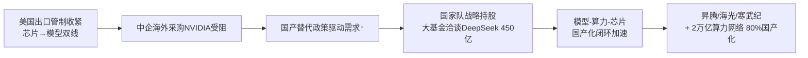
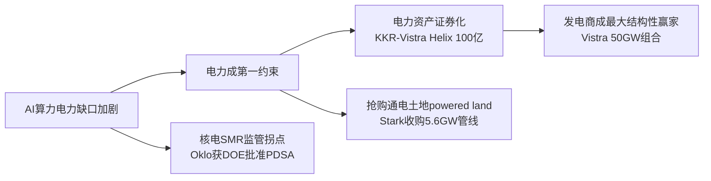

> **覆盖区间**：2026-06-09（周二）00:00 ~ 2026-06-15（周一）24:00（上海时区）
> **覆盖范围**：AI 产业链 5 层（能源 / 基础设施 / 芯片存储 / 模型框架 / 应用商业化）+ 4 横切维度（政策 / 国资 / 资金 / 人才）
> **时间窗声明**：仅收录上述自然周内的真实公开动态；区间外信息仅作背景并标注"（背景，非本周）"。所有关键数据标注来源 URL + 日期，查不到写"未公开"，绝不编造。

> **本周产业链全景**：本周最活跃的不是单一某层，而是**横切维度（政策 + 国资 + 资本市场）对全链的重定价**。三条主线：① **国家队入场**——国家集成电路产业投资基金（大基金）被曝洽谈领投 DeepSeek（估值约 450 亿美元），国资从"补芯片"升级到"持模型"；叠加 Bloomberg 曝五年约 2 万亿元、国产芯片占比 ≥80% 的全国算力网络计划。② **监管从芯片爬升到模型**——美国商务部 6/12 援引国家安全权限，禁止外国国民访问 Anthropic 最新 Fable 5/Mythos 5，AI 出口管制首次直接套用于"模型 API"而非芯片，开创先例。③ **电力一体化平台化**——KKR 联手 Nvidia、Vistra、科威特主权基金推出超 100 亿美元的 Helix Digital Infrastructure，把"私募 + 主权资本 + 芯片 + 电力"垂直捆绑；叠加 SpaceX（含 xAI）史上最大 IPO（募资 750 亿美元、首日市值 2.1 万亿美元）。**产业链传导链**清晰：「出口管制收紧 → 国产替代政策驱动 + 国资战略持股 → 国产算力闭环」与「电力成第一约束 → 电力资产证券化 + 一体化平台 → 发电商成最大结构性赢家」两条链本周同时按下拐点。

---

## 🔥 本周 TOP 5 投资事件

> 按"对产业研判 + 一级市场机会判断的**信号价值**"排序，非按新闻热度。

### 1. 国家大基金洽谈领投 DeepSeek，估值约 450 亿美元 ｜ 2026-06-09 曝光

一直拒绝外部股权融资的 DeepSeek（2023 年 7 月成立，幻方量化孵化，此前研运资金全靠内部支持）本周被曝正被投资方争抢入股。约两周前还在以 200 亿美元估值寻求融资，"几天内估值翻倍"，路透社报道其估值上限可能达 500 亿美元。**关键信号：国家集成电路产业投资基金（大基金）被曝与 DeepSeek 洽谈首轮融资，估值直奔 450 亿美元**，可能由"国家队"领投引入外部资本。动因：算力扩张需要 + 人才竞争应对（去年下半年至今至少 5 名核心研发成员确认离职）。DeepSeek 吸引力源于极致成本结构、开源生态、国产芯片（昇腾等）适配。截至目前 DeepSeek 尚未盈利、尚未发布 V4、无公开商业化数据。

↳ **投资意义**：这是本期**最强国资信号**——"国家队"从"芯片端补贴"升级到"模型层战略持股"，意在构建"模型—算力—芯片"国产化闭环、稳定核心人才、对标 OpenAI。无商业化数据却 450 亿美元估值，是国产 AI"技术信仰溢价 + 地缘战略溢价"叠加。【确定性 中（估值数字待官方确认）】 [来源：36氪](https://36kr.com/p/3799097625926917)

### 2. 美国出口管制"从芯片爬升到模型"：Anthropic Fable 5/Mythos 5 全球下架 ｜ 2026-06-12

Anthropic 于 6/9 发布旗舰 Claude Fable 5 与 Mythos 5，定价 10 美元/百万输入、50 美元/百万输出（较 Mythos Preview 腰斩），官方称在软件工程、知识工作、视觉、科研几乎所有基准为 SOTA。但**仅 3 天后（6/12 17:21 ET）被迫全球暂停**：美国商务部援引国家安全出口管制权限下令，禁止任何"外国国民"（无论境内外、含 Anthropic 非美籍员工）访问这两款模型，因覆盖面太广，Anthropic 被迫对全球所有用户禁用。政府理由是获知一种"窄域非通用越狱"；Anthropic 强烈异议，称同类能力在 GPT-5.5 等公开模型已广泛可得且未被同等管制。6/14 有 80+ 网络安全 CEO 联署要求撤销。Artificial Analysis 称这是"我们的智能前沿图首次倒退"。

↳ **投资意义**：AI 出口管制**首次直接套用于"软件模型 API"而非芯片**，从 chips 爬升到 models，开创监管先例，对所有前沿模型商部署节奏构成系统性政策风险。利好多模型路由/冗余架构（OpenRouter、Bedrock 等聚合层）与可自托管的开源权重战略溢价。事件正值 Anthropic IPO 窗口（6/1 已秘交 S-1，估值 9650 亿美元）。【确定性 高】 [来源：Anthropic](https://www.anthropic.com/news/fable-mythos-access)、[Fortune](https://fortune.com/2026/06/13/anthropic-disables-fable-mythos-export-controls-national-security-threat/)

### 3. KKR 联手 Nvidia/Vistra/科威特主权基金推出 Helix Digital，超 100 亿美元 ｜ 2026-06-11

全球投资巨头 KKR 联合科威特投资局（KIA）、Nvidia、电力公司 Vistra 推出 Helix Digital Infrastructure（HDI），启动资本超 100 亿美元长久期资本，定位超大规模厂商的"一站式协调点"，覆盖数据中心开发运营、基载 + 灵活电力发电、输配电、光纤连接。前 AWS CEO Adam Selipsky 任掌门。Nvidia 作为基石战略伙伴支持其 DSX AI factory 部署；Vistra 作为首选电力伙伴——其在美国 18 州运营约 50GW 电力组合、已执行超 5,000 MW 与超大规模厂商的 PPA。KKR 基建平台管理超 700 亿美元数字与电力资产。官方称 100 亿美元是"地板而非天花板"。

↳ **投资意义**：本周能源 + 基建层**最重磅的结构性事件**——把"私募资本 + 主权资本 + 芯片 + 电力"垂直捆绑成超大规模厂商的供给侧护城河（用 Helix 即默认锁定 Nvidia GPU + Vistra 电力）。标志 AI 基建进入"金融工程化、一体化平台"阶段，电力（基载）被正式确认为 AI 算力的核心稀缺资源。【确定性 高】 [来源：Yahoo Finance](https://finance.yahoo.com/sectors/technology/articles/ai-hyperscalers-kkr-ready-10-211522274.html)、[Middle East AI News](https://www.middleeastainews.com/p/kkr-kuwait-launch-10-billion-helix)

### 4. Oracle FY26 Q4：RPO 飙至 6380 亿美元，但 >50% 来自 OpenAI、FCF -237 亿美元 ｜ 2026-06-10

Oracle 6/10 盘后发布 FY26 Q4 及全年业绩：Q4 总营收 192 亿美元（+21%），云收入 99 亿美元（+47%，其中 IaaS +93% 至 58 亿美元）。**核心看点剩余履约义务（RPO）达 6380 亿美元，同比 +363%、环比 +850 亿美元**，远超分析师 5957 亿美元预期。但**财报后股价盘后跌约 10%**：① FY27 计划再融资约 400 亿美元（含 200 亿美元 ATM 增发）；② FY26 自由现金流为负 237 亿美元，capex 同比暴增 162% 至 557 亿美元；③ BofA 指出 **逾 50% 的 RPO 来自 OpenAI**（单一客户集中风险）。

↳ **投资意义**：RPO 6380 亿美元是 AI 基础设施需求最硬的单一公司证据，但">50% 来自 OpenAI"暴露单一客户集中 + 对手方信用风险（若 OpenAI 资金链生变将直接冲击 backlog 兑现）。负 237 亿 FCF + 再融资 400 亿，标志超大规模云厂进入"借债扩张 AI 算力"高杠杆阶段——这是 AI capex 回报周期最值得警惕的拐点。【确定性 高】 [来源：Oracle](https://www.oracle.com/news/announcement/q4fy26-earnings-release-2026-06-10/)、[CNBC](https://www.cnbc.com/2026/06/10/oracle-orcl-q4-earnings-report-2026.html)

### 5. SpaceX（含 xAI）史上最大 IPO：募资 750 亿美元、首日市值 2.1 万亿美元 ｜ 2026-06-12

SpaceX（年初已合并 xAI，定位"AI-focused space company"）6/11 定价：每股 135 美元、募资 750 亿美元、定价估值 1.77 万亿美元——成为史上最大 IPO（近三倍于沙特阿美）。6/12 在 Nasdaq 以 SPCX 挂牌，收 161.11 美元（首日 +约 20%），市值达 2.1 万亿美元，成为美国第 6/全球第 7 大公司。Musk 身家破 1 万亿美元。基本面：2025 年营收 187 亿美元（绝大部分来自 Starlink）、净亏 49 亿美元；与 xAI 合并实体累计赤字 413 亿美元；IPO 定价约 94 倍 TTM 营收。Morningstar 给出公允价值仅 7800 亿美元（较 IPO 估值低约 55%）。

↳ **投资意义**：以 94 倍营收、首日 2.1 万亿市值挂牌，是"IPO summer"龙头，公开市场正式开始"为 AGI 定价"。xAI 价值被打包进 SpaceX、纯 AI 业务估值不透明，叠加 OpenAI/Anthropic 接力秘交 S-1，印证**一级市场已无力承接 AI 巨额 capex，资本来源转向公众资金**。被动指数快通道将放大估值脱实风险。【确定性 高】 [来源：Fortune](https://fortune.com/2026/06/12/spacex-ipo-trading-first-day-live-updates-elon-musk/)、[Axios](https://www.axios.com/2026/06/12/spacex-shares-rocket-first-trades)

---

## 🧭 三条主线判断

**主线一 · 资本流向：从"找钱"转向"找电 + 找地"，并出现一体化平台化拐点。** 本周 KKR/Nvidia/Vistra/科威特 Helix（>100 亿美元）把电力与算力垂直捆绑；Crusoe 已签约容量 4.9GW、管线超 40GW；Oracle RPO 单季 +850 亿。资本正从"单点投 GPU/数据中心"升级为"电力 + 土地 + 算力 + 融资"全栈打包。【确定性 高】

**主线二 · 政策导向：中美双线同步收紧 + 体系化推进。** 美国出口管制从芯片爬升到模型（Anthropic 下架）、堵第三国转运漏洞（穿透式执法）、台湾拟将管制扩至全部中国客户；中国工信部 6/10《"人工智能+信息通信"实施意见》17 项任务 + Bloomberg 曝 2 万亿元国家算力网络（国产芯片 ≥80%）。"模型/芯片能在哪用、给谁用"成为新地缘变量。【确定性 高】

**主线三 · 估值与变现：背离基本面，商业化兑现成全球共同主线。** 美股——Anthropic ARR 争议、SpaceX 94x 营收、Q1 全球 VC 80% 流向 AI 且 4 家吸走 65%；中国——智谱 PS≈480x、Kimi 2 亿 ARR 对 300 亿估值、DeepSeek 无商业化数据却 450 亿。全行业从"技术军备/讲故事"切换到"看财报/价值兑现"，Oracle 单一客户集中 + 高杠杆是最警惕的拐点。【确定性 高】

---

## 🧩 产业链研判（so what 收敛层）

> 本节是给决策者看的"结论"，由本周真实动态推导，每条判断标注【确定性】。

### ① 本周产业链传导链（两条最强因果链）

**链条一（地缘→国产化）**：美国出口管制从芯片爬升到模型 → 中企海外采购受阻 + 国产替代政策驱动 → 国家大基金战略持股 DeepSeek（450 亿）+ 2 万亿国家算力网络（国产芯片 ≥80%）→ 国产算力（昇腾/海光/寒武纪）+ 光电芯片（CPO/400G/800G）订单与估值重估。【确定性 中-高】

**链条二（电力→证券化）**：AI 电力缺口加剧 → 电力成第一约束 → 电力资产证券化（KKR-Vistra Helix 100 亿）+ 抢购通电土地（Stark 收购 5.6GW）→ 发电商（Vistra）成最大结构性赢家；核电 SMR 出现监管拐点（Oklo 获 DOE 批准 PDSA）但商业供电仍需时间。【确定性 高】

### ② 景气度信号

- **上行（强）**：内存超级周期未见顶反而强化——韩国 5 月 DRAM 出口同比 +370%、约 66% 全球 DRAM 产能已分配给 AI；台积电 5 月营收创新高（131.9 亿美元，同比 +30.1%）；博通 AI 半导体营收同比 +143%；全球 DC capex 2026 首破 1 万亿美元。【确定性 高】
- **上行（拐点）**：推理经济学拐点已现且来自架构——MiniMax M3 的稀疏注意力（MSA）把 1M 上下文 decode 提速 15×；开源在工具调用维度首超闭源旗舰（Kimi K2.7 MCPMark 81.1% > Opus 4.8 76.4%）。【确定性 中-高】
- **风险信号**：Oracle 盘后 -10%、FCF -237 亿，市场首次对 AI capex 回报周期与单一客户集中（>50% RPO 来自 OpenAI）定价疑虑。【确定性 高】

### ③ 资本流向判断（A 目标）

钱本周往三个方向集中：① **电力 + 基建一体化平台**（Helix 100 亿、DayOne 45 亿、Amazon 175 亿贷款、APLD take-or-pay 360 亿组合）；② **公开市场**（SpaceX IPO 750 亿、OpenAI/Anthropic 接力秘交 S-1）——一级转二级；③ **国资战略持股**（大基金洽谈 DeepSeek、2 万亿算力网络）。新的方向切换是"从纯 GPU 投资 → 电力 + 土地 + 一体化平台"，以及"私募 → 公众资金 + 主权资本"。【确定性 高】

### ④ 一级市场机会与风险（C 目标）

- **过热（风险）**：国产大模型一级估值脱离基本面——智谱 PS≈480x、Kimi 半年融资约 376 亿元/估值涨近 7 倍、DeepSeek 无商业化数据却 450 亿；美国 Q1 全球 VC 80% 流向 AI、4 家吸走 65%，极端集中是泡沫顶部特征。【确定性 高】
- **可能被低估/早期机会**：① 电力设备与"通电土地"（长周期变压器/开关柜/燃机售罄至 2028、powered land 资产化）——AI 竞赛真正瓶颈环节；② 推理框架与聚合分发层（vLLM/SGLang/OpenRouter/Together）——开源 day-0 适配成常态、多模型路由因 Anthropic 下架成刚需；③ 国产存储借全球缺货窗口（CXMT/YMTC 激进扩产 + 冲刺 IPO）。【确定性 中】

### ⑤ 下周值得跟踪的领先指标

1. **美光 FQ3 财报（6/24 盘后）**：毛利率能否守住 81%、2027 合约能见度、capex 纪律——决定内存超级周期是"结构性"还是"见顶"。【确定性 高（事件确定）】
2. **大基金领投 DeepSeek 是否 close + 官方确认估值**：国家队持股头部大模型若坐实，将系统性重估国产 AI 主权叙事。【确定性 中】
3. **Anthropic Fable 5/Mythos 5 出口管制是否撤销 + 是否扩大到其他前沿模型商**：决定"模型级管制"是一次性事件还是新常态。【确定性 中】
4. **2 万亿国家算力网络方案是否落地官方文件 + 国产化比例细则**：直接决定昇腾/海光订单能见度。【确定性 中】

---

## 📚 各层深度正文

### 🔋 L1 能源 + 🏗️ L2 基础设施

**速查表：**

| 主题 | 热度 | 一句话 |
|------|------|--------|
| KKR/Nvidia/Vistra/科威特 Helix Digital | 🔥 | 详见 TOP5 #3 |
| SpaceX 史上最大 IPO | 🔥 | 详见 TOP5 #5 |
| Oracle FY26 Q4 云基建超级 capex | 🔥 | 详见 TOP5 #4 |
| Crusoe 合同容量逼近 5GW、管线超 40GW | 🔥 | 中立第三方 AI 工厂超级承包商 |
| 超大规模数据中心融资潮 | 🔥 | DayOne 45 亿 + Amazon 175 亿 + APLD 360 亿组合 |
| Oklo 获 DOE 批准 Aurora 安全分析（SMR） | 🟢 | 核电监管拐点信号 |
| CFS 获阿布扎比主权基金入股（核聚变） | 🟢 | 中东石油美元押注下一代基载电源 |
| Meta-Reliance 印度数据中心 + 近 1GW 清洁能源 | 🟢 | 超大规模出海轻资产模式 |
| Stark Power 收购 Sagebrush 锁定 5.6GW | 🟡 | "通电土地"资产化 |

**Crusoe 合同容量逼近 5GW、开发管线超 40GW**：6/9 Crusoe（丹佛"AI 工厂"公司）宣布已签约容量达 4.9 GW，总开发管线超 40 GW。采用"能源→算力→云服务"垂直一体化模式，自建长周期电气部件工厂（科罗拉多/俄克拉荷马/路易斯安那三州），预制化压缩交付。旗舰项目是为 Oracle 定制的 1.2 GW 德州 Abilene 园区（前 2 栋运营/6 栋在建），近期又为微软在 Abilene 破土第二个 900 MW 园区。引用 McKinsey 预测 2030 年全球需 156 GW AI 数据中心容量。**投资判断**：40GW 管线 + 自建电气设备工厂，强化"电力与场地是 AI 算力真正瓶颈"主线，资本正从纯 GPU 向"电力 + 基建 + 预制化供应链"迁移，利好长周期电力设备（变压器/开关柜/中压）与天然气调峰电源。【确定性 高】 [来源：Crusoe](https://www.crusoe.ai/resources/newsroom/crusoes-contracted-ai-infrastructure-capacity-approaches-5-gigawatts-across-data-centers-and-cloud)

**超大规模数据中心融资潮（本周密集发生）**：本周是 AI 数据中心融资与签约的密集窗口——① **DayOne Data Centers**（新加坡）完成 C 轮股权融资最终交割，总募资 45 亿美元，由 Coatue 与 Hillhouse 领投，新进印尼主权基金 INA、Achi Capital；自 2022 年已锁定超 1.5 GW 亚太 + 欧洲容量。② **Applied Digital（APLD）**签下 Delta Forge 2 园区 210 MW 关键 IT 负载的 15 年 take-or-pay 租约，基础期合同收入约 52 亿美元（含续约可达 127 亿/30 年）；叠加后总组合达 5 个园区/1.4 GW IT 负载/约 2.15 GW 并网电力/约 360 亿美元基础期收入，70% 由投资级超大规模厂商背书。③ **Amazon** 获 175 亿美元贷款用于 AI 数据中心（金额待二次核实）。④ **Switch** 信贷额度扩至近 100 亿美元。⑤ **Blue Owl** 为北弗吉尼亚提供 9.75 亿美元融资、拟出售约 300 亿美元亚太数据中心业务。**投资判断**：股权（DayOne 45 亿 + 主权基金 INA）、债务（Amazon 175 亿/APLD 票据）、私募信贷（KKR/Blue Owl）三路资金同时涌入，主权财富基金入场标志资产类别机构化；take-or-pay 长约把数据中心现金流债券化；资本瓶颈从"找钱"转向"找电 + 找地"。【确定性 高】 [来源：DayOne](https://dayonedc.com/headliners/dayone-data-centers-announces-final-closing-of-its-series-c-equity-financing-at-us4-5-billion)、[Applied Digital](https://ir.applieddigital.com/news-events/press-releases/detail/154/applied-digital-signs-210-mw-lease-at-delta-forge-2)

**Oracle FY26 Q4 云基建超级 capex**：详见 TOP5 #4。补充：FY26 全年总营收 674 亿美元（+17%）、云收入 340 亿美元（+39%）；RPO 从 5530 亿跃升至 6380 亿美元；市场预期未来一年 capex 约 700 亿美元用于数据中心扩建。CEO Magouyrk 称本季度将上线近 1GW 算力。**投资判断**：RPO 单季 +850 亿是本周最强算力需求"远期订单"信号，直接拉动 Oracle capex→数据中心建设→电力采购全产业链，对中立承建商（Crusoe）与电力设备商是确定性订单能见度。【确定性 高】 [来源：Oracle](https://www.oracle.com/news/announcement/q4fy26-earnings-release-2026-06-10/)

**Oklo 获 DOE 批准 Aurora 初步安全分析（SMR 监管拐点）**：6/11 先进核能公司 Oklo（NYSE: OKLO）宣布 DOE 爱达荷办公室批准其位于 INL 的 Aurora powerhouse 初步文件化安全分析（PDSA），是"反应堆试点计划（RPP）"授权路径关键一步。Aurora-INL 是 Oklo 首座快中子裂变电厂（钠冷快堆、金属燃料，基于 EBR-II 设计）。DOE 试点目标是让至少 3 座先进测试堆在 7 月 4 日前达临界，Oklo 是 11 个入选项目中唯一拿下 2 个名额的公司。背景：Oklo 此前已与 Meta（俄亥俄 1.2GW）、Switch 签供电意向。**投资判断**：SMR 板块本周最实质的"监管拐点"——从纸面 PPA 走向真实安全审查通过，降低 Aurora 商业化执行风险；但仍是测试堆而非商业堆，短期对数据中心实际供电贡献有限。【确定性 中】 [来源：NucNet](https://www.nucnet.org/news/doe-approves-key-safety-analysis-for-oklo-aurora-nuclear-plant-in-idaho-6-5-2026)

**CFS 获阿布扎比主权基金入股（核聚变）**：6/11 全球私营核聚变龙头 Commonwealth Fusion Systems（CFS）宣布阿布扎比政府所有的早期基金 Plynth Energy 收购其少数股权（金额未披露）。CFS 自 2018 年成立累计融资超 30 亿美元，标志项目 SPARC 旨在实现净能量输出。背景：Helion 6/4 完成 4.65 亿美元 G 轮。**投资判断**：中东主权基金正成为聚变赛道关键长钱来源，反映海湾国家用石油美元押注下一代基载电力；但聚变离商业供电仍有距离（2030s），本周入股更多是"战略卡位"。【确定性 中】 [来源：CFS](https://cfs.energy/news-and-media/commonwealth-fusion-systems-announces-equity-investment-by-abu-dhabi-based-plynth-energy/)

**Meta-Reliance 印度数据中心 + 近 1GW 清洁能源**：6/9 Meta 与信实工业宣布在印度古吉拉特邦 Jamnagar 共建 AI 数据中心（信实建设、Meta 租赁，首期 168 MW 可扩容），可再生能源供电 + 海水淡化冷却。同时 Meta 在印度签约近 1 GW 新清洁能源（CleanMax 837 MW + Fourth Partner 88 MW）。**投资判断**：超大规模 capex 从美国本土外溢到印度，"租赁 + 本地伙伴建设"成出海轻资产模式；新兴市场数据中心在电力与水约束下被迫绿色化，利好光伏/风电 EPC。【确定性 中】 [来源：Meta](https://about.fb.com/news/2026/06/meta-partners-with-reliance-on-ai-enabled-data-center-in-india/)

> 💤 本周相关静默/背景：Stark Power 收购 Sagebrush 锁定 5.6GW 美国数据中心管线（6/8，紧贴窗口前沿，"通电土地"资产化信号）；中国五年约 2 万亿元全国 AI buildout 计划（Bloomberg 6/9 曝光，详见横切·国资节）。
