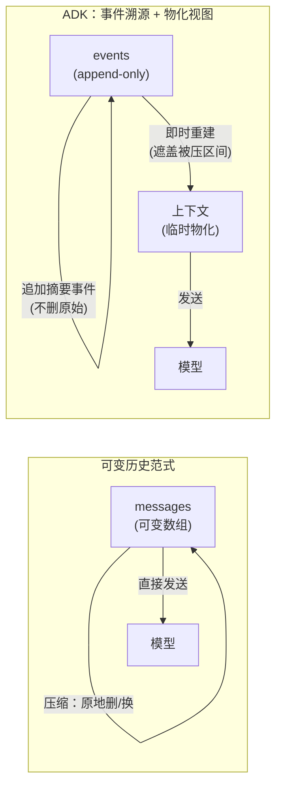
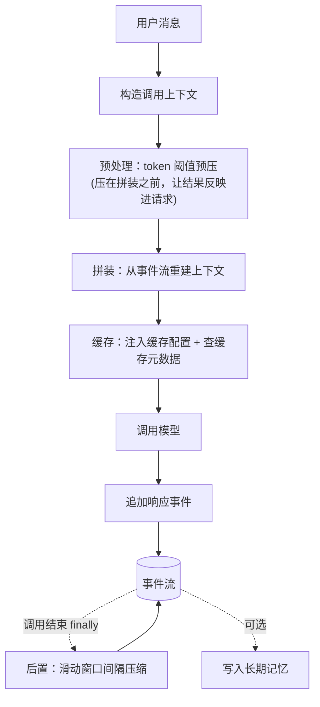
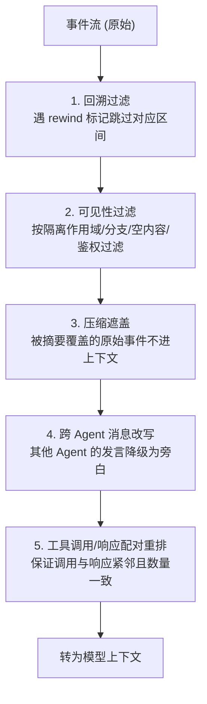

> 研究对象：Google ADK-Python（Agent Development Kit）。方法：逐行精读核心源码、用测试用例反推设计意图。下文所有结论以源码为准，并与另一类「轻量可变历史」框架（下文统称对照框架）做横向对比。

---

## 为什么 ADK 的上下文管理值得单独拆

上下文管理这件事，不同框架的做法差异可以大到「范式」级别。一类框架把对话历史当作一个**可变的消息数组**，压缩就是原地删除或替换其中的元素——轻、直接，但摘要替换后原文就永久消失了。

Google ADK 选了另一条路，而且选得很彻底：**它根本不维护可变的消息数组。** 会话的唯一真相是一份**只追加（append-only）的事件流**，每次模型调用前，发给模型的上下文是**从这份事件流即时重建**出来的。压缩不删任何原始事件，只是往流里追加一条「摘要事件」，重建时让摘要去「遮盖」它覆盖的那段历史。

这一个底层选择，像多米诺骨牌一样决定了 ADK 后面所有的能力与代价：它天然支持回溯（rewind）、多 Agent 上下文隔离、会话恢复；但也因此每次请求都要跑一条上千行的重建流水线。本文就从这个范式差异出发，逐层拆开 ADK 的压缩、拼装、缓存与记忆四套机制。

---

## 根本范式：事件溯源 vs 可变历史

先把两种范式的对比摆清楚，后面一切都从这里推导。

**可变历史**：消息数组是唯一真相且可变。压缩等于原地删除或替换数组元素，摘要替换后原文物理消失、不可逆，整个会话只有一个视图。

**事件溯源（ADK）**：事件流是唯一真相且只能追加。压缩等于往流里追加一条带「起止时间戳 + 摘要内容」的事件。重建上下文时，被这条摘要时间区间覆盖的原始事件被「遮盖」而不进入上下文，但它们**仍然物理留在事件流里**。

这个差异决定了后续所有设计：ADK 的压缩不需要在「删除切点」上保护工具调用配对（因为它不删元素），但重建时需要一套复杂的「遮盖 + 重排 + 配对」逻辑；ADK 天然支持多 Agent 隔离（同一条事件流按不同维度过滤出不同视图）；ADK 天然支持回溯（追加一条 rewind 标记事件，重建时跳过对应区间）。

一句话总结这种哲学：**它把上下文当成「不可变事件日志的物化视图」来管理，而不是「一份可变状态」**。前者重、可溯源、可恢复、可多视图，适合生产级有状态服务；后者轻、直接，适合嵌入式集成。

---

## 五层架构全景

ADK 的上下文管理可以拆成五层，全部围绕一个中心数据结构——那条 append-only 的事件流。

| 层 | 职责 |
|----|------|
| 状态/记忆持久化 | Session（事件流 + 状态，多后端）、Memory（长期 RAG 记忆）、State 多级作用域 |
| 上下文对象模型 | 贯穿一次调用的上下文容器、Event 事件模型、只读/可写/回调上下文分层 |
| 上下文缓存 | 利用 Gemini 缓存，让稳定前缀命中 KV 缓存 |
| 上下文拼装 | 每次请求从事件流重建上下文（过滤/重排/配对/遮盖） |
| 压缩/摘要 | 双触发压缩（间隔/阈值）、重叠摘要、滚动摘要、LLM 摘要 |

关键在于：这五层都围绕那条事件流工作——压缩层往里**追加**摘要事件；拼装层从里**读取并物化**成上下文；缓存层对物化后的前缀做缓存；对象模型层把它包进容器传递；持久化层把它存到多后端。**没有任何一层会删除或原地修改已有事件**——这就是事件溯源的本质。

配置入口也很能说明 ADK 的定位：上下文管理的所有配置都挂在顶层的 `App` 容器上（压缩配置、缓存配置、可恢复性配置），且作用于 App 内所有 Agent，而不是挂在单个 Agent 上。这体现了 ADK 面向「多 Agent 应用」而非「单 Agent」的产品取向。

### 一次调用里的双压缩时机

ADK 的压缩有两个触发时机，分工清晰：

- **预处理时机（请求前）**：只处理 token 阈值触发的压缩，理由是「压缩要跑在拼装之前，这样压缩结果才能反映进这次的模型请求上下文」。
- **后置时机（调用结束）**：在整个调用的 `finally` 块里跑滑动窗口的间隔压缩。

这种「请求前压 token、调用后压间隔」的双时机分工，是 ADK 独特的生命周期编排。

---

## 压缩机制深剖

压缩是 ADK 上下文管理的重头，全部逻辑集中在一个 600 多行的引擎里。

### 配置的四个字段

压缩配置有四个字段，逐一理解它们的语义是关键：

- **compaction_interval（必填）**：每累积 N 个**新的用户轮次（invocation）**就压一次。注意计量单位是「用户轮次」，不是消息条数也不是 token 数——一个轮次可能包含用户输入、模型回复、多次工具往返等好几条事件。
- **overlap_size（必填）**：新的压缩范围要从「上一段压缩结束前 N 个轮次」开始，让相邻两份摘要在时间上重叠。这是 ADK 独有的设计。
- **token_threshold（可选）**：当最近观测到的 prompt token 数达到或超过阈值时触发。注意是「最近**观测**到的」——来自上一次模型响应的用量元数据，不是当前请求的估算。
- **event_retention_size（可选）**：token 触发时，保留最近 N 条原始事件不压。

配置校验里有个细节：`token_threshold` 和 `event_retention_size` 必须**要么都设、要么都不设**（用异或强制）。而 `compaction_interval` 和 `overlap_size` 是必填的，所以滑动窗口压缩**总是可用**，token 阈值压缩是叠加的可选增强。

两种触发的优先级是：**token 阈值优先于滑动窗口**——如果 token 触发并成功压了，这一轮就直接结束，不再做间隔压缩。因为「token 超阈值」是更紧急的信号。

### 滑动窗口：按用户轮次计数的节拍器

滑动窗口压缩是 ADK 的常规节拍器，算法可以概括为五步：

1. 反向扫描找到上一次压缩的结束时间戳。
2. 收集每个用户轮次的最新时间戳（只看非压缩事件）。
3. 筛出「上次压缩之后才出现的新轮次」。
4. 新轮次数量不够 `compaction_interval` 就不压。
5. 够了就计算压缩范围：终点是最后一个新轮次，起点向前回溯 `overlap_size` 个轮次。

它按**用户轮次粒度**计数与切割，而不是消息粒度或 token 比例。这种粒度更「业务对齐」——压缩边界天然落在完整轮次之间，绝不会把一轮对话从中切开。

### 重叠摘要：维持跨摘要的连续性

这是 ADK 压缩最值得讲的一处设计。举个例子（间隔 2、重叠 1）：

- 轮次 1、2 完成 → 触发，压成摘要 A，覆盖 [1,2]
- 轮次 3 完成 → 只有 1 个新轮次，不够 2，不压
- 轮次 4 完成 → 轮次 3、4 共 2 个新轮次，触发；上次压到轮次 2，重叠 1 让新范围从轮次 2 开始 → 压成摘要 B，覆盖 [2,4]

注意摘要 A 的 [1,2] 和摘要 B 的 [2,4] 在**轮次 2 上重叠了**。为什么要重叠？因为重建上下文时，范围更大的摘要 B 会「遮盖」摘要 A。重叠保证了：当新摘要接替旧摘要时，新摘要的开头携带了旧区间尾部的上下文，不会出现「摘要 A 讲到轮次 2 戛然而止、摘要 B 从轮次 3 突兀开始」的语义断层。这相当于给摘要流加了滑动窗口式的步进重叠，维持跨摘要的叙事连续性。纯替换式的摘要做法没有这个机制——相邻摘要之间无重叠保护。

### 滚动摘要：摘要的摘要

token 阈值路径还有一个精华设计：如果已存在上一份压缩摘要，就把它当作一个「种子事件」放在待压列表的开头，让新摘要去「吸收并取代」旧摘要——也就是摘要的摘要（summary of summaries）。

而且种子事件的时间戳被设成旧摘要的起始时间戳，使新摘要的覆盖区间从旧摘要的起点开始，从而在重建时「吞掉」旧摘要。这样上下文里始终只有**一份有效摘要**（加上保留的原始尾部），而不是层层叠加的多份独立摘要。

### 工具配对保护：和「可变历史」框架同目标、不同手法

ADK 同样要保护工具调用与工具响应的配对，但因为它不删元素，保护的是「压缩区间边界」而非「删除切点」。核心思路是用一个「未闭合调用集合」跟踪义务：工具调用、工具确认请求、鉴权请求都会开启一个义务，对应 id 的工具响应闭合它；只在所有义务都闭合的位置才是可安全摘要的边界，取以该点结尾的最长前缀。

它还额外防止「被保留的工具响应被孤立」：保留的尾部事件里如果有工具响应，而它对应的调用在被压的前缀里，重建就会失败；所以会把切点往前移，让调用与响应一起被保留。

和「可变历史」框架的关键区别在**时机**：后者在压缩删元素时做切点保护；ADK 在压缩选事件时保证区间自闭合，**另外还在拼装阶段做二次配对保护**——是「压缩端 + 拼装端」双重的。

### LLM 摘要器的两个细节

负责生成摘要的摘要器，有两个细节耐人寻味。

一是它把事件渲染成**纯文本**喂给模型（而非结构化内容），其中工具调用、工具响应、甚至模型的「思考」都纳入——因为思考承载了模型对工具结果的分析。但每段工具参数/响应会被截断到 2000 字符，理由很实在：「免得压缩反而撑大它本应缩小的上下文」。

二是摘要内容被强制设为**模型角色（model）**——这与「可变历史」框架普遍把摘要强制设为用户角色恰好相反。这背后是两种不同的建模选择：ADK 认为摘要是「历史的模型侧陈述」，用模型角色更合适；而承载这条摘要的事件本身记的是「谁追加了它」，是另一个维度。

---

## 上下文拼装：每次请求从事件流重建

因为上下文是从事件流即时重建的，每次请求都要跑一条长流水线，这是 ADK 最核心也最复杂的部分。它有两种模式：默认模式包含完整会话历史；「无记忆」模式只包含当前轮次，适合每轮独立的 Agent。

默认模式的重建可以拆成五步：

**回溯过滤**是事件溯源「追加标记、重建时跳过」的典型应用：遇到带回溯标记的事件，就跳回指定轮次，中间的事件被从重建结果中移除——这正是「可变历史」框架做不到的能力。

**压缩遮盖**是「压缩如何注入回上下文」的核心。它先收集所有有效的摘要事件区间，计算哪些摘要被更大的摘要「包含」（被滚动摘要吞并的旧摘要会在这里被排除），然后把保留的摘要物化成临时事件、按时间戳过滤掉被覆盖的原始事件、最后按时间戳排序。

与「可变历史」框架最本质的区别在这里凸显：后者的摘要是原地数组拼接、原文已物理删除；ADK 的遮盖是原始事件仍在、仅在拼装时按时间戳过滤。这意味着同一份会话可以被不同 Agent 以不同方式重建，摘要事件本身也能被后续更大的摘要遮盖——这是「可重放、可多视图」对「不可逆单视图」的根本差异。

**跨 Agent 改写**则把其他 Agent 的消息重写成用户角色、并加上「某某 Agent 说/调用了工具/返回了结果」的前缀，把它降级为「背景旁白」，避免多 Agent 共享上下文时「谁说的」混乱。

配对重排里还有一个精微点：工具调用 id 的去留是按 provider 区分的——对靠位置配对的 provider 去掉 id，对靠 id 配对的 provider 保留 id，避免重放时配对断裂。这比「所有 provider 统一靠位置配对」更细腻。

---

## 上下文缓存：补上了「删头击穿缓存」的短板

一类「可变历史」框架被诟病的最大短板，是缺乏对 prompt 缓存的前缀保护——从历史头部删/压会让前缀变化，击穿 KV 缓存。ADK 有一整套机制补上了这一点。

它的核心策略很简洁：**缓存「最后一批连续用户消息之前」的所有内容**。也就是把稳定的历史前缀做成可缓存内容，可变的尾部（当前用户轮次）正常发送。这样跨轮次时前缀逐字节不变，缓存就能命中。

配套的是一套指纹失效检测：对系统指令、工具、前若干条内容做哈希生成指纹，指纹变了就说明前缀变了、缓存失效。再加上过期时间、最大复用轮次等生命周期控制，以及「首轮不建缓存、第二轮才开始」「低于最小 token 数不建」等门槛。

不过这里有个**ADK 自身的 trade-off** 值得点出：它的缓存与压缩是两个独立机制，而且会互相干扰。一旦压缩追加了新的摘要事件，下次拼装出的前缀就变了（摘要取代了一批原始事件），指纹检测到不匹配，旧缓存就作废重建。所以 ADK 虽有前缀缓存，压缩事件仍会阶段性击穿它——只是压缩频率较低（按轮次间隔），不像「每次都从头删」那样频繁击穿。

把三种做法排个序：在「压缩与缓存协同」这件事上，定向删除并严格保前缀逐字节一致的方案最优，ADK 居中（有前缀缓存但与压缩未协同），纯删头的方案最弱。

---

## Session 与 Memory：短期与长期的双层记忆

ADK 明确区分两种记忆，这是一种产品化的分层。

**Session（短期）** 是当前会话的事件流加状态，支持多种后端：内存（原型/测试）、关系型数据库、SQLite、托管服务。所有上下文写入都通过同一个入口完成。

它的**状态有多级作用域**，靠键名前缀路由到不同持久化范围：应用级（跨所有用户共享）、用户级（跨该用户所有会话共享）、临时级（仅本次调用内存有效、不落盘）、以及默认的会话级。其中临时级的设计很巧妙——它写进内存让同一次调用内的后续 Agent 能读到（比如串行 Agent 之间传值），但不会被持久化。

**Memory（长期）** 是跨会话的长期记忆，支持把整个会话摄取进记忆库、以及按查询检索。后端从简单的关键词匹配，到语义 RAG 检索、托管记忆库不等。它通过一个预加载工具在每次请求前自动检索相关记忆、拼成一段背景注入系统指令——这是检索增强的上下文，注入的内容不进入历史。

双层分工很清楚：Session 管「这次对话」（事件按时间重建），Memory 管「跨对话记忆」（检索后注入）。压缩只作用于短期会话的事件流，长期记忆是另一条独立的持久化路径。

---

## 一切皆 Event：统领上下文的原子

ADK 的整个上下文模型建立在一个统一的原子上——Event。用户输入、模型回复、工具调用与响应、状态变更、压缩摘要、回溯标记、Agent 转移，全都是 Event。上下文，就是事件流的某个物化视图。

每个事件携带的「动作」字段是上下文流转的枢纽：状态变更（按前缀路由到多级作用域）、产物版本、压缩摘要（起止时间戳 + 摘要内容就存在这里）、回溯标记、工具配对义务、Agent 调度信息等。压缩摘要不是一个独立的特殊对象，而就是某个事件携带的一个动作——这让「压缩」在模型上和其他一切操作完全统一。

围绕事件流，还有一个贯穿单次调用的上下文容器，携带会话、各类服务、配置、分支、调用 id 等，作为拼装/压缩/缓存各环节的共享载体。上下文对象本身还分只读与可写两种面，在不同生命周期钩子里暴露不同权限——指令生成时只读、工具回调时可写，防止误改。

---

## 设计哲学与三组取舍

把 ADK 放到取舍的坐标里看，有三组根本张力：

**事件溯源 vs 可变状态**。事件溯源带来可溯源、可多视图、可回溯、可恢复、压缩不损原始这五件事；代价是每次请求都要跑完整的重建流水线，计算开销和复杂度都高。可变状态轻快直接，但不可溯源、单视图。

**服务化 vs 嵌入式**。ADK 的会话与记忆都是可插拔的多后端服务，面向生产部署，代价是重、依赖多；轻量框架则适合嵌入和函数级部署。

**压缩决策主体：框架 vs 模型**。ADK 的压缩全是确定性的框架规则（间隔、阈值、保留数、重叠），**没有让模型按语义自己决定压什么、保什么的能力，也没有显式的消息固定机制**——这是它相对「模型自管」类框架的明显缺口。

所以选型很清晰：需要生产级有状态服务、多后端持久化、多 Agent 隔离、会话可恢复/回溯、长期记忆、前缀缓存的，选 ADK；需要轻量嵌入、模型驱动的语义感知压缩、开箱即用的，选轻量框架。

---

## 三方横向对比

把 ADK、轻量可变历史框架、以及无损分层压缩思路放在一起：

| 维度 | Google ADK | 轻量可变历史框架 | 无损分层压缩思路 |
|------|-----------|-----------------|-----------------|
| 核心范式 | 事件溯源 + 服务化多层 | 可变消息数组原地改写 | 无损分层（摘要可还原） |
| 压缩触发 | 滑动窗口（按轮次间隔）+ token 阈值 | 阈值钩子 + 溢出捕获 | 阈值/事件驱动 |
| 压缩粒度 | 用户轮次 | 消息条数 / token 比例 | 消息/轮次 |
| 工具配对保护 | 压缩选事件 + 拼装重排双重 | 压缩切点 | 有 |
| 缓存友好 | 前缀稳定 + 指纹失效检测 | 无（删头击穿） | 部分 |
| 有损/无损 | 半有损（摘要有损，原始事件物理保留） | 有损（原文物理删除） | 无损（可还原） |
| 持久化 | 多后端（内存/DB/SQLite/托管） | 可选 | 文件 + DAG |
| 长期记忆 | 独立 Memory 服务 + 预加载注入 | 无专门层 | 落盘 + 检索 |
| 决策主体 | 纯框架 | 框架 + 模型自管 | 框架 + 可检索 |
| 多 Agent 隔离 | 分支 + 隔离作用域 | 无 | — |
| 回溯/可溯源 | 回溯事件 + 事件溯源 | 无 | 可还原 |

一句话概括三者哲学：ADK 追求「生产级可溯源 + 服务化」，轻量框架追求「灵活 + 模型自管」，无损分层追求「零信息丢失」。

---

## 关键洞察与局限

**亮点**：事件溯源是最底层的架构决策，append-only 事件流加物化视图一口气解决了回溯、多 Agent 隔离、恢复、可溯源、压缩不损原始五件事，压缩只是「追加一条遮盖性摘要事件」，相当优雅；重叠摘要是业界少见的「摘要连续性」设计；滚动摘要控制上下文里始终只有一代有效摘要；前缀稳定缓存简单有效；token 估算复用真实拼装路径，避免估算与实际偏差；状态多级作用域加临时级语义服务于跨 Agent 传值。

**局限**：一是没有模型驱动的压缩——全是确定性框架规则，缺少「让模型按语义相关性决定取舍」的能力，也没有显式的消息固定保护；二是摘要实践上不可逆——虽然原始事件物理留着，但不提供回放接口，被压区间在重建时被永久遮盖；三是缓存与压缩会互相干扰，未真正协同；四是重建流水线复杂度高，事件越多重建越慢；五是 token 阈值依赖上一轮的用量元数据，冷启动时退化为字符数粗估；六是简单后端的记忆只是关键词匹配，语义检索需要绑定云服务。

总体而言，ADK 的上下文管理是一套**工程上偏重、哲学上偏向生产可溯源**的体系。它用事件溯源这一个底层选择，换来了回溯、多视图、可恢复这些「可变历史」框架给不了的能力，也因此背上了重建流水线的复杂度。它最值得借鉴的，不是某个具体算法，而是「把上下文当成不可变日志的物化视图」这一范式——一旦接受这个前提，回溯、隔离、恢复都成了自然的副产品。

---

*本文为源码级研究解读，所有结论基于对 Google ADK-Python 的逐行精读与测试用例反推。*
