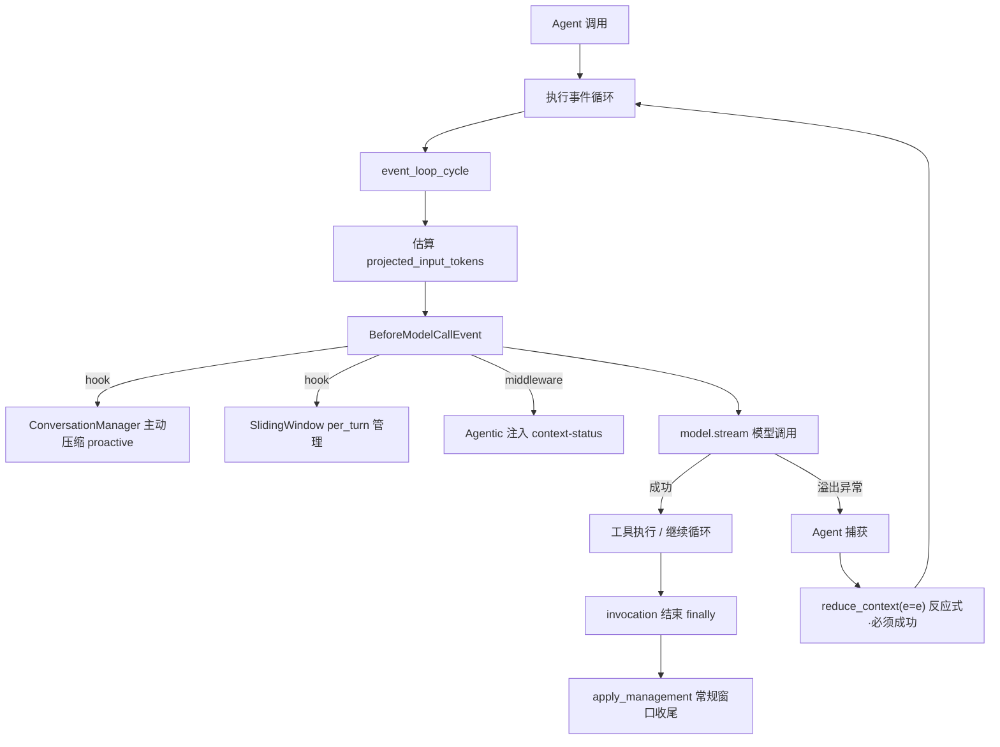
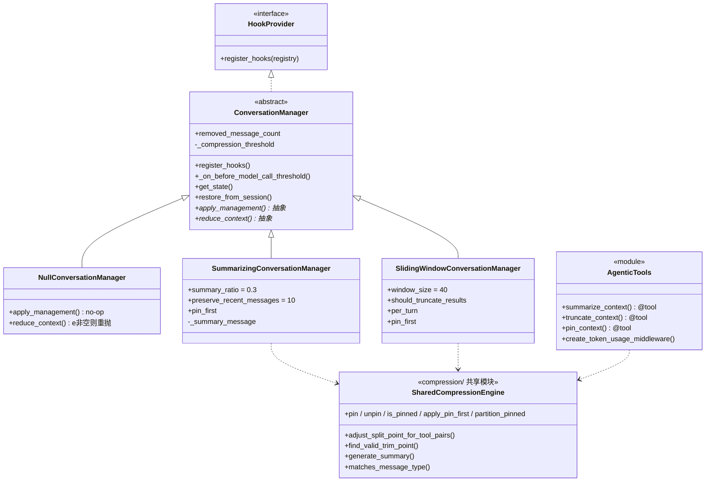
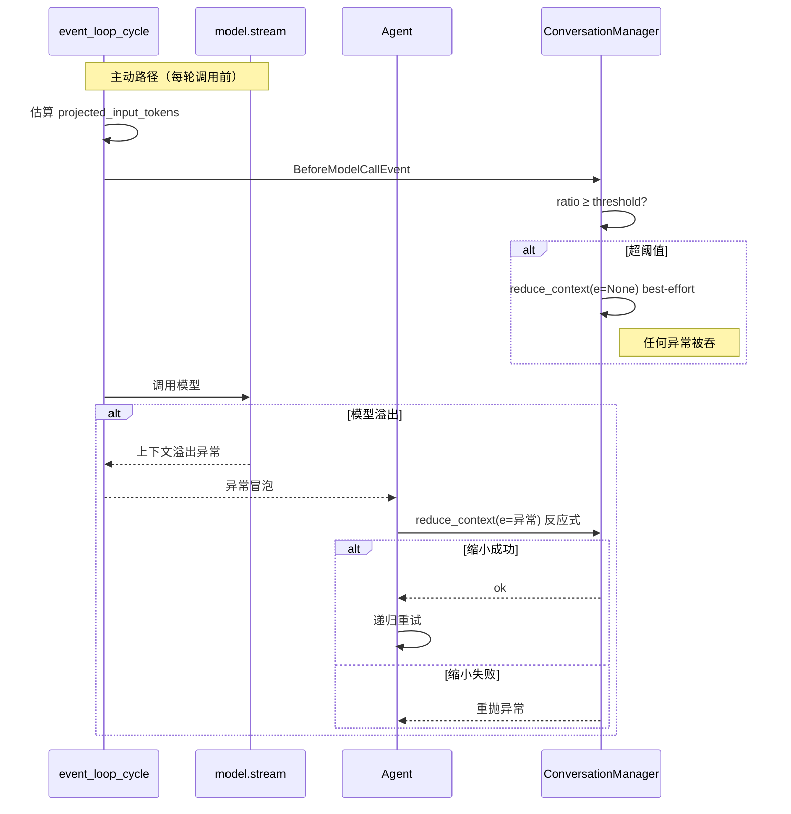

> 研究对象：Strands Agents（AgentCore harness-sdk）。方法：逐行精读 Python SDK 核心源码、用测试用例反推设计意图、官方文档交叉印证，并比对 Python/TS 双实现差异。下文所有结论以源码为准。

---

## 为什么这套压缩机制值得拆开看

当一个 Agent 跑得足够久，对话历史会无可避免地撑爆模型的上下文窗口。最朴素的应对是「删掉最旧的消息」，但真到工程里，这件事远比想象复杂：删错地方会拆散工具调用配对、击穿模型 provider 的会话合法性约束，甚至让下一次调用直接报错。

Strands 给出的答案是一个**分层、双引擎、可组合**的体系。它的精髓不在「怎么删」，而在三件事：用**两条并行的压缩路线**覆盖「框架自动」与「模型自主」两种哲学；用**一套共享的底层引擎**把「绝对不能错」的会话合法性约束沉到最底层；用**非对称的错误处理**精准区分「必须成功的恢复」与「锦上添花的优化」。

这三点恰好对应了上下文管理里最难权衡的三组张力——信息保真与 token 成本、自动与模型自主、确定性与灵活性。拆开它，等于看懂了一套成熟 Agent harness 在「记忆管理」上的完整思路。

---

## 整体架构：双引擎，共享底层

Strands 的上下文压缩有**两条并存且可叠加**的路线。

**第一条是声明式的 `ConversationManager`**，由框架自动驱动：一个抽象基类，加三个具体实现——Sliding Window（滑动窗口）、Summarizing（摘要式）、Null（空实现）。它的首要职责是**溢出恢复**，并可选开启**主动压缩**。

**第二条是模型驱动的 Agentic 模式**（`context_manager="agentic"`）：向模型注入 `summarize_context` / `truncate_context` / `pin_context` 三个工具，并通过中间件把「上下文水位」实时喂给模型，让 LLM 自己决定何时压、压什么、保什么。

最优雅的架构决策在于：**这两条路线复用同一套底层引擎**。源码里 `compression/` 模块的注释写得明白——这些函数同时服务于 conversation managers（反应式/主动式压缩）和 agentic context-management tools（模型驱动压缩）。声明式与模型驱动只是触发主体不同（框架 vs 模型），底下的 tool-pair 安全、pin 保护、摘要生成原语是同一套。

### 它在 Agent 循环里的三个嵌入点

上下文压缩并非一个独立模块，而是嵌进 Agent 执行循环的三处：

1. **每次模型调用前**：估算「预计输入 token」，构造 `BeforeModelCallEvent` 事件，触发所有钩子——包括主动压缩、滑动窗口的 per-turn 管理、Agentic 的 token 遥测中间件。
2. **模型调用溢出时**：捕获 `ContextWindowOverflowException`，调用 `reduce_context` 缩小历史后递归重试。
3. **每次调用结束后**：在 `finally` 块里做常规窗口收尾。

### 类继承关系

抽象基类 `ConversationManager` 同时实现了 `HookProvider` 接口（这是它能挂进 `BeforeModelCallEvent` 的前提），三个子类各自实现 `apply_management` 与 `reduce_context` 两个抽象方法。Agentic 工具与共享压缩引擎则以模块形式存在，被各路线引用。

两条路线并非互斥：即便选了 Agentic 模式，底层仍会挂一个关闭了主动压缩的 Summarizing 管理器作安全网——如果模型放任窗口溢出，它会反应式地兜底压缩。

---

## 双触发机制：一个参数区分「硬恢复」与「软优化」

声明式路线的精髓，是 `reduce_context` 的两种调用场景，靠一个异常参数 `e` 是否为空来区分。

- **Reactive（反应式，`e` 非空）**：模型抛出上下文溢出异常后，框架捕获并调用 `reduce_context(e=e)`。这是**硬约束**——实现必须移除足够的历史让下一次调用成功，否则就重抛异常。理由很直接：不缩小历史，下一次调用必然再次溢出，陷入死循环。
- **Proactive（主动式，`e` 为空）**：每次模型调用前的钩子检查「预计输入 token / 上下文窗口上限 ≥ 阈值」，超阈值就 best-effort 压缩。这是**软优化**——任何异常都被吞掉，保证模型调用照常进行。大不了这一轮不压，等真溢出再反应式兜底。

**这组非对称设计是教科书级的**：proactive 吞异常，因为它只是「锦上添花」，失败不该拖垮正常推理；reactive 重抛，因为它是「保命操作」，失败就意味着无路可走。一个 `e is None` 的判断，把两种语义切得干干净净。

### 预计 token 是怎么算出来的

主动压缩依赖一个估算值——「这次调用预计要喂多少 token」。Strands 的算法很讲究，不是每轮重新数整个历史，而是**增量估算**：找到上一条带 usage 元数据的 assistant 消息，以它的「输入 + 输出 token」为已知基线（这正是上一轮模型实际看到的总量），只对「新增的消息」重新计数。

这样设计的妙处在于：system prompt 与工具描述的 token 已经包含在基线里，避免重复计数，也避免了每轮 O(n) 全量分词的开销。只有冷启动（没有 usage 元数据）才退化为全量估算。而且这个估算是**非致命**的——失败就当作没有估算值，主动压缩直接跳过，绝不阻断推理。

### 反应式恢复的完整闭环

反应式路径是一个「捕获—缩小—递归重试」的结构：异常冒泡到 Agent 层被接住，调用 `reduce_context(e=e)` 缩小历史，同步会话状态，然后递归重试整个循环。

支撑这个闭环的，是上下文溢出异常被列入了「直接冒泡、不包装」的白名单——它能干净地穿透事件循环内层，被外层的恢复逻辑精准接住，而不会被当成普通错误吞掉或改写。

---

## 四种策略：从「什么都不做」到「让模型自己管」

声明式路线的三个实现加上 Agentic 模式，构成了从最保守到最灵活的完整光谱。

**NullConversationManager** 是对照基准——完全不动历史。反应式触发时它无法缩小，只能把溢出原样重抛；主动式时静默返回。它适用于外部托管、测试，或模型在服务端自管状态的场景。

**SlidingWindowConversationManager**（默认窗口 40 条）走的是「先减肥再砍人」的思路。反应式触发时，它**优先截短臃肿的工具结果**——把过大的文本压成首尾各 200 字符、中间用占位符替代，工具结果里的图片也换成占位符；截短成功就直接返回，尽量保留消息条目。只有截短还不够，才真正 trim 消息：找到一个合法的边界，删除窗口外所有非固定消息。它还有 `per_turn` 参数，可以每轮或每 N 轮主动管理一次，特别适合频繁截图、历史增长飞快的浏览类 agent。

**SummarizingConversationManager**（默认摘要比例 0.3、保留最近 10 条）则把最旧的一段消息折叠成一条摘要。它有个值得注意的特性：**常规收尾是空操作**——摘要只在真正的溢出或主动阈值触发时才发生。压缩后的结构是「固定保留段 + 一条新摘要 + 保留的最近段」，摘要以 user 角色嵌入历史。

**Agentic 模式**则把决策权完全交给模型（详见下一节）。

### 四策略横向对比

| 维度 | Null | Sliding Window | Summarizing | Agentic |
|------|------|----------------|-------------|---------|
| 算法 | 不动 | 截断最旧 + 工具结果截短 | 最旧段折叠为模型摘要 | 模型调工具自管 |
| 信息保真 | 100%（但会溢出） | 低（直接丢/截短，有损） | 中高（摘要保留要点） | 由模型判断（最优但不确定） |
| token 成本 | 0 | 0（无模型介入） | 摘要时一次模型调用 | 遥测 + 工具调用持续开销 |
| 常规管理 | 无 | 每轮收尾（超窗才动） | 无（仅溢出触发） | 无（模型驱动） |
| 主动压缩 | 不支持 | 支持 | 支持 | 关闭（模型自管） |
| 确定性 | 完全确定 | 完全确定 | 确定（除摘要文本） | 不确定（模型决策） |
| 适用场景 | 外部托管/测试 | 长对话、工具密集流水 | 需保留语义连续性 | 需按相关性精细取舍 |

### auto 模式：开箱即用的「最优组合」

Strands 把验证过的最佳搭配封装成了 `context_manager="auto"`：一个摘要比例 0.3、阈值 0.85 的 Summarizing 管理器，外加一个上下文卸载插件（ContextOffloader）。官方称这套默认值在内部的 ContextBench 评测里得分最高。

值得注意的是，auto 的 0.85 阈值比基类默认的 0.7 更激进地往后压——更晚触发、更省 token。而 Agentic 模式则配一个更高（8000）token 阈值的卸载器，让模型能看到更多内联内容再自行决定。用户传入自定义管理器时会替换掉默认的 Summarizing，但卸载器仍会自动补上。

---

## 底层安全机制一：工具配对永不拆散

这是所有压缩操作都绕不开的硬约束。模型 provider 对消息序列有严格要求：一个 `toolUse`（assistant 发起工具调用）必须紧跟一个 `toolResult`（user 回工具结果），二者通过 ID 配对。如果压缩切割点落在配对中间，会产生两种致命错误——「孤儿工具结果」（有结果无调用）和「悬空工具调用」（有调用无结果），provider 都会直接报错。

Strands 用两个函数守住这条红线。

**`adjust_split_point_for_tool_pairs`** 服务于摘要场景：给定一个初始切割点（前面要被摘要的条数），它会**向前推进**，跳过那些会变成孤儿的工具结果、那些会被拆散的工具调用，直到找到一个安全点；如果一路推到尽头都没找到，就抛出「无法裁剪对话上下文」异常。测试用例把它的行为锁得很死——比如「工具调用 + 工具结果 + user」这种配对完整的序列，可以在起点切（把整对一起摘要）；而连续两个工具结果，切割点会被往后推到它们之后。

**`find_valid_trim_point`** 服务于截断场景，比前者多一条强约束：**切割点必须是一条 user 消息**。原因在于截断保留的是切割点之后的内容，这段新历史的第一条会成为对话起点，而多数 provider 要求对话以 user 消息开头——若以 assistant 开头，直接被拒。这正是它与摘要切割点的关键区别：摘要后前面会拼上固定段或摘要消息（都是 user 角色），不强求 user 开头；而截断是纯删除，保留段起点直接暴露为对话首条。

针对工具密集型对话（可能压根没有纯文本 user 消息、全是工具往返），Python SDK 还多了一个回退逻辑：找一个「工具调用 + 工具结果」的完整配对边界作为退路，保证这类对话也 trim 得动。

---

## 底层安全机制二：消息固定（Pin）

有些消息绝对不能被压掉——开头的任务定义、关键约束、正在攻克的问题。Strands 用「固定」机制保护它们。

固定标志存在消息的元数据里（`metadata.custom.pinned`）。解除固定时还会顺手清理空容器，避免残留空字典污染消息结构。

最精巧的设计是**工具配对伙伴的连带保护**：判断一条消息是否被固定时，不只看它自己的标志——如果它含工具调用或结果，还会检查左右相邻的消息；若邻居被固定且**共享同一个工具 ID**，那它自己也算被固定。这意味着固定了一个工具调用，就自动连带保护了它的工具结果，反之亦然，**配对永远不会被拆**。

`apply_pin_first` 则永久固定开头的 N 条消息。对话开头往往是系统级约束、任务定义、关键背景——「你是谁、做什么、规则是什么」，这些必须跨整个会话存活。滑动窗口和摘要管理器都支持这个参数，且只在首次压缩时应用一次，之后固定标志已持久化在元数据里，无需重复。

---

## 底层安全机制三：摘要生成的两个关键决策

摘要式压缩调用模型把旧消息折叠成一段总结，这里有两个看似别扭、实则深思熟虑的决策。

**第一，摘要直连底层模型，绕过整个 Agent 管道。** 源码注释把原因说得很清楚：摘要发生在压缩过程里，而压缩是在 Agent 调用过程中触发的——此时调用锁已被持有。若再走完整的 Agent 管道，会**重入死锁，并污染指标、追踪、中断状态**。所以它直接调底层模型的流式接口，跳过锁、指标、追踪和工具循环，做一次干净的「裸模型调用」。这显然是踩过坑后的成熟设计。

**第二，摘要结果被强制转成 user 角色。** 模型生成的摘要本是 assistant 角色，但它要插回历史替换最旧段。强制改成 user 角色有两层考虑：一是**会话合法性**——provider 要求 user / assistant 角色交替，作为 user 消息它能安全嵌入任意位置；二是**语义贴切**——摘要是「关于对话的元信息」，像「用户提供的背景」，而非模型在对话中的发言。

摘要的提示词本身也是一套**防御性提示工程**：用一连串「必须 / 禁止」把模型钉死在结构化输出上——必须用要点格式、必须涵盖工具执行结果与代码、必须用第三人称；禁止寒暄、禁止直接称呼用户、禁止臆测工具调用失败。每一条都有针对性：要点格式让摘要在后续轮次被反复读取时更省 token、信息密度更高；第三人称避免与真实对话的人称体系冲突；禁止臆测失败，是因为摘要时工具上下文已被剥离，模型看不到工具列表、容易脑补「调用失败了」。这套约束最大化了摘要作为「压缩后历史」的可用性与保真度。

---

## Agentic 模式：把压缩决策权交给模型

这是 Strands 在上下文管理上最具前瞻性的设计。它的核心理念，官方文档一句话点破：**模型比阈值更清楚哪些消息还重要**。一个编程 agent 可以丢掉它已经改完的过时文件，同时固定住它正在攻克的失败测试——而固定阈值分不清这种区别，它只会按「年龄」压缩。Agentic 模式用 token 成本换来了这份判断力。

它给模型两样东西：**信息**和**杠杆**。

**信息**是一段实时的「上下文水位」遥测。中间件在每次模型调用前，往最后一条消息追加一个状态块，告诉模型当前用了多少 token、还剩多少、占比多少。关键在于它**不修改原消息**，而是复制一份再追加——这是临时增广，不污染真实历史。这段遥测是模型决策的唯一信号，它据此判断窗口是否够满、该不该动手。

**杠杆**是三个可主动调用的工具：

- **`summarize_context`**：把最旧的一段消息折叠成摘要。可指定保留最近几条、折叠多大比例、定向哪类消息（仅工具 / 仅非工具 / 全部）。
- **`truncate_context`**：直接丢弃旧消息，不做摘要。适合工具结果这类「体积大、相关性掉得快」的内容。
- **`pin_context`**：标记保护。选择方式很灵活——可以是「当前这一轮」（从末尾回溯到最近一条文本 user 消息，把整轮的工具往返一起选中）、「最近 N 条」、或指定的几个索引位置，再用过滤器二次缩窄。

这三个工具有一个共同的精妙之处：**失败时不抛异常，而是返回一句可操作的引导**。比如摘要找不到合法切割点时，它会告诉模型「试试更小的保留条数、更大的折叠比例，或者改用 truncate_context 针对工具消息」。这把「错误处理」变成了「对模型的指令」——工具返回值是给模型读的，要引导它下一步怎么改参数重试。这正是 LLM 原生工程范式的体现。

无论模型怎么调，三个工具底层都共享同一套保护：**第一条 user 消息永远保留**（保证对话合法开头）、固定消息永不动、工具配对永不拆。模型拥有的是「在安全边界内的灵活裁量权」，而非「为所欲为」。

它与传统管理器的本质区别可以这样概括：

| | 传统 ConversationManager | Agentic 工具 |
|--|------------------------|-------------|
| 决策时机 | 框架在固定钩子点 | 模型在推理中任意时刻 |
| 决策依据 | token 阈值 / 消息数（年龄） | 语义相关性（模型判断） |
| 失败处理 | 抛异常 / 吞异常 | 返回引导性文字给模型重试 |
| 参数来源 | 构造时固定 | 模型每次动态传 |
| 可解释性 | 规则透明 | 模型黑盒决策 |

优劣很清楚：Agentic 优在按相关性精细取舍，劣在不确定性（模型可能误判、忘了压、压错对象）加上额外 token 开销。所以底层永远挂一个 Summarizing 兜底——Strands 并不完全信任模型。官方的选择建议是：大多数 agent 用 auto，当你确实想让模型自己决定什么该留在上下文里时，再上 agentic。

---

## 会话持久化：压缩状态如何跨会话存活

压缩会改变历史结构，所以会话恢复时必须能还原压缩状态，否则连续性就断了。

基类持久化两样东西：一个类型标识（防止把滑动窗口的状态错误地恢复到摘要管理器上），和一个「已移除消息计数」。

摘要管理器额外持久化**摘要消息本身**。这是关键设计——会话恢复时，被摘要掉的原始消息已经不在持久化的历史里了（它们被替换成了摘要），所以恢复时必须把摘要消息重新塞回历史开头，否则会话连续性断裂。「已移除消息计数」则记录有多少真实消息被折叠了，供会话层正确对齐索引。

滑动窗口则额外持久化它的「模型调用计数」，保证 `per_turn=N` 的节奏跨会话连续。压缩发生后，框架还会立即同步 agent 状态落盘，确保压缩后的状态不丢。

---

## 设计哲学与三组张力

把整套机制拉远看，它本质上是在三组张力之间找平衡。

**信息保真 vs token 成本。** Null 百分百保真但会溢出；滑动窗口省 token 到极致但有损（中间内容永久消失）；摘要保真度更高，代价是一次模型调用加上摘要本身仍占的 token；Agentic 理论保真最优，但遥测与工具调用持续烧 token。Strands 默认的 auto（摘要 0.3 + 卸载器）是「中庸」——既不暴力丢也不全保留，再配合卸载器把大工具结果搬到外部、内联只留预览。

**自动 vs 模型自主。** 声明式路线零模型介入，确定、可预测、可测试；Agentic 灵活、语义感知，但引入不确定性。Strands 的态度是默认推自动，把 Agentic 当进阶选项，且永远配兜底——不完全信任模型。

**确定性 vs 灵活性。** 工具配对保护、截断必须 user 开头、固定连带保护，这些都是硬确定性规则，无论哪条路线都强制遵守；而「压多少、压哪类、保哪条」的策略层则交给参数或模型。**这正是分层设计的智慧**：把「绝对不能错」的会话合法性约束沉到共享底层，把「怎么压更好」的策略上浮到可配置层。

### 放到业界坐标里看

| 维度 | Strands | Claude Code（cache_edits / microcompact） | LangChain Memory | 无损分层压缩（LCM 思路） |
|------|---------|------------------------------------------|------------------|------------------------|
| 核心范式 | 双引擎：声明式规则 + 模型驱动工具 | 服务端定向删工具调用 + 客户端摘要 | 多种 Memory 类拼接 | 无损分层，摘要可回溯还原 |
| 是否有损 | 滑动有损 / 摘要半有损 / Agentic 视模型 | 摘要有损但保留重读机制 | 摘要有损 / 窗口截断有损 | 无损（原始消息可还原） |
| 缓存友好 | 未见显式前缀缓存保护（删头会破缓存） | 核心卖点：删尾保前缀、定向删保前缀一致 | 无 | — |
| 决策主体 | 框架阈值 / 模型自主 | 服务端策略 + 客户端阈值 | 开发者选 Memory 类 | 框架 + 可检索 |
| 可回溯 | 摘要不可逆 | 可重读源文件 | 不可逆 | 可逆 |

几点高下值得点出。**对比 Claude Code**：后者把「缓存经济学」做到极致——删尾保前缀、定向删除工具调用，让前缀逐字节一致以命中 KV 缓存；而 Strands 的滑动与摘要都从**头部**删压，这在缓存视角下会击穿前缀缓存。但 Strands 的 Agentic 模型驱动加工具化固定，是 Claude Code 没有的开放式灵活性。**对比 LangChain**：Strands 的双引擎加共享的工具配对安全引擎，比 LangChain 零散的 Memory 类更系统化、更工程化。**对比无损分层压缩**：后者追求「不丢」（摘要可还原原始消息），Strands 追求「够用 + 灵活 + 低成本」，哲学不同；但 Strands 的上下文卸载（大工具结果落外部存储、可检索）在思路上与「把大块挪走、留引用、按需取回」高度神似。

---

## Python 与 TS 实现：高度对齐，四处差异

两端整体高度对齐——同名函数、相同默认值（阈值 0.7、窗口上限 200K、摘要比例 0.3、保留最近 10 条、截短 200 字符、Agentic 常量全同）。但有四处实质差异，迁移或对照时需留意：

1. **摘要切割点的越界处理**：切割点超过消息数组长度时，Python 显式抛异常，TS 则直接返回不抛——Python 更严格，错误文案也不一致。
2. **滑动窗口的工具配对回退是 Python 独有**：当找不到纯 user 截断点时，Python 还有一个「工具调用 + 工具结果」配对边界的回退，TS 没有。工具密集型对话在 Python 端更容易被 trim 成功。
3. **摘要消息的字段构造**：Python 保留原消息所有字段、只覆盖角色；TS 只取内容重建、丢弃其他字段（如元数据）。
4. **参数校验分层**：TS 用 schema 在工具入参层就拒掉非法值，Python 接受后在函数体内兜底 clamp——语义等价但分层不同。

结论：核心算法、默认值、安全约束两端语义一致，可放心认为「实现对齐」；差异集中在错误处理严格度、Python 独有的回退、校验分层与字段保留四处，其中前两点会导致边界场景行为不同。

---

## 插件层：卸载与注入，两个正交维度

上下文压缩之外，Strands 还有两个与之配合的插件，共同构成完整的 token 管理。

**上下文卸载（ContextOffloader）** 管的是「单个大工具结果」。当一次工具返回几十上百 KB 时，它在结果进入对话**之前**就拦下，把内容存到外部存储（进程内 / 文件 / S3），内联只留一段预览加一个存储引用，并注册一个工具供 agent 按引用取回。它与压缩的分工很清晰——卸载是「第一道防线」，防大结果进对话；压缩是「第二道防线」，管整体历史增长。官方特别强调：卸载**不能替代**对话管理，你仍然需要一个对话管理器。这套「卸载—引用—取回」的模式，与「大输出落盘、留引用、按需检索」的思路高度神似。

文档还点出了二者的一个对照：滑动窗口对大工具结果是**反应式**截短——在上下文已经溢出、一次 API 调用已经白白浪费之后，才把结果截成首尾 200 字符，而且是有损的；卸载器则是**主动式**——在结果进入对话前就拦截，溢出根本不会发生。

**上下文注入（ContextInjector）** 则相反——它每次调用前把实时文本折叠进模型输入，但**永不写入历史**。用于那些「agent 该一直知道、但不该存进历史」的东西：当前时间、环境描述、检索结果。因为不进历史，它既不受压缩影响，也不增加历史 token 累积。有意思的是，Agentic 模式那个注入「上下文水位」的中间件，本质上就是一种框架内置的特殊注入器——机制同源。

把三者放在一起看，它们是三个正交的 token 管理维度，分别管「进多少」（卸载）、「留多少」（压缩）、「临时加多少」（注入）。

---

## 关键洞察与局限

**最值得称道的几点设计**：双引擎共享底层，既保证两条路线行为一致，又避免重复实现 provider 级约束；主动/反应式的非对称错误处理，用一个参数切开「软优化」与「硬恢复」；Agentic 模式代表了上下文管理的范式前移——从「框架按年龄压」到「模型按相关性压」，且用引导性返回值「教模型怎么重试」，是 LLM 原生工程范式的典范；摘要直连底层模型绕过管道，是踩过死锁坑后的成熟方案；第一条 user 保留加固定加工具配对连带保护，以最小代价守住会话合法性这条红线。

**也有明显的局限**：

1. **缺乏前缀缓存保护，是当前最大短板。** 滑动与摘要都从历史头部删压，在 KV 缓存视角下会击穿整个前缀缓存——前缀一变，后续全部 cache miss。摘要替换最旧段尤其会让缓存全失效，成本上可能抵消甚至超过省下的 token。这是相对 Anthropic 方案最明显的差距。
2. **摘要不可逆**：原文被替换后无法还原，摘要质量完全依赖模型，丢了关键细节就无从追回。
3. **Agentic 的不确定性**：模型可能忘记压缩、压错对象、过度固定，额外 token 开销在长会话里也可能可观，且决策难以测试。
4. **token 估算依赖元数据**：冷启动或元数据缺失时退化为全量计数，开销较大。

总体而言，Strands 的上下文压缩是一套**工程上相当成熟、哲学上偏务实**的体系——它不追求理论上的「零信息丢失」，而是在保真、成本、灵活性之间找一个开箱即用的平衡点，再把进阶的决策权以工具的形式开放给模型。它最大的启发，或许不是某个具体算法，而是那种「把不能错的沉到底层、把可以变的浮到上层、把判断力交给模型但永远留一张安全网」的分层思路。

---

*本文为源码级研究解读，所有结论基于对 Strands Agents harness-sdk 的逐行精读与测试用例反推，并经 Python / TypeScript 双实现交叉验证。*
