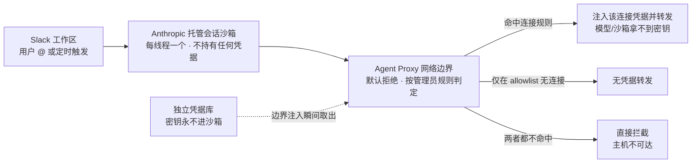

> **一句话**：Claude Tag 不是「更好用的 Slack 机器人」，而是 Anthropic 给「AI 虚拟员工」补上的那块工程地基——**Agent 身份**。读懂它，你就读懂了企业 AI 下一阶段的竞争与风险都将围绕什么展开。

## 为什么这次发布值得认真读

过去两年，「让 AI 进入工作软件」的尝试层出不穷：OpenAI 的 Workspace Agents、Perplexity 的 Computer、微软 Copilot 进 Teams、Salesforce 给 Slackbot 堆能力……热闹之下，大多数仍是同一个范式——**一个跟着「你」跑、用「你」的权限、帮「你」做事的个人助手**。

2026 年 6 月 23 日 Anthropic 发布的 **Claude Tag**，第一次把这件事的底层逻辑换了：它让 Claude 以**一个独立的、共享的「团队成员」身份**常驻在频道里，谁都能 @ 它委派任务，它用自己的账号、自己的凭据、自己的记忆去干活。

这个看似产品层的小动作，背后是一次架构层的拐点。本文从技术维度把它拆开讲清楚：它是什么、四个核心能力怎么实现、运行时架构长什么样、为什么说它带来了一种全新的安全范式，以及它的边界在哪里。

---

## 一、它是什么：从「单用户助手」到「常驻虚拟员工」

Claude Tag 是 Anthropic 推出的「让团队与 Claude 协作的新方式」，首发落地 Slack——Claude 以「团队成员」身份加入频道。管理员授予它选定频道的访问权、并连接所需的工具/数据/代码库后，**频道里任何人都能 @Claude 委派任务**，然后转身去忙别的。官方把它定位为「Claude Code 的演进」：让模型更主动、更适合整个团队协作。

可用范围与模型：自 6 月 23 日起对 **Claude Enterprise 与 Team** 客户开放公测，运行在 **Claude Opus 4.8**，并已上架 AWS Marketplace。Anthropic 给出的内部数据点相当激进：**其产品团队 65% 的代码已由内部版 Claude Tag 生成**，使用场景正从写代码扩散到追踪产品指标、处理 support ticket、定位疑难 bug。

> 重要时间线：Claude Tag 替代旧版「Claude in Slack」集成。旧集成将于 **2026-08-03 下线**，管理员有 **30 天迁移窗口**（从 6/23 起算），未主动迁移的工作区将被自动迁移。

### 交互范式：@Tag 委派 + 线程协作

- **启动**：在频道里 @Claude，把需求写在同一条消息里，即开启针对该线程的「工作会话」。
- **进度呈现**：短问题直接回复；长任务先回一个「实时任务清单（checklist）」，Claude 边做边就地编辑勾选。这里有个值得注意的 UX 陷阱——Slack 对「编辑消息」不发通知，所以线程看似「冻结」其实在干活，官方专门提示「安静的线程通常意味着在做事，而非卡住」。
- **多人接力**：会话一旦激活就「属于频道里所有人」，同事无需再 @ 即可在该线程补充上下文、改变方向或接手结果。但**没有 rewind**：编辑/删除消息不会撤回已发给 Claude 的内容，要纠偏只能新发一条。
- **上下文窗口**：中途 @Claude 进入已有长线程，它只能拿到从线程根起的最多 **50 条消息**——所以关键信息要主动复述。

### 与旧版「Claude in Slack」的本质区别

旧版本质是**单用户工具**：DM 或 @ 拿到按需帮助，按「你」的身份和会话运行。Claude Tag 在它之上加了一层旧工具难以维持的**持久上下文 + 记忆**，并把交互对象从「单个用户 / 单次任务」变成「一个频道共享的队友」。官方归纳了四个差异化能力：

1. **@Claude is multiplayer**：一个频道内只有一个 Claude，与所有人交互，谁都能看它在做什么、从别人停下处接着干。
2. **@Claude learns over time**：跟随频道积累上下文，不必每次从头解释；获授权后还能跨频道/数据源学习（但**不报告私有频道内容**）。
3. **@Claude takes initiative（ambient）**：开启后主动推送它认为你需要知道的信息，跨频道标记相关情报，跟进「沉默」的线程。
4. **@Claude works asynchronously**：派完任务你去忙别的，它能给自己排期、自主推进项目数小时到数天。

> **一个易混淆点**：频道里的 Claude Tag = 管理员配的 **Agent 身份**；而 DM 里的 @Claude、以及把编码 @ 路由到 web 的「Claude Code in Slack」= 以**你自己的账号**运行。判别法：如果 Claude 开的 PR 作者是**你本人**，那是 Claude Code in Slack，不是 Claude Tag 频道会话。

---

## 二、四个核心能力，到底怎么实现的

### 2.1 持久记忆：按频道隔离的「策展笔记」

Claude Tag 的记忆**按频道划分**，而非绑定个人。读写规则界定了记忆隔离的技术边界：

| Claude 工作位置 | 读取自 | 写入到 |
| :--- | :--- | :--- |
| 公共频道 | workspace 记忆 | 本频道笔记或 workspace 共享 |
| 私有频道 | 该频道记忆 + workspace 记忆（只读） | 该频道自己的 store |

公共频道产生的记忆会自动「升级」为全 workspace 共享（在 `#data-eng` 记下的决策，在 `#analytics` 提问时可用）；私有频道学到的东西只存入该频道自己的 store，不外泄；DM 与其他 workspace 保持隔离。私有频道后来转公开，其私有期间的记忆**不会**随之迁移。

一个关键设计：**记忆是「策展的笔记」，不是会话 transcript 全文**。三种积累方式——你明说「remember for this channel: …」、Claude 工作中自发记下决策、可读过往会话 transcript（但**不能全文检索**，要指定时间段/主题）。官方建议长 playbook 放代码仓库让 Claude 去读，而非塞进记忆。

> **隐私边界的核心**：「销售」用的 Claude 不会把记忆传给「工程」用的 Claude，ambient 也不报告私有频道。这是 Anthropic 应对企业「记忆串频道」担忧的核心设计。

### 2.2 环境监听（ambient）：靠「例程」实现的调度型 always-on

ambient 是一个**可开关的模式**，开启后 Claude 从「被动响应」转为「主动响应」。但「常驻」的工程落地**不是一个一直跑的进程**，而是通过**例程（routines）** 实现的调度型 always-on。三种触发：

- **Scheduled jobs（定时任务）**：「每个工作日 9am 读本频道未关线程，逐条发一行状态」。默认 UTC，需显式写时区。
- **Watch channels（监听频道）**：监听指定频道，命中主题时在本频道汇报（「每天一次，有相关就发，没有就跳过」）。
- **Follow a PR（订阅 PR）**：CI 完成或 review 落地时播报、失败时 @ 你。

例程用「频道的连接」、与交互请求同权限；创建者离职例程继续跑，但创建者被移出频道则停止。

> **技术含义**：ambient 把 Claude 从「调用才响应的函数」变成「持续观察信息环境、自主决定何时插话的代理」。这是「代理性（agency）」的一次显著扩张，也是治理难点的根源所在。

### 2.3 跨频道上下文：聚合与隔离同时存在

- **聚合**：公共频道记忆自动全 workspace 共享；获授权后可跨频道/数据源拉取上下文（「看 `#data-eng` 对这个了解多少」）。
- **隔离**：每个 Slack 线程 = 一个独立会话 + 独立沙箱，同频道两个线程互不共享 state；私有频道不外报；不同 Agent 身份间记忆不互通。

### 2.4 工具连接与 Agentic 工作流

**连接对象**：代码库（GitHub，走 Claude GitHub App）、ticketing、数据仓库、监控、任意 HTTP API，以及 plugins 与 skills。个人在 claude.ai 配的 connectors（含 **MCP servers**）**仅在 DM 生效**，频道里只用管理员挂的服务账号连接。

> **是不是 MCP？** 是，但不止。文档明确提到 MCP（个人 connectors 含 MCP servers）；但频道侧的「连接」是更广的 **Access bundle** 概念（凭据 + 允许主机规则），不限于 MCP 一种协议。

**多步任务的执行循环**（五步）：
1. @ 启动会话或例程触发；
2. 为该线程构建隔离沙箱；
3. 在沙箱内用频道访问权跑工作循环、就地编辑 checklist；
4. 结果落在线程（回复 / 文档 / 图表 / PR）；
5. 空闲期释放沙箱、线程保留，新回复时重建沙箱。

沙箱跑的是**与 Claude Code on the web 同一引擎**，所以产出是可工作的产物（PR、文档）而非单纯聊天。

### 2.5 背后的模型与编排

Claude Tag 运行在 **Claude Opus 4.8**（`claude-opus-4-8`，2026-05-28 发布，1M 上下文，$5 / $25 每百万 token 输入/输出）。该模型同期推出了 **Dynamic Workflows**（研究预览）：可在单个 Claude Code 会话内编排**数十到数百个并行 subagents**，自动 plan / distribute / verify / integrate。官方描述 Claude Tag「现在更多时间花在并行给许多 Claude 派活」，与 Opus 4.8 的 subagent 编排能力同源。

> **诚实标注**：Claude Tag 是否在频道会话内**直接**调用 Dynamic Workflows 的数百 subagents，官方文档**未明说**；可确认的只有两点——跑的是「与 Claude Code on the web 同一引擎」且模型为 Opus 4.8。「频道内多 subagent 编排」是合理推断，非官方明确陈述。

---

## 三、运行时架构：沙箱 + Agent Proxy + 凭据库

这是 Claude Tag 工程上最硬核、也最值得安全团队读懂的部分。它的请求路径是一个三区架构：

1. **Slack 工作区**：用户 @ 或调度触发的起始点。
2. **Anthropic 托管的会话沙箱**：每线程一个，读文件 / 写文档 / 跑代码 / 克隆仓库。**沙箱不持有任何凭据**；克隆的仓库在沙箱内改、推回 Git host 为分支或 PR。
3. **Agent Proxy（网络边界）**：沙箱所有出站请求都过它，按管理员规则判定。凭据存于**独立凭据库**，仅在边界注入的瞬间取出并附到请求上——**模型与沙箱始终拿不到密钥**。

Agent Proxy 三种结果（**默认拒绝**）：命中某连接规则 → 注入凭据转发；仅在 allowlist、无连接 → 无凭据转发；两者都不命中 → 直接拦截。同一规则也适用于 Claude 在沙箱里跑的 `curl` / `fetch`。数据只能流向已允许的主机。

### 3.1 Agent 身份模型：本产品最重要的架构创新

频道里 Claude 以**自己的服务账号**行事，而非代表发请求的那个人：Slack 里以 Claude app 发帖，GitHub 上以 Claude GitHub App 作 PR 作者，其他工具用管理员 provision 的服务账号。**「访问权随频道走」**——同一请求在 `#platform-eng` 能做的事比在普通频道多。四个后果：

- 一次配置，全员可用；
- 行为不随发起人变化（**可预测**）；
- 个人 connectors 仅在 DM 生效；
- 审计干净（动作落在服务账号名下）。

DM 身份则截然不同：跑在用户自己的 claude.ai 账号上、用个人 connectors、费用计到个人 seat、PR 作者是个人。管理员可全组织禁用 DM。

### 3.2 计算、数据保留与审计

- **计算**：沙箱 = Claude Code on the web 同一托管算力，每线程一个，空闲释放、回复重建。
- **持久化**：线程、可见产物、push 到分支/PR 的内容、Slack 贴出的内容会保留；仅存于沙箱的文件**不持久**（要保留须 push 或贴出）。
- **ZDR 限制**：因为保留频道记忆与会话 transcript，**启用 Zero Data Retention 的组织不可用** Claude Tag。
- **审计四处**：Audit 页（scheduled work / memory / network events）、各 scope 记忆文件、每个动作的服务账号归属、各连接服务自身的审计日志。其中 Network events 为逐小时 JSON 导出（**不含 Git 与 MCP 流量**，需联系客户团队启用）。

> 注意一个治理盲区：Audit 页**没有**「每个任务及谁发起」的逐动作日志，routine 仅显示 Created by。

### 3.3 与 Slack 的真正集成方式

安装 Claude app 只是前提，**真正的 setup 是「provision 一个身份」**：与 Slack workspace 配对 → 给工具访问权（Access bundle）→ 设组织月度花费上限 → 在私有频道测试。需要 Claude 组织的 Owner 执行。默认任何连接该 Slack workspace 的人都可调用（哪怕没有 Claude 账号），Owner 可收窄为仅组织成员或按角色。

---

## 四、范式转移：从「治理用户」到「控制 Agent 意图」

这是 Claude Tag 在安全层面真正颠覆性的地方。安全公司 Zenity（6 月 29 日）提出的核心论点是：业界讨论多集中在「身份」，但真正的变化是**从治理用户转向控制 Agent 意图**。

传统模型下，助手的权限 = 用户的权限：用户访问不了某个仓库，助手也访问不了。Claude Tag 把权限**直接赋给共享 Agent**——只要 Claude 有 GitHub / Jira / Drive / Salesforce 的访问权，**频道里任何人都能让它用这些权限干活**。

一个直接的风险示例：一个无权访问敏感仓库的开发者，可以让 Claude 去分析、总结、准备 PR——只要频道授了权，请求就会成功，因为**授权属于 Claude，而非发起人**。传统 RBAC / IAM 在「共享 Agent + 人人可委派」的组合下事实上失效了。

另一个难点是**审计断层**：下游系统记录的是 Claude 服务账号，而非发起任务的员工。Anthropic 自己的日志能把任务绑回 requester，但你的 SIEM / 连接系统只看到「Claude」——**要关联「意图」与「动作」，需要拼接两套日志**。再叠加 ambient 的跨系统自主执行，prompt injection、恶意指令、意外行为影响可信企业集成的机会随之增多。

> Zenity 的结论很尖锐：可见性是基础但远远不够，真正需要的是在每一次工具调用 / API / MCP 调用**之前**的 runtime 控制。这恰恰指向一个正在崛起的新赛道——**Agent runtime 安全**。

---

## 五、与 OpenAI / Google 的同类路线，技术上差在哪

Slack 频道正在成为企业 AI 最激烈的战场：

| 玩家 | 路线 | 本质 |
| :--- | :--- | :--- |
| **Anthropic Claude Tag** | 频道级共享 Agent 身份 | 一个有独立账号/凭据/记忆的「虚拟员工」 |
| **OpenAI Workspace Agents** | 跨 app 任务编排（connectors） | 仍是「用户构建、跨 app 执行」的用户代理 |
| **Google / Microsoft** | 组织知识图谱（Graph）+ Copilot | 以组织上下文层增强个人 copilot |
| **Perplexity Computer** | @computer 进 Slack | 通用 agent，偏个人调用 |
| **Salesforce / Slack** | 给 Slackbot 堆 30+ 能力 | 平台原生「agentic OS」 |

> **对比洞察**：OpenAI 的 Workspace Agents 本质仍是**用户代理**（用户构建、跨 app 执行）；Google / 微软走「组织知识图谱 + copilot」。Anthropic 的差异点在于**「Agent 身份」与「频道级共享主体」**——不是每人一个助手，而是一个有独立 service account、独立凭据、独立记忆的共享虚拟员工。这把「上下文护城河」从个人层提到了团队层，同时也把治理难度同步抬高了一个量级。

---

## 六、能力边界与局限（不吹不黑）

- **Prompt injection 被放大**：沙箱跑「与 Claude Code on the web 同一引擎」。同期安全研究指出 Claude Code / Gemini CLI / Copilot 均可被代码注释里的注入绕过多层防御——「注入不是 bug，而是 agent 被设计去处理的 context」。频道场景下，恶意消息或被污染的仓库文件，可能被写入记忆或触发越权动作。
- **越权风险**：频道成员可借 Claude 服务账号访问自己本无权访问的资源。
- **幻觉在协作场景被放大**：ambient 主动插话 + 多人共享记忆，一条错误「事实」会被写入 workspace 记忆并跨频道传播；记忆「不能全文检索」也限制了回溯准确性。
- **上下文窗口限制**：中途加入线程仅取 50 条消息，长线程关键信息可能丢失。
- **无 rewind**：编辑 / 删除消息不能撤回已发送给 Claude 的指令。
- **ZDR 不可用**：启用 Zero Data Retention 的组织无法使用。
- **成本画像不同**：持续监听 + 建记忆 + 异步跨时的 agent，token 消耗远高于传统按需调用，被多家媒体点名为采纳顾虑。无按座计费，频道/线程按 usage 计（Opus 4.8 费率），从组织 usage balance 扣，spend limit 封顶；详细套餐价**未公开**。
- **供应商锁定**：积累数月频道上下文与机构记忆的 Claude 极难替换，切换成本很高。

---

## 七、技术研判：三个值得记住的判断

1. **「Agent 身份」是本次发布真正的架构拐点。** 把权限、凭据、记忆、审计绑在一个企业安全团队能理解的 service account 上，是「AI 虚拟员工」从 demo 走向生产的必要工程前提。Agent Proxy 默认拒绝 + 凭据永不进沙箱的设计，是对「Agent 被注入后偷凭据」的直接防御。

2. **真正的范式转移是「从治理用户到控制 Agent 意图」。** 传统 RBAC / IAM 在「共享 Agent + 人人可委派」下失效，意图与动作需跨两套日志拼接。这既是企业采纳的真正门槛，也是 Agent runtime 安全这类新产品的市场机会。

3. **ambient 是 agent 工程的关键方向信号。** AI 从「调用才响应的函数」变成「持续观察、自主决定何时行动的主体」。配合 Opus 4.8 的并行 subagent 编排，信号清晰：下一代企业价值不再由「存数据的系统」捕获，而由「坐在干活现场的 agent」捕获。

---

> 写在最后：Claude Tag 的产品故事很性感（「AI 队友进群」），但它真正的分量在工程地基——**Agent 身份**。当 AI 第一次拥有了自己的账号、自己的凭据和自己的记忆，企业要管理的就不再只是「人能做什么」，而是「这个 Agent 想做什么、被允许做什么」。这层转变，才是接下来两三年企业 AI 竞争与安全攻防的真正主线。
