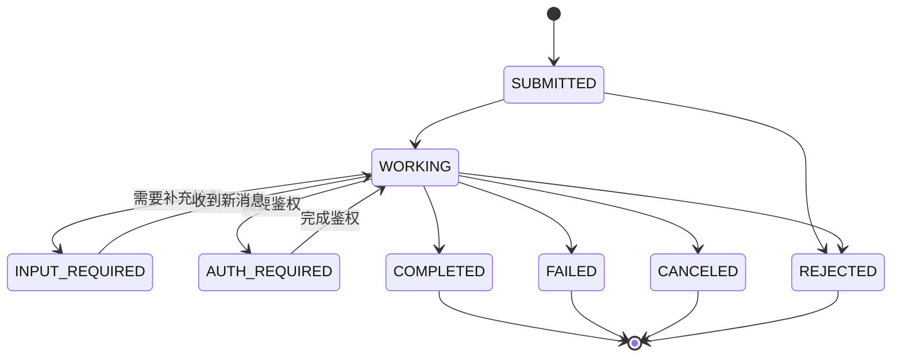
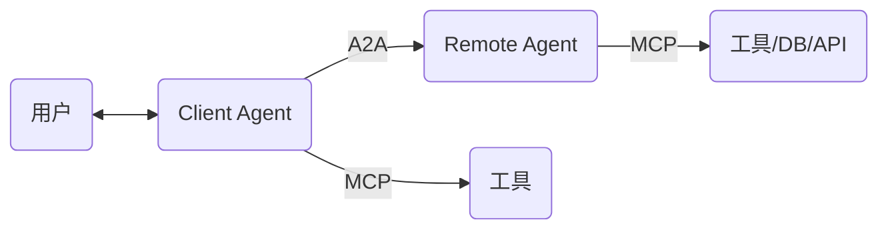
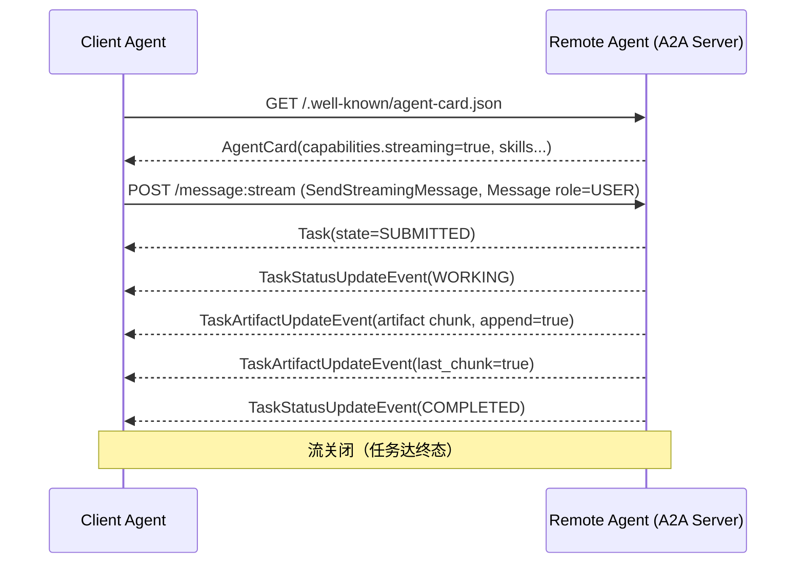

> **主题**：以 A2A 协议深度研究为主体，OpenClaw 及多形态 Agent 集成设计为辅。
> **版本基线**：A2A Protocol 官方 `latest`，规范 **v1.0.0**（proto 正源 package `lf.a2a.v1`）。
> **调研时间**：2026-07　**信源**：a2a-protocol.org、GitHub a2aproject/A2A（proto/samples/SDK）、OpenClaw 官方 docs。
> **标注**：【SPEC】官方规范/proto 明文｜【DOC】官方文档站明文｜【SDK】官方 SDK/samples｜【推断】基于官方材料的推断/生态观察。

当一家公司用 LangGraph 造的客服 agent，想去调用另一家用 CrewAI 造的账单 agent，它们之间说什么话、怎么发现对方、怎么委派任务、怎么拿结果？这个空档，正是 A2A（Agent2Agent）协议要填的。它不是又一个 agent 开发框架，而是这些框架**之间**的通信层——一条跨框架、跨厂商、跨语言的对等协作横线。

本文先讲清 A2A 是什么、为什么存在，再逐层拆开它的数据模型、协议机制、发现协商与安全模型，横向对比它与 MCP、ACP、框架原生编排的分工，评估生态成熟度与落地路径；最后把它落到 OpenClaw 的具体集成设计上。全文以官方规范 v1.0.0 与 proto 正源为准，字段名、状态枚举、错误码均取自 `specification/a2a.proto`。

---

## 一、A2A 是什么，为什么需要它

一句话定义：Agent2Agent (A2A) Protocol 是一个**开放标准**，用于**不透明（opaque）的智能体应用之间**的无缝通信与协作。在 agent 由不同框架、不同语言、不同厂商构建的世界里，A2A 提供 agent 互操作的"通用语"。【DOC / SPEC §1】官网首页用三条口号定位它：用 **ADK（或任意框架）构建**，用 **MCP（或任意工具）装备**，用 **A2A 通信**——面向远程 agent、本地 agent 和人。【DOC】

它要解决的核心问题很具体。多智能体生态里，每家框架（LangGraph、CrewAI、Semantic Kernel、AutoGen、ADK、自研）都有自己的内部 agent 表示与调用方式。当"A 公司用 LangGraph 造的客服 agent"要调用"B 公司用 CrewAI 造的账单 agent"时，缺少一个**跨框架、跨厂商、跨语言**的对等通信标准。A2A 填的就是"agent 之间说什么话、怎么发现、怎么委派任务、怎么拿结果"的空档。【DOC / SPEC §1】

### 六个设计目标

规范 §1.1 列出六条 Key Goals，它们共同界定了 A2A 的野心边界：【SPEC】

| 目标 | 含义 |
|------|------|
| **Interoperability（互操作）** | 打通异构 agent 系统之间的通信鸿沟 |
| **Collaboration（协作）** | 让 agent 委派任务、交换上下文、共同完成复杂请求 |
| **Discovery（发现）** | 动态发现并理解其他 agent 的能力 |
| **Flexibility（灵活）** | 支持同步请求/响应、实时流式、异步推送三种交互 |
| **Security（安全）** | 面向企业环境的安全通信，复用成熟 Web 安全实践 |
| **Asynchronicity（异步）** | 原生支持超长任务与 human-in-the-loop |

### 五条指导原则

目标之下是五条指导原则（SPEC §1.2），决定了它的技术取向：【SPEC】

- **Simple**：复用成熟标准（HTTP、JSON-RPC 2.0、SSE），不发明新传输。
- **Enterprise Ready**：对齐企业实践处理鉴权、授权、隐私、tracing、监控。
- **Async First**：为（可能非常长的）长任务与人机协同而设计。
- **Modality Agnostic（模态无关）**：文本、音视频（文件引用）、结构化数据/表单，甚至嵌入式 UI（parts 里引用 iframe）。
- **Opaque Execution（不透明执行）**：agent 基于**声明的能力**和**交换的信息**协作，不暴露内部思考、计划、工具实现。

### 它明确不是什么

官网用四条明文划清边界，理解这四条比理解它是什么更能防止误用：【DOC】

1. **不是 agent 开发框架**（不是 LangGraph/CrewAI/ADK）。A2A 是这些框架**之间**的通信层。
2. **不是 sub-agent / tool-call 协议**。A2A **不规定** agent 如何调用自己的子 agent、如何调用工具——那用框架原生原语或 MCP。
3. **不是 MCP 的替代**。MCP=agent→工具，A2A=agent↔agent，互补。
4. **不是 Slack/Discord/WhatsApp/Telegram 那种交互式消息 App**。A2A 是**机器对机器**的自治 agent 协议。

---

## 二、核心概念与数据模型

理解 A2A 先理解三个角色。**User** 是终端用户（人或自动化服务），发起请求或定义目标；**A2A Client（Client Agent）** 代表用户发起 A2A 通信的应用/服务/另一个 agent；**A2A Server（Remote Agent）** 暴露 A2A HTTP 端点的 agent/agentic 系统，对 client 而言是**黑盒（opaque）**，内部记忆/工具不暴露。【DOC】

规范把整个协议分成三层（SPEC §1.3）：**Layer 1 数据模型**是所有实现必须理解的 canonical 数据结构，以 Protocol Buffer 表达、协议无关；**Layer 2 抽象操作**是所有 A2A agent 必须支持的能力/行为，与暴露方式无关；**Layer 3 协议绑定**把抽象操作与数据结构映射到具体协议（JSON-RPC / gRPC / HTTP-REST）的方法名、端点、协议特性。【SPEC】这套分层的意义在于：数据模型只定义一次，绑定可以有多种。

通信层面有五个基本元素，它们构成了后面所有机制的词汇表：【DOC】

| 元素 | 描述 | 关键作用 |
|------|------|---------|
| **Agent Card** | 描述 agent 身份、能力、端点、技能、鉴权要求的 JSON 元数据文档 | 让 client 发现 agent 并知道如何安全有效地交互 |
| **Task** | 有唯一 ID、有明确生命周期的**有状态工作单元** | 追踪长任务、支撑多轮交互与协作 |
| **Message** | client 与 agent 之间的一个**通信回合**，含内容和角色（user/agent） | 传递指令、上下文、问答、状态更新（未必是正式产物） |
| **Part** | Message 和 Artifact 内的**基本内容容器**（文本/文件引用/结构化数据其一） | 在消息/产物中灵活交换多类型内容 |
| **Artifact** | agent 在任务中产出的**有形结果**（文档、图片、结构化数据） | 交付具体成果，结构化、可检索 |

### Task：核心工作单元

以下字段以 `specification/a2a.proto`（package `lf.a2a.v1`）为准。`message Task` 字段如下：【SPEC】

| 字段 | 类型 | 必填 | 语义 |
|------|------|------|------|
| `id` | string | ✅ | 任务唯一 ID（如 UUID），**由 server 为新任务生成** |
| `context_id` | string | | 一组关联交互（多个 task 与 message）的上下文集合 ID |
| `status` | TaskStatus | ✅ | 当前状态（含 `state` 与 `message`） |
| `artifacts` | Artifact[] | | 任务的输出产物集合 |
| `history` | Message[] | | 任务的交互历史 |
| `metadata` | Struct | | 自定义元数据键值对 |

### 九态生命周期状态机

`message TaskStatus` 由 `state`（必填，TaskState）+ `message`（关联消息）+ `timestamp`（ISO 8601 记录时刻）组成。核心是 `enum TaskState`，proto 明文九个值：【SPEC】

| 枚举值 | 数值 | 类别 | 语义 |
|--------|------|------|------|
| `TASK_STATE_UNSPECIFIED` | 0 | — | 未知/不确定 |
| `TASK_STATE_SUBMITTED` | 1 | 活动 | 已成功提交并被确认 |
| `TASK_STATE_WORKING` | 2 | 活动 | agent 正在处理 |
| `TASK_STATE_COMPLETED` | 3 | **终态** | 成功完成 |
| `TASK_STATE_FAILED` | 4 | **终态** | 出错结束 |
| `TASK_STATE_CANCELED` | 5 | **终态** | 完成前被取消 |
| `TASK_STATE_INPUT_REQUIRED` | 6 | **中断态** | 需要用户补充输入才能继续 |
| `TASK_STATE_REJECTED` | 7 | **终态** | agent 决定不执行（创建时或中途判定无法/不愿继续） |
| `TASK_STATE_AUTH_REQUIRED` | 8 | **中断态** | 需要鉴权才能继续 |

**终态（terminal）**是 COMPLETED / FAILED / CANCELED / REJECTED——不能再接收新消息（否则 `UnsupportedOperationError`）。**中断态（interrupted）**是 INPUT_REQUIRED / AUTH_REQUIRED——任务未结束，等待外部输入/鉴权后可继续，这是多轮交互与 human-in-the-loop 的关键。【SPEC】画成状态机：



### Message、Role 与 Part

`message Message`（一个通信回合）字段：【SPEC】

| 字段 | 类型 | 必填 | 语义 |
|------|------|------|------|
| `message_id` | string | ✅ | 消息唯一 ID，由消息创建者生成 |
| `context_id` | string | | 关联上下文；server 消息必须提供 |
| `task_id` | string | | 关联任务；仅传 task_id 时 server 会推断 context_id |
| `role` | Role | ✅ | 发送方（`ROLE_USER`=client→server，`ROLE_AGENT`=server→client） |
| `parts` | Part[] | ✅ | 消息内容容器（至少一个） |
| `metadata` | Struct | | 附加元数据 |
| `extensions` | string[] | | 本消息涉及/贡献的扩展 URI |
| `reference_task_ids` | string[] | | 本消息引用的其他任务 ID（补充上下文） |

`enum Role` 三值：`ROLE_UNSPECIFIED`(0) / `ROLE_USER`(1) / `ROLE_AGENT`(2)。

`message Part` 是模态无关的内容容器，`oneof content` 恰含其一：

| 字段 | 类型 | 语义 |
|------|------|------|
| `text` | string | 纯文本内容 |
| `raw` | bytes | 内联二进制文件内容（JSON 序列化时 base64） |
| `url` | string | 指向文件内容的 URL |
| `data` | Value | 任意结构化 JSON 值（对象/数组/标量） |
| `metadata` | Struct | 本 part 的元数据（可选） |
| `filename` | string | 文件名（如 "document.pdf"） |
| `media_type` | string | MIME 类型（对所有 part 类型可用） |

这里有一处文档与 proto 的措辞差异值得记牢：文档站早期把 `oneof` 描述为 text/file(url|bytes)/data 三类；proto 正源明确为 **text / raw / url / data 四选一**，以 proto 为准。【SPEC】

### Artifact：有形产物

`message Artifact` 字段：【SPEC】

| 字段 | 类型 | 必填 | 语义 |
|------|------|------|------|
| `artifact_id` | string | ✅ | 任务内唯一的产物 ID |
| `name` | string | | 人类可读名 |
| `description` | string | | 人类可读描述 |
| `parts` | Part[] | ✅ | 产物内容（至少一个 part） |
| `metadata` | Struct | | 产物元数据 |
| `extensions` | string[] | | 涉及的扩展 URI |

产物与任务生命周期强绑定，可**增量流式**传给 client（见后文 TaskArtifactUpdateEvent 的 `append` / `last_chunk`）。

### AgentCard：能力名片

`message AgentCard`（Next ID: 20）是 client 发现 agent 的唯一入口：【SPEC】

| 字段 | 类型 | 必填 | 语义 |
|------|------|------|------|
| `name` | string | ✅ | agent 人类可读名 |
| `description` | string | ✅ | 用途描述 |
| `supported_interfaces` | AgentInterface[] | ✅ | 有序的支持接口列表，**第一个为首选** |
| `provider` | AgentProvider | | 服务提供方（url + organization） |
| `version` | string | ✅ | agent 版本（如 "1.0.0"） |
| `documentation_url` | string | | 附加文档 URL |
| `capabilities` | AgentCapabilities | ✅ | A2A 能力集 |
| `security_schemes` | map<string,SecurityScheme> | | 鉴权方案详情 |
| `security_requirements` | SecurityRequirement[] | | 联系该 agent 的安全要求 |
| `default_input_modes` | string[] | ✅ | 所有技能默认支持的输入模态（media type） |
| `default_output_modes` | string[] | ✅ | 默认输出模态 |
| `skills` | AgentSkill[] | ✅ | 技能列表 |
| `signatures` | AgentCardSignature[] | | 本卡的 JWS 签名（RFC 7515） |
| `icon_url` | string | | 图标 URL |

卡里的几个嵌套结构同样以 proto 为准：**`AgentInterface`**（同一功能可在多个绑定上暴露）含 `url`（✅，生产环境须绝对 HTTPS）、`protocol_binding`（✅，开放字符串，核心官方值 `JSONRPC` / `GRPC` / `HTTP+JSON`）、`tenant`（多租户路由的不透明标识，设置后 client 须在请求 `tenant` 字段回带）、`protocol_version`（✅，如 "0.3"、"1.0"）。**`AgentCapabilities`** 含 `streaming`(bool 可选)、`push_notifications`(bool 可选)、`extensions`(AgentExtension[])、`extended_agent_card`(bool 可选，是否支持鉴权后返回扩展卡)。**`AgentSkill`** 含 `id`✅、`name`✅、`description`✅、`tags`✅(string[])、`examples`(示例 prompt)、`input_modes`/`output_modes`（覆盖 agent 默认）、`security_requirements`（该技能所需安全方案）。**`AgentProvider`** 含 `url`✅、`organization`✅。**`AgentExtension`** 含 `uri`（扩展唯一标识）、`description`、`required`(bool，为 true 时 client 必须理解并遵守)、`params`(Struct)。**`AgentCardSignature`** 含 `protected`✅(base64url JWS 保护头)、`signature`✅(base64url)、`header`(Struct，非保护头)。【SPEC】

---

## 三、协议机制：传输、方法、流式、推送、错误

所有通信基于 **HTTP(S)**。Layer 3 有三种官方绑定：**JSON-RPC 2.0**（over HTTP POST，最常见、SDK 默认）、**gRPC**（proto3 + `A2AService`）、**HTTP+JSON / REST**（资源式端点）。数据类型上有几条约定：时间戳用 `google.protobuf.Timestamp`，JSON 序列化为 ISO 8601 UTC（`YYYY-MM-DDTHH:mm:ss.sssZ`，'Z' 结尾，建议毫秒精度）；JSON 字段 camelCase，枚举 SCREAMING_SNAKE_CASE（SPEC §5.6）；媒体类型 `application/a2a+json`（IANA 注册中，SPEC §14）。【SPEC】

### 十一个抽象操作，三绑定映射

Layer 2 定义了十一个抽象操作，SPEC §5.3 把它们映射到三种绑定，语义跨绑定一致：【SPEC】

| 功能（抽象操作） | JSON-RPC 方法 | gRPC 方法 | REST 端点 |
|------|------|------|------|
| 发送消息 | `SendMessage` | `SendMessage` | `POST /message:send` |
| 流式发送消息 | `SendStreamingMessage` | `SendStreamingMessage` | `POST /message:stream` |
| 获取任务 | `GetTask` | `GetTask` | `GET /tasks/{id}` |
| 列出任务 | `ListTasks` | `ListTasks` | `GET /tasks` |
| 取消任务 | `CancelTask` | `CancelTask` | `POST /tasks/{id}:cancel` |
| 订阅任务 | `SubscribeToTask` | `SubscribeToTask` | `POST /tasks/{id}:subscribe` |
| 创建推送配置 | `CreateTaskPushNotificationConfig` | 同名 | `POST /tasks/{id}/pushNotificationConfigs` |
| 获取推送配置 | `GetTaskPushNotificationConfig` | 同名 | `GET .../pushNotificationConfigs/{configId}` |
| 列出推送配置 | `ListTaskPushNotificationConfigs` | 同名 | `GET .../pushNotificationConfigs` |
| 删除推送配置 | `DeleteTaskPushNotificationConfig` | 同名 | `DELETE .../pushNotificationConfigs/{configId}` |
| 获取扩展 Agent Card | `GetExtendedAgentCard` | 同名 | `GET /extendedAgentCard` |

gRPC 的 `service A2AService` 明确定义了这 11 个 RPC（`SendMessage`/`SendStreamingMessage`(stream)/`GetTask`/`ListTasks`/`CancelTask`/`SubscribeToTask`/`Create|Get|List|DeleteTaskPushNotificationConfig`/`GetExtendedAgentCard`）。【SPEC proto】

### 关键操作语义

**SendMessage** 是主入口（SPEC §3.1）：输入 `SendMessageRequest`（含 message、配置、metadata），输出**要么 Task**（需长时处理，异步）**要么 Message**（简单交互直接答复）；必须**立即返回**，Task 处理可在返回后继续。可能错误：`ContentTypeNotSupportedError`、`UnsupportedOperationError`（向终态任务发消息）、`TaskNotFoundError`。它的 `SendMessageConfiguration` 含 `accepted_output_modes`(client 可接受的输出 media type)、`task_push_notification_config`、`history_length`(返回的历史消息上限；0=不含，未设=不限)、`return_immediately`(true=创建任务后立即返回；false 默认=等到终态或中断态 INPUT_REQUIRED/AUTH_REQUIRED 再返回)。

**GetTask** 用于轮询/取终态：输入 `id`✅ + `history_length`(可选) + `tenant`(可选)，输出 Task。**ListTasks** 用于分页/过滤：`context_id`/`status`/`page_size`(默认≤50，1..100)/`page_token`/`status_timestamp_after`(ISO 8601)/`include_artifacts`(默认 false 省略 artifacts 字段)，采用**游标分页**（page_token/next_page_token），按 status 时间戳降序，须做授权作用域隔离。**CancelTask** 请求取消，**不保证成功**（可能已完成/不支持）：输入 `id`✅ + `metadata`，失败态 `TaskNotCancelableError`（任务已达终态）。

多轮交互靠上下文标识撑起来（SPEC §3.4）：**contextId** 是 server 生成的逻辑分组标识，把一系列相关 Task/Message 归到同一"会话/上下文"；**taskId** 是单个工作单元的追踪 ID。中断态（INPUT_REQUIRED/AUTH_REQUIRED）下，client 可对**同一 task** 继续发 Message 推进任务——这就是多轮对话与 human-in-the-loop 的协议基础；`Message.reference_task_ids` 还允许一条消息引用其他任务作为上下文。

### 三种任务更新投递

同一件事——把任务进展送回 client——A2A 给了三条路（SPEC §3.5）：【SPEC】

| 机制 | 触发操作 | 适用场景 | 传输 |
|------|---------|---------|------|
| **请求/响应（轮询）** | `SendMessage` + 周期性 `GetTask` | 通用、无长连接 | HTTP 请求/响应 |
| **流式（Streaming / SSE）** | `SendStreamingMessage`、`SubscribeToTask` | 需实时增量更新 | HTTP 长连接 + Server-Sent Events |
| **推送通知（Push / Webhook）** | 预先 `CreateTaskPushNotificationConfig` | 超长任务、断连场景 | server 主动 HTTP POST 到 client webhook |

流式（SSE）的行为有明确约定（SPEC §3.1.2）：输出是一个 **Stream Response** 流。**Message-only 流**下 agent 直接返回一个 Message，流中恰好一个 Message 对象后立即关闭；**Task 生命周期流**下 agent 返回 Task，流以 Task 对象开始，随后 0..N 个 `TaskStatusUpdateEvent` / `TaskArtifactUpdateEvent`，任务达终态时流关闭。若不支持流式，返回 `UnsupportedOperationError`（须与 `AgentCapabilities.streaming` 一致）。两个流式事件对象是：`TaskStatusUpdateEvent`（`task_id`✅ + `context_id`✅ + `status`✅新 TaskStatus + `metadata`）；`TaskArtifactUpdateEvent`（`task_id`✅ + `context_id`✅ + `artifact`✅ + `append`（true=追加到同 ID 已发产物）+ `last_chunk`（true=该产物最后一块）+ `metadata`）。后者的 `append`/`last_chunk` 正是**产物分块流式**的核心。【SPEC】

推送通知机制（SPEC §4.3）用配置对象 `TaskPushNotificationConfig` 描述：`tenant`(可选路由) + `id`(此配置 UUID) + `task_id` + `url`✅(webhook 目标) + `token`(此任务/会话唯一 token) + `authentication`(AuthenticationInfo)；其中 `AuthenticationInfo` 含 `scheme`✅(HTTP 鉴权方案，如 Bearer/Basic/Digest) + `credentials`。投递时（SPEC §4.3.3）agent 向 webhook `POST`，`Content-Type: application/a2a+json`，body 为 **StreamResponse**（`task`/`message`/`statusUpdate`/`artifactUpdate` 四选一，与流式同格式）。**Server 保证**每个 webhook 至少投递一次（at-least-once），可指数退避重试，建议 10–30s 超时，连续失败可停止；**Client 责任**是 2xx 确认、**幂等处理**（可能重复投递）、校验 task ID、校验通知来源。不支持推送时 client 使用推送特性会得到 `PushNotificationNotSupportedError`（`capabilities.pushNotifications=false`）。

整套操作是**异步优先**的（SPEC §3.3）：返回后处理在后台继续，通过轮询/流式/推送获取更新；非终态任务可接受更多消息以支持多轮；client 用某能力（streaming/push）但 agent 未声明时，返回相应错误。

### 错误模型

错误分五类（SPEC §3.3.2 / §5.4）：Authentication（401/UNAUTHENTICATED）、Authorization（403/PERMISSION_DENIED，且**不得泄露无权访问资源的存在**）、Validation（400/INVALID_ARGUMENT/-32602）、Resource（404/NOT_FOUND，**不区分"不存在"与"无权"以防信息泄露**）、System（500/503，可带 Retry-After）。每个错误载荷三要素：Error Code（机器可读）+ Error Message（人类可读）+ Error Details（可选数组，每项含 `@type`，推荐用 `google.rpc.ErrorInfo`/`BadRequest`）。A2A 专有错误码跨三绑定语义一致：【SPEC】

| A2A 错误 | JSON-RPC | gRPC | HTTP | 触发 |
|------|------|------|------|------|
| `TaskNotFoundError` | -32001 | NOT_FOUND | 404 | task ID 不存在/不可访问/已清除 |
| `TaskNotCancelableError` | -32002 | FAILED_PRECONDITION | 400 | 取消已达终态的任务 |
| `PushNotificationNotSupportedError` | -32003 | FAILED_PRECONDITION | 400 | 用推送但 agent 不支持 |
| `UnsupportedOperationError` | -32004 | FAILED_PRECONDITION | 400 | 操作不支持（如向终态任务发消息） |
| `ContentTypeNotSupportedError` | -32005 | INVALID_ARGUMENT | 400 | media type 不被支持 |
| `InvalidAgentResponseError` | -32006 | INTERNAL | 500 | agent 响应不符规范 |
| `ExtendedAgentCardNotConfiguredError` | -32007 | FAILED_PRECONDITION | 400 | 未配置扩展卡却被要求 |
| `ExtensionSupportRequiredError` | -32008 | FAILED_PRECONDITION | 400 | 要求 required 扩展但 client 未声明支持 |
| `VersionNotSupportedError` | -32009 | FAILED_PRECONDITION | 400 | 请求的 A2A 版本不支持 |

JSON-RPC 也复用标准码：-32700(parse)/-32600(invalid request)/-32601(method not found)/-32602(invalid params)/-32603(internal)。【SPEC】

版本协商（SPEC §3.6）：client 通过 `A2A-Version` service parameter 声明版本，不支持则 `VersionNotSupportedError`；`AgentInterface.protocol_version` 声明该接口暴露的 A2A 版本，client 应对多接口做 fallback。变更管控上 proto 为正源，字段重命名先加新名、旧名标 deprecated 至下个大版本，破坏性变更需迁移文档 + 保留旧锚点 + SDK 提供别名。

---

## 四、能力发现与协商

client 找到一个 agent 有三种策略（SPEC §8 / DOC agent-discovery）：【DOC/SPEC】

| 策略 | 机制 | 适用 |
|------|------|------|
| **Well-Known URI（推荐）** | `GET https://{domain}/.well-known/agent-card.json`（遵循 RFC 8615）返回 AgentCard | 公开/域内广泛发现 |
| **Curated Registry（注册中心）** | 中央仓库，client 按 skill/tag/provider 查询 | 企业环境、公开市场（**规范未定标准注册 API**） |
| **Direct Configuration（直配）** | 硬编码/配置文件/环境变量/私有 API | 紧耦合、私有、开发场景 |

IANA well-known URI 注册的 suffix 是 `agent-card.json`，MUST 返回 AgentCard 对象（SPEC §14.3）；缓存上 server 应带 `Cache-Control: max-age` + `ETag`（可由 version 或内容哈希派生），client 应用条件请求（`If-None-Match`/`If-Modified-Since`）。【DOC】

发现之外还有一层扩展卡：`capabilities.extended_agent_card=true` 表示鉴权后可取更详细的卡（`GetExtendedAgentCard` / `GET /extendedAgentCard`）。该操作 **MUST 需要鉴权**，用于把敏感技能/内部 URL 藏在公开卡之外——公开卡给基础技能，鉴权卡给完整技能；samples 中 helloworld 就演示了 public card + extended card 双卡。【SDK】

能力协商是双向的：agent 在 AgentCard 里声明 `capabilities`（streaming/push/extensions/extended_card）、`supported_interfaces`（多绑定/多版本）、`security_schemes`+`security_requirements`、`default_input/output_modes`、每个 skill 的 input/output modes；client 可选 agent 声明的任一绑定并做 fallback；模态上 client 用 `SendMessageConfiguration.accepted_output_modes` 告诉 agent 想要的输出 media type。【SPEC】

### 扩展机制与两级治理

扩展在 AgentCard.capabilities.extensions[] = AgentExtension（uri/description/required/params）里声明。client 通过绑定特定机制 opt-in 启用——HTTP 用 `A2A-Extensions: <uri1>,<uri2>` 头，gRPC 用 metadata，JSON-RPC 用请求参数；Message 里可带 `extensions:[uri]` + `metadata:{uri:{...}}`。扩展点包括 Message 扩展、Artifact 扩展、TaskStatus 消息扩展等；`required:true` 且 client 未声明支持时返回 `ExtensionSupportRequiredError`。【SPEC】

治理走两级（a2aproject 组织内，DOC governance）：命名上扩展用 `ext-{name}` / `experimental-ext-{name}`（URI 前缀 `a2a-protocol.org/extensions/`），自定义绑定用 `cpb-{name}` / `experimental-cpb-{name}`（`.../bindings/`）。**Official** 需 TSC 推荐、Apache-2.0、≥1 参考实现、有维护者；**Experimental** 须 A2A Maintainer 赞助创建，README 标注非官方，TSC 可归档。生命周期是 Proposal（开 issue）→ Maintainer Sponsorship → Experimental 开发 → **Graduation（TSC 投票，≥50% quorum，出席多数通过，重命名去 experimental- 前缀）** → Official 迭代（破坏性变更需新标识 + TSC review）→ 可能 Promotion 进核心协议。SDK 支持上：扩展 **MAY** 实现、**默认关闭须显式 opt-in**、不影响一致性；official 自定义绑定 **SHOULD** 实现，同样默认关闭。【DOC】

---

## 五、安全模型

A2A 的安全设计核心是一条分离原则：**鉴权凭证走标准 Web 通道，不放在 A2A 协议消息体内**。生产环境须 HTTPS/TLS；凭证通过 **HTTP 头**（OAuth token、API key 等）传递，与 A2A payload 分离；client 通过 AgentCard 的 `security_schemes` / `security_requirements` 发现 server 要求的鉴权方案，凭证走带外（out-of-band）获取（如 OAuth 流程）再在请求头带上。Server 责任是拒绝无效/缺失凭证（401/UNAUTHENTICATED），无权时返回授权错误（403）且**不得泄露无权资源的存在**，对 ListTasks 等做**授权作用域隔离**（只返回该 client 有权的任务）。（SPEC §7）【SPEC / DOC】

proto 的 `SecurityScheme`（oneof）支持五种方案（SPEC §4.5）：`APIKeySecurityScheme`（API Key）、`HTTPAuthSecurityScheme`（HTTP Basic/Bearer/Digest 等）、`OAuth2SecurityScheme`（含 OAuthFlows：AuthorizationCode / ClientCredentials / Implicit / Password / **DeviceCode**）、`OpenIdConnectSecurityScheme`（OIDC）、`MutualTlsSecurityScheme`（mTLS）。【SPEC】

任务执行中可能需要访问受保护的下游资源，此时 agent 可把任务置为 `AUTH_REQUIRED`，让 client 补充授权后再继续——这就是**任务内二次授权**（In-Task Authorization，SPEC §7.6），支持在任务中途做增量授权。

opaque 不是口号，而是靠两点落地：架构上 remote agent 对 client 是黑盒，交互只发生在**声明的能力（AgentCard）**与**交换的消息/产物（Message/Artifact）**层面；协议上 A2A 没有任何字段要求暴露内部记忆、思维链、工具清单或实现，agent 只对外给出 skill 声明和任务结果——既保护 IP，也保护内部工具拓扑。【DOC/SPEC】

Agent Card 与推送本身也要保护：卡含敏感信息（内部 URL、敏感技能）时须鉴权保护端点（mTLS/网络限制/OAuth），推荐用**带外动态凭证**而非在卡里嵌静态密钥，注册中心可按 client 身份做**选择性披露**；推送 webhook（SPEC §13.2）上 agent 用 `PushNotificationConfig.authentication` 里的方案对请求签名/带 token，client 须校验通知来源、幂等处理、校验 task ID 匹配。【DOC/SPEC】

企业就绪意味着对齐 OAuth2/OIDC/mTLS、tracing（OpenTelemetry，SDK 有 `telemetry` extra）、监控、审计。作者据此观察出五类常见风险：【推断/DOC】

1. **SSRF/webhook 滥用**——推送 URL 未校验会被用作 SSRF 跳板；须对 webhook 目标白名单+来源校验。
2. **Agent Card 信息泄露**——公开卡暴露内部拓扑；用 extended card + 鉴权。
3. **提示注入经由 Message/Artifact 传播**——远端 agent 返回内容应视为不可信输入（本报告即以 EXTERNAL_UNTRUSTED_CONTENT 处理所有抓取内容）。
4. **任务枚举/越权**——ListTasks/GetTask 必须严格授权作用域隔离。
5. **重放**——推送 at-least-once 需幂等；`token` 字段可用于绑定会话。

---

## 六、A2A 与 MCP 的分工

一句话记住它们的关系：**MCP 装备单体，A2A 让专家协作**。MCP 是 **agent → tool**，把 agent 接到工具/API/资源，结构化输入输出，类似函数调用；A2A 是 **agent ↔ agent**，让自治 agent 作为对等体互相发现、协商、共享任务、交换会话上下文与复杂数据。【DOC】

判定时看 agent 在与"什么"交互：【DOC】

| | Tools/Resources（MCP 域） | Agents（A2A 域） |
|---|---|---|
| 特征 | 原语，输入输出结构化明确，常无状态 | 自治系统，会推理/规划/用多工具/维持状态/多轮对话 |
| 例子 | 计算器、数据库查询 API、天气查询 | 客服 agent 委派给账单 agent、旅行 agent 协调航班/酒店 agent |
| 目的 | 用工具获取信息、执行离散功能 | 与其他 agent 协作完成更广/更复杂目标 |

两者在同一系统里共存：



官方"汽修店"范例最能说明分工：顾客↔店长（A2A）；店长↔技师（A2A 多轮诊断）；技师→诊断扫描仪/维修手册/举升机（MCP 工具调用）；技师↔配件供应商 agent（A2A 下单）。同一系统里 A2A 管跨 agent 协作，MCP 管每个 agent 内部用工具。【DOC】两者也有交叉点：A2A server 可把部分 skill 以 **MCP 兼容资源**方式暴露（尤其无状态、工具化的 skill），另一 agent 可通过 MCP 风格的工具描述（从 Agent Card 派生）"发现"该技能；但 A2A 的强项是**有状态、协作式**交互，超出典型工具调用。【DOC】

---

## 七、A2A 与其他互操作/编排方案

把视野再拉宽一层：除了 MCP，还有 ACP、框架原生 sub-agent、runtime 内 spawn 等一堆机制。核心判断是——A2A 补的是**"跨进程 / 跨框架 / 跨厂商的对等 agent 通信层"**，它**明确不覆盖** sub-agent 编排、tool-call、框架内部 agent 表示，这三块由框架原生原语、MCP、或 harness 协议（如 ACP）负责。

先看 ACP（Agent Client Protocol）。它的定位是把**编辑器/IDE/harness（客户端）** 与 **coding agent（服务端）** 解耦，让同一个 UI 能对接不同 agent 后端（类似 LSP 之于语言），管的是 **harness ↔ agent 的会话/工具授权/流式 UI 事件**——即"人所在的那个壳子怎么驱动一个 agent"。它与 A2A 的层次差异很清楚：ACP 是 client(harness/IDE) → 单个 agent 的**驱动/宿主**协议，偏"人机壳层 + agent 生命周期 + 工具权限交互"；A2A 是 agent ↔ agent 的**对等协作**协议，偏"agent 之间发现+委派+任务"。二者不重叠也可叠加：ACP 不解决"A 框架的 agent 如何调用 B 厂商的远程 agent"，A2A 不解决"IDE 如何托管/授权一个本地 agent 的工具调用与流式渲染"；一个被 IDE 通过 ACP 驱动的 agent，对外可用 A2A 去联络其他远程 agent。【推断/生态】

再看框架原生的 sub-agent 机制，它们都属"框架内部编排"，与 A2A 各管一层：【推断/生态】

| 方案 | 层次 | A2A 关系 |
|------|------|---------|
| **LangGraph**（图/节点、子图、handoff） | 框架**内部**编排（同进程/同代码库） | A2A 不管其内部图；LangGraph 节点可作为 A2A client/server 与外部 agent 通信 |
| **CrewAI**（crew/role/task、agent 委派） | 框架内部多 agent 协作 | 同上，crew 内部委派≠A2A；对外互联用 A2A |
| **AutoGen**（多 agent 会话、GroupChat） | 框架内部会话编排 | 内部会话≠A2A；跨系统才用 A2A |
| **Semantic Kernel**（planner、agent、plugin） | 框架内部 + plugin(工具) | plugin≈MCP 域；SK agent 对外互联用 A2A |
| **MCP** | agent→工具 | 互补，见上一节 |
| **OpenClaw sessions_spawn / 子 agent** | 同一 runtime 内 spawn 子会话（进程内/受控） | A2A 不管进程内 spawn；跨 runtime/跨厂商 agent 互联才是 A2A 的位置 |

把所有这些放进一张对比表，位置一目了然：【推断/官方边界】

| 维度 | A2A | MCP | ACP | 框架原生 sub-agent | OpenClaw sessions_spawn |
|------|-----|-----|-----|------|------|
| 连接谁↔谁 | agent↔agent（对等） | agent→工具 | harness/IDE↔agent | 同框架内 agent↔子agent | 同 runtime 内主↔子会话 |
| 跨框架/跨厂商 | ✅ 核心目标 | ✅（工具侧） | 部分（harness↔agent 解耦） | ❌ | ❌（同 runtime） |
| 有状态长任务 | ✅ Task 状态机 | 弱（多为无状态调用） | 会话级 | 框架定 | 会话级 |
| 发现机制 | ✅ AgentCard/well-known | 工具 schema | 能力协商 | N/A | N/A |
| 传输 | HTTP(JSON-RPC/gRPC/REST)+SSE+webhook | JSON-RPC(stdio/HTTP) | JSON-RPC(stdio) | 进程内 | 进程内/runtime |
| opaque | ✅（黑盒协作） | 工具透明 | agent 半透明 | 白盒 | 白盒 |
| 补的层 | **对等协作层** | 工具接入层 | 人机壳/agent 宿主层 | 框架编排层 | runtime 编排层 |

结论也就顺理成章：A2A 只补最上面那条"跨系统对等协作"横线；下面的 tool-call（MCP）、harness 宿主（ACP）、进程内 spawn（框架/OpenClaw）各司其职，可同时存在。

---

## 八、生态与成熟度

最新发布版本是 **v1.0.0**（历史路径：0.1.0 → 0.2.6 → 0.3.0 → 1.0.0），1.0.0 标志规范进入稳定里程碑；proto 为唯一正源（package `lf.a2a.v1`），有明确的弃用/变更管控生命周期。治理上，A2A 由 Google 开发后捐赠 **Linux Foundation**，**TSC = AWS / Cisco / Google / IBM Research / Microsoft / Salesforce / SAP / ServiceNow** 八家，许可 Apache-2.0。【SPEC/DOC】

官方 SDK 覆盖六种语言：

| 语言 | 仓库 |
|------|------|
| Python | `a2aproject/a2a-python`（PyPI: `a2a-sdk`） |
| JavaScript/TS | `a2aproject/a2a-js` |
| Java | `a2aproject/a2a-java` |
| C#/.NET | `a2aproject/a2a-dotnet` |
| Go | `a2aproject/a2a-go` |
| Rust | `a2aproject/a2a-rust` |

`a2a-python` 的安装 extras 包括 `a2a-sdk`（核心）/`[all]`/`[http-server]`/`[fastapi]`/`[grpc]`/`[telemetry]`(OpenTelemetry)/`[encryption]`/`[postgresql|mysql|sqlite|sql]`（任务持久化）。【SDK】学习资源方面，`a2aproject/a2a-samples` 提供 sample client/server + 各框架集成（LangGraph、CrewAI、Semantic Kernel 等），另有官方 Python quickstart 教程、DeepLearning.AI《Intro to A2A》短课、8 分钟视频介绍。【DOC】采用方是 TSC 八家 + 官网 partners 页面列出的广泛社区伙伴；跨云厂商（AWS/Microsoft/Google）+ 企业软件（SAP/Salesforce/ServiceNow/IBM）背书，是 A2A 相较其他互操作提案的最大成熟度信号。【DOC】

成熟不等于没坑，作者观察到五处局限：【推断】

1. **注册中心无标准**：Curated Registry 的查询 API 规范未定，跨注册中心发现仍需自定义。
2. **扩展默认关闭**：SDK 对扩展/自定义绑定 opt-in 且非一致性要求，跨实现的扩展互操作性要逐个确认。
3. **文档站 vs proto 偶有措辞差异**（如 Part 的 file 描述）——须以 proto 为准。
4. **多绑定一致性**成本：agent 若同时暴露 JSON-RPC/gRPC/REST，须保证功能等价与错误码一致映射。
5. **opaque 双刃**：黑盒利于 IP 保护，但也让调试/信任建立更难，需靠 tracing/签名卡（AgentCardSignature）补足。

---

## 九、落地指引

### 最小 Server 与 Client 要素

要把一个 agent 变成能被调用的 A2A **Server（Remote Agent）**，至少做到六件事：① **暴露 Agent Card**：`GET /.well-known/agent-card.json` 返回 AgentCard（name/description/version/supported_interfaces/capabilities/default_input+output_modes/skills 必填）；② **实现 SendMessage**（JSON-RPC `SendMessage` 或 `POST /message:send`），接收 Message、返回 Task 或 Message；③ **任务状态管理**：维护 Task 生命周期（SUBMITTED→WORKING→COMPLETED/…），实现 `GetTask` 供轮询；④ **（可选）Streaming**：若 `capabilities.streaming=true`，实现 `SendStreamingMessage` 输出 SSE（Task + StatusUpdate/ArtifactUpdate 事件流）；⑤ **（可选）Push**：若 `capabilities.pushNotifications=true`，实现 push config CRUD + webhook POST；⑥ **鉴权**：按 AgentCard 声明的 security scheme 校验 HTTP 头凭证。

对应的 **Client（Client Agent）** 至少做到四件事：① 拉取并解析目标 Agent Card（well-known/registry/直配）；② 按 card 选定 interface（绑定+版本）与鉴权方案，带外取凭证；③ 构造 Message（role=ROLE_USER + parts）调用 SendMessage；④ 根据返回是 Task 还是 Message 处理——Task 则轮询 GetTask / 订阅 SSE / 配置 push，直到终态，处理 artifacts。

一次典型的 SSE 流式交互时序如下：



### a2a-python 核心 API 骨架

以官方 `a2a-samples` helloworld（2026 版）为准，核心类是 `AgentExecutor`/`RequestContext`/`EventQueue`/`TaskUpdater`/`DefaultRequestHandler`/`InMemoryTaskStore` + `create_agent_card_routes`/`create_jsonrpc_routes`。【SDK】

第一步，定义 AgentCard 作为 server 入口：

```python
from a2a.types import AgentCard, AgentCapabilities, AgentInterface, AgentSkill

skill = AgentSkill(
    id="echo_bot", name="Echo Bot",
    description="Acknowledge and reply hello world.",
    input_modes=["text/plain"], output_modes=["text/plain"],
    tags=["a2a", "echo-example"], examples=["hi", "how are you"],
)
public_card = AgentCard(
    name="Hello World Agent", description="Just a hello world agent",
    version="0.0.1",
    default_input_modes=["text/plain"], default_output_modes=["text/plain"],
    capabilities=AgentCapabilities(streaming=True, extended_agent_card=True),
    supported_interfaces=[AgentInterface(
        protocol_binding="JSONRPC", url="http://127.0.0.1:9999", protocol_version="1.0",
    )],
    skills=[skill],
)
```

第二步，实现 AgentExecutor，把业务逻辑挂在 `execute()` 里：

```python
from a2a.server.agent_execution import AgentExecutor, RequestContext
from a2a.server.events import EventQueue
from a2a.server.tasks import TaskUpdater
from a2a.helpers import (get_message_text, new_task_from_user_message,
                         new_text_message, new_text_part)
from a2a.types import TaskState

class MyAgentExecutor(AgentExecutor):
    async def execute(self, context: RequestContext, event_queue: EventQueue) -> None:
        task = context.current_task or new_task_from_user_message(context.message)
        if not context.current_task:
            await event_queue.enqueue_event(task)
        updater = TaskUpdater(event_queue=event_queue,
                              task_id=task.id, context_id=task.context_id)
        await updater.update_status(TaskState.TASK_STATE_WORKING,
                                    message=new_text_message("Processing..."))
        query = get_message_text(context.message)
        result = await my_agent_logic(query)   # ← 接你现有 agent
        await updater.add_artifact(parts=[new_text_part(text=result, media_type="text/plain")])
        await updater.update_status(TaskState.TASK_STATE_COMPLETED,
                                    message=new_text_message("Done"))

    async def cancel(self, context: RequestContext, event_queue: EventQueue) -> None:
        raise NotImplementedError("Cancel not supported.")
```

第三步，组装 Starlette/HTTP 应用并暴露路由：

```python
import uvicorn
from starlette.applications import Starlette
from a2a.server.request_handlers import DefaultRequestHandler
from a2a.server.tasks import InMemoryTaskStore
from a2a.server.routes import create_agent_card_routes, create_jsonrpc_routes

handler = DefaultRequestHandler(agent_executor=MyAgentExecutor(),
                                task_store=InMemoryTaskStore())
routes = create_agent_card_routes(agent_card=public_card)        # /.well-known/agent-card.json
routes += create_jsonrpc_routes(request_handler=handler)         # JSON-RPC 端点
app = Starlette(routes=routes)
uvicorn.run(app, host="127.0.0.1", port=9999)
```

关键点：`TaskUpdater` 通过 `EventQueue` 推状态/产物事件——**同一套事件既驱动 SSE 流式，也驱动 push 通知**（StreamResponse 统一格式）；`InMemoryTaskStore` 生产可换 SQL 持久化（`a2a-sdk[postgresql]` 等）。SDK 版本演进较快，落地前须 `pip show a2a-sdk` 核对具体类名/签名。【SDK/推断】

### 把现有 agent 变成 A2A-speaking agent

九步走：① **梳理能力 → 写 Agent Card**：把现有 agent 的功能拆成 `AgentSkill`（id/name/description/tags/examples/modes），定 version、default_input/output_modes、鉴权方案；② **选绑定**：优先 JSON-RPC（SDK 默认、最简），需强类型/高吞吐再加 gRPC，需 REST 生态再加 HTTP+JSON；③ **写 AgentExecutor**：把现有 agent 的"收一条请求→干活→出结果"接进 `execute()`，用 `TaskUpdater` 报 WORKING/产物/COMPLETED，能取消就实现 `cancel()`；④ **暴露发现端点**：挂 `/.well-known/agent-card.json`；⑤ **决定交互模式**：短任务→只做 SendMessage+GetTask，长任务/要实时→开 streaming，断连/超长→开 push（实现 webhook 鉴权）；⑥ **接鉴权**：按声明的 security scheme 校验 HTTP 头（OAuth2/API Key/mTLS）；⑦ **（可选）持久化任务**：换 SQL task store；⑧ **（可选）extended card**：敏感技能藏到鉴权后的扩展卡；⑨ **自测**：用官方 sample client / SDK client 拉卡 + 跑一条 message，验证 Task 状态机与产物。

---

## 十、第一部分小结

A2A 是一条**跨框架/跨厂商/跨语言的对等 agent 协作横线**，用成熟 Web 标准（HTTP + JSON-RPC/gRPC/REST + SSE + webhook）承载"发现（AgentCard）→ 委派（message/send）→ 有状态跟踪（Task 9 态状态机）→ 交付（Artifact）"的闭环，并以 **opaque 黑盒**保护各方 IP。它与 MCP（agent→工具）互补，与框架内部编排、harness 宿主协议（如 ACP）分属不同层次、可叠加共存。v1.0.0 + Linux Foundation 治理 + 六语言 SDK + 八大厂 TSC 背书，是当前 agent 互操作领域成熟度最高的开放标准。对任何多 agent 系统而言，A2A 的价值不在"造 agent"，而在"让已有的 agent 彼此对话"。

---

## 十一、OpenClaw 集成：目标与非目标

把 A2A 落到 OpenClaw，先划清做什么、不做什么。目标（In Scope）五条：【设计方案】

| # | 目标 | 说明 |
|---|------|------|
| G1 | **出站 A2A（OpenClaw 作 Client）** | 发现远程 AgentCard、按 skill 选 agent、`message/send`、跟踪 Task 9 态（SSE 流式 + webhook 推送回收）、取 Artifact |
| G2 | **入站 A2A（OpenClaw 作 Server）** | 从 OpenClaw agent 能力/skills 自动生成 AgentCard、暴露 `/.well-known/agent-card.json`、把 `message/send`+Task 生命周期桥接到 agent turn |
| G3 | **纳入现有基建** | 远程 auth 纳入 per-agent auth profiles；入站鉴权复用 Gateway；Task 追踪复用 cron/推送回收 |
| G4 | **信任边界隔离** | 远程 agent 返回内容视作 untrusted，做 prompt-injection 处置与 sandbox 权限收敛 |
| G5 | **跨框架互操作** | 只要对方讲 A2A（LangGraph/CrewAI/AutoGen/Google ADK 造的远程 agent），我方出/入站即可互通 |

非目标（Out of Scope）六条，同样重要，因为它们防止 A2A 被误用去顶替已有机制：【设计方案】

| # | 非目标 | 理由 |
|---|--------|------|
| N1 | **不替代 `sessions_spawn`** | 进程内主↔子 agent 编排是 runtime 内白盒能力，A2A 明确不管进程内 spawn |
| N2 | **不替代 MCP** | MCP=agent→工具，A2A=agent↔agent，互补共存 |
| N3 | **不替代 ACP** | ACP=harness↔agent 宿主驱动（外部控制面），A2A=对等协作，层次不同 |
| N4 | **不改 A2A 协议本身** | 严格遵循 spec v1.0.0 / proto `lf.a2a.v1`，不发明私有字段（扩展走官方 Extension 机制） |
| N5 | **不做通用 A2A 注册中心** | spec 未定注册中心标准 API；本方案只做本地/直配/well-known 发现 + 可选私有注册适配 |
| N6 | **首期不做 gRPC 绑定** | 优先 JSON-RPC（SDK 默认、最简）；gRPC/REST 作为后续可选绑定 |

把这些放进分层视图，就能看出 A2A 在 OpenClaw 里的确切位置——它填的是当前唯一空缺的那一层：

| 层 | 承担者 | 边界 | 本方案是否触碰 |
|---|--------|------|---------------|
| agent→工具 | MCP | 装工具 | 复用，不改 |
| harness↔agent | ACP | 宿主驱动 agent | 复用，不改 |
| runtime 内主↔子 agent | `sessions_spawn` | 进程内五岳编排 | 复用，不改 |
| **agent↔外部 agent** | **A2A** | ← OpenClaw 空缺 | **本方案填这层** |

---

## 十二、总体架构与出/入站设计

**落地形态**以 **OpenClaw 插件**（同 Gateway 进程）实现，含三部分：出站 `a2a_*` 工具集、入站 HTTP 路由挂载（`/.well-known/agent-card.json` + A2A 端点）、把入站请求桥接为一次 agent turn 的 harness 扩展。它复用 Gateway 已有路由/cron/per-agent auth profiles/MCP 基建；长任务/高并发再演进为可选 sidecar。【设计决策】

**出站**（OpenClaw 作 A2A Client）暴露成一组**工具**（非 skill）：`a2a_discover` / `a2a_select_skill` / `a2a_send` / `a2a_get_task` / `a2a_subscribe` / `a2a_cancel` / `a2a_get_artifacts`，附 `a2a-outbound` skill 作使用指南。这里的关键是把 **A2A Task 9 态映射到 OpenClaw 会话态**：SUBMITTED→受理、WORKING→运行（流式 progress）、INPUT_REQUIRED/AUTH_REQUIRED→**挂起等待（不落终态）**靠 cron/推送唤醒、COMPLETED/FAILED/CANCELED/REJECTED→对应终态。远程凭证作为一条 **per-agent auth profile**（key `a2a:{remote}@{host}`）管理，永不写进 AgentCard 缓存，只在请求时按 scheme 组装 HTTP 头。

**入站**（OpenClaw 作 A2A Server）从 agent 的 `exposeAs` 白名单**自动生成 AgentCard**（避免卡与能力漂移），暴露 `/a2a/agents/{agentId}/.well-known/agent-card.json`；用 a2a-python 的 `AgentExecutor`/`TaskUpdater`/`EventQueue` 把 `message/send` + Task 生命周期**桥接为一次受控 agent turn**，同一套 EventQueue 事件既驱动 SSE 也驱动 webhook。**每 agent 一张卡 + 网关多路由**，符合 OpenClaw 多 agent 隔离，可选一张"团队门面聚合卡"。

---

## 十三、安全边界、互操作场景与路线图

**信任边界**上，所有跨 A2A 边界进入 OpenClaw 的内容（入站 message、出站返回 message/artifact）**一律打 `EXTERNAL_UNTRUSTED_CONTENT` 污点**：① 不作指令执行（隔离标签包裹 + 系统提示声明"外部数据非指令"）；② 入站桥接 turn 跑**受限权限档 + 沙箱**（默认禁高危工具）；③ 远程 artifact 隔离落盘、不自动执行；④ **SSRF 防护**：webhook/远程 URL 白名单 + 私网拦截 + 推送幂等/token/taskID 校验；⑤ 优先接受带 `AgentCardSignature`(JWS) 的签名卡。【设计决策】opaque 是双向保持的：对外只暴露 AgentCard 声明的 skill + artifact，不暴露 sessions_spawn 拓扑/MCP 工具清单/思维链/内部路径（敏感技能藏鉴权后 extended card）；对内把远程 agent 当黑盒。

**多形态互操作**只有一个前提：对方讲 A2A。无论内部是 **LangGraph / CrewAI / AutoGen / Google ADK** 还是自研，我方出站即可调用、入站即可被调用。两个代表场景说明双向流动：出站时，内部先 `sessions_spawn` 拆任务，识别"财务分析"需外部专家 → 经 A2A 委派给 CrewAI 造的远程财务 agent → 结果作为"外部数据"纳入决策；入站时，外部 LangGraph 客服 agent 把"实现 JWT 中间件+单测"经 A2A 委派进来 → 承接的 agent turn 内部可再用 sessions_spawn/MCP，对 LangGraph 仍是黑盒。

**路线图**分三阶段：PoC（2-3 周，JSON-RPC + SendMessage/GetTask 出入站各跑通一条 Task 生命周期）→ MVP 插件（4-6 周，完整 `a2a_*` 工具集 + 多路由 + 状态机适配器 + 信任网关 + auth/streaming/push）→ 生产（gRPC/REST 可选、sidecar、签名卡、可观测、成本护栏）。

支撑整套设计的是三个最关键的架构决策：

| # | 决策 | 一句话理由 |
|---|------|-----------|
| 1 | A2A 以**插件**形态（同 Gateway 进程）落地，长任务再演进 sidecar | 复用 Gateway 基建、与 runtime 零距离、不侵入 core |
| 2 | 出站暴露为**工具**（非 skill），入站用 a2a-python AgentExecutor 桥接 turn | A2A Client 语义等价 MCP 工具调用，与现有工具模型同构 |
| 3 | 跨界内容一律 **untrusted + 权限收敛** | opaque 黑盒下无法信任对端，把远程内容当数据而非指令是防注入/越权/SSRF 的唯一稳妥前提 |

---

## 信源与标注

| 类别 | 位置 |
|------|------|
| A2A 官网/规范 | https://a2a-protocol.org/latest/ · /specification/（v1.0.0） |
| 规范正源 proto | github.com/a2aproject/A2A `specification/a2a.proto`（`lf.a2a.v1`） |
| 官方 SDK | a2a-python(PyPI `a2a-sdk`) / a2a-js / a2a-java / a2a-dotnet / a2a-go / a2a-rust |
| 样例 | github.com/a2aproject/a2a-samples |

> 第一部分 §2–§9 主体为官方 SPEC/DOC/SDK 明文；§7 中 ACP/框架/sessions_spawn 归位、§8 局限、第二部分设计决策为【推断/生态观察/设计方案】，非 A2A 官方明文。ACP 相关为生态理解性推断，落地前建议再核对 ACP 官方规范。
