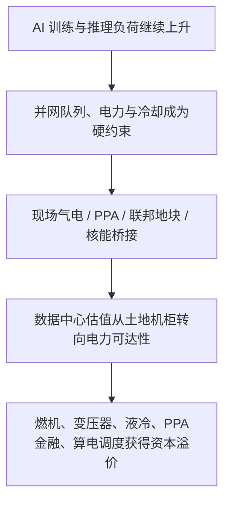
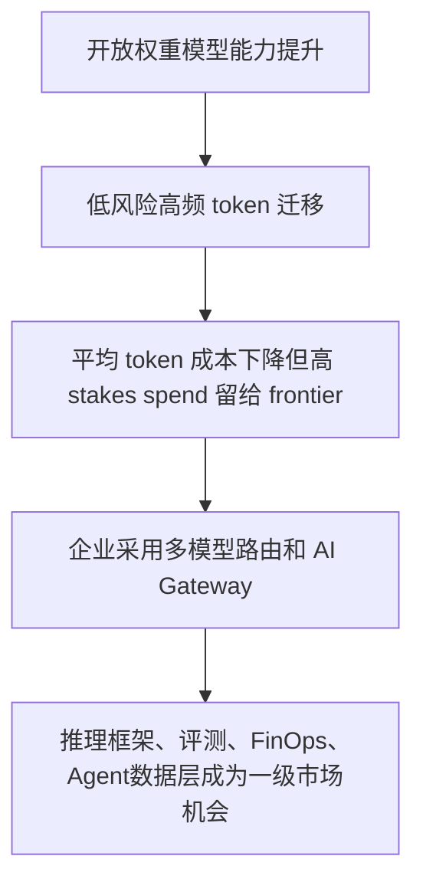

> **覆盖区间**：2026-07-14（周二）00:00 → 2026-07-20（周一）24:00（上海时区完整一周）
> **覆盖范围**：AI 产业链 5 层（能源 / 基础设施 / 芯片存储 / 模型框架 / 应用商业化）+ 4 横切维度（政策 / 国资 / 资金 / 人才）
> **时间窗声明**：仅收录区间内真实公开动态；区间外内容标注为背景，不用于凑本周动态。关键数据附来源与日期；查不到写“未公开”。

## 本周产业链全景

> 本周 AI 投资主线不是“谁又发了一个模型”，而是**AI 产业链从上到下同时被可交付能力约束重排**：底层是电力、并网、PPA 和现场发电；中层是 TSMC 先进制程/先进封装、HBM/CXL/内存层与机架级系统；上层是推理框架、开放权重路由、企业 AI Gateway 与行业 Agent 的商业化治理。
>
> **能源与基础设施层最热**：美国 DOE/NNSA 在 Savannah River Site 选择 Amentum 进入谈判，项目包括 1GW AI 数据中心和约 2GW 现场发电，路径是“天然气桥接核能”；中国国家能源局/中电联同步给出“十五五”电网固定资产投资 5 万亿元以上、算力用电 2030 年或达 8000 亿千瓦时的口径。AI 负荷已经从云厂成本项变成电网、燃机、核能、液冷和数据中心选址的投资主线。
>
> **芯片层仍强，但信号从单卡转向系统和供给约束**：TSMC 将 2026 年 capex 上修到 600-640 亿美元，HPC 占营收 66%；NVIDIA Vera Rubin、AMD Helios、华为/阿里/壁仞 SuperPoD 都显示客户购买的是机架/集群/软件栈，不再只是芯片。HBM、DRAM、CXL 和 GDDR 的供需紧张继续从数据中心外溢到边缘与工作站。
>
> **模型层的关键变量是推理经济学**：Vercel AI Gateway 数据显示开放权重模型跑了 29% 的生产 token、只占不到 4% spend；Inkling、vLLM、SGLang、TensorRT-LLM 同周释放的指标说明，模型竞争正在转化为 Day-0 serving、spec decode、prefill/decode 分离、CI/eval 质量体系之争。
>
> **应用层资本转向“结果/美元”**：OpenAI、Cohere、Databricks 同周强调 useful work per dollar、TCO、AI Gateway、上下文治理；Databricks 以 1880 亿美元估值签署战略融资 term sheet，Chai Discovery 4 亿美元融资把 AI for Science 再次推到一级市场热区。企业 AI 的付费理由从“更聪明”变成“可治理、可审计、可控成本地完成任务”。

---

## 🔥 本周 TOP 5 投资事件

> 按“对产业研判 + 一级市场机会判断的信号价值”排序，非新闻重要性。

### 1. DOE/NNSA 推 1GW AI 数据中心 + 2GW 现场电源，AI 电力硬约束进入政策交付层 ｜ 2026-07-20

美国 DOE/NNSA 宣布选择 Amentum 进入谈判，在南卡 Savannah River Site 以分阶段租赁方式开发 AI 数据中心和专用现场能源项目。原文明确项目包括 **1GW data center** 和约 **2GW on-site energy generation**，且路径是 **natural gas bridging to nuclear energy**。这不是单一数据中心选址新闻，而是把联邦土地、数据中心、现场发电、费率保护与未来核能迁移包装成一个可融资的政策项目。与此同时，中国国家能源局/中电联披露“十五五”电网投资将达 **5 万亿元以上**，算力用电到 2030 年预计达 **8000 亿千瓦时、占全社会用电约 6%**，中美都在用政策语言确认“算力的尽头是电力”。

↳ **投资意义**：AI 基建的稀缺资源从 GPU 采购进一步下沉到“能不能拿到可交付电力”。一级市场机会在模块化现场电站、PPA/tolling、并网排队数据、微电网 EMS、燃气桥接、核能许可、预制变电站和液冷可靠性；风险是燃机交期、许可、水资源与居民电价压力。 [DOE/NNSA](https://www.energy.gov/nnsa/articles/nnsa-selects-amentum-ai-data-center-and-energy-project-savannah-river-site) ｜ [国家能源局](http://www.nea.gov.cn/20260717/6ba0fac6398740758e0f0de19ef8d27e/c.html)

### 2. TSMC 上修 2026 capex 至 600-640 亿美元，先进制程与封装仍是 AI 硬瓶颈 ｜ 2026-07-16~20

TSMC 二季度材料和 CFO 采访显示，公司将 2026 年资本预算上调至 **600 亿-640 亿美元**，其中 70%-80% 投向先进制程，10%-20% 投向先进封装、测试、掩膜等；HPC 占营收 **66%**，Q1 为 61%。同时，Arizona 投资 pipeline 被描述为最高约 **2650 亿美元**，公司将 5nm 产能快速转向 3nm，并让 2nm 在 Q2 开始贡献收入、Q3 成为新收入驱动。与 NVIDIA Vera Rubin、AMD Helios、Etched N4P、Google Frozen v2、国产 SuperPoD 同周信号放在一起看，AI 硬件竞争的单位已经从芯片变成机架/集群，而上游供给仍卡在先进节点、先进封装、HBM 与测试。

↳ **投资意义**：TSMC 用 capex 上修而非口头乐观回应 AI 需求，说明供给瓶颈还未解除。比单一芯片公司更稳的机会在 CoWoS/SoIC、ABF/基板、良率检测、封装设备、热管理、电源、HBM 测试和美国本土半导体施工运维。 [W.Media](https://w.media/tsmc-raises-2026-capital-budget-to-us-64-billion-as-hpc-demand-surges/) ｜ [CNBC](https://www.cnbc.com/2026/07/20/tsmc-arizona-fab-capacity-ai-chip-demand.html)

### 3. BIS 放宽 UAE 先进算力出口，主权 AI 从地缘限制进入白名单扩张 ｜ 2026-07-14

美国 BIS 在 Federal Register 发布最终规则，对 UAE 在 EAR 下给予更优惠待遇：将 UAE 从 Country Groups D:3 和 D:4 移除，加入 A:5；更多 License Exceptions 可用，并明确 **UAE Government and approved commercial entities will also have license-free access to advanced computing items**。规则生效日为 **2026-07-10**。但这不是全面放开：先进计算物项仍保留一般许可要求，例外限于 UAE 政府、Supplement 8 批准实体、以及指定美国总部 AI 公司及其 UAE 子公司。该规则把中东主权 AI、美国云厂商、先进芯片、数据中心工程与合规审计放进同一条资本链。

↳ **投资意义**：出口管制从“国家一刀切”向“可信国家 + 批准实体 + 持续审计”演进。利好 UAE/MGX/G42/Core42 等相关 AI 数据中心项目和美国云/芯片/服务器供给链，也催生合规自动化、芯片资产追踪、数据中心安全审计、供应链 KYC 等新基础设施需求。 [Federal Register/GPO](https://www.govinfo.gov/content/pkg/FR-2026-07-14/html/2026-14132.htm) ｜ [BIS](https://www.bis.gov/press-release/department-commerce-eases-export-controls-uae)

### 4. Databricks 1880 亿美元估值战略融资，企业 AI 资本押注“上下文 + 治理 + Agent 数据层” ｜ 2026-07-16

Databricks 宣布已签署 term sheet，拟以 **1880 亿美元估值**进行战略融资，由 Coatue 领投，预计夏季晚些时候关闭。资金用途直指 AI 战略：Unity AI Gateway（多 AI 治理与成本控制）、Genie（把业务数据转为可信答案和动作的 AI coworker）、Lakebase（为 AI agents 构建的 serverless Postgres）。CEO Ali Ghodsi 的表述与 OpenAI/Cohere 同周口径高度一致：“Enterprises are moving from tokenmaxxing to valuemaxxing”，企业不想为每个任务都烧最贵模型，而是要 best outcome per dollar。

↳ **投资意义**：大额估值说明资本不只押模型，而是押“企业数据上下文 + 多模型治理 + Agent-ready 数据库”。这会抬高企业 AI Gateway、语义层、AI FinOps、Agent 数据库、评测/可观测性工具的估值，同时挤压缺少分发和数据控制面的独立工具。 [Databricks](https://www.databricks.com/company/newsroom/press-releases/databricks-raising-strategic-round-funding-188-billion-valuation)

### 5. 开放权重生产 token 升至 29%，推理经济学把模型层重新分层 ｜ 2026-07-13~15

Vercel AI Gateway Production Index 显示，6 月生产流量中 token volume 环比 +29%、spend +27%；开放权重模型跑了 **29%** 的 gateway tokens（4 月为 11%），但只占 **不到 4%** spend；DeepSeek 达 **22.6%** token volume，距 Google 不到 2 个百分点；Anthropic 则用 32% tokens 拿走 61% spend，并在高 stakes 用例拿到 72%+ spend。与此同时，Thinking Machines Lab Inkling 开放权重 975B/41B active 多模态模型与 vLLM Day-0 支持、SGLang/TileRT/TensorRT-LLM 的推理优化，同周把“模型发布”直接推向“可部署、可路由、可降本”的生产层。

↳ **投资意义**：开放权重不一定替代闭源 frontier，但会吃掉大量低风险高频 token，把闭源模型推向高 stakes 任务溢价。一级市场机会在模型路由、AI Gateway、FinOps for inference、spec decode、KV/cache 管理、框架商业支持、CI/eval 质量体系；风险是只做模型外壳、不控制成本/质量/分发的应用毛利被压缩。 [Vercel](https://vercel.com/blog/ai-gateway-production-index-july-2026) ｜ [vLLM Inkling](https://vllm.ai/blog/2026-07-15-inkling)

---

## 🧭 三条主线判断

**资本流向：从“模型故事”下沉到可交付基础设施。** 本周资金与政策最强信号集中在电力、数据中心、先进制程、封装、内存、AI Gateway 和企业数据层。AI 投资不再只看“谁模型更强”，而要看谁掌握电力、芯片供给、推理成本、数据上下文和企业治理入口。

**技术拐点：推理经济学接管模型层。** 开放权重 29% tokens / <4% spend、SGLang 500+ tok/s/user、vLLM/TileRT prefill-decode 解耦、AMD Quark EAGLE-3 1.4-2.0x 加速，说明推理优化、路由和框架质量正在把模型能力转化为真实毛利差异。

**政策导向：AI 基础设施进入“许可 + 白名单 + 成本分摊”时代。** BIS 的 UAE 白名单、DOE/NNSA 联邦地块数据中心项目、欧盟 AI Act/GPAI 执行、中国算电协同与绿电直连，都指向同一个事实：AI 不再只是软件监管问题，而是电网、出口管制、数据、算力、透明度和安全审计的综合产业政策问题。

---

## 🧩 产业链研判（so what 收敛层）

### ① 本周产业链传导链

### ② 景气度信号

- **上行：能源/电网/数据中心基础设施**。DOE/NNSA 1GW+2GW、BofA/Utility Dive 的 125GW 数据中心负荷、国家能源局/中电联“十五五”电网 5 万亿元以上投资，共同确认电力侧景气上行。**【确定性 高】**
- **上行：先进制程/封装/内存层**。TSMC capex 上修、HPC 66%营收、HBM sold out through 2027、CXL 内存层进入推理容量瓶颈，说明硬件瓶颈仍在。**【确定性 高】**
- **拐点：模型层从训练规模转向推理单位经济**。本周训练集群/训练成本硬数据静默，反而推理框架、开放权重、AI Gateway 数据密集释放，重心切换清晰。**【确定性 高】**
- **承压：纯模型 API 与单点应用外壳**。低风险 token 向低价开放权重迁移，云厂和企业应用厂商把 Agent 内置到核心系统，独立外壳型应用毛利承压。**【确定性 中】**

### ③ 资本流向判断（A目标）

钱本周在向三类资产集中：第一，**AI 供电与数据中心项目化资产**，包括现场发电、PPA、电网、液冷、低碳数据中心和核能/聚变远期期权；第二，**先进硬件瓶颈资产**，包括 TSMC 先进制程/封装、HBM/CXL、推理 ASIC 与机架级系统；第三，**企业 AI 控制面**，包括 Databricks/Unity AI Gateway、OpenAI/Cohere 的 TCO 与 useful work per dollar 叙事、Oracle/AWS 的 Agent 工作流交付。**【确定性 高】**

### ④ 一级市场机会与风险（C目标）

- **机会**：PPA/tolling 金融工具、并网排队情报、模块化电站、预制变电站、液冷可靠性、CXL/内存池化、KV cache 管理、spec decode、AI Gateway、模型路由、AI safety/audit、AI for Science 湿实验闭环。**【确定性 中高】**
- **风险**：推理 ASIC（如 Etched）和 AI for Science（如 Chai/新团队）估值上行很快，若缺少可执行合同、量产良率、第三方 benchmark 或药企里程碑，容易“估值先于证据”；数据中心项目若无锁电、锁客和许可，也容易被高 capex/长交期拖垮。**【确定性 中】**
- **本周无显著新信号的区域**：部分中国头部模型公司、央企国资算力项目公开原文不足，不能用旧闻或搜索摘要凑结论；后续需要以招采、交易所公告、地方发改委项目公示和官方公众号补核。**【确定性 高】**

### ⑤ 下周值得跟踪的领先指标

1. **Amentum/Savannah River 项目谈判与许可节点**：是否披露 PPA、燃机/核能路线、客户和租赁条款。**【确定性 中】**
2. **TSMC/内存厂后续 capex 与 CoWoS/HBM 交期**：验证先进封装和 HBM 是否继续成为 2027 供给瓶颈。**【确定性 高】**
3. **BIS Supplement 8 批准实体与中东 AI 服务器采购落地**：UAE 白名单是否转化为真实订单。**【确定性 中高】**
4. **Azure AMD Helios 实例可用区、定价和 benchmark**：观察推理芯片多供应商策略是否从公告进入客户可用。**【确定性 中】**
5. **Databricks 融资 closing 与 AI Gateway/Lakebase 客户案例**：验证 1880 亿美元估值是否对应可扩张收入，而不只是平台稀缺溢价。**【确定性 中】**

---

## 📚 各层深度正文

### 🔋 L1-L2 能源与基础设施

#### L2/核电与SMR
- 覆盖状态：有动态
- 本周动态：本周最强信号来自美国能源部/NNSA 7月20日宣布选择 Amentum 进入谈判，在南卡 Savannah River Site 以“分阶段租赁”开发 AI 数据中心和专用现场能源项目；原文称项目包含“1-gigawatt data center”和“approximately 2-gigawatts of on-site energy generation consisting of natural gas bridging to nuclear energy”，且“Selection for negotiations does not constitute a final lease award”，仍需谈判、许可、安全与联邦审批。该项目把联邦土地、数据中心、现场发电和未来核能迁移打包，是“先气后核”商业化路径的政策背书。同期 World Nuclear News 报道 Constellation Technology Ventures 战略投资 Blue Energy，Blue Energy 年内已披露融资 USD380mn，并与 GE Vernova 合作多 GW “gas-to-nuclear”项目，拟使用 GE Vernova 燃机和 BWRX-300 SMR；其 Texas Port of Victoria 项目规划最高 1.5GW 核电为 Crusoe AI factories 供电，2026 年或启动早期场地工作、2027 年 FID、2028 年先用气电、2031 年转核。两条新闻共同说明：SMR 短期不再只卖“反应堆故事”，而是被包装成 AI 数据中心可融资的“电力交付路径”，核心不是堆型创新，而是站址、许可、EPC/模块化、燃机桥接和长期负荷承诺。
- 关键数据：1GW 数据中心+约2GW现场发电（天然气桥接核能），DOE/NNSA，2026-07-20，[链接](https://www.energy.gov/nnsa/articles/nnsa-selects-amentum-ai-data-center-and-energy-project-savannah-river-site) ；Blue Energy USD380mn 融资、Port of Victoria 最高1.5GW核电、2026早期场地、2027 FID、2028气电、2031核电，World Nuclear News，2026-07-18左右，[链接](https://www.world-nuclear-news.org/articles/constellation-invests-in-blue-energy)
- 原文链接：[链接](https://www.energy.gov/nnsa/articles/nnsa-selects-amentum-ai-data-center-and-energy-project-savannah-river-site) ；[链接](https://www.world-nuclear-news.org/articles/constellation-invests-in-blue-energy)
- 投资判断【确定性 高】：高确定性的是“AI 负荷→可调度电源/核能重估→SMR项目融资前移”的方向；低确定性的是单个 SMR 项目能否按 48个月或2031年节点落地。一级市场更应看核岛之外的标准化厂房、许可咨询、核级供应链、模块化施工、核能PPA撮合，而不是只押堆型。
- So what：传导链为 GPU 集群用电刚性→数据中心寻求专用电源→燃机先行锁定交付→核能/SMR作为长期低碳基荷替换。领先指标：DOE联邦地块租赁进展、NRC里程碑、BWRX-300供应链订单、AI客户PPA/租赁披露、燃机桥接项目FID。

#### L2/核聚变
- 覆盖状态：有动态
- 本周动态：7月13日 Fusion Industry Association 发布《Global Fusion Industry in 2026》年度报告，显示截至2026年7月的12个月内，56家聚变公司合计融资 USD4.48bn，为其自2021年统计以来最高年度融资额、较2025年高69%，累计融资达 USD14.24bn；World Nuclear News 同步报道并交叉验证主要轮次包括 CFS USD863mn、Proxima Fusion USD518mn、Helion USD465mn、Inertia Enterprises USD450mn。报告首次纳入“选址和购电协议”指标：6家公司已有选址协议，5家公司已有PPA/offtake或类似商业承诺，另有公司在讨论；原文明确指出 Microsoft-Helion（2023）和 Google-CFS（2025）的PPA正在被AI能源需求加速。重要之处在于，聚变投资逻辑从“科研突破期权”转向“AI长期清洁电力期权”，大额融资与上市路径（TAE、General Fusion 准备/已推动 Nasdaq）给了二级/一级资本退出想象，但技术瓶颈仍集中在电效率、中子材料、氚自持，商业发电多数公司仍指向2030年代。
- 关键数据：12个月融资USD4.48bn，累计USD14.24bn，56家公司、16,000+雇员；CFS USD863mn、Proxima USD518mn、Helion USD465mn、Inertia USD450mn；6个选址协议、5个PPA/offtake；FIA，2026-07-13，[链接](https://www.fusionindustryassociation.org/fusion-industry-attracts-record-annual-funding-of-4-48bn-raising-total-to-14-24bn/) ；World Nuclear News交叉验证，[链接](https://www.world-nuclear-news.org/articles/fusion-industry-raised-usd45-billion-over-past-year-report-says)
- 原文链接：[链接](https://www.fusionindustryassociation.org/fusion-industry-attracts-record-annual-funding-of-4-48bn-raising-total-to-14-24bn/) ；[链接](https://www.world-nuclear-news.org/articles/fusion-industry-raised-usd45-billion-over-past-year-report-says)
- 投资判断【确定性 中】：确定的是AI算力让聚变PPA和选址提前、融资窗口重新打开；不确定的是商业发电时点和资本开支强度，平均仍需约USD2.7bn才能使电站商业可行。早期机会在中子材料、氚循环、功率电子、超导/激光、仿真与诊断，而非只追高整机估值。
- So what：资本流向从碳减排叙事转向“AI可用的远期清洁基荷期权”。领先指标：PPA/offtake数量、选址协议、政府燃料循环支持、材料验证、SPAC/IPO后融资成本。

#### L2/光伏/储能与低碳数据中心
- 覆盖状态：有动态
- 本周动态：本周没有看到单一重大光伏电站/组件订单专门绑定AI数据中心的新增公告；但7月16日前后 Currence/媒体披露的H1 2026气候科技融资数据构成重要信号：低碳数据中心开发商占全部气候VC融资34%，较一年前3%大幅上升，DayOne USD4.5bn 与 Nscale USD2bn Series C 合计约占总投资四分之一；The Register 原文称“route to power”正在像机柜和地产一样重要，且数据中心开发商推动长时储能、先进核能、地热甚至太空太阳能等融资。ESG Today 搜索摘要显示 SB Energy 这类“自建太阳能+储能+数据中心”的平台也进入最大交易样本，但原文403未能抓取全文；因此本周光伏主题不按单一项目凑数，而按“低碳供电资产被AI数据中心重定价”记录。DOE资源页同周更新/检索显示，美国把清洁能源PTC/ITC、储能、并网和DOE贷款工具列为满足数据中心需求的政策工具包，光伏+储能作为可快速建设电源继续是桥接方案之一，但容量信用不足意味着要和气电、核电、长储组合。
- 关键数据：H1 2026 climate tech VC USD26.1bn，同比+55%；低碳数据中心34%（一年前3%）；DayOne USD4.5bn、Nscale USD2bn；The Register，2026-07-16，[链接](https://www.theregister.com/ai-and-ml/2026/07/16/ai-power-binge-delivers-best-half-since-2022-for-climate-tech-venture-funding/5272401) ；ET Datacenters交叉验证，2026-07-17左右，[链接](https://datacenters.economictimes.indiatimes.com/news/investments-deals/climate-tech-venture-funding-surges-driven-by-ai-infrastructure-demand/132451458)
- 原文链接：[链接](https://www.theregister.com/ai-and-ml/2026/07/16/ai-power-binge-delivers-best-half-since-2022-for-climate-tech-venture-funding/5272401) ；[链接](https://datacenters.economictimes.indiatimes.com/news/investments-deals/climate-tech-venture-funding-surges-driven-by-ai-infrastructure-demand/132451458) ；[链接](https://www.energy.gov/oe/clean-energy-resources-meet-data-center-electricity-demand)
- 投资判断【确定性 中】：确定的是AI负荷会继续提高绿电资产、储能和PPA撮合的战略价值；不确定的是纯光伏能否独立满足AI训练负荷的24/7需求。一级市场应优先看“光伏+储能+负荷调度+PPA结算+并网排队优化”的组合平台，而非单纯组件扩产。
- So what：景气信号从组件价格转向“可交付电力”。领先指标：低碳数据中心融资占比、储能时长、容量信用规则、企业24/7 CFE采购、虚拟/物理PPA价差。

#### L2/天然气与现场发电
- 覆盖状态：有动态
- 本周动态：7月17日 Utility Dive 引述 BofA 报告称，美国未来五年需新增超过230GW发电容量，但受监管公用事业预计仅增加约93GW认可容量，缺口超过100GW；数据中心单独可能新增约125GW美国电力负荷，推动2026-2030年总电力需求CAGR达4.1%。原文进一步指出大型燃机产能基本售罄至2030年，数据中心开发商更可能转向现场燃气内燃机，同时公用事业延迟煤电退役、部署电池和输电升级。7月20日DOE/NNSA项目也给出同样方向：Savannah River项目约2GW现场发电“natural gas bridging to nuclear”。Schneider Electric 7月17日文章补充，AI数据中心正采用能源园区、气电、储能和微电网绕开并网等待，例举 Abilene Stargate 1.2GW 项目大部分来自自有天然气电厂、Meta Hyperion 规划10座气电厂合计7.5GW（旧闻背景）。天然气因此成为AI算力“时间换空间”的第一顺位桥接电源，但燃机/发动机供应、管道、排放许可和社区阻力会成为瓶颈。
- 关键数据：美国未来五年需>230GW新增发电；公用事业仅约93GW认可容量；缺口>100GW；数据中心新增约125GW负荷；>7.5GW现场发电数据中心在建、60GW+预建设；Utility Dive/BofA，2026-07-17，[链接](https://www.utilitydive.com/news/ai-data-center-growth-utilities-generation-plans/825541/) ；Savannah River约2GW现场发电，DOE/NNSA，2026-07-20，[链接](https://www.energy.gov/nnsa/articles/nnsa-selects-amentum-ai-data-center-and-energy-project-savannah-river-site)
- 原文链接：[链接](https://www.utilitydive.com/news/ai-data-center-growth-utilities-generation-plans/825541/) ；[链接](https://blog.se.com/datacenter/2026/07/17/powering-ai-gold-rush-new-strategies-beyond-grid-connections/) ；[链接](https://www.energy.gov/nnsa/articles/nnsa-selects-amentum-ai-data-center-and-energy-project-savannah-river-site)
- 投资判断【确定性 高】：高确定性的是近端AI数据中心会大量使用燃气发动机/小燃机/BESS混合供电；中期确定性取决于燃机供给与气源。机会在燃机替代设备、模块化电站、燃气管网/调压、微电网EMS、排放控制；风险是政策对碳排和成本转嫁约束加码。
- So what：传导链为并网队列拉长→开发商追求speed-to-power→现场气电/能源园区订单增加→燃机、发动机、变压器、BESS和燃气基础设施紧缺。领先指标：燃机交期、BTM项目GW、管道许可、数据中心专属费率。

#### L2/电网与输配电设备
- 覆盖状态：有动态
- 本周动态：中国侧，本周国家能源局转载/发布中电联《中国电力行业年度发展报告2026》重点解读，提出“十五五”全国电网固定资产投资将达5万亿元以上、较“十四五”同期增长超80%；拟新增投产约15回特高压直流输电通道，西电东送规模超过4.2亿千瓦，建成6个以上区域电网互济工程，提升互济能力约4000万千瓦。政策/产业含义非常直接：AI算力、电气化、新能源消纳共同把电网从“配套资产”推成主投资主线。海外侧，每经网7月16日援引央视财经报道，全球算力、数据中心及终端设备需求扩张带动中国预制舱变电站、变压器出口，山东省上半年电工器材出口货值267.3亿元、同比+9.3%，其中变电站和变压器产品出口超过70亿元，有企业上半年海外交付项目同比+30%；最高电压等级预制舱变电站已在阿曼送电。国内外合看，电网瓶颈从输电规划延伸到变压器、高压开关、预制舱、工程交付和海关标准互认。
- 关键数据：“十五五”电网固定资产投资5万亿元以上、同比“十四五”+80%+；约15回特高压直流；西电东送>4.2亿千瓦；互济能力+4000万千瓦；国家能源局/中电联，2026-07-17，[链接](http://www.nea.gov.cn/20260717/6ba0fac6398740758e0f0de19ef8d27e/c.html) ；山东电工器材出口267.3亿元，同比+9.3%；变电站/变压器出口>70亿元，企业海外交付+30%；每经/央视财经，2026-07-16，[链接](https://www.nbd.com.cn/articles/2026-07-16/4474120.html)
- 原文链接：[链接](http://www.nea.gov.cn/20260717/6ba0fac6398740758e0f0de19ef8d27e/c.html) ；[链接](https://www.nbd.com.cn/articles/2026-07-16/4474120.html) ；[链接](https://www.stdaily.com/web/gdxw/2026-07/16/content_548231.html)
- 投资判断【确定性 高】：电网是本周最确定的景气方向之一，需求来自算力负荷、新能源消纳和跨区互济三重叠加。一级机会在数字化配网、预制变电站、变压器监测、动态增容、柔性互联、虚拟电厂和需求响应；风险是特高压/电网投资周期长、招标节奏与价格管制。
- So what：景气信号由“发电侧扩容”传导到“电力可达性”。领先指标：特高压核准/招标、变压器交期、预制舱出口、配网数智化招标、数据中心接入协议。

#### L2/电力PPA与项目融资结构
- 覆盖状态：有动态
- 本周动态：A&O Shearman 7月中旬文章指出，在AI驱动的数据中心建设中，JV已从“融资选项之一”变成默认交付模型，尤其 developer-power developer JV 正在重塑项目结构。原文写道，在合同购电模型下，数据中心开发商“不拿股权”，而是与拥有燃机/电站的电力开发商或IPP签长期PPA或tolling arrangement；PPA或tolling费用必须在足以匹配桥接用途的期限内回收发电方资本成本，通常7-12年，并与预计电网连接日期对应。该文还指出 powered shell site 相比未锁电站址可有2-3倍溢价，VoltaGrid-Oracle 例子为超过2,300MW模块化现场发电供给OCI AI数据中心。Global Data Center Hub 7月18日也称PPA已从运营决策变成融资优先事项，物理PPA保障直供、虚拟PPA对冲价格但有基差风险，核能PPA快速扩张。结论：PPA已成为数据中心估值、债务可得性和开工顺序的核心文件。
- 关键数据：PPA/tolling桥接期限通常7-12年；powered shell site可较未锁电站址有2-3x溢价；VoltaGrid向Oracle部署>2,300MW模块化现场发电（文中案例）；A&O Shearman，2026-07-17左右，[链接](https://www.aoshearman.com/en/insights/data-center-insights/joint-ventures-powering-the-data-center-build-out-three-partnerships-reshaping-the-market) ；PJM AI项目从申请到运营平均>7年（Global Data Center Hub），2026-07-18，[链接](https://www.globaldatacenterhub.com/p/capacity-planning-the-numbers-locked)
- 原文链接：[链接](https://www.aoshearman.com/en/insights/data-center-insights/joint-ventures-powering-the-data-center-build-out-three-partnerships-reshaping-the-market) ；[链接](https://www.globaldatacenterhub.com/p/capacity-planning-the-numbers-locked)
- 投资判断【确定性 高】：确定性高的是PPA/电力包销能力将成为数据中心资产的估值乘数；仅有土地和机柜不再足够。一级市场机会在PPA撮合、能源金融建模、可中断负荷合约、tolling管理、信用增强、BTM合规；风险在长期价格/燃料/并网责任错配。
- So what：资本流向从房地产开发转向“电力+地产+客户包销”的复合项目融资。领先指标：PPA期限、take-or-pay比例、tolling价、项目债条款、hyperscaler信用支持。

#### L2/数据中心建设与选址
- 覆盖状态：有动态
- 本周动态：7月20日DOE/NNSA选择Amentum的Savannah River Site项目，将1GW数据中心与约2GW现场能源放在同一联邦地块，代表美国将核安全/能源部门土地转化为AI基础设施承载空间。DOE页面同时回溯其2025年4月已识别16个联邦站点，Savannah River等4个进入私营开发邀请阶段；本周新动态是Amentum被选中进入谈判。Global Data Center Hub 7月18日从选址方法论层面给出强信号：行业建设顺序已反转，过去先拿地、审批、签租、最后接电；现在“Power access and fiber connectivity now sit at the front of the site selection process”，100MW以上校园会触发多阶段并网研究，20MW以上负荷通常进入可行性、系统影响、设施研究、互联协议/施工四阶段；PJM AI项目从申请到运营平均超过7年。训练负荷可去低电价/低时延要求区域，推理负荷需要接近用户，形成“农村训练、城市推理”的基础设施二分。
- 关键数据：Savannah River 1GW数据中心+约2GW现场能源；DOE 16个潜在联邦站点、4个推进私营开发（背景）；DOE/NNSA，2026-07-20，[链接](https://www.energy.gov/nnsa/articles/nnsa-selects-amentum-ai-data-center-and-energy-project-savannah-river-site) ；数据中心shell建设18-24个月，高压输电/变电许可建设7-10年；PJM AI项目平均>7年；Global Data Center Hub，2026-07-18，[链接](https://www.globaldatacenterhub.com/p/capacity-planning-the-numbers-locked)
- 原文链接：[链接](https://www.energy.gov/nnsa/articles/nnsa-selects-amentum-ai-data-center-and-energy-project-savannah-river-site) ；[链接](https://www.globaldatacenterhub.com/p/capacity-planning-the-numbers-locked) ；[链接](https://www.energy.gov/policy/ai-infrastructure-doe-lands-request-information)
- 投资判断【确定性 高】：数据中心估值核心从“土地+低成本建设”转为“电力可达+光纤冗余+许可速度”。早期机会在选址数据、并网排队情报、土地/电力联合开发、联邦/棕地再利用、推理边缘站址；风险是社区反对、水资源、费率和环保暂停。
- So what：传导链为AI需求→开工瓶颈转向电力/光纤→有电有纤站址溢价→传统地产开发商让位于能源-数据中心复合开发商。领先指标：MW获批量、并网研究状态、长协电价、暗纤路径、许可诉讼。

#### L2/液冷散热
- 覆盖状态：有动态
- 本周动态：Schneider Electric 7月15日发布液冷故障风险文章，核心不是新品发布，而是把液冷从“可选节能设备”提升为保护AI数据中心投资的可靠性基础设施。原文称AI单机柜成本可达 USD3mn+，未来1GW AI数据中心成本估算约 USD38bn；液冷故障常见原因包括泵故障、冷却液劣化、泄漏和传感器问题，高密度AI环境下系统达到临界温度阈值可能只需数秒，带来降频、停机、硬件损坏、SLA罚款甚至合同终止。Modelon 7月14日文章从热管理前沿补充：AI GPU+CPU处理器功耗进入700-2000W甚至更高区间，散热目标不只是带走热量，而是保持time-to-tokens吞吐、避免热点和延长芯片寿命；当前方向包括direct-to-chip、单相/两相冷板、CDU、无冷机运行、芯片级热点控制和废热利用。两源共同表明液冷市场下一阶段卖点会从“冷板/管路硬件”扩展到冗余、监控、流体维护、数字孪生和全系统仿真。
- 关键数据：AI机柜USD3mn+；1GW AI数据中心估算USD38bn；Schneider Electric，2026-07-15，[链接](https://blog.se.com/datacenter/2026/07/15/liquid-cooling-failures-ai-data-centers-causes-risks-prevention/) ；AI处理器功耗700-2000W+；废热设想每200+MWe数据中心可发20-25MW电并保留50℃温水；Modelon，2026-07-14，[链接](https://www.modelon.com/blog/why-data-center-thermal-management-cant-wait/)
- 原文链接：[链接](https://blog.se.com/datacenter/2026/07/15/liquid-cooling-failures-ai-data-centers-causes-risks-prevention/) ；[链接](https://www.modelon.com/blog/why-data-center-thermal-management-cant-wait/)
- 投资判断【确定性 高】：液冷渗透率提升确定性高，且可靠性/运维软件化开始成为新壁垒。一级机会在CDU冗余、泄漏检测、冷却液监测、冷板仿真、数字孪生、废热回收；风险是标准碎片化和大客户自研压价。
- So what：景气信号为高功率GPU→机柜密度上升→液冷从CAPEX项目变成SLA保障资产。领先指标：单柜kW、CDU订单、冷却液更换周期、液冷故障保险/质保条款、废热利用并网/供热案例。

#### L2/网络互联与光纤
- 覆盖状态：有动态
- 本周动态：本周网络互联主题没有发现重大融资或并购公告，但选址与架构层面有明确动态。Global Data Center Hub 7月18日指出，电力决定设施能否运行，光纤决定运行效果；AI训练需要GPU间超低时延网络，带宽需求从 H200 约800Gbps 上升到 B200 超过1,200Gbps，进而影响建筑净高、管道路由和内部布线。外部连通性方面，真正的运营韧性来自“carrier diversity”：不同运营商使用物理分离的路线、入口点和设备；共享管道不构成冗余，暗纤所有权和长期路由协议成为战略资产。该文还提出训练和推理的地理分裂：训练集群可去电力便宜地区，推理负荷需要 sub-10ms 靠近用户。该主题本周偏“方法论/约束变化”，不是单一公司事件，但对投资价值很高：光模块/光纤/交换/暗纤路径正成为AI基础设施与电力同等级的硬约束。
- 关键数据：H200带宽需求约800Gbps，B200超过1,200Gbps；推理负荷要求sub-10ms接近用户；Global Data Center Hub，2026-07-18，[链接](https://www.globaldatacenterhub.com/p/capacity-planning-the-numbers-locked) ；搜索另见Lightwave/EE Times本周关于800G/1.6T趋势，但部分原文403/超时，未作为关键数据主源。
- 原文链接：[链接](https://www.globaldatacenterhub.com/p/capacity-planning-the-numbers-locked)
- 投资判断【确定性 中】：确定的是AI集群网络带宽和物理路由约束继续抬升；中等不确定性在于不同光互联路线（可插拔、CPO、硅光）的节奏。一级机会在暗纤资产数据、路由冗余规划、低时延metro edge、800G/1.6T测试与运维；风险是技术迭代快、客户集中。
- So what：传导链为训练规模扩大→GPU互联带宽上升→园区内部光纤/交换架构前置到设计阶段→有独立路由的站址溢价。领先指标：800G/1.6T出货、暗纤长协、双路由接入率、metro inference节点布局。

#### L2/能源与数据中心政策监管
- 覆盖状态：有动态
- 本周动态：美国政策端有两条强信号。其一，纽约州长Hochul 7月14日签署行政令，暂停新建用电50MW及以上大型数据中心最多一年；CNBC原文摘录称“barring the construction of new large-scale data centers using 50 megawatts or more of power for up to one year”，州长解释这些 hyperscale AI 数据中心消耗巨大电力、可能超过电网能力并推高居民成本。官方州长网站原始链接检索到但web_fetch遭403，故以CNBC全文和EnergyNewsBeat汇总为可读来源，后者补充适用范围为50MW以上、暂停许可最长一年、用于研究电网/水资源/社区影响，小型医院、大学、后台金融服务设施豁免；并称纽约此前立法讨论过20MW门槛。其二，中国中电联/国家能源局提出政策方向：鼓励算力企业绿电直连、源网荷储一体化，鼓励算力设施作为灵活调节资源参与电力市场，以电力时空价格信号引导负荷。政策含义是中美都在把数据中心纳入“谁付电网成本、谁承担调节义务”的监管框架。
- 关键数据：纽约暂停50MW及以上新大型数据中心最长1年；CNBC，2026-07-14，[链接](https://www.cnbc.com/2026/07/14/new-york-ai-data-center-ban.html) ；EnergyNewsBeat，2026-07-14，[链接](https://energynewsbeat.co/ai/new-york-imposes-first-ever-moratorium-on-u-s-data-centers/) ；中国政策方向：绿电直连、源网荷储一体化、算力参与电力市场、时空价格信号；国家能源局，2026-07-17，[链接](http://www.nea.gov.cn/20260717/6ba0fac6398740758e0f0de19ef8d27e/c.html)
- 原文链接：[链接](https://www.cnbc.com/2026/07/14/new-york-ai-data-center-ban.html) ；[链接](https://energynewsbeat.co/ai/new-york-imposes-first-ever-moratorium-on-u-s-data-centers/) ；[链接](http://www.nea.gov.cn/20260717/6ba0fac6398740758e0f0de19ef8d27e/c.html)
- 投资判断【确定性 高】：确定的是监管将从环保审批扩展到电网成本分摊、可中断性、现场电源和社区水/噪声影响。机会在合规、能源计费、需求响应、环境影响评估、低水耗冷却；风险是高负荷项目在高电价/高监管地区估值折价。
- So what：政策传导链为居民电价压力→数据中心许可/费率约束→项目迁移到低价且支持性区域→可调节/自带电源项目获政策优势。领先指标：MW门槛、专属费率、税收优惠取消、可中断负荷补偿、EIS要求。

#### 国资算力与电网企业
- 覆盖状态：有动态
- 本周动态：中国网7月20日《焦点访谈》调查是本周国内“算电协同”最具体案例。全国用电负荷7月10日创今年以来历史新高，达15.18亿千瓦；广东韶关作为国家数据中心十大集群之一，建成算力从去年同期5000匹升至3万匹，用电量为去年同期五六百倍。原文称普通机柜满负荷一天约240度电，相当于普通家庭一个月；2025年全国算力中心用电量同比+18.1%，高于全社会用电量+5.2%。南方电网数字集团在广州负荷偏高时通过“电算碳协同系统”向中国移动南方基地数据中心下发调度指令，将不紧急推算任务从广州迁移到贵州贵安数据中心，约5分钟转移1.6千瓦负荷；虽规模很小，但验证了“算力任务可迁移为电网调节资源”。江苏扬州则计划7月下旬上线算电协同调度平台，引导本地算力在新能源大发时段消纳绿电。该主题本周没有看到国家电网具体AI数据中心项目公告，但国家能源局/中电联“六张网”与电网投资解读已覆盖国家电网/南网后续投资方向。
- 关键数据：7月10日全国用电负荷15.18亿千瓦；韶关算力5000匹→3万匹、用电量同比五六百倍；2025算力中心用电同比+18.1%、全社会+5.2%；2025算力中心占全社会用电1.6%；南网试验5分钟转移1.6千瓦；中国网，2026-07-20，[链接](http://news.china.com.cn/2026-07/20/content_118607714.shtml) ；2030算力用电8000亿千瓦时/占6%，国家能源局/中电联，2026-07-17，[链接](http://www.nea.gov.cn/20260717/6ba0fac6398740758e0f0de19ef8d27e/c.html)
- 原文链接：[链接](http://news.china.com.cn/2026-07/20/content_118607714.shtml) ；[链接](http://www.nea.gov.cn/20260717/6ba0fac6398740758e0f0de19ef8d27e/c.html) ；[链接](https://finance.sina.com.cn/tech/roll/2026-07-15/doc-inihwrre1134327.shtml)
- 投资判断【确定性 中】：确定的是东数西算从“静态布局”走向“动态调度”，运营商数据中心和电网企业将共同参与负荷管理；不确定的是可迁移任务占比、结算机制和跨省利益分配。机会在算力调度平台、碳电算计量、运营商算力交易、负荷预测、绿色算力认证。
- So what：传导链为迎峰度夏压力→算力从刚性负荷变灵活资源→电力现货/时空价格驱动任务迁移→西部绿电算力价值提升。领先指标：可迁移MW规模、运营商参与深度、电力市场补偿、跨省算力结算规则。

#### L2/融资并购、基金与资本市场
- 覆盖状态：有动态
- 本周动态：本周资本信号高度集中在“AI基础设施把气候科技推向基础设施金融”。The Register/ET Datacenters引用Currence称，H1 2026气候科技VC融资USD26.1bn，同比+55%，但交易数下降25%，前10大轮次占全部融资42%；低碳数据中心开发商占气候VC的34%，DayOne USD4.5bn和Nscale USD2bn合计约占四分之一。Latitude Media 引用 Net Zero Insights 给出另一套口径：H1 2026私募市场气候科技融资USD41.3bn，平均轮次从USD18mn升至USD27mn；债务仍约占全部气候科技融资四分之一，Series C及以后吸收USD7.5bn，成长股权从H2 2025的USD1.9bn回升至H1 2026的USD3.1bn；X-energy 4月以USD11.9bn估值登陆Nasdaq、Fervo 5月USD1.9bn IPO，说明“可部署稳定电力”打开退出窗口。核聚变FIA报告也显示年度融资USD4.48bn创纪录。资本市场偏好正在从早期碳减排技术转向可在AI负荷中变现的电力、数据中心、核能、地热、储能与电网资产。
- 关键数据：Currence口径：H1 2026 climate tech VC USD26.1bn，同比+55%，deal count -25%，前10轮占42%，低碳数据中心34%，DayOne USD4.5bn，Nscale USD2bn；The Register，2026-07-16，[链接](https://www.theregister.com/ai-and-ml/2026/07/16/ai-power-binge-delivers-best-half-since-2022-for-climate-tech-venture-funding/5272401) ；Net Zero Insights口径：H1私募气候科技USD41.3bn、平均轮USD27mn、Series C+ USD7.5bn、成长股权USD3.1bn；Latitude Media，2026-07-14左右，[链接](https://www.latitudemedia.com/news/how-the-2026-climate-tech-market-is-shaping-up-so-far/) ；FIA聚变USD4.48bn，[链接](https://www.fusionindustryassociation.org/fusion-industry-attracts-record-annual-funding-of-4-48bn-raising-total-to-14-24bn/)
- 原文链接：[链接](https://www.theregister.com/ai-and-ml/2026/07/16/ai-power-binge-delivers-best-half-since-2022-for-climate-tech-venture-funding/5272401) ；[链接](https://www.latitudemedia.com/news/how-the-2026-climate-tech-market-is-shaping-up-so-far/) ；[链接](https://www.fusionindustryassociation.org/fusion-industry-attracts-record-annual-funding-of-4-48bn-raising-total-to-14-24bn/)
- 投资判断【确定性 高】：高确定性的是资金向大额、项目化、具备明确电力/算力收入的资产集中；传统轻资产气候软件和碳相关股权承压。早期基金要避开“需要巨额项目债但无锁电/锁客”的公司，寻找能嵌入大项目的关键部件、软件和金融工具。
- So what：资本流向从“气候主题”迁移到“AI供电能力”。领先指标：Series C+占比、项目债成本、hyperscaler anchor、IPO/SPAC窗口、低碳数据中心占气候融资比例。

#### L2/人才与劳动力
- 覆盖状态：有动态
- 本周动态：Indeed Hiring Lab 7月14日数据显示，AI数据中心建设正在创造一类“不像传统科技岗位的科技岗位”。过去两年，美国数据中心相关职位发布量翻倍以上；每1000个美国职位中已有6个与数据中心相关，2023年5月/6月约为2个；同期美国总招聘发布约下降12%，非数据中心科技岗下降6%。2026年至今，市值前10大科技公司占数据中心岗位发布的71%，并把招聘地理从硅谷/西雅图/Austin推向 Columbus OH、Jackson MS、Reno NV 等中小都会区，三地来自前10大科技公司职位占比从2025年中低于2%升至当前超过10%。岗位结构上，约四分之一数据中心职位是安装与维护；小时制安装维护岗位在数据中心场景中薪酬较非数据中心同类岗位高42%，约每小时多USD10。DOE Portsmouth项目也显示单个10GW级AI/能源园区预计带来1万+建设岗位和2000+运营岗位（该项目3月发布，本周作为DOE页面检索背景）。人才瓶颈已从软件工程师转向电气、施工、运维、液冷、并网、燃机/核安全等跨界工种。
- 关键数据：数据中心职位两年翻倍；6/1000美国职位与数据中心相关（2023约2/1000）；前10大科技公司占2026数据中心职位71%；安装维护约25%；小时薪酬溢价42%/约USD10每小时；Indeed Hiring Lab，2026-07-14，[链接](https://www.hiringlab.org/2026/07/14/hiring-for-the-data-center-build-out/) ；Portsmouth项目1万+建设、2000+运营岗位（背景，DOE，2026-03-20/07检索），[链接](https://www.energy.gov/articles/fact-sheet-department-energy-ensuring-affordable-energy-access-ohio-while-powering-future)
- 原文链接：[链接](https://www.hiringlab.org/2026/07/14/hiring-for-the-data-center-build-out/) ；[链接](https://www.energy.gov/articles/fact-sheet-department-energy-ensuring-affordable-energy-access-ohio-while-powering-future)
- 投资判断【确定性 中】：确定的是数据中心建设会支撑电气/机电/运维岗位需求；不确定的是建设高峰后的长期岗位留存。机会在数据中心技工培训、液冷运维认证、电力项目管理软件、安全合规培训；风险是区域劳动力短缺推高项目成本并延误交付。
- So what：传导链为AI资本开支→数据中心/电站建设潮→安装维护、电气工程、冷却运维紧缺→薪酬溢价和培训需求上升。领先指标：岗位发布/工资溢价、EPC排期、工会协议、项目延期原因中的劳动力占比。

#### L2/静默与获取失败主题补充
- 覆盖状态：静默/获取失败
- 本周动态：本周检索覆盖了核电/SMR/聚变、光伏/储能、天然气、电网、PPA、数据中心选址、液冷、网络互联、政策监管、国资算力/东数西算/运营商/南方电网/国家电网、融资并购/基金、人才。静默原因主要有三类：第一，未发现“本周新增且权威来源可读”的单一光伏PPA或组件扩产专门服务AI数据中心公告，因此光伏只以H1低碳数据中心融资与DOE清洁能源工具包记录，不把旧项目当本周动态；第二，国家电网本周未检索到独立AI数据中心/算电协同新公告，相关判断来自国家能源局/中电联对新型电网和算电协同的政策解读；第三，部分原始/权威来源获取失败：纽约州长官网新闻稿、ESG Today、Power Engineering、Data Center Frontier、NucNet、Enverus、EE Times/Lightwave等出现403/超时/解析失败，已改用可web_fetch打开的CNBC、EnergyNewsBeat、World Nuclear News、Utility Dive、DOE、A&O Shearman、Global Data Center Hub等来源，并在关键数据中标明可读来源。未公开数据均未编造。
- 关键数据：获取失败URL包括 [链接](https://www.governor.ny.gov/news/first-statewide-moratorium-new-hyperscale-data-centers-launched-governor-kathy-hochul) （403）、[链接](https://www.esgtoday.com/climate-tech-funding-surges-in-h1-2026-on-growing-data-center-demand-for-low-carbon-power-report/) （403）、[链接](https://www.enverus.com/blog/national-grids-1-75b-bet-joulent-shows-what-it-takes-to-justify-new-gas/) （403）等；检索时间：2026-07-21 上海时间。
- 原文链接：见各主题；失败链接如上。
- 投资判断【确定性 中】：静默不是需求缺失，而是本周缺少可核验新增公告。研究上应避免将旧闻包装为周动态，保留为背景和领先指标。
- So what：覆盖缺口提示后续重点监控：国家电网/运营商正式公告、光伏+储能数据中心项目FID、NY行政令原文、Enverus/Joulent交易原始公告、光互联厂商财报。

#### 能源与基础设施本层投资洞察
1. 本周能源与基础设施最强主线是“AI基础设施的瓶颈从GPU采购转向可交付电力”。美国侧，BofA/Utility Dive指出未来五年数据中心可能新增125GW负荷，而公用事业认可容量缺口超过100GW；中国侧，中电联/国家能源局预计2030年算力用电达8000亿千瓦时、约占全社会用电6%。电力可达性已成为AI供给曲线的硬约束。
2. “先气后核/先现场发电后并网”成为近端交付路径。DOE/NNSA Savannah River 1GW数据中心+2GW现场发电、Blue Energy gas-to-nuclear、Schneider列举能源园区/微电网，说明燃气桥接和SMR远期替换正在组合成可融资产品。
3. 中国的差异化优势在“算电协同+电网投资+设备出口”。南网5分钟迁移1.6kW虽小，但证明算力负荷可调节；“十五五”电网投资5万亿元以上与预制变电站出口增长，形成从政策、工程到制造的完整传导链。
4. 一级市场机会从单点技术转向系统集成：并网排队数据、PPA/tolling金融工具、模块化电站、预制变电站、液冷可靠性、暗纤路由、算电碳调度、数据中心技工培训。最需警惕的是只讲AI需求但无法锁定电力、许可和客户的项目。
5. 政策风险开始重定价。纽约50MW+数据中心暂停许可最多一年，与中国鼓励绿电直连/源网荷储/参与电力市场，方向不同但共同指向：数据中心必须为电网成本和调节责任买单。

#### 能源与基础设施覆盖清单与静默主题
- 核电/SMR：有动态；DOE/NNSA Amentum、Blue Energy/Constellation。
- 核聚变：有动态；FIA年度融资报告与PPA/选址指标。
- 光伏/储能：有动态但无单一新增项目；按低碳数据中心融资和DOE工具包记录。
- 天然气：有动态；BofA/Utility Dive、DOE/NNSA、Schneider。
- 电网：有动态；中电联/国家能源局“十五五”电网投资、设备出口。
- 电力PPA：有动态；A&O Shearman、Global Data Center Hub。
- 数据中心建设/选址：有动态；Savannah River、power+fiber选址反转。
- 液冷散热：有动态；Schneider、Modelon。
- 网络互联：有动态但偏约束/方法论；Global Data Center Hub，部分光互联来源获取失败。
- 能源/数据中心政策监管：有动态；纽约50MW+暂停、中国算电协同政策。
- 国资算力/东数西算/运营商/国家电网/南方电网：有动态；中国网焦点访谈、南网电算碳协同、中国移动南方基地、贵安迁移；国家电网无单独本周项目公告。
- 融资并购/基金：有动态；Currence、Net Zero Insights、FIA。
- 人才：有动态；Indeed Hiring Lab。

#### 能源与基础设施数据源与交叉验证说明
- 时间窗执行：优先采用2026-07-14至2026-07-20发布/更新的DOE、国家能源局/中电联、FIA、Utility Dive、Indeed、CNBC、A&O Shearman、Global Data Center Hub、Schneider、Modelon、中国网等来源；区间外DOE Portsmouth/SB Energy等仅作背景，已标注。
- 关键数据交叉验证：聚变融资由FIA原始报告与World Nuclear News交叉；中国算力用电/电网投资由国家能源局转载、中电联新闻稿口径、科技日报/证券时报交叉；气候科技融资由The Register、ET Datacenters和Latitude不同口径并列；Savannah River以DOE/NNSA原文为准；数据中心劳动力以Indeed原文为准。
- 获取失败处理：对403/超时来源不采作唯一关键数据；若搜索摘要有信息但原文未能打开，仅作为线索，不作为核心事实。纽约官方州长网页403，改用CNBC可读全文与EnergyNewsBeat汇总，并注明官方原文获取失败。
- 口径差异：Currence的USD26.1bn为气候科技VC口径；Net Zero Insights的USD41.3bn为私募市场气候科技融资口径，二者不可直接相加。中国“算力中心/数据中心用电”不同媒体存在表述差异，本文以国家能源局/中电联转载口径为主。

---

### 💾 L3 芯片与存储

#### NVIDIA：Vera Rubin
- 覆盖状态：有动态
- 本周动态：2026-07-20，NVIDIA与Bristol Myers Squibb（BMS）披露，BMS将部署第二套NVIDIA DGX SuperPOD，基于8套DGX Vera Rubin NVL72机架级系统，目标是建设生命科学行业“最强/最高能效”的单一企业自有AI基础设施。NVIDIA官方博客原文称：“BMS announced today it is deploying its second NVIDIA DGX SuperPOD, this one built on eight DGX Vera Rubin NVL72 systems”，且“each comprising NVIDIA Vera CPUs and Rubin GPUs, deliver up to 10x the performance per megawatt of the infrastructure it replaces”。Business Wire稿（经Yahoo Finance镜像检索验证，2026-07-20）亦称BMS将部署“an NVIDIA DGX SuperPOD with DGX Vera Rubin NVL72 systems”，用于扩展专有AI模型、压缩药物发现周期并支撑BioNeMo/agentic workflows。该动态的信号价值不在单一药企采购金额（未公开），而在Rubin从发布路线图进入垂直行业首批落地：生命科学工作负载从“训练大模型”外溢到结构预测、分子设计、数字孪生、临床应用等持续推理/仿真任务，说明GPU整机需求仍沿“CPU+GPU+网络+软件+行业工具链”打包升级。
- 关键数据：8套DGX Vera Rubin NVL72系统；每套含NVIDIA Vera CPU与Rubin GPU；最高10倍performance per megawatt（NVIDIA Blog，2026-07-20，[链接](https://blogs.nvidia.com/blog/bristol-myers-squibb-building-life-science-industrys-most-advanced-ai-factory-on-nvidia-vera-rubin/)）；采购金额与交付节奏未公开（Business Wire/Yahoo Finance，2026-07-20，[链接](https://finance.yahoo.com/healthcare/articles/bristol-myers-squibb-build-most-105900054.html)）。
- 原文链接：[链接](https://blogs.nvidia.com/blog/bristol-myers-squibb-building-life-science-industrys-most-advanced-ai-factory-on-nvidia-vera-rubin/) ；[链接](https://finance.yahoo.com/healthcare/articles/bristol-myers-squibb-build-most-105900054.html)
- 投资判断【确定性 高】：Rubin机架级平台已开始被非云巨头高价值垂直行业客户预订/采用，验证“AI工厂”形态不只服务通用大模型训练，也服务高毛利专业推理和科学计算。金额未披露使短期收入弹性不确定，但对上游先进制程、CoWoS/先进封装、HBM和高速互连的中期订单确定性偏强。
- So what：传导链为药企/科研AI工厂需求→整机级GPU平台→Rubin GPU/Vera CPU→HBM4/先进封装/高速网络。一级市场可关注行业AI基础设施编排、Bio/EDA/材料科学agent工作流、GPU集群利用率管理与能效优化；领先指标是Rubin NVL72公开客户数、非云行业订单、BioNeMo等垂直软件随硬件绑定率。

#### AMD：Helios系统
- 覆盖状态：有动态
- 本周动态：2026-07-20，AMD Helios机架级AI系统获得Microsoft Azure采用，CNBC实地报道称AMD将在今年晚些时候向包括Microsoft在内的客户发货；Microsoft将用Helios支撑frontier model inference、Azure AI服务，并新增基于AMD“Venice”CPU的两个计算实例。原文关键句包括：“Microsoft announced Monday it will use the Helios system in its data centers”，以及“AMD will begin shipping to customers, including Microsoft, later this year”。Helios是AMD以GPU、CPU、网络和软件打包的首代rack-scale系统，报道披露每个Helios有18个compute trays，每个tray含4个Instinct GPU和1个EPYC CPU；每个tray还最多含12个源自Pensando技术的网络芯片。Futurum估算Helios成本为500万-550万美元/架，Vera Rubin为350万-400万美元/架；AMD称前10大AI公司中8家运行Instinct GPU工作负载，Meta已披露未来使用最高6GW AMD GPU、先从1GW Helios部署开始。2026-07-14，Cirrascale亦发布基于AMD Helios Rackscale Solution与MI400系列GPU的开放AI基础设施新闻（BusinessWire页面打开403，搜索结果与CNBC交叉确认其存在）。
- 关键数据：18个compute trays/Helios；4个Instinct GPU+1个EPYC CPU/tray；最多12个网络芯片/tray；今年晚些时候向Microsoft等发货；Futurum估算500万-550万美元/Helios，NVIDIA Vera Rubin 350万-400万美元；AMD数据中心收入2026Q1同比+57%，计划2027年起录得数百亿美元数据中心AI收入（CNBC，2026-07-20，[链接](https://www.cnbc.com/2026/07/20/amd-helios-microsoft-ai-nvidia.html)）。
- 原文链接：[链接](https://www.cnbc.com/2026/07/20/amd-helios-microsoft-ai-nvidia.html) ；[链接](https://businesswire.com/news/home/20260714481734/en/Cirrascale-Advances-Open-AI-Infrastructure-with-AMD-Helios-Rackscale-Solution-and-AMD-Instinct-MI400-Series-GPUs) （获取失败403，仅作检索交叉线索）
- 投资判断【确定性 高】：Microsoft采用Helios是AMD从“GPU卡替代”升级为“机架级系统替代”的标志，产业信号强于单次芯片出货。短期瓶颈仍是ROCm/CUDA生态差距与客户早期部署稳定性，但云巨头第二供应源诉求强，AMD在推理/TCO场景的份额提升确定性上升。
- So what：传导链为云厂商多供应商策略→AMD Helios/MI400订单→台积电先进节点、CoWoS/HBM、以太网/网络芯片与液冷机柜需求。一级市场机会在ROCm兼容层、异构集群调度、开放以太网互连、AI推理TCO优化；风险是软件生态迁移成本和Helios单架成本高于NVIDIA估算口径。

#### Google：Gemini ASIC
- 覆盖状态：有动态
- 本周动态：2026-07-20，TechCrunch和CNBC均引用The Information报道称，Alphabet/Google正在设计内部代号“Frozen v2”的新服务器AI芯片，用于让自研Gemini模型以更高能效运行。TechCrunch原文称：“The new chip, internally dubbed ‘Frozen v2,’ is slated to be released sometime in 2028”，并称按每单位功耗生成token数衡量，可能比Google现有AI芯片高“between six and 10 times”。CNBC进一步披露其思路是将Gemini架构的一部分“permanently embed…directly into the silicon”，减少计算次数与数据搬移；并强调Frozen会成为Google自研芯片组合中更专用的分支，而不是取代通用TPU。Google官方回应未直接确认项目，但表示其团队持续研究创新，并通过软硬件“co-designing…from the ground up”优化真实负载。该动态说明超大模型厂商正在从通用TPU/GPU转向“模型架构固化进硅”的更激进专用化路径，以解决推理成本、功耗与内部算力短缺。
- 关键数据：目标部署时间2028年；tokens per unit of power较最新TPU提升6-10倍（TechCrunch，2026-07-20，[链接](https://techcrunch.com/2026/07/20/google-is-working-on-a-new-ai-chip-designed-to-make-gemini-more-efficient/)）；Alphabet股价当日收涨1.51%，CNBC称Google工程师预测6-10倍能效，且Frozen v2不计划按TPU同等规模生产（CNBC，2026-07-20，[链接](https://www.cnbc.com/2026/07/20/alphabet-googl-stock-ai-chip-report.html)）。
- 原文链接：[链接](https://techcrunch.com/2026/07/20/google-is-working-on-a-new-ai-chip-designed-to-make-gemini-more-efficient/) ；[链接](https://www.cnbc.com/2026/07/20/alphabet-googl-stock-ai-chip-report.html)
- 投资判断【确定性 中】：方向高度确定——推理成本压降将推动模型-芯片协同设计；但Frozen v2仍为匿名信源报道且2028年才可能部署，量产规模和架构延续性风险高。对NVIDIA短期冲击有限，对ASIC/IP/EDA/封装和定制互连是长期正信号。
- So what：传导链为模型厂商内部算力短缺→专用推理ASIC→先进节点流片、HBM/片上存储、低延迟互连与编译器工具链。一级市场机会在模型编译、架构搜索、ASIC验证、Chiplet互连、功耗建模；领先指标是Google是否在财报/Cloud Next确认Frozen、Gemini架构稳定性、TPU外部云客户迁移。

#### Etched融资
- 覆盖状态：有动态
- 本周动态：2026-07-17，WSJ报道称AI推理芯片创业公司Etched正谈判两轮并行融资，估值分别约100亿美元和200亿美元；MarketScale对WSJ报道作了可抓取转述，称高估值轮由既有投资方Jane Street领投，另一轮由Sequoia Capital按100亿美元估值推进，且截至2026-07-17交易尚未完成、条款仍可能变化。Etched官网本周可验证的公司自述显示，其定位已从单芯片变为“frontier inference clusters”，原文称：“Earlier this year our A0 silicon came back from TSMC N4P”，并正在验证首个rack-scale产品以履行“$1B in demand”；公司还披露“400+ engineers from NVIDIA, Google TPUs, Broadcom, SK Hynix, TSMC”，累计“raised $800M across four unannounced financings”。技术上，公司主张Low Voltage Inference与Cluster Scale Memory，称可在80%+ Peak FLOPs运行万亿参数稀疏MoE且不热降频，并用HBM/SRAM hybrid设计解决容量与mem2mem延迟。该动态是本周最典型的一级市场信号：资本正在用接近后期成长股的估值抢占“推理专用AI工厂”入口。
- 关键数据：传闻融资估值100亿美元/200亿美元，两轮均未最终关闭（MarketScale转述WSJ，2026-07-18，[链接](https://www.marketscale.com/industries/software-and-technology/etched-targets-a-20-billion-valuation-with-back-to-back-rounds-as-inference-chip-demand-hits-1-billion/)）；Etched官网披露A0硅片来自TSMC N4P、验证首个rack-scale产品、>$1B客户合同/需求、400+工程师、累计融资$800M、首批机架今年夏季发货（Etched官网，抓取于2026-07-21，[链接](https://www.etched.com/)）。
- 原文链接：[链接](https://www.marketscale.com/industries/software-and-technology/etched-targets-a-20-billion-valuation-with-back-to-back-rounds-as-inference-chip-demand-hits-1-billion/) ；[链接](https://www.etched.com/) ；[链接](https://www.wsj.com/tech/ai/ai-chip-startup-etched-is-in-talks-for-20-billion-valuation-caf1787d) （获取失败401，仅作原始报道指向）
- 投资判断【确定性 中】：一级市场热度确定，产品商业兑现尚未验证。Etched若能按官网所称履行>$1B合同，将证明推理ASIC可以绕开GPU通用性溢价；但A0到稳定量产、软件栈、供应链良率与客户锁定均是高风险环节。
- So what：传导链为企业推理成本焦虑→预订专用ASIC机架→N4P/先进封装/HBM-SRAM混合架构→资本继续流入推理芯片与系统公司。一级市场应重点看真实合同可执行性、机架级交付能力、token/$与token/W第三方基准、供应链绑定；风险是估值先于流片/量产证据大幅透支。

#### L3算力硬件 / 先进制程与先进封装（TSMC）
- 覆盖状态：有动态
- 本周动态：2026-07-16，TSMC二季度业绩与资本开支上修成为本周算力硬件最强上游信号。W.Media对TSMC Q2材料与电话会的摘录显示，公司将2026年资本预算上调至600亿-640亿美元；CFO Wendell Huang原文称：“Given the continued strong structural demand from our customers, including the newly emerging agentic AI market, we have decided to raise our full year 2026 capital budget to be between US$60 billion and US$64 billion”。资本开支结构为70%-80%投向先进制程，10%投向specialty technologies，10%-20%投向先进封装、测试、掩膜等。CNBC在2026-07-20采访CFO称TSMC追加1000亿美元Arizona投资、总Arizona投资pipeline至2650亿美元，并快速将5nm产能转向3nm以支持客户；美国phase one 4nm已投产，2nm在Q2已开始贡献收入、Q3成为新收入驱动。公司还明确新投资包括“front-end wafer fabs and back end advanced packaging fabs”。
- 关键数据：2026 capex 600亿-640亿美元；Q2净利润NT$7065.6亿/约223.7亿美元，同比+77.4%；HPC占营收66%，Q1为61%；Q2 capex NT$4960亿/约155亿美元，环比+41.4%；Arizona追加1000亿美元、总pipeline约2650亿美元（W.Media，2026-07-16，[链接](https://w.media/tsmc-raises-2026-capital-budget-to-us-64-billion-as-hpc-demand-surges/)；CNBC，2026-07-20，[链接](https://www.cnbc.com/2026/07/20/tsmc-arizona-fab-capacity-ai-chip-demand.html)）。TSMC官网/IR页面web_fetch因Cloudflare 403获取失败。
- 原文链接：[链接](https://w.media/tsmc-raises-2026-capital-budget-to-us-64-billion-as-hpc-demand-surges/) ；[链接](https://www.cnbc.com/2026/07/20/tsmc-arizona-fab-capacity-ai-chip-demand.html) ；[链接](https://investor.tsmc.com/english/quarterly-results/2026/q2) （获取失败403）
- 投资判断【确定性 高】：TSMC用capex上修而非口头乐观回应AI需求，说明先进制程与先进封装供给仍是硬约束。HPC营收占比升至66%强化AI/HPC已成为台积电主引擎；先进封装占capex 10%-20%意味着CoWoS/后道产能仍会持续扩张。
- So what：传导链为NVIDIA/AMD/ASIC订单→TSMC 3nm/2nm/N4P→CoWoS/SoIC/后道封装→HBM与ABF/基板/测试设备。一级市场机会在先进封装设备材料、热管理、良率检测、EDA/DFM、美国本土半导体施工与运维；领先指标是TSMC capex再上修、2nm收入占比、CoWoS交期和Arizona客户导入。

#### HBM、DRAM与CXL
- 覆盖状态：有动态
- 本周动态：本周内存链条出现两条并行信号：一是HBM/DRAM供给紧张继续向产能扩张传导，二是AI推理容量瓶颈推动CXL成为HBM之外的新内存层。2026-07-15，BigGo转述市场消息称Samsung计划在韩国Giheung园区新建DRAM fab，月产能10万片晶圆、投资“tens of trillions of won”，最快2026Q3开工；同日Omdia在首尔论坛称HBM供给至少到2027年前仍将极度紧张，Bruce Bateman称“Current fabs are running at full capacity, and manufacturers are raising prices”，并称HBM供应“sold out” through 2027。2026-07-20，Korea Herald报道Samsung与SK hynix推进CXL内存产品：SK hynix在HPE Discover展示基于CXL 3.2的第二代256GB CMM-DDR5样品，容量为一代两倍；Samsung据称目标年底生产下一代CMM-D，虽可能因Intel/AMD服务器平台延迟滑至2027。文中关键摘录：“CXL will not replace HBM…It extends capacity alongside HBM”，并引用Samsung测试称1TB CXL memory pool在8 GPU推理中达到约92% DRAM-level performance，SK hynix研究称CXL共享TB级内存层带来最高35.7%吞吐提升。
- 关键数据：Samsung Giheung新DRAM fab计划10万片/月、投资数十万亿韩元、最快2026Q3开工；Omdia称HBM sold out through 2027，全球半导体市场2024年6870亿美元、2026年1.6万亿美元、2028年2.1万亿美元（BigGo/Omdia转述，2026-07-15，[链接](https://finance.biggo.com/news/9eab76d3-16ce-4049-8ec8-92be7f0506c1)）；SK hynix CXL 3.2 CMM-DDR5样品256GB；Samsung 1TB CXL memory pool在8 GPU推理约92% DRAM级性能；SK hynix CXL共享层最高+35.7%吞吐（Korea Herald，2026-07-20，[链接](https://www.koreaherald.com/article/10813898)）。Micron本周未见公司级重大公告；其HBM/DRAM景气仅作行业交叉背景。
- 原文链接：[链接](https://finance.biggo.com/news/9eab76d3-16ce-4049-8ec8-92be7f0506c1) ；[链接](https://www.koreaherald.com/article/10813898)
- 投资判断【确定性 高】：HBM短缺仍未缓解，且CXL不是替代HBM而是扩展KV cache/容量层，意味着AI服务器内存BOM会继续上升并从HBM外溢到DDR5、CXL控制器、内存池化软件。Samsung扩产若落地将缓解2027后供给，但短期更可能维持价格强势。
- So what：传导链为AI推理KV cache膨胀→HBM保带宽、CXL/DDR5补容量→内存厂扩产→设备、封装、测试与内存管理软件受益。一级市场机会在CXL switch/controller、内存池化/分层调度、KV cache压缩、HBM测试与散热；领先指标是CXL服务器平台量产时间、Samsung Giheung开工、SK hynix/Micron HBM预订覆盖年限、DRAM合约价。

#### L3算力硬件 / GDDR与消费GPU存储价格外溢
- 覆盖状态：有动态
- 本周动态：2026-07-20，TrendForce援引VideoCardz/Tom's Hardware报道称，NVIDIA GeForce RTX 50 Super refresh可能因3GB GDDR7价格过高而推迟。虽然这不是数据中心HBM本身，但它说明AI时代存储供需紧张已从HBM外溢到GDDR等图形内存，并反过来影响消费/工作站GPU供给。报道原文称“Memory is becoming a critical bottleneck in the AI era, and even NVIDIA is not immune to the pressure”；传闻RTX 50 Super系列将采用3GB GDDR7芯片，使VRAM容量较现有2GB模块方案提升50%，但3GB GDDR7单颗价格约60-70美元，而常规2GB模块约20美元，价差约3倍。受影响产品包括RTX 5080 Super、RTX 5070 Ti Super、RTX 5070 Super、RTX 5050 9GB；其中RTX 5080 Super和5070 Ti Super预计24GB GDDR7/256-bit，5070 Super为18GB/192-bit。更重要的是，TrendForce称NVIDIA在2025年底因内存短缺改变供应模式，板卡厂需自行采购VRAM，导致其直接参与有限供给竞争。
- 关键数据：3GB GDDR7约60-70美元/颗，2GB GDDR7约20美元/颗；容量提升50%；潜在影响RTX 5080 Super/5070 Ti Super/5070 Super/5050 9GB（TrendForce，2026-07-20，[链接](https://www.trendforce.com/news/2026/07/20/news-nvidias-rtx-50-super-refresh-faces-launch-uncertainty-as-3gb-gddr7-reportedly-costs-3x-more-than-2gb/)；Tom’s Hardware原文web_fetch仅取到标题，[链接](https://www.tomshardware.com/pc-components/gpus/nvidia-rtx-50-super-gpus-are-reportedly-ready-but-stuck-in-limbo-due-to-excessive-gddr7-pricing-3gb-gddr7-module-costs-triple-the-price-of-2gb)）。
- 原文链接：[链接](https://www.trendforce.com/news/2026/07/20/news-nvidias-rtx-50-super-refresh-faces-launch-uncertainty-as-3gb-gddr7-reportedly-costs-3x-more-than-2gb/) ；[链接](https://www.tomshardware.com/pc-components/gpus/nvidia-rtx-50-super-gpus-are-reportedly-ready-but-stuck-in-limbo-due-to-excessive-gddr7-pricing-3gb-gddr7-module-costs-triple-the-price-of-2gb)
- 投资判断【确定性 中】：消息来源为产业媒体与传闻，具体发布时间未获NVIDIA确认；但价格数量级与AI挤占存储供给的方向与DRAM/HBM紧张相互印证。若GDDR持续紧张，边缘AI工作站、小模型本地推理硬件的成本也会被动上行。
- So what：传导链为AI服务器优先锁定先进存储产能→GDDR高密度颗粒供给紧张→消费/工作站GPU延期或涨价→边缘AI硬件部署节奏受扰。一级市场机会在显存替代/压缩、低显存推理、二手GPU资源池；领先指标是GDDR7合约价、板卡厂毛利、RTX refresh发布日期。

#### BIS、H200与UAE
- 覆盖状态：有动态
- 本周动态：2026-07-14，美国BIS在Federal Register发布最终规则《Enhanced Favorable Treatment for the United Arab Emirates Under the Export Administration Regulations》，生效日为2026-07-10。原文摘要明确：“BIS is removing the UAE from Country Groups D:3 and D:4 and adding the UAE to Country Group A:5”，并称更多License Exceptions可用，包括面向UAE政府和获批商业实体的STA；同时“UAE Government and approved commercial entities will also have license-free access to advanced computing items”。但条款并非全面放开：BIS继续对运往/在UAE境内的advanced computing items执行许可要求，例外仅限UAE政府、补充8所列获批商业实体、以及美国总部AI公司及其UAE子公司。补充8列明G42、Core42可接收advanced computing items license-free，但授权若无后续通知将在2027-04-06自动到期；Amazon、Apple、Google、Meta、Microsoft、OpenAI、Oracle、xAI及其子公司可接收先进计算物项并使用STA。另据CNBC 2026-07-14，美国商务部工业与安全副部长Jeffery Kessler在国会听证称“very few” NVIDIA H200及等效芯片已按许可证发往中国/香港，“very small quantity”，且申请逐案审查、需满足国家安全要求和接受检查。
- 关键数据：BIS规则91 FR 43034，Docket No.260710-0168，RIN 0694-AK54；生效2026-07-10，发布2026-07-14；UAE从D:3/D:4移除、加入A:5；适用ECCN包括3A090.a/4A090.a及相关.z、3A090.b/4A090.b等；G42/Core42授权到2027-04-06自动到期；预计每年减少约50份许可申请、25小时负担和950美元成本（Federal Register API/PDF，2026-07-14，[链接](https://www.federalregister.gov/api/v1/documents/2026-14132.json)；PDF：[链接](https://www.govinfo.gov/content/pkg/FR-2026-07-14/pdf/2026-14132.pdf)）。H200对华出货“very few/very small quantity”（CNBC，2026-07-14，[链接](https://www.cnbc.com/2026/07/14/nvidia-h200-ai-chips-china.html)）。
- 原文链接：[链接](https://www.federalregister.gov/api/v1/documents/2026-14132.json) ；[链接](https://www.govinfo.gov/content/pkg/FR-2026-07-14/pdf/2026-14132.pdf) ；[链接](https://www.cnbc.com/2026/07/14/nvidia-h200-ai-chips-china.html)
- 投资判断【确定性 高】：出口管制正在从“国家一刀切”转向“可信国家+实体白名单+算力物项持续许可”的精细化框架。UAE放松利好中东AI数据中心资本开支和美系云/AI公司海外部署；H200对华小规模恢复则对NVIDIA收入有边际正面，但政策和中方审批均限制放量。
- So what：传导链为BIS白名单→中东AI数据中心可采购Blackwell/Instinct等先进芯片和服务器→美系云/主权AI项目加速→先进芯片、液冷、电力基础设施订单上行。一级市场机会在出口合规软件、可信执行/资产追踪、数据中心安全与中东AI基础设施服务；领先指标是补充8名单扩容、MGX/G42采购许可、H200许可证数量、对华先进芯片政策反复。

#### 国产SuperPoD
- 覆盖状态：有动态
- 本周动态：2026-07-17至20，WAIC 2026把中国AI芯片竞争焦点从单卡指标推向系统级SuperPoD与软件栈。BigGo对WAIC报道梳理称，平头哥正式开源其AI软件栈T-Head SAIL，覆盖OS到SDK/接口层，并兼容260+主流训练与推理框架；华为首次公开展示Ascend 950（Atlas 950）SuperPoD实体机，以64卡单柜为基本单元，可高速互联1024张Ascend NPU卡，提供1 EFLOPS FP8、2 EFLOPS FP4和256TB全局统一内存寻址空间；华为称2025年发布的Ascend 384 SuperPoD已商业部署超过750套。阿里云展示Zhenwu M890 × Panjiu AL128 SuperPoD，单柜128卡，ALink互联达Pb/s级带宽、亚百纳秒延迟，并首次在公有云提供SuperPoD形态算力；截至2026年4月，Zhenwu AI芯片累计交付超过56万片，服务400+客户、20+行业。Global Times 2026-07-19又报道曙光8000“登峰”版为首个全国产10万卡AI超集群，已接入国家超算互联网并优化300+重点应用；壁仞在WAIC发布下一代supernode方案，采用Near-Packaged Optics光互连与分布式解耦架构，单supernode最高支持1024个GPU进行scale-up扩展；SenseTime计划两年内建设5个各超过1万卡的国产算力集群。
- 关键数据：华为Ascend 950 SuperPoD：64卡/柜、1024 NPU互联、1 EFLOPS FP8、2 EFLOPS FP4、256TB统一寻址、TB级NPU互联带宽、3微秒RTT；Ascend 384 SuperPoD累计750+商业部署；阿里Panjiu AL128：128卡/柜、Pb/s级带宽、亚百纳秒延迟、推理性能较传统架构+50%；Zhenwu累计交付56万+芯片、400+客户、20+行业；曙光8000全国产10万卡超集群；壁仞单supernode最高1024 GPU（BigGo，2026-07-18，[链接](https://finance.biggo.com/news/d1a26539-30bc-414f-ae61-7ee75824403a)；Global Times，2026-07-19，[链接](https://www.globaltimes.cn/page/202607/1366311.shtml)）。寒武纪本周未检索到公司级新产品/订单原文；仅在行业预测中被提及与华为合计占中国AI服务器芯片份额。
- 原文链接：[链接](https://finance.biggo.com/news/d1a26539-30bc-414f-ae61-7ee75824403a) ；[链接](https://www.globaltimes.cn/page/202607/1366311.shtml)
- 投资判断【确定性 中】：国产AI芯片“可用性”正在从芯片参数转向集群工程、互连、软件生态和真实客户交付，方向确定；但WAIC展会信息含厂商口径，需后续以第三方benchmark、采购中标和云服务利用率验证。华为与阿里交付/部署数据相对更具产业信号，壁仞光互连supernode仍需量产证据。
- So what：传导链为出口限制+国产替代→SuperPoD系统工程→国产NPU/GPU、光互连、液冷、电源、调度软件和模型适配需求上升。一级市场机会在国产加速卡互连、CPO/NPO光模块、CUDA兼容/算子库、集群故障诊断、国产HBM/DRAM配套；领先指标是WAIC展示产品的中标规模、云上实例开放、开发者适配数量、训练SOTA模型案例。

#### Samsung 2nm传闻
- 覆盖状态：有动态
- 本周动态：2026-07-16，Cleanroom Technology援引产业报道称Samsung Foundry已完成Tesla下一代AI处理器的tape-out，相关Samsung foundry工程师社交媒体贴文称“Tesla-Samsung A15 chip has taped out”。报道解释tape-out代表物理设计完成，可进入掩膜、工程验证和工艺认证阶段；传闻生产地点为Samsung Taylor, Texas fab，采用2nm-class制造技术，量产时间预计2027年。该芯片据称面向自动驾驶与机器人应用，支持Tesla FSD、Optimus和AI计算基础设施，但Tesla并未公开确认“A15”产品名，Samsung也未确认具体生产时间、地点或制程。报道还称该设计依赖SK hynix memory modules围绕主计算die布置。该动态虽为未证实传闻，但与AI算力从云端训练扩展至汽车/机器人端侧推理相吻合，也说明Samsung Foundry正试图借2nm节点和美国Taylor fab争取AI ASIC客户。
- 关键数据：报道日期2026-07-16；tape-out贴文日期2026-07-13；潜在工艺Samsung 2nm-class；潜在量产2027；潜在地点Taylor, Texas；使用SK hynix memory modules；Samsung/Tesla未公开确认（Cleanroom Technology，2026-07-16，[链接](https://cleanroomtechnology.com/samsung-foundry-completes-tape-out-of-tesla-s-next)）。Anthropic 2nm订单本周亦有媒体传闻，但未找到权威可抓取确认，未纳入核心判断。
- 原文链接：[链接](https://cleanroomtechnology.com/samsung-foundry-completes-tape-out-of-tesla-s-next)
- 投资判断【确定性 低】：若属实，Samsung 2nm/Taylor将获得高可见度AI边缘ASIC案例；但消息链条来自社媒和行业转述，客户/厂商均未确认，确定性低。产业意义在于先进制程竞争从数据中心GPU扩展到汽车机器人AI SoC。
- So what：传导链为FSD/机器人端侧算力需求→Tesla自研AI SoC→Samsung 2nm/Taylor→先进封装、车规验证、SK hynix高性能内存。一级市场机会在车载AI SoC验证、机器人推理芯片、车规先进封装与热管理；领先指标是Samsung/Tesla正式公告、Taylor 2nm良率、A15工程样片/路测信息。

#### AMD：FastFlowLM
- 覆盖状态：有动态
- 本周动态：2026-07-17，AMD官方博客披露FastFlowLM团队加入AMD，定位为补齐端侧/工作站AI推理软件栈与Day-0模型使能。原文关键句：“Recently, the FastFlowLM team joined AMD, marking another key step in our strategy to advance AI performance and efficiency across the stack。”AMD称FastFlowLM开发了“lightweight, highly optimized inference software flow”，可在AMD技术驱动的AI PC和工作站上直接提供快速、高效的大语言和多模态模型性能。其技术基础包括AMD Research and Advanced Development Group开发并开源的IRON NPU compiler，以及AMD开源推理项目Lemonade；团队将加入AMD Artificial Intelligence Group，用于加速client/workstation AI software stack和最新模型Day-0 enablement。官方还提到FastFlowLM近期发布Qwen3.6-35B-A3B，是AMD NPU上的第二个MoE模型版本。该动态金额未披露，严格说更像团队/技术并入而非大额并购，但对AI硬件投资判断很关键：硬件厂商的竞争开始明显从芯片规格转向编译器、模型适配、开源生态和端侧推理体验。
- 关键数据：加入日期2026-07-17；FastFlowLM团队加入AMD Artificial Intelligence Group；技术栈包括IRON开源NPU compiler、Lemonade开源推理项目；近期版本Qwen3.6-35B-A3B；交易金额/员工人数未公开（AMD官方博客，2026-07-17，[链接](https://www.amd.com/en/blogs/2026/fastflowlm-joins-amd-to-advance-ai-inference.html)）。
- 原文链接：[链接](https://www.amd.com/en/blogs/2026/fastflowlm-joins-amd-to-advance-ai-inference.html)
- 投资判断【确定性 中】：端侧AI和工作站推理不会只由NPU TOPS决定，编译器和模型Day-0适配会影响OEM采用与开发者迁移。金额未披露降低财务影响，但人才/软件团队并入显示AMD正把AI竞争从数据中心ROCm延伸到PC/workstation全栈。
- So what：传导链为端侧模型增长→NPU/CPU/GPU混合推理→编译器和模型适配团队稀缺→硬件厂商收购/吸纳软件人才。一级市场机会在NPU编译器、端侧RAG、多模态轻量推理、模型量化与硬件抽象层；领先指标是AMD NPU模型库更新速度、OEM预装推理框架、开发者下载/活跃度。

#### L3算力硬件 / 中芯国际与中国先进制程
- 覆盖状态：静默
- 本周动态：在2026-07-14至2026-07-20窗口内，检索“SMIC AI chip July 2026 advanced process China”“中芯国际 先进制程 AI芯片 2026年7月14日 7月20日”“SMIC 7nm 5nm AI accelerator July 2026”等关键词，并交叉查看Google News RSS/公开英文科技媒体，未找到中芯国际在本周披露的AI算力芯片先进制程新节点、重大客户、产能扩张、财报或监管公告原文。本周可见的中国先进制程相关信号主要来自国产AI系统展会（WAIC）与中国存储/DRAM资本动作，而非SMIC公司级披露。静默原因判断：SMIC作为受出口管制约束的晶圆代工厂，其先进节点客户和产能信息通常披露有限；本周公开舆论焦点被TSMC capex、Samsung 2nm传闻和国产SuperPoD系统覆盖。旧背景（不纳入本周动态）：SMIC长期是中国先进逻辑代工核心，但受EUV等设备限制，先进AI芯片量产能力与良率信息不透明。
- 关键数据：本周未公开新的SMIC先进制程AI相关产能/客户/金额数据；检索源包括Google News RSS与web_search，时间限定2026-07-14至2026-07-20；未找到可web_fetch的公司公告/权威媒体原文。
- 原文链接：—
- 投资判断【确定性 中】：静默不代表无产业进展，而是公开可验证信号不足。对投资研判应避免用SMIC传闻凑数，继续把国产先进制程判断建立在客户芯片实测、设备采购、招标和财报capex上。
- So what：领先指标是SMIC季报capex/产能利用率、国产AI芯片拆解工艺、EDA/IP适配、先进封装协同、美国BIS新限制；一级市场更适合关注不依赖最先进EUV的Chiplet、先进封装、存算架构和良率检测。

#### L3算力硬件 / 寒武纪公司级动态
- 覆盖状态：静默
- 本周动态：在时间窗内检索“Cambricon AI chip July 2026 China”“寒武纪 2026年7月14日 7月20日 AI芯片”“寒武纪 WAIC 2026 SuperPoD”“寒武纪 融资 订单 7月 2026”等关键词，未找到寒武纪本周发布的新产品、重大订单、融资并购、资本开支或官方公告原文。搜索结果中寒武纪主要以行业预测/ETF成分/国产AI服务器芯片份额背景出现，例如BigGo WAIC综述转述TrendForce预测称2026年华为、寒武纪等国产玩家将合计占中国AI服务器芯片市场近80%，但该表述并非寒武纪公司级动态，也未提供寒武纪本周新增数据，因此不计为“有料主题”。静默原因：WAIC本周国产AI芯片报道重点落在华为Ascend 950、阿里平头哥Zhenwu/SAIL、曙光、壁仞、燧原/MetaX和中兴SuperPoD，寒武纪未见同等级公开发布。
- 关键数据：公司级新增数据—；检索范围：中英文新闻、Google News RSS、公开财经/科技媒体，日期2026-07-14至2026-07-20；行业背景提及见BigGo WAIC综述（2026-07-18，[链接](https://finance.biggo.com/news/d1a26539-30bc-414f-ae61-7ee75824403a)）。
- 原文链接：[链接](https://finance.biggo.com/news/d1a26539-30bc-414f-ae61-7ee75824403a) （仅行业背景，非寒武纪公司动态）
- 投资判断【确定性 中】：寒武纪本周缺少可验证增量，不宜据行业份额预测推断公司订单或收入。国产替代方向仍成立，但公司级机会需等待订单、云实例、生态适配或财报数据确认。
- So what：领先指标是寒武纪新一代训练/推理卡发布、运营商/互联网客户中标、软件栈适配框架数量、国产HBM/封装配套；一级市场可关注其生态周边而非基于静默周做强结论。

#### L3算力硬件 / 实体清单与新增制裁名单
- 覆盖状态：静默
- 本周动态：本周检索“BIS Entity List AI chips July 2026”“Entity List semiconductor China July 14 2026”“实体清单 AI芯片 2026年7月14日 7月20日”“BIS final rule advanced computing July 2026”等关键词，并重点检查BIS/Federal Register本周规则。可确认的政策动态是UAE出口管制待遇调整与H200对华许可执行情况；未发现本周新增针对NVIDIA/AMD/HBM/中国AI芯片公司的Entity List新增、移除或修订条目原文。Federal Register 2026-07-14规则涉及Country Group和Supplement 8 approved entities，不是Entity List增删。静默原因：本周美国出口管制焦点从“新增实体”转向“白名单/可信实体”和许可证执行；若后续出现Entity List更新，应以Federal Register/BIS官方PDF为准。
- 关键数据：新增实体清单条目—；确认检索到的BIS规则为91 FR 43034，生效2026-07-10，发布2026-07-14，主题为UAE enhanced favorable treatment（[链接](https://www.federalregister.gov/api/v1/documents/2026-14132.json)）。
- 原文链接：[链接](https://www.federalregister.gov/api/v1/documents/2026-14132.json)
- 投资判断【确定性 高】：没有新增Entity List并不意味着政策风险下降；监管形态在向实体白名单、许可证、最终用户审核和算力流向追踪演进。产业链应把合规能力视为AI芯片出海/中东部署的准入门槛。
- So what：领先指标是BIS Entity List公告、Supplement 8名单变化、许可证审批节奏、对中国/中东转运执法案例；一级市场机会在合规自动化、芯片资产追踪、数据中心审计与供应链KYC。

#### 芯片与存储本层投资洞察
1. **AI算力硬件从“单芯片”进入“机架/集群/软件栈”竞争。** NVIDIA Vera Rubin、AMD Helios、华为/阿里/壁仞SuperPoD、Etched frontier inference clusters都指向同一变化：客户购买的不再只是GPU/NPU，而是CPU/GPU/NPU、HBM/DDR/CXL、网络互连、液冷、电源、编译器和模型工具链的整机级解决方案。一级市场应降低对“单卡参数故事”的估值权重，提高对可交付机架、集群利用率、软件生态和真实客户合同的权重。
2. **推理成本成为2026-2028芯片投资主线。** Google Frozen v2、Etched、AMD FastFlowLM、CXL内存层、BMS Vera Rubin生物AI工厂都不是单纯训练叙事，而是围绕token/W、token/$、KV cache、长上下文和agentic workflow展开。HBM仍是带宽核心，但CXL/DDR/GDDR和内存管理软件的景气会被推理规模化放大。
3. **先进制程与先进封装供给继续紧。** TSMC上修2026 capex至600亿-640亿美元、HPC占营收66%、Arizona追加投资和先进封装capex占比10%-20%，说明上游不是周期尾声，而是AI系统级需求继续拉动的产能再定价。先进封装、测试、散热、电源、基板和良率检测仍是比单一芯片公司更稳的“铲子”。
4. **出口管制从封堵变成“可信白名单+持续审计”。** UAE规则显示先进计算物项可在特定国家、特定实体、特定条件下license-free，但同时保留ECCN许可、最终用户、Supplement 8、到期和审计安排。中东主权AI与美国云厂商部署将加速，但合规、可追踪和地缘政治反复是核心风险。
5. **国产替代的胜负手转向集群工程。** WAIC显示国产厂商正在用SuperPoD、光互连、统一内存寻址和开源软件栈绕过单卡差距。对一级市场而言，国产AI芯片机会不只在“类GPU芯片”，更在互连、CPO/NPO、调度软件、算子库、散热电源和国产内存/封装协同。

#### 芯片与存储覆盖清单与静默主题
- 有动态主题（11）：NVIDIA GPU与DGX Vera Rubin；AMD GPU与Helios；Google TPU/自研Gemini ASIC；推理ASIC融资Etched；TSMC先进制程/先进封装；HBM/DRAM/CXL内存层；GDDR存储价格外溢；出口管制与H200/UAE；国产AI芯片SuperPoD；Samsung Foundry/Tesla A15传闻；AMD FastFlowLM人才/软件栈。
- 静默主题（4）：中芯国际与中国先进制程（未见本周公司级原文）；寒武纪公司级动态（仅行业背景，无新增公告/订单）；实体清单新增制裁（未见本周新增Entity List条目）；Micron公司级本周公告（未见重大公司原文，已在HBM/DRAM行业主题中作为背景处理）。
- 获取失败但已标注：TSMC官网/IR多页面Cloudflare 403；BusinessWire Cirrascale AMD Helios 403；Reuters/WSJ等部分权威媒体401/付费墙；Tom's Hardware正文抽取不足但TrendForce转述可抓取。所有关键结论均尽量使用可web_fetch的公司博客、政府API/PDF、CNBC、Korea Herald、Global Times、TrendForce、BigGo/Cleanroom Technology等来源。

#### 芯片与存储数据源与交叉验证说明
- **政策/出口管制**：以Federal Register API与govinfo PDF为主源，提取生效时间、Country Group、Supplement 8、ECCN与适用实体；CNBC听证报道用于交叉验证H200许可证执行状态。
- **先进制程/封装**：TSMC官网受Cloudflare阻断，采用W.Media对TSMC Q2财报/电话会摘录与CNBC CFO采访交叉；关键数据包括capex区间、HPC收入占比、Arizona投资和先进封装capex占比。
- **GPU/系统平台**：NVIDIA主题以NVIDIA官方博客为主、Business Wire/Yahoo Finance镜像为交叉线索；AMD Helios以CNBC实地报道为主，AMD官网活动页和BusinessWire搜索结果作背景。
- **内存/HBM/DRAM**：Samsung扩产/Omdia观点来自BigGo转述市场与论坛信息，CXL来自Korea Herald；GDDR价格外溢来自TrendForce并标明其二级引用VideoCardz/Tom's Hardware。涉及传闻的数据均在正文标注确定性与未确认状态。
- **国产AI芯片**：WAIC相关以BigGo综述和Global Times原文为主，均为展会/厂商口径，投资判断降为中等确定性；寒武纪、SMIC没有公司级增量，单列静默避免用行业热度替代事实。
- **一级市场/融资**：Etched估值来自MarketScale转述WSJ，官网用于交叉验证A0硅片、N4P、$1B需求、$800M融资、400+团队等公司自披露；融资条款未关闭，确定性降为中等。

---

### 🧠 L4 模型与框架

#### Inkling开放权重模型
- 覆盖状态：有动态
- 本周动态：7月14日，Thinking Machines Lab 在 Hugging Face 发布 Inkling-NVFP4 模型卡并给出同日基准；7月15日 vLLM 官方博客宣布对 Inkling Day-0 支持。Inkling 是通用多模态自回归 Transformer，支持文本、图像、音频输入并输出文本，开放权重，目标场景包括 agentic/tool-use、代码助手、RAG 与对话。模型卡披露架构为 66 层 decoder-only sparse MoE，文本/图像/音频进入共享隐藏空间；总参数 975B、active 41B，支持 BF16 与 NVFP4。vLLM 侧补充称这是 TML 训练的“1T-parameter multimodal model”，1M context，架构含 relative attention、short convolution、shared expert sinks、8 个 MTP heads；vLLM 集成了 sconv cache 管理、sconv-aware TP sharding、FA4 sheared-bias kernel、MTP KV 重算等。原文关键摘录：模型卡称“Inkling is ... released with open weights”；vLLM 称“runs at up to 380 tok/s/user with MTP and 140 tok/s/user without MTP on 4 GB200 GPUs”。投资/产业判断：这不是单纯模型发布，而是“开放权重+Day-0 serving 优化+多框架生态支持”的组合，说明一线模型发布的竞争已经前移到推理可用性和单位用户速度。TML 未公开训练集群规模与训练成本；但 975B/41B active、NVFP4、4×GB200 吞吐披露，给一级市场提供了清晰机会：模型公司必须绑定推理框架/量化/KV/cache 工程公司才能把“benchmark”转化为“可部署产品”。
- 关键数据：975B total / 41B active（Hugging Face 模型卡，比较分数生成日期 2026-07-14，[链接](https://huggingface.co/thinkingmachines/Inkling-NVFP4)）；66-layer decoder-only sparse MoE、每 token 6/256 routed experts + 2 shared experts（同源）；vLLM 披露 up to 380 tok/s/user with MTP、140 tok/s/user without MTP on 4 GB200 GPUs，8K input/1K output SPEED-Bench（2026-07-15，[链接](https://vllm.ai/blog/2026-07-15-inkling)）；1M context、MMAU 76.10%、BFCL exact 78.61%、MMMU-Pro micro 71.12%、NIAH 2K-221K 99.09%（vLLM，2026-07-15）。训练成本/集群规模：未公开。
- 原文链接：[链接](https://huggingface.co/thinkingmachines/Inkling-NVFP4)；[链接](https://vllm.ai/blog/2026-07-15-inkling)
- 投资判断【确定性 高】：高确定性看多“新模型首发适配/优化服务”与“NVFP4/FP8 量化+spec decode+长上下文 KV 管理”公司；开源权重并不会压缩推理工程价值，反而把差异化转向吞吐、稳定性、模型覆盖速度。闭源 frontier 仍在高风险任务上收取溢价，但开放权重模型在体量与能力上逼近后，企业会更重视可控部署和成本。
- So what：传导链为新基座模型开放权重 → vLLM/SGLang/TensorRT-LLM 等抢 Day-0 → 企业通过自托管/多 provider 路由压低 token 成本 → 资本流向 inference runtime、模型适配、量化、benchmark/评测、GPU 利用率工具。领先指标：新模型发布后 7 天内是否有多框架 recipes、单用户 tok/s、长上下文准确性、工具调用准确性。

#### 开源与闭源路由
- 覆盖状态：有动态
- 本周动态：Vercel 7月13日发布 AI Gateway Production Index（覆盖6月生产流量），为本周北极星“训练/推理经济学拐点”和“生态格局”提供了强数据点。报告称 AI Gateway 每月路由“tens of trillions of tokens”，6月 token volume 环比 +29%、spend +27%，平均 token 价格在5月上涨近20%后持平。更关键的是，open-weight models 跑了 29% 的 gateway tokens（4月为11%）但只占不到4% spend；DeepSeek 达到 22.6% token volume，距离 Google 不到2个百分点；Z.ai GLM 5.2 从 6月16日 API 可用到月末，日 token volume 约 50x 增长，最后一周按 tokens 排第11、单日最高第7。原文关键摘录：“Open-weight models ran 29% of gateway tokens ... on under 4% of spend”，“high-volume work goes to low-cost models, high-risk work stays on the frontier”。产业判断：开放权重不是“替代闭源”，而是在路由层重塑需求分层：高频低风险/可验收任务向低价开放权重迁移，编码代理、back-office agents 等高 stakes 仍将 spend 留给 Anthropic/OpenAI 等闭源 frontier。
- 关键数据：AI Gateway token volume +29% MoM、spend +27%、平均 price per token flat（Vercel，2026-07-13，[链接](https://vercel.com/blog/ai-gateway-production-index-july-2026)）；open-weight 29% tokens / <4% spend，4月为11% tokens（同源）；DeepSeek 22.6% token volume，Anthropic 61% spend on 32% tokens，Anthropic 在高 stakes 用例拿 72%+ spend（同源）；GLM 5.2 自 2026-06-16 API 可用至月末 daily token volume ~50x，最后一周第11/单日最高第7（同源）。
- 原文链接：[链接](https://vercel.com/blog/ai-gateway-production-index-july-2026)
- 投资判断【确定性 高】：高确定性看多“模型路由/成本观测/评测闭环”基础设施，尤其是能按用例风险、延迟、价格、成功率做动态路由的层。闭源模型收入不会线性受 open-weight 冲击，但低风险 token 的毛利会被持续压低；一级市场机会在模型 gateway、policy routing、finops for inference、open-weight 企业部署平台。
- So what：传导链为开放权重能力提升 → 生产 token 迁移 → 平均价格被低价模型拉低但 frontier 高价值工作涨价抵消 → 企业形成多模型组合。景气信号：open-weight token share、spend share、customer adoption、top models migration speed；风险：若闭源平台通过安全/合规/工具链锁定高 stakes 任务，开放权重公司需证明企业级可靠性与合规。

#### vLLM与TileRT
- 覆盖状态：有动态
- 本周动态：7月14日 vLLM 发布与 TileRT 的集成：通过 vLLM V1 public connector interface，将 vLLM prefill 与 TileRT decode 配对，TileRT 0.1.5 发布。技术核心是 disaggregated serving 中 prefill 计算密集、decode 带宽/串行受限；一旦二者分离，decode pool 可插拔。该方案保持 vLLM 的调度、chunked prefill、prefix caching、OpenAI-compatible API 不变，仅将 latency-critical 流量路由到 TileRT decode；原文强调“zero changes to vLLM: no fork, no patches”。数据面用 Mooncake 或 NIXL 进行 RDMA one-sided writes 到预注册 GPU buffers，无 host staging；state extraction 在 forward window 内完成，background sender 传输，避免阻塞下一次 prefill。当前限制也明确：TileRT decode node 一次服务一个 in-flight request，模型覆盖 GLM-5/5.1 与 DeepSeek-V3.2。原文关键摘录：“speed is becoming its own scaling dimension”和“moving a workload ... is a routing change, not a client change”。投资判断：推理经济的关键不再只是吞吐，而是按 workload 拆分 SLO；低延迟 agent/voice/coding 任务会推动专用 decode engine、RDMA KV 传输、prefill/decode 调度器成为独立价值层。
- 关键数据：TileRT 0.1.5，Python 3.12、CUDA 13 wheels（vLLM，2026-07-14，[链接](https://vllm.ai/blog/2026-07-14-vllm-tilert-pd)）；数据面为 RDMA one-sided writes，Mooncake 或 NIXL transfer engine（同源）；当前模型覆盖 GLM-5/5.1、DeepSeek-V3.2，当前每个 TileRT decode node 1 个 in-flight request（同源）；评估为 GLM-5.1-FP8 on 8×NVIDIA B200，input 1K–192K、output 1K，含 MTP acceptance 3.2/4.0 场景（图表披露，具体 tok/s 图中文字未完整提取）。
- 原文链接：[链接](https://vllm.ai/blog/2026-07-14-vllm-tilert-pd)
- 投资判断【确定性 中】：中高确定性看多 decode 专用化，但商业化取决于模型覆盖与并发能力；当前 one in-flight request 限制说明仍处早期。若 agentic loops 与实时语音成为高 ARPU 工作负载，低延迟 decode engine 可能从框架插件成长为独立服务品类。
- So what：传导链为 agent/voice/coding 低延迟需求 → prefill/decode 解耦 → 专用 decode 引擎与 RDMA KV connector → GPU 单用户 token speed 变成可售卖指标。领先指标：支持模型数、并发数、P99 inter-token latency、RDMA 传输开销、是否能无客户端改动接入 OpenAI API。

#### AMD推理加速
- 覆盖状态：有动态
- 本周动态：vLLM 7月13日发布 EAGLE-3 在 AMD Instinct GPU 上的训练与推理全流程，虽早于本窗口一天，但作为 7月14-20 内 vLLM/推理经济热点的背景补充，且被本周 vLLM 博客列表持续引用。该文指出 LLM 推理越来越受 autoregressive decoding 约束，即 prefill 优化后 decode 仍需逐 token 运行 target model。方案是 EAGLE-3 speculative decoding：draft model 提前生成候选 token，target model 单次 forward 验证，保持“lossless”输出分布。AMD Quark 提供 day-0 MXFP4/FP8 checkpoint，vLLM 贯穿 on-policy data synthesis、hidden-state extraction、FSDP2 draft training、serve-eval、deployment。关键数据充分：MiniMax-M3 EAGLE-3 draft 在 SPEED-Bench 11 个 domain 平均 acceptance length 2.77，coding 3.16/math 3.12/RAG 3.11，1K 到32K 长上下文 AL 基本持平（2.64到2.63）；Kimi-K2.5 在 MI355X TP=4 1K/1K workload 下 BF16 draft 1.69x-1.90x、FP8 draft 1.76x-2.00x；MiniMax-M2.5 BF16 draft 1.38x-1.79x。原文关键摘录：“every draft token is verified ... so it leaves the target’s output distribution unchanged”。投资判断：spec decode 正从论文技巧变成厂商级“量化+draft+serving”交付包；AMD 用 Quark 把 Instinct 的短板（生态）转为模型首发量化能力，挑战 NVIDIA CUDA-only 推理栈。
- 关键数据：MiniMax-M3 EAGLE-3 draft average AL 2.77，coding 3.16/math 3.12/RAG 3.11，1K→32K AL 2.64→2.63（vLLM，2026-07-13，[链接](https://vllm.ai/blog/2026-07-13-eagle-3-amd-instinct)）；Kimi-K2.5 on AMD Instinct MI355X TP=4 1K/1K：BF16 draft 1.69x-1.90x、AMD Quark FP8 draft 1.76x-2.00x；MiniMax-M2.5 BF16 EAGLE-3 1.38x-1.79x（同源）；MXFP4 为 OCP 4-bit floating-point format，MI350-series 原生 FP4 matrix acceleration（同源）。
- 原文链接：[链接](https://vllm.ai/blog/2026-07-13-eagle-3-amd-instinct)
- 投资判断【确定性 高】：高确定性看多 speculative decoding、draft model 训练/选择、量化工具链与跨硬件 serving 验证服务；短期价值会先体现在大 MoE 和长输出场景。AMD 生态若能持续 day-0 支持主流模型，将提升 MI355X/MI350 系列在推理云中的议价能力。
- So what：传导链为 decode 受限 → spec decode 降低 target forward 次数 → tok/s/GPU 上升 1.4-2.0x → 单 token 成本下降、低延迟体验改善。领先指标：acceptance length、draft quantization 后精度、在真实 prompt 分布下的 P99 latency 与输出一致性、Quark/vLLM 支持的新模型速度。

#### vLLM生产质量
- 覆盖状态：有动态
- 本周动态：7月14日 vLLM v0.25.1 发布，属于 v0.25.0 之上的 targeted bug fixes。本周 patch 只含2个修复，但对生产质量很关键：一是当系统无 FFmpeg 时，TorchCodec import RuntimeError 曾阻塞 vllm serve Qwen/Qwen3-VL-2B-Instruct 等启动，即便未使用 TorchCodec；现在错误延迟到 runtime。二是为 mixed-dtype allreduce RMSNorm quant fusions 加 dtype-match guard，避免 BF16 residual stream + FP32 RMSNorm weight 等 NVFP4 模型图被错误匹配，导致 hidden state corruption 和“repeated !!!!! tokens”。为了理解本周 patch 的影响，需结合7月11日 v0.25.0（窗口外背景）：558 commits/232 contributors，MRv2 成为 dense models 默认；PagedAttention legacy implementation 删除；Transformers backend “as fast as native vLLM”；新增 LLaVA-OneVision-2、Unlimited OCR、MOSS-Transcribe-Diarize、openai/privacy-filter、Hy3；GLM-5/DeepSeek-V3.2 入 model zoo；spec decode 支持 heterogeneous vocabularies、DSpark、DFlash。原文关键摘录：“corrupting the hidden state and producing garbage output such as repeated !!!!! tokens”。投资判断：vLLM 的瓶颈已经从功能覆盖转向“生产可靠性+模型爆炸式适配+silent correctness regression”，这让 CI/benchmark/eval 和 release engineering 成为框架护城河。
- 关键数据：v0.25.1 发布 2026-07-14 08:51，2 commits/2 contributors/1 new contributor（GitHub，[链接](https://github.com/vllm-project/vllm/releases)）；v0.25.0 发布 2026-07-11，558 commits/232 contributors/64 new contributors（同源，窗口外背景）；v0.25.0 删除 PagedAttention、MRv2 default for dense models、Transformers backend as fast as native vLLM（同源）；GLM-5/DeepSeek-V3.2、MiniMax-M3 NVFP4、universal speculative decoding 等（同源）。
- 原文链接：[链接](https://github.com/vllm-project/vllm/releases)；[链接](https://vllm.ai/blog/2026-07-16-keeping-vllm-production-quality)
- 投资判断【确定性 高】：高确定性看多 vLLM 生态商业化（托管、企业支持、定制优化），但核心开源项目自身会承受质量治理压力。一级机会不只在“跑得快”，更在发现 silent accuracy/performance regression、跨硬件 CI、模型级 acceptance testing。
- So what：传导链为模型/硬件组合爆炸 → framework release 风险上升 → 企业需要可验证的生产质量和回滚机制 → 资金流向观测、评测、CI fleet、框架支持服务。领先指标：release cadence、patch 原因、silent correctness bug 数、CI 覆盖硬件和模型矩阵。

#### SGLang性能优化
- 覆盖状态：有动态
- 本周动态：SGLang 7月14日发布 v0.5.15.post1，patch 主要修复 GLM 5.2 相关问题：非 CUDA/HIP 设备 DSA model launching、CUDA 12 镜像 flashinfer 依赖、flashinfer trtllm FP4 MoE kernels 长输入 NaN、GLM 5.2 IndexShare 在 PD disaggregation 和 Context Parallel 下的问题。同时 release notes 披露了与 v0.5.15 相关的重要生产优化：GLM-5.2 NVFP4 在 Blackwell 上调优后，8×B300 达 500+ tok/s/user、4×GB300 bs=1 达 450 tok/s/user；Spec V2 默认启用，通过 CUDA-graphable DSA draft-extend、去除 D2H/H2D sync、融合 metadata ops，端到端 TPS +11%；IndexShare MTP 长上下文 draft-step cost 最高降低 1.9x；Indexer prologue fusion 将 12 kernels 降到4，bs=1 decode 快约8%；DeepSeek-V4 FlashMLA sparse prefill 默认启用，长上下文 throughput >10% gain。原文关键摘录：“GLM-5.2 NVFP4... 500+ tok/s/user on 8x B300, 450 on 4x GB300”。投资判断：SGLang 走的是“特定模型/硬件极限优化”路线，与 vLLM 的广覆盖形成互补/竞争；对一级市场而言，SGLang/RadixArk 类公司若能把 benchmark 优势转成企业 SLA，是高价值但工程密集型机会。
- 关键数据：v0.5.15.post1 发布 2026-07-14 08:43（GitHub，[链接](https://github.com/sgl-project/sglang/releases)）；GLM-5.2 NVFP4：500+ tok/s/user on 8×B300，450 on 4×GB300 bs=1（同源）；Spec V2 +11% end-to-end TPS，IndexShare MTP up to 1.9x lower draft-step cost at long context，Indexer prologue 12 kernels→4、~8% faster decode at bs=1（同源）；DeepSeek-V4 FlashMLA sparse prefill >10% throughput gain on long context、non-paged indexer >5% E2E gain（同源）。
- 原文链接：[链接](https://github.com/sgl-project/sglang/releases)
- 投资判断【确定性 高】：高确定性看多围绕 SGLang 的生产化公司与专家优化团队，特别是 Blackwell/GB300/B300、GLM/DeepSeek/Kimi 等热门模型的极致吞吐。风险是模型特化优化迭代快、维护成本高，商业模式需绑定高价值推理流量或云厂商。
- So what：传导链为新 MoE/长上下文模型 → 通用框架初始支持不足 → SGLang 通过 kernel/spec/IndexShare 抢性能高地 → 企业按模型选择 serving engine。领先指标：tok/s/user、bs=1 decode、长上下文收益、patch 中 correctness 修复频率。

#### TensorRT-LLM转向
- 覆盖状态：有动态
- 本周动态：NVIDIA TensorRT-LLM 7月15日发布 v1.3.0rc21 pre-release。这个版本的重要信号不是单个优化，而是路线转向：release notes 明确 AutoDeploy backend 正被 deprecated，legacy TensorRT backend 的 Python modules/tests 被移除，并强调用 PyTorch backend 通过 agentic approaches 改善“time to functional model support”；前一 RC 已提示“last one supporting TensorRT backend”。模型支持包括 DeepSeek V4 model/tokenizer/integration、Cosmos3 reasoner/audio output、Minimax M3 MXFP8/NVFP4、Gemma 4 12B Unified、Qwen3.5-VL MoE/Dense、Qwen3.6 NVFP4。功能层包含 DSv4 sparse MLA attention backend、dynamic speculation 扩展到所有 spec decode algorithms、Qwen3.5/Qwen3.6 MoE Piecewise CUDA Graph、cascade attention up to 4.6x faster than MMHA、inflight weight update、per-model KV cache manager v2 auto selection。Known Issues 同样值得关注：DeepSeek V3.2 host KV cache offload 在多 GPU 可 OOM/hang，B300 multi-GPU NVFP4 accuracy failures，disaggregated serving 可能产生 incorrect output。原文关键摘录：“earlier model support is a critical priority ... agentic approaches to improve time to functional model support”。投资判断：即使 NVIDIA 官方栈也在从“静态编译 engine”转向 PyTorch-first/agentic support/快速适配，说明模型发布节奏已逼迫底层 runtime 改变组织形态。
- 关键数据：v1.3.0rc21 发布 2026-07-15 22:46（GitHub，[链接](https://github.com/NVIDIA/TensorRT-LLM/releases)）；cascade attention up to 4.6x faster than MMHA（同源）；支持 DeepSeek V4、Minimax M3 MXFP8/NVFP4、Gemma 4 12B Unified、Qwen3.5-VL、Qwen3.6 NVFP4（同源）；Known Issues：B300 multi-GPU NVFP4 accuracy failures、DeepSeek V3.2 host KV cache offload OOM/hang、disaggregated output correctness issue（同源）。
- 原文链接：[链接](https://github.com/NVIDIA/TensorRT-LLM/releases)
- 投资判断【确定性 中】：中等确定性看多 NVIDIA 生态内的 PyTorch-backend serving、模型迁移自动化、runtime QA；但 TensorRT-LLM 的 known issues 显示复杂模型上的稳定性仍不如 marketing 简单。一级机会在“官方栈之上的验证/调优/托管”，而非纯替代 NVIDIA。
- So what：传导链为模型架构快速变化 → 静态 TensorRT backend 适配慢 → PyTorch backend + agentic support 成为新方向 → 框架竞争从极限 kernel 扩展到自动适配与可靠性。领先指标：新模型 functional support 时间、已知 issue 清单、accuracy failure 关闭速度、PyTorch backend 性能差距。

#### PyTorch与质量体系
- 覆盖状态：有动态
- 本周动态：PyTorch 2.13.0 于7月8日发布（不在本周窗口，作为背景标注），但本周 vLLM 7月16日“Keeping vLLM Production Quality”与 vLLM release/CI 体系多次指向 PyTorch 式 release engineering，且 PyTorch 2.13 的训练/分布式能力对 L4 框架格局重要。PyTorch 2.13 release notes 关键亮点包括 FlexAttention lands on Apple Silicon (MPS)，在 sparse patterns 上较 SDPA up to ~12x；CuTeDSL “Native DSL” backend 给 Inductor 除 Triton 外第二条高性能路径；nn.LinearCrossEntropyLoss 将最后预测与 loss 合并，大词表语言模型训练 peak GPU memory up to 4x 降低；torchcomms 成为新的 PyTorch Distributed communications backend，提高大集群训练 fault tolerance/scalability/debuggability；FSDP2 opt-in 专用 process group 重叠 reduce-scatter/all-gather，提高 distributed training throughput。vLLM 7月16日披露自身6月 main 合并1,918 commits（64/day），CI 13 million job minutes、峰值 1400 concurrent runners、37 test groups/266 jobs、58 runner queues，夜间 perf/eval 跑 DeepSeek V4 Pro/Flash、gpt-oss、Kimi K2.5、MiniMax、Qwen3.5、GLM 5.1、Gemma 4、Nemotron 3 Super 等17个 model-hardware recipes。原文关键摘录：“A green check cannot tell us”与“performance regressions rarely crash”。投资判断：训练框架与推理框架共同进入“分布式通信+kernel DSL+release QA”时代，框架护城河从 API 生态扩展到 CI fleet 和硬件伙伴网络。
- 关键数据：PyTorch 2.13.0 GitHub release 时间 2026-07-08 17:39 UTC（窗口外背景，[链接](https://github.com/pytorch/pytorch/releases/tag/v2.13.0)）；FlexAttention on MPS up to ~12x over SDPA sparse patterns，nn.LinearCrossEntropyLoss peak GPU memory up to 4x 降低，torchcomms/FSDP2 overlap（GitHub release notes，[链接](https://github.com/pytorch/pytorch/releases)）；vLLM 6月 1,918 commits、13M CI job minutes、1400 concurrent runners peak、37 groups/266 jobs、58 runner queues、17 model-hardware recipes（vLLM，2026-07-16，[链接](https://vllm.ai/blog/2026-07-16-keeping-vllm-production-quality)）。
- 原文链接：[链接](https://github.com/pytorch/pytorch/releases)；[链接](https://vllm.ai/blog/2026-07-16-keeping-vllm-production-quality)
- 投资判断【确定性 中】：中高确定性看多围绕 PyTorch/Inductor/CuTeDSL/Distributed 的编译与通信优化；但 PyTorch 本体商业化空间更多在云/芯片/企业支持侧。更直接的一级机会是第三方训练系统 profiler、通信库、FSDP/Megatron recipe、CI/perf regression 平台。
- So what：传导链为大模型训练成本受通信/显存/编译效率制约 → PyTorch 加速 distributed 与 Inductor/CuTeDSL → 下游训练平台降低工程门槛；推理框架借鉴 PyTorch CI 形成大规模质量护城河。领先指标：FSDP2 throughput、torchcomms 采用、CuTeDSL kernel 覆盖、CI 硬件队列数量。

#### JAX训练栈更新
- 覆盖状态：有动态
- 本周动态：JAX 7月16日发布 v0.11.0。相比 PyTorch 2.13 的大模型训练显性卖点，JAX 本周更新更偏 API/编译语义与工程清理，但对 Google/TPU 生态和高阶 autodiff 研究仍关键。新增 jax.custom_remat 到顶层 namespace，可在新的 jax_remat3 实现下做 per-function rematerialization 控制；jax.checkpoint_policies 从 namespace object 变成 submodule，并暴露 SaveOnlyTheseNames、SaveAnyNamesButThese、SaveAndOffloadOnlyTheseNames 等 name-based policy classes，这对训练超大模型时显存/重计算/激活 offload 策略有直接意义；新增 jax.Inline enum 用于 jax.jit inlining policies；experimental hijax 文档与 helpers 支持从 jvp/lin rules 推导 VJPHiPrimitive autodiff rules。Breaking changes 包括移除 jax.cloud_tpu_init、停止支持 Python 3.11/NumPy 2.0/SciPy 1.14、停止 Python 3.13t、jax.numpy.empty/empty_like 改为未初始化数组、清理 jax.core 与 pxla 的多项 deprecated API。原文关键摘录：“Added jax.custom_remat ... per-function control of rematerialization”。投资判断：JAX 的更新说明训练框架竞争仍在“显存调度/重计算/编译内联/自动微分扩展”这些深水区；但其生态相对集中，创业机会更适合做 TPU/JAX 专项性能服务或面向科研机构的训练栈，而非通用企业市场。
- 关键数据：JAX v0.11.0 发布时间 2026-07-16 19:53 UTC（GitHub，[链接](https://github.com/jax-ml/jax/releases/tag/jax-v0.11.0)）；新增 jax.custom_remat、checkpoint_policies 子模块和 name-based policies、jax.Inline enum、hijax custom derivative helpers（同源）；移除 Python 3.11/NumPy 2.0/SciPy 1.14/Python 3.13t 支持（同源）。
- 原文链接：[链接](https://github.com/jax-ml/jax/releases)；[链接](https://github.com/jax-ml/jax/releases/tag/jax-v0.11.0)
- 投资判断【确定性 中】：中等确定性看多 JAX/TPU 生态的专业训练优化，但范围窄于 PyTorch；JAX 更可能在 frontier lab 内部和科学计算继续强势。一级市场机会在 activation checkpoint/remat/offload 策略自动搜索、JAX-to-production 工具、TPU 性能咨询。
- So what：传导链为模型变大 → 显存与重计算策略复杂 → JAX 暴露更细粒度 remat/checkpoint policy → 专业团队可优化训练成本。领先指标：remat3 采用、checkpoint policy 与 offload 效果、JAX 在新模型论文/开源训练 recipes 中占比。

#### 安全评测与州法
- 覆盖状态：有动态
- 本周动态：本周安全/政策侧有三条与模型层直接相关的信号。其一，Future of Life Institute 7月发布 Summer 2026 AI Safety Index（页面给出7月，PDF为7月14版），评估 Anthropic、OpenAI、Google DeepMind、xAI、Z.ai、Meta、DeepSeek、Alibaba Cloud、Mistral 9家公司，37项指标、6个域；证据收集截止 2026-06-03。关键发现包括 Anthropic/OpenAI/Google DeepMind 仍领先，OpenAI 在 Risk Assessment 领先；Meta 上升、xAI 下降；Mistral 垫底；Existential Safety 是全行业最弱域，“No company exceeds C-”；多家公司削弱/撤回接近 redline 时暂停的承诺。其二，Reuters/Yahoo 7月14日报道白宫将建立 AI 与 cybersecurity coordination group，软件公司、AI 公司和 critical infrastructure providers 共享 AI systems 引发的 cybersecurity vulnerabilities 并制定响应，落实6月行政令。其三，Latham & Watkins 7月文章详解 Illinois SB315（7月7签署，窗口外但本周搜索与影响持续）：适用于 >10^26 FLOPs frontier models，large frontier developer 为前一年收入 >$500M，2027-01-01 起部分披露/注册，2028-01-01 起 framework/audit；首次在美国州法中要求大型 frontier developers 年度独立第三方合规审计，critical safety incident 72小时上报、imminent risk 24小时。原文关键摘录：FLI 称“Safety rhetoric outpaces revealed behavior”；Illinois 法要求 audit 报告含 internal controls、deviations、methodology、lead auditor signature。产业判断：安全评测与合规从“声誉成本”转向“部署门槛/审计市场/模型发布节奏约束”。
- 关键数据：FLI Index：9家公司、37 indicators、6 domains、独立7人专家组，证据截止 2026-06-03，July 2026/14-Jul PDF（[链接](https://futureoflife.org/ai-safety-index-summer-2026/)）；US AI/cyber coordination group 报道日期 2026-07-14，涉及 software companies、AI companies、critical infrastructure providers，依据6月特朗普行政令（Yahoo/Reuters mirror，[链接](https://www.yahoo.com/news/politics/articles/us-launch-ai-cybersecurity-coordination-203842521.html)）；Illinois SB315：>10^26 FLOPs、>$500M revenue、2027-01-01/2028-01-01 生效节点，72小时/24小时 incident reporting，罚款首违 up to $1M、后续 up to $3M（Latham & Watkins，[链接](https://www.lw.com/en/insights/illinois-joins-growing-state-level-effort-to-regulate-frontier-ai-with-new-safety-measures-act)）。
- 原文链接：[链接](https://futureoflife.org/ai-safety-index-summer-2026/)；[链接](https://www.yahoo.com/news/politics/articles/us-launch-ai-cybersecurity-coordination-203842521.html)；[链接](https://www.lw.com/en/insights/illinois-joins-growing-state-level-effort-to-regulate-frontier-ai-with-new-safety-measures-act)
- 投资判断【确定性 高】：高确定性看多 AI safety evaluation、frontier compliance、third-party audit、red-team automation、model incident reporting 与 secure weight governance。监管会提高 frontier lab 固定成本，利好已有合规团队的大厂，也为独立评测/审计公司创造一级市场窗口。
- So what：传导链为 state/federal safety rules + public safety index → 模型发布需透明报告/incident reporting/audit → 评测与合规预算刚性化 → 资本流向 AI assurance。领先指标：>10^26 FLOPs 模型数量、州法互认/联邦框架、审计机构资质、critical incident 披露频次。

#### 框架融资静默
- 覆盖状态：静默
- 本周动态：检索范围覆盖 2026-07-14 至 2026-07-20 的 “AI model company funding”“AI startup funding model inference framework July 2026 vLLM SGLang”“RadixArk/SGLang funding”“vLLM funding”“model company acquisition July 2026”等，并打开/核对可见结果。未发现本周（时间窗内）模型/框架公司新增融资或并购的原始公告、SEC/公司公告或权威媒体报道。可作为背景的旧闻包括：TechCrunch 2026-01-21 曾报道 Project SGLang spin out as RadixArk、$400M valuation，且 vLLM 商业化相关资金/估值传闻在年初出现；但这些均不属于本周动态，不能计入本周有料事件。与此同时，本周多个技术动态（vLLM/TileRT、SGLang、TensorRT-LLM）显示框架价值持续上升：框架不再只是开源工具，而是模型上线速度、硬件利用率、稳定性与成本的关键控制面。静默原因不是赛道无变化，而是本周没有可验证的融资/并购“交易事件”。投资判断：一级市场仍会围绕 inference runtime、框架商业支持、性能调优、CI/eval、模型适配服务继续溢价，但本周不能用未落地传闻凑动态。
- 关键数据：本周新增融资并购公开数据—；旧闻背景（不计本周）：TechCrunch 2026-01-21 “Project SGLang spins out as RadixArk with $400M valuation”（未 web_fetch 原文，搜索结果来源，区间外背景，不纳入本周动态）。
- 原文链接：本周未发现可打开的原始/权威融资并购来源；技术背景来源见 vLLM/SGLang/TensorRT-LLM 条目。
- 投资判断【确定性 中】：中等确定性认为框架公司估值会继续受推理需求与模型复杂度驱动，但交易节奏可能阶段性空窗。一级投资应关注是否有真实付费推理流量、企业 SLA、框架 contributor 控制力，而不是单纯 GitHub stars。
- So what：传导链为推理成本压力 → 框架优化价值上升 → 商业化团队融资/并购概率上升；本周领先指标应看技术 release 与企业采用，而非交易新闻。

#### 模型层人才静默
- 覆盖状态：静默
- 本周动态：检索范围覆盖 2026-07-14 至 2026-07-20 的 “AI research talent model company hire July 2026”“OpenAI Anthropic Google DeepMind Meta talent hire July 2026”“model framework talent hire”等，未发现时间窗内新的原始/权威人才流动公告。可作为背景的是 CRN 7月7（窗口外）汇总 Anthropic 2026 年五个重要 hires：Andrej Karpathy（OpenAI/Tesla/Eureka Labs 背景，加入 Anthropic 并称将 build new pre-training team）、Eric Boyd（Microsoft AI Platform 总裁，任 Anthropic Head of Infrastructure）、Tim Hughes（Stack Infrastructure/CDO，任 Head of Energy, Leasing and Land）、Ross Nordeen（xAI co-founder，technical staff，focus on compute）、Joe Mellet（Google Cloud startup customer engineering，Head of Applied AI, Americas Startups）。原文关键摘录：CRN 称 Anthropic “investing heavily in talent acquisition”，并将 pre-training、infrastructure、energy/land、compute、applied AI 同时补强。静默原因：这些不是本周新发生事件，但它们解释了本周模型/框架竞争的资本信号——顶级 lab 的人才战已经从纯研究员扩展到基础设施、能源、土地、渠道与应用交付。
- 关键数据：CRN 文章日期 2026-07-07（窗口外背景，[链接](https://www.crn.com/news/ai/2026/anthropic-s-5-huge-hires-from-openai-google-microsoft-and-xai-in-2026)）；Anthropic partner push 背景：$100M Claude Partner Network、100+ partners（同源，窗口外）；本周新增人才动态：—。
- 原文链接：[链接](https://www.crn.com/news/ai/2026/anthropic-s-5-huge-hires-from-openai-google-microsoft-and-xai-in-2026)
- 投资判断【确定性 中】：中等确定性认为 frontier lab 的“人才+compute+energy”组合将抬高进入壁垒；模型创业公司若没有独特数据/分发/框架生态，很难单靠研究人才竞争。一级机会转向人才杠杆更高的工具链、推理优化、垂直模型与合规服务。
- So what：传导链为 frontier 模型成本上升 → labs 招募 pretraining/infrastructure/energy/compute 人才 → 资源集中 → 中小公司更依赖开源模型与框架。领先指标：infra/energy hires、pretraining team build-out、compute procurement 人才流动、partner/channel 负责人变动。

#### 训练硬数据静默
- 覆盖状态：静默
- 本周动态：围绕 2026-07-14 至 2026-07-20 的 “AI training cluster training cost foundation model compute”“OpenAI/Anthropic/xAI/Google training cluster July 2026”“foundation model training cost July 2026”“new training run compute FLOPs July 2026”等进行检索，并优先查看公司公告、官方博客、权威媒体与 Epoch/政策来源。未发现时间窗内头部 lab 披露新的训练集群规模、单次训练成本、训练 FLOPs、训练数据规模或新 training run 完成公告。相关背景仍是5-6月的 compute deals、数据中心扩张、AI 投资与 2025/2026 compute threshold 研究；这些不应凑作本周动态。需要特别区分的是：本周 OpenAI GPT-5.6 7月9发布（窗口外）与 Apple AFM 3 6月8发布（窗口外）有训练方法描述，但均不在本周；TML Inkling 本周模型卡披露训练数据类型（公开/第三方/合成/增强）但未披露训练集群或成本。因此本周训练经济学没有新增“硬数据”，推理经济学反而有密集数据（Vercel、vLLM、SGLang）。静默原因：头部训练成本仍高度不透明，公开市场本周可验证信息集中在推理与部署侧。
- 关键数据：本周新增训练集群规模/训练成本—；Inkling 训练数据来源为 publicly available/acquired/synthetic/augmented，但训练 compute/cost 未公开（Hugging Face，2026-07-14，[链接](https://huggingface.co/thinkingmachines/Inkling-NVFP4)）；OpenAI GPT-5.6 “released last week”相对7月17文章，发布日7月9、窗口外，训练成本未公开（[链接](https://openai.com/index/gpt-5-6/)）。
- 原文链接：[链接](https://huggingface.co/thinkingmachines/Inkling-NVFP4)；[链接](https://openai.com/index/gpt-5-6/)
- 投资判断【确定性 中】：训练端短期缺少公开硬数据，不代表景气下降；只是资本信号从“谁训练更大模型”转向“谁把模型更便宜、更稳定地推到生产”。一级市场不宜仅押训练集群服务，需同时看推理负载与企业付费。
- So what：传导链为训练数据不透明 → 外部投资者难判断训练 ROI → 观察指标转向 token usage、推理成本、模型迁移速度、API spend share。领先指标：新模型技术报告是否披露 FLOPs/cost、训练框架 release 中 FSDP/通信优化、cloud/energy 合同。

#### 其他训练框架静默
- 覆盖状态：静默
- 本周动态：检索范围包括 “Megatron-LM release July 2026”“DeepSpeed release July 2026”“site:github.com/NVIDIA/Megatron-LM releases July 2026”“site:github.com/microsoft/DeepSpeed releases July 2026”“FSDP Megatron DeepSpeed training framework July 14 2026”等。未发现时间窗内可验证的重大 release、官方博客、融资并购或生产 benchmark。与训练框架相关的可用动态主要集中在 PyTorch 2.13（窗口外发布、窗口内影响）和 JAX 0.11.0（窗口内发布），以及 vLLM 生产质量体系中对 CI/分布式测试的披露。静默原因：Megatron/DeepSpeed 作为训练栈仍重要，但本周公开信息没有足够“新动态+原文+关键数据”满足质量铁律；避免用 GitHub commit 噪声凑数。
- 关键数据：本周新增—。
- 原文链接：未发现本周可验证权威动态；相关训练框架信号见 PyTorch/JAX 条目。
- 投资判断【确定性 低】：本周无法形成增量投资判断。中长期仍关注 Megatron/DeepSpeed 与 PyTorch FSDP2、JAX/TPU、厂商自研训练系统的竞争，但需等待硬 benchmark 或大客户采用披露。
- So what：领先指标：训练吞吐 benchmark、ZeRO/FSDP/Megatron recipes 更新、H100/B200/GB200/MI355X 多节点 scaling efficiency、checkpoint/restart/fault tolerance。

#### L4/其他推理框架 TGI 等
- 覆盖状态：静默
- 本周动态：检索 Hugging Face Text Generation Inference (TGI) releases，GitHub 页面显示仓库已于 2026-03-21 archived and read-only，本周无新 release。页面可见的旧 release 包括 v3.3.5 及 Gaudi/Neuron/XPU/Gemma3 等历史修复，但均早于本周且仓库已归档。与本周推理框架相关的有效动态集中在 vLLM、SGLang、TensorRT-LLM 和 TileRT。静默原因：TGI 本周无维护动态，且项目状态已归档，不适合作为本周投资信号。
- 关键数据：TGI repository archived by owner on 2026-03-21（GitHub，[链接](https://github.com/huggingface/text-generation-inference/releases)）；本周新增—。
- 原文链接：[链接](https://github.com/huggingface/text-generation-inference/releases)
- 投资判断【确定性 中】：TGI 的归档强化了推理框架赛道优胜劣汰：通用 serving 竞争从早期 API server 转向深度 kernel、spec decode、disaggregation、模型 day-0 支持。资本应回避维护停滞的纯 wrapper 型 serving 项目。
- So what：传导链为模型架构复杂度上升 → 旧框架维护负担加重 → 生态向 vLLM/SGLang/NVIDIA 栈集中。领先指标：活跃 release、贡献者数、模型支持速度、硬件后端覆盖。

#### 模型与框架本层投资洞察
1. **本周核心不是训练大新闻，而是推理经济学拐点继续验证。** Vercel 生产数据给出 open-weight 29% tokens / <4% spend，vLLM/SGLang 给出 1.4-2.0x spec decode、500+ tok/s/user、380 tok/s/user 等性能数据，说明“单位 token/单位成功任务成本”正在被路由、量化、spec decode、PD disaggregation 重写。
2. **模型发布的竞争前移到 Day-0 serving。** Inkling 同时在 Hugging Face 模型卡、vLLM、SGLang、Transformers/TokenSpeed/Unsloth recipes 中出现，代表新模型想进入企业生产，必须同时交付模型权重、模型卡、推理框架适配、量化版本、benchmark 与安全说明。
3. **框架护城河变成“速度+正确性+硬件覆盖+CI”。** vLLM 6月 13M CI job minutes、58 runner queues 与夜间 eval matrix，说明开源框架若进入生产核心层，质量体系本身就是资本壁垒。silent correctness bugs（mixed dtype fusion、B300 NVFP4 accuracy failures、disagg incorrect output）会成为企业采购痛点。
4. **开放权重压低低风险 token，但闭源保留高 stakes spend。** Vercel 数据显示 Anthropic 61% spend on 32% tokens，并在高 stakes 用例拿 72%+ spend；DeepSeek/GLM 等开放权重吃 volume。这意味着一级机会在模型路由、风险分级、成本观测，而不是押单一模型赢家。
5. **安全/合规从软约束转为可收费市场。** FLI Index、美国 AI/cyber coordination group、Illinois 年度第三方审计要求共同指向：frontier developers 要做 transparency report、incident reporting、framework、audit。AI assurance/red teaming/audit 将从咨询变成软件+服务混合市场。

#### 模型与框架覆盖清单与静默主题
- 大模型训练（头部训练集群规模/训练成本/新训练 runs）：静默；检索 OpenAI/Anthropic/xAI/Google/TML/training cluster/training cost/FLOPs，本周无可验证新增硬数据。
- 新基座模型：有动态；Inkling-NVFP4/Inkling 模型卡与 vLLM Day-0 支持。
- 大模型推理（成本下降/需求爆发/芯片与优化）：有动态；Vercel Gateway、TileRT/vLLM、AMD Quark EAGLE-3、SGLang、TensorRT-LLM。
- 训练框架 PyTorch/JAX/Megatron/DeepSpeed：PyTorch/JAX 有动态/影响；Megatron/DeepSpeed 静默，未见本周重大权威 release/benchmark。
- 推理框架 vLLM/SGLang/TensorRT-LLM/TGI：vLLM/SGLang/TensorRT-LLM 有动态；TGI 静默/仓库已归档。
- 开源 vs 闭源：有动态；Vercel open-weight vs closed frontier spend/volume 数据。
- 模型/框架公司融资并购：静默；未发现 2026-07-14 至 2026-07-20 权威新增交易。
- 政策/安全评测：有动态；FLI AI Safety Index、美国 AI/cyber coordination group、Illinois SB315 背景。
- 人才：静默；本周无新增权威动态，7月7 Anthropic hires 仅作背景。

#### 模型与框架数据源与交叉验证说明
- **模型/框架技术数据优先官方源**：Hugging Face 模型卡、vLLM 官方博客/GitHub releases、SGLang GitHub releases、NVIDIA TensorRT-LLM GitHub releases、JAX/PyTorch GitHub releases。关键性能数据多来自发布方，已标注来源与日期；除 Inkling 参数/benchmark 由模型卡与 vLLM 两源互证外，部分 tok/s/throughput 属官方单源，需在后续等待第三方 benchmark 交叉验证。
- **生产使用数据来自 Vercel AI Gateway**：该数据为 Vercel 匿名聚合 routing 数据，覆盖“tens of trillions of tokens”，能代表其客户结构而非全市场；已在判断中避免外推为全行业绝对份额。
- **政策/安全数据交叉**：FLI Index 为独立专家评分，证据截止 2026-06-03；Reuters/Yahoo 反映白宫 coordination group；Latham & Watkins 对 Illinois SB315 作法律解读，非州政府原文但为权威律所分析。因原始 Reuters 被 JS/401 拦截，使用 Yahoo 镜像全文。
- **静默主题处理**：训练成本/集群、Megatron/DeepSpeed、融资并购、人才均明确了检索范围与静默原因；区间外旧闻仅作背景并标注，不计入本周有料动态。

---

### 💰 L5 应用商业化与横切维度

#### OpenAI：结果/美元
- 覆盖状态：有动态
- 本周动态：OpenAI 于 2026-07-14 发布《How to manage AI investments in the agentic era》，核心不是新融资，而是给企业CFO/管理员定义 AI 投入回报口径。原文提出“From GPT‑4 to GPT‑5.4, the price per million tokens fell 97%”，并称 GPT‑5.6 在 Artificial Analysis Coding Agent Index 上“54% fewer output tokens and 57% less time per task”。更关键的是其商业化叙事从模型调用费转向“useful work per dollar”：任务完成、时间节省、决策改善、工作流可扩展。OpenAI 明确推荐企业在 Admin Console 中按用户、产品、模型追踪 adoption、credit usage、spend，并为 production agents 使用 Guaranteed Capacity、Scale Tier、Batch API、Flex processing、Prompt Caching 等商业结构。对一级市场的信号是：应用层卖点正在从“AI助手体验”迁移到可观测、可审计、可控成本的工作流ROI，企业客户会要求 Agent 平台具备 identity、trusted connectors、evaluations、observability、model routing、reusable agent patterns 等基础设施能力。
- 关键数据：GPT‑4 至 GPT‑5.4 每百万 tokens 价格下降 97%；GPT‑5.6 编码Agent指标输出 token 少 54%、任务耗时少 57%；日期 2026-07-14；来源：[链接](https://openai.com/index/managing-ai-investments-in-agentic-era/)
- 原文链接：[链接](https://openai.com/index/managing-ai-investments-in-agentic-era/)；[链接](https://openai.com/news/)
- 投资判断【确定性 高】：OpenAI 本周没有披露ARR/估值/融资新数，但其商业口径极具风向标意义。企业AI支出会更像云资源治理和业务流程改造，而不是单纯SaaS席位采购。
- So what：传导链为 frontier model能力提升 → agent工作流变长 → 企业要求预算/权限/审计/容量治理 → AgentOps、AI FinOps、企业连接器、评测与可观测性工具受益；领先指标看大客户从试点转向 Guaranteed Capacity/Scale Tier 这类承诺型采购。

#### Anthropic静默
- 覆盖状态：静默
- 本周动态：检索 Anthropic 官方 News 页面（web_fetch 读取 [链接](https://www.anthropic.com/news)）在时间窗 2026-07-14 至 2026-07-20 内未发现新公告；页面最新可见条目为 2026-06-30 “Redeploying Fable 5”和“Claude Science, an AI workbench for scientists, is now available”，均早于本周，不能计入本周动态。另检索到若干第三方网页声称 Anthropic 2026 年收入、估值或IPO进度，但多为统计站/二级传播，未能在本周时间窗内通过公司公告或权威财经原文交叉验证，因此不纳入“有料动态”。本周对Anthropic的有效结论是：没有可落地的营收/ARR、融资、并购、重大客户或政策相关新披露；AWS页面显示 Claude Fable 5 已在 Bedrock 相关页出现，但具体发布日期为早于本周或未构成公司新公告。
- 关键数据：本周未公开新增ARR/估值/融资；官方 News 最新可见日期 2026-06-30（区间外背景）；来源：[链接](https://www.anthropic.com/news)
- 原文链接：[链接](https://www.anthropic.com/news)
- 投资判断【确定性 中】：静默不等于商业势能减弱，但在本周投资周报口径下不可用旧闻凑动态。应等待其与AWS/Google的大客户或资本动作的原始披露。
- So what：短期无新增传导；持续跟踪 Bedrock、Google Cloud 上 Claude 模型上新与企业部署案例，作为其推理收入与分销渠道强度领先指标。

#### Google：小微Agent
- 覆盖状态：有动态
- 本周动态：Google 官方博客在 2026-07-20 发布《5 ways to build a side hustle with Gemini》，将 Gemini 定位为小微创业/副业经营的商业化入口。原文称美国“start a business”搜索量今年创历史新高，Gemini 可用于 business plan、Deep Research 市场研究、品牌视觉/视频广告、物流自动化、定价建模等场景。文中尤其提到 Gemini Spark “runs in the background 24/7 — even when your laptop and phone are turned off”，可连接工具与应用，例如自动从邮件抽取客户信息、写入 Google Sheet、创建 Drive 文件夹，且“Gemini Spark is available to Google AI Ultra subscribers globally”。这说明 Google 把 Agent 能力从开发者API和Workspace企业场景扩展到个人/小微付费订阅，试图用搜索、邮箱、表格、Drive、Business Profile、Canva/Pomelli 等生态资产形成分发闭环。
- 关键数据：Gemini Spark 全球面向 Google AI Ultra 订阅用户可用；发布日期 2026-07-20；来源：[链接](https://blog.google/products-and-platforms/products/gemini/launch-business-with-gemini/)
- 原文链接：[链接](https://blog.google/rss/)；[链接](https://blog.google/products-and-platforms/products/gemini/launch-business-with-gemini/)；背景开发者页：[链接](https://blog.google/innovation-and-ai/technology/developers-tools/expanding-managed-agents-gemini-api/)
- 投资判断【确定性 中】：Google 的优势不是单点模型收费，而是把AI嵌入搜索、办公、广告和本地商家工具链。小微商业化若跑通，将压缩独立AI营销/电商SaaS的获客空间，但也带动面向Google生态的垂直Agent插件机会。
- So what：传导链为 Gemini订阅 → Spark后台执行 → Gmail/Sheets/Drive/Business Profile 数据闭环 → 小微企业自动化；一级市场机会在行业模板、合规审计、跨平台连接器，风险是被Google原生功能快速吞并。

#### NVIDIA：日本AI工厂
- 覆盖状态：有动态
- 本周动态：NVIDIA 本周连续发布多条SIGGRAPH/Japan相关AI动态。其中 2026-07-16 官方新闻称 NVIDIA 与 Noetra Corp. 将建设 Vera Rubin AI factory，配置 13,750 个 NVIDIA Vera CPU、27,500 个 NVIDIA Rubin GPU，提供 140MW 数据中心容量，支撑日本 METI FRONTia Project，即“Development of Multimodal Foundation Models with a View to AI Robotics and Physical AI”。原文称该设施将开发开放多模态基础模型，用于 AI agents、digital twins、robotics、physical AI，并把预训练权重广泛提供给日本国内模型开发者和企业。2026-07-20 NVIDIA 又宣布 Agent Toolkit 纳入 Omniverse libraries，使AI agents可在3D工具中进行传感器仿真、GPU物理仿真和CAD-to-SimReady资产校验，SideFX、PTC 等软件商参与集成。两条动态共同指向：算力capex正在从通用LLM训练进一步扩展到国家/行业级物理AI仿真工厂。
- 关键数据：13,750 Vera CPU、27,500 Rubin GPU、140MW 数据中心容量；日本AI Robotics Strategy目标到2040年获取全球AI机器人市场30%以上、约1330亿美元机会；日期 2026-07-16/20；来源：[链接](https://nvidianews.nvidia.com/news/japan-government-industrial-leaders-and-nvidia-launch-the-worlds-first-national-ai-infrastructure)
- 原文链接：[链接](https://nvidianews.nvidia.com/news)；[链接](https://nvidianews.nvidia.com/news/japan-government-industrial-leaders-and-nvidia-launch-the-worlds-first-national-ai-infrastructure)；[链接](https://nvidianews.nvidia.com/news/nvidia-agent-toolkit-expands-with-new-omniverse-libraries-putting-ai-agents-to-work-building-simulation-ready-worlds)
- 投资判断【确定性 高】：这是本周最强的“主权AI+产业AI”资本开支信号之一。NVIDIA 把GPU、网络、DSX参考架构、Cosmos/Isaac/GR00T/Nemotron/Omniverse软件栈绑定到国家产业升级项目，强化全栈议价权。
- So what：传导链为政府产业战略 → 主权AI工厂capex → 机器人/制造/物流/医疗行业模型 → 仿真数据与SimReady资产需求；一级市场看好物理AI数据、仿真工具、机器人评测、工业数字孪生Agent，风险是过度依赖NVIDIA闭环生态。

#### AMD与Azure Helios
- 覆盖状态：有动态
- 本周动态：AMD 2026-07-20 官方公告称与 Microsoft 扩大战略合作，Microsoft 将在 Azure 上规模部署 AMD Helios Rackscale Solution，用于 Microsoft、AI客户和 Azure AI services 的 frontier model inference。原文写明 Helios 集成 AMD Instinct MI455X GPUs、AMD EPYC “Venice” CPUs、Pensando networking 与 ROCm software，AMD 将于 2026 年下半年开始向包括 Microsoft 在内的客户发货。Azure 还将新增两类 6th Gen AMD EPYC “Venice” VM：Azure HDv2 面向 agentic AI and data pipelines，Azure HXv2 面向 semiconductor design，并继续部署 AMD Pensando DPUs、与 Azure Boost 集成。Satya Nadella 在引文中强调客户需要覆盖训练、推理、数据准备、搜索、强化学习的优化AI基础设施。该公告是AMD在NVIDIA之外争取大云厂推理份额的重要客户背书。
- 关键数据：Helios 发货时间 2026H2；Azure新增 HDv2（agentic AI/data pipelines）与 HXv2（semiconductor design）VM；来源/日期：[链接](https://newsroom.amd.com/news/microsoft-azure-ai-infrastructure/（2026-07-20)）
- 原文链接：[链接](https://newsroom.amd.com)；[链接](https://newsroom.amd.com/news/microsoft-azure-ai-infrastructure/)
- 投资判断【确定性 高】：Microsoft 选择规模部署AMD Helios，说明推理成本和供应链多元化已是云厂战略要点。AMD短期仍面对CUDA生态壁垒，但在Azure这样一线云上拿到rackscale部署将提高ROCm与MI系列的生态可信度。
- So what：传导链为AI推理需求爆发 → 云厂寻求NVIDIA替代/补充 → AMD GPU+CPU+DPU+ROCm全栈机会 → 推理优化软件、模型适配、异构调度受益；领先指标看 Azure 上AMD实例可用区、价格、主流模型benchmark与客户案例。

#### AWS：FDE交付
- 覆盖状态：有动态
- 本周动态：AWS 官方页面本周可见两类重要商业化信号。第一，AWS 宣布投入 10 亿美元创建 Forward Deployed Engineering（FDE）组织，把数千名AI工程师嵌入客户团队，用 agentic AI 构建 agentic solutions，目标将部署周期“from months to days”。原文列出 Allen Institute、Cox Automotive、NBA、NFL、Ricoh、Southwest Airlines 等客户，强调每个项目产出客户自有AWS账户中的语义层、知识图谱、runbooks、架构文档和内部champions。第二，AWS页面显示 OpenAI GPT-5.6 Sol/Terra/Luna 已在 Amazon Bedrock GA（页面更新为2026-07-09，区间外背景，但本周AWS列表仍置顶），匹配OpenAI一方定价，并可计入AWS承诺消费。二者合起来说明云厂正在从“卖模型API/算力”升级为“模型超市+前线工程+行业结果交付”。
- 关键数据：AWS FDE 投入 10亿美元；部署周期目标从数月压缩到数天；客户包括 Allen Institute、Cox Automotive、NBA、NFL、Ricoh、Southwest Airlines；来源：[链接](https://www.aboutamazon.com/news/aws/aws-1-billion-forward-deployed-ai-engineers)
- 原文链接：[链接](https://www.aboutamazon.com/news/aws)；[链接](https://www.aboutamazon.com/news/aws/aws-1-billion-forward-deployed-ai-engineers)；背景：[链接](https://www.aboutamazon.com/news/aws/bedrock-openai-models)
- 投资判断【确定性 高】：FDE模式直接对标Palantir/Scale式前线交付，云厂把服务收入与平台锁定结合。对AI应用创业公司而言，单纯“帮企业做Agent项目”会被云厂挤压，必须沉淀行业数据资产或专有workflow IP。
- So what：传导链为企业AI落地困难 → 云厂派驻FDE → 客户数据/流程沉淀在AWS语义层 → Bedrock/云服务消耗上升；一级市场机会在垂直行业可复用Agent、迁移治理、多云中立FDE工具，风险是服务型毛利被大云厂压低。

#### Oracle：内生Agent
- 覆盖状态：有动态
- 本周动态：Oracle 2026-07-14 官方公告推出 Oracle AI Agent Studio for Fusion Applications 的新 AI-native builder experience，允许客户和伙伴在 Oracle Fusion Cloud Applications 内原生创建和运行 Fusion Agentic Applications。原文强调这类应用不是 standalone agents/copilots，而是在企业系统内运行、继承 Fusion security/governance controls、直接作用于 business objects/workflows/tools/policies/approvals/logged actions，解决企业AI从原型到生产时的 identity、data access、approvals、audit trails、observability、governance、lifecycle management 难题。Oracle 还称 AI Agent Marketplace 将从现有AI agents扩展到agentic applications，已有超过80,000名认证专家接受 Oracle AI Agent Studio 培训；该能力“Available at no additional cost”，可扩展 Fusion Applications 中已交付的 1,000+ AI agents 和今年早些时候发布的22个 Fusion Agentic Applications。
- 关键数据：80,000+认证专家；Fusion Applications已交付1,000+ AI agents；22个 Fusion Agentic Applications；发布日期 2026-07-14；来源：[链接](https://www.oracle.com/news/announcement/oracle-introduces-ai-native-builder-experience-2026-07-14/)
- 原文链接：[链接](https://www.oracle.com/news/)；[链接](https://www.oracle.com/news/announcement/oracle-introduces-ai-native-builder-experience-2026-07-14/)
- 投资判断【确定性 高】：Oracle的策略是用既有ERP/HCM/SCM数据与权限体系内生Agent，明显利好存量企业应用厂商。独立Agent平台若不能深度接入核心系统，将被“应用内置Agent”削弱。
- So what：传导链为企业核心系统数据/流程 → 原生Agent builder → 财务关账、收款、客服、供应链等结果型应用 → 咨询伙伴和行业模板繁荣；一级市场可投围绕Oracle生态的实施自动化、审计、安全测试、Marketplace应用。

#### MiniMax：视频Agent
- 覆盖状态：有动态
- 本周动态：MiniMax 官网新闻页本周置顶 “MiniMax Hailuo 2.3 / 2.3 Fast”，web_fetch 打开原文显示公司发布 Hailuo 2.3 视频模型和 Media Agent。原文称 Hailuo 2.3 在 Hailuo 02 基础上升级动态表现力，提升肢体动作、风格化、人物微表情和运动指令响应；“保持 Hailuo 02 既有价格，B端与C端都加量不加价”，并提供 Hailuo 2.3 Fast，“最高可为批量创作降低50%成本”。同时，Hailuo Video Agent 升级为“支持全模态全能创作的 Media Agent”并全球同步上线，可自动匹配多模态模型，无需手动剪辑实现“一键成片”，专业创作者也可上传图片、视频、音频分步创作。虽然原文未显示明确发布日期，但网页在本周抓取时为NEW置顶，且内容称“今天”发布；日期仍需后续用官方公众号/社媒交叉验证。
- 关键数据：Hailuo 2.3 Fast 最高降低批量创作成本50%；保持 Hailuo 02 既有价格；全球同步上线；来源：[链接](https://www.minimaxi.com/news/minimax-hailuo-23（抓取时间) 2026-07-21，页面未明示发布日期）
- 原文链接：[链接](https://www.minimaxi.com/news)；[链接](https://www.minimaxi.com/news/minimax-hailuo-23)
- 投资判断【确定性 中】：AI视频应用层的价格战和工作流战同步加速。MiniMax把视频模型与Media Agent打包，目标是从“生成一段视频”升级为“完成营销/创作成片”，更接近商业付费场景。
- So what：传导链为视频模型成本下降 → 批量广告/电商素材生成 → Agent一键成片降低剪辑门槛 → 创作者与中小商家付费；一级市场机会在视频素材管理、品牌一致性、安全审核、投放闭环，风险是模型平台直接内置工作流。

#### 智谱：本周静默
- 覆盖状态：静默
- 本周动态：web_fetch 打开智谱官网新闻页（[链接](https://www.zhipuai.cn/news)）显示其当前主打 GLM-5.2、MaaS、高效能模型服务、应用级API、全流程开发套件等。页面文字称“GLM-5.2 智谱上线并开源的新一代旗舰模型，在Artificial Analysis综合榜单上取得51分，与Anthropic、OpenAI一起位居前三，为开源模型SOTA”，并强调“Coding能力开源SOTA，支持1M无损上下文”。但在本次可抓取页面中没有明确本周发布日期，也未披露本周新增融资、估值、ARR或重大客户。页面提供 [链接](https://z.ai/blog/glm-5.2) 链接，但该页为前端应用，web_fetch未能提取正文；因此本周按“静默/仅背景”处理，不能把GLM-5.2旧发布凑作本周动态。
- 关键数据：官网宣称 GLM-5.2 Artificial Analysis 综合榜 51分、支持1M上下文；未见本周日期/融资数据；来源：[链接](https://www.zhipuai.cn/news)
- 原文链接：[链接](https://www.zhipuai.cn/news)；[链接](https://z.ai/blog/glm-5.2（抓取失败/前端页)）
- 投资判断【确定性 中】：智谱的商业重点仍是开源模型+MaaS+应用级API，但本周缺少可验证新增事件。其对国内企业开发者生态的影响需结合API价格、政企客户与开源社区活跃度继续跟踪。
- So what：短期无新增资金/客户传导；领先指标看 GLM-5.2 API调用、AutoGLM应用、政企MaaS订单和国产算力适配案例。

#### BIS：UAE白名单
- 覆盖状态：有动态
- 本周动态：美国BIS 2026-07-10公告、Federal Register 2026-07-14正式刊登最终规则《Enhanced Favorable Treatment for the United Arab Emirates Under the Export Administration Regulations》，本周生效口径明确。原文关键条款：BIS “is removing the UAE from Country Groups D:3 and D:4 and adding the UAE to Country Group A:5”；“The UAE Government and approved commercial entities will also have license-free access to advanced computing items”；生效时间为“This rule is effective July 10, 2026”。细则还规定，STA在UAE仅适用于 ultimate consignee 和 all end users 均为 supplement no.8 批准实体；UAE政府机构自2026-07-10起可完整使用STA，但不扩展到政府拥有公司/承包商；advanced computing items 仍保留对UAE的一般许可要求，例外为UAE政府、批准商业实体、指定美国总部AI企业及其UAE子公司。BIS还称倾向积极审查涉及UAE公司MGX向UAE出口半导体和服务器的许可申请。
- 关键数据：Federal Register 91 FR 43034；生效日 2026-07-10；预计每年减少约50个许可申请、节省25 burden hours和950美元；来源：[链接](https://www.govinfo.gov/content/pkg/FR-2026-07-14/html/2026-14132.htm)；API元数据：[链接](https://www.federalregister.gov/api/v1/documents/2026-14132)
- 原文链接：[链接](https://www.bis.gov/press-release/department-commerce-eases-export-controls-uae)；[链接](https://www.govinfo.gov/content/pkg/FR-2026-07-14/html/2026-14132.htm)；[链接](https://www.federalregister.gov/api/v1/documents/2026-14132)
- 投资判断【确定性 高】：这是美国把AI算力出口从“一刀切防扩散”转为“可信国家/批准实体白名单”的重要信号。UAE/MGX相关中东AI基础设施项目获得更明确的合规通道，利好AI服务器、GPU、数据中心工程与主权AI生态。
- So what：传导链为BIS放宽UAE → AI芯片/服务器license-free给批准实体 → 中东AI数据中心capex加速 → 美国云/模型/芯片商受益；风险是批准实体范围、美国公司化条件、part 744 end-use/end-user限制仍会决定落地速度。

#### 欧盟AI Act执行
- 覆盖状态：有动态
- 本周动态：欧盟数字战略官网本周更新AI Act框架页并列出 July 2026 “Action Plan on Cybersecurity and AI”。AI Act官方页面明确：不可接受风险禁令已于2025年2月生效；GPAI模型规则已于2025年8月生效；“transparency rules of the AI Act will come into effect in August 2026”。页面同时列出GPAI合规工具：Guidelines on scope of obligations、GPAI Code of Practice、training content public summary template。另《EU Action Plan on Cybersecurity and Artificial Intelligence》原文称行动计划聚焦三目标：Promoting the safe and responsible use of advanced AI、Reinforcing the EU's cybersecurity and resilience、Scaling up Europe's AI capabilities for cybersecurity；委员会将加强AI模型入市前评估能力，与ENISA制定 secure access blueprint，并建立secure testing platform，服务 energy、transport、health、finance、public administration 等关键行业。
- 关键数据：透明度规则生效时间 2026-08；GPAI规则已于2025-08生效；行动计划 July 2026；来源：[链接](https://digital-strategy.ec.europa.eu/en/policies/regulatory-framework-ai)；[链接](https://digital-strategy.ec.europa.eu/en/library/eu-action-plan-cybersecurity-and-artificial-intelligence)
- 原文链接：[链接](https://digital-strategy.ec.europa.eu/en/policies/regulatory-framework-ai)；[链接](https://digital-strategy.ec.europa.eu/en/library/eu-action-plan-cybersecurity-and-artificial-intelligence)；[链接](https://digital-strategy.ec.europa.eu/en/news/supporting-implementation-ai-act-clear-guidelines)
- 投资判断【确定性 高】：欧盟监管进入执行和细则阶段，GPAI供应商、生成式AI应用和高风险AI部署方的合规成本将显著上升。安全评估、训练数据摘要、内容标识、模型风险管理和行业测试平台成为确定性需求。
- So what：传导链为AI Act细则 → 模型/应用合规义务 → AI安全评测、内容水印、数据谱系、FRIA与post-market monitoring工具需求；一级市场机会在“合规即基础设施”，风险是非欧创业公司因合规负担推迟进入欧盟市场。

#### Meta：安全与广告
- 覆盖状态：有动态
- 本周动态：Meta Newsroom 在本周有两条与AI应用商业化/治理相关动态。2026-07-16，Meta宣布如果青少年在Meta AI对话中显示自杀或自伤风险，系统将在专家信号基础上识别，并在人工复核后提醒使用 Instagram parental supervision 的家长；该功能已在美国、英国、澳大利亚、加拿大上线，年底前面向全球监督家长开放，且 Meta 正构建在成人或青少年对话显示迫切自杀风险时联系急救服务的能力。原文还披露去年在Facebook/Instagram上对可信自杀风险向急救服务转介超过19,000次。另一个区间内更新是 2026-07-15 更新 Muse Image 文章，Meta撤回了“@提及公开Instagram账号作为生成参考”的功能，说明个人AI创作工具在隐私与肖像权上会快速触发政策/舆论边界。Muse Image 已在Meta AI中提供，未来接入 Advantage+ creative，免费日常创建、更多创建进入订阅计划。
- 关键数据：家长提醒功能本周已在US/UK/Australia/Canada上线，年底全球；2025年Meta向急救服务转介超19,000次；Muse Image超30个Instagram Stories AI effects，未来接入 Advantage+ creative；来源：[链接](https://about.fb.com/news/2026/07/keeping-parents-informed-teens-distress-conversations-meta-ai/)；[链接](https://about.fb.com/news/2026/07/introducing-muse-image-meta-ai/)
- 原文链接：[链接](https://about.fb.com/news/)；[链接](https://about.fb.com/news/2026/07/keeping-parents-informed-teens-distress-conversations-meta-ai/)；[链接](https://about.fb.com/news/2026/07/introducing-muse-image-meta-ai/)
- 投资判断【确定性 高】：Meta 的AI商业化天然连接社交分发和广告投放，但本周事件也显示AI消费应用的未成年人安全、肖像/内容授权将成为核心成本。安全治理能力本身将成为平台护城河。
- So what：传导链为Meta AI用户互动 → 安全检测/人工复核/家长与急救联动 → 监管信任；Muse Image → 社交创作 → Advantage+广告素材生成。一级市场机会在AI安全监测、未成年人保护、内容授权/水印、广告素材合规审核。

#### Scale AI：行业部署
- 覆盖状态：有动态
- 本周动态：Scale AI 博客本周置顶多篇应用/横切动态。Mayo Clinic + Scale 文章称双方正开发和部署临床AI应用，优先三类场景：缩短初诊前医生审阅病历时间、自动检测wrong-site surgeries或严重跌倒等关键安全事件、减少行政任务并建立未来AI应用基础。原文披露“77% of health systems cite immature AI tools as a significant barrier to adoption”，且自上线以来医生平均每位患者多花11分钟直接照护时间，数据保留在 Mayo Clinic 安全、HIPAA-compliant 环境内。另一篇 Genesis Mission Consortium 文章称 Scale 正式加入美国DOE Genesis Mission Consortium，从战略合作进入技术工作组，参与AI model development and validation、data integration and standards、HPC infrastructure、robotics，并贡献GenAI benchmark/evaluation、科学工作流agents、computer vision/robotics data pipelines。Scale 的叙事从标注外包升级为高价值行业AI基础设施。
- 关键数据：77% health systems认为AI工具不成熟是采用障碍；医生平均每位患者多11分钟；DOE 17个National Labs；来源：[链接](https://scale.com/blog/mayo-clinic-scale)；[链接](https://scale.com/blog/scale-ai-joins-genesis-mission-consortium)
- 原文链接：[链接](https://scale.com/blog)；[链接](https://scale.com/blog/mayo-clinic-scale)；[链接](https://scale.com/blog/scale-ai-joins-genesis-mission-consortium)
- 投资判断【确定性 高】：Scale本周动态强化“数据质量+评测+行业部署”是AI商业化瓶颈。医疗和国家实验室场景的高合规、高价值属性，有助于提升服务/平台客单价与粘性。
- So what：传导链为高风险行业AI落地 → 数据碎片/评测不足/合规要求 → Scale式数据与部署平台进入核心流程；一级市场机会在临床AI评测、科学数据治理、机器人数据管线、行业benchmark，风险是项目制交付毛利与周期。

#### Cohere：私有部署
- 覆盖状态：有动态
- 本周动态：Cohere 2026-07-16宣布与多伦多大学建立多年合作，支持负责任AI在大型研究教育机构内规模采用。原文称 Cohere 的 privately deployable agentic AI platform North 将作为 U of T forthcoming enterprise-wide AI platform 的 orchestration layer，帮助师生员工在大学系统中管理复杂任务并安全访问可信信息，同时敏感数据保持安全并受大学控制；该合作还支持 U of T 的 AI Kitchen，用于通过vetted applications、appropriate data access、privacy-conscious frameworks探索和评估AI工具。2026-07-15 Cohere 还发布《The total cost of AI ownership》，强调企业需要从tokens、latency、throughput、utilization、data control、forecastability角度决定AI能力“own vs rent”，并引用Gartner预测2026年全球AI支出2.52万亿美元、同比增44%，以及企业在agentic AI中成本超预期的多项调查。
- 关键数据：UofT多年合作；North作为企业级AI平台编排层；Gartner预测2026全球AI支出2.52万亿美元、同比+44%；来源：[链接](https://cohere.com/blog/cohere-university-of-toronto-announcement)；[链接](https://cohere.com/blog/the-total-cost-of-ai-ownership)
- 原文链接：[链接](https://cohere.com/blog)；[链接](https://cohere.com/blog/cohere-university-of-toronto-announcement)；[链接](https://cohere.com/blog/the-total-cost-of-ai-ownership)
- 投资判断【确定性 高】：Cohere延续企业/主权AI差异化路线，避开纯消费流量竞争。教育、金融、政府等机构更重视私有部署、数据控制和成本可预测性，North类平台有机会成为“企业AI操作系统”。
- So what：传导链为机构AI规模采用 → 数据主权/隐私/成本预测需求 → 私有部署Agent平台与TCO咨询 → 模型/编排/检索一体化采购；一级市场机会在AI TCO管理、私有Agent编排、主权AI服务集成。

#### Microsoft：Azure多元化
- 覆盖状态：有动态
- 本周动态：Microsoft 本周最可验证AI动态来自 AMD 官方公告中 Satya Nadella 的客户侧背书：Azure 将部署 AMD Helios 用于 frontier model inference，并新增 HDv2/HXv2 VM。Microsoft自有新闻/投资者主页在web_fetch中未提取到本周Copilot营收、ARR、重大并购或IPO等新增信息；因此不编造Copilot商业数字。本周对Microsoft的有效判断是：其AI战略继续围绕Azure基础设施选择权与推理成本优化展开，一方面与OpenAI深度绑定（OpenAI新闻页显示GPT-5.6已成为Microsoft 365 Copilot preferred model为区间外7月9背景），另一方面通过AMD Helios分散GPU供应与降低推理成本。
- 关键数据：Azure将部署AMD Helios；HDv2用于agentic AI/data pipelines，HXv2用于semiconductor design；来源：[链接](https://newsroom.amd.com/news/microsoft-azure-ai-infrastructure/)；Microsoft投资者主页未披露本周AI商业新数据：[链接](https://www.microsoft.com/en-us/investor/default)
- 原文链接：[链接](https://newsroom.amd.com/news/microsoft-azure-ai-infrastructure/)；[链接](https://www.microsoft.com/en-us/investor/default)
- 投资判断【确定性 中】：Microsoft的商业关键仍在Copilot与Azure AI服务消耗，但本周未见独立新增收入数字。基础设施多元化是可观察的确定趋势。
- So what：传导链为Copilot/客户AI推理需求 → Azure寻求AMD/NVIDIA多供应 → 云端模型服务毛利优化；领先指标看Azure AI增速、Copilot付费席位、AMD实例定价与客户采用。

#### xAI等获取受限
- 覆盖状态：静默/获取失败
- 本周动态：xAI 官方 news 页面在本环境抓取返回403（Blocked due to abusive traffic patterns），未能web_fetch读取全文；Perplexity hub/blog 同样返回403 Cloudflare页面，无法确认本周动态。Palantir 官网 newsroom 和 press releases 可访问但主要内容为前端/历史列表，web_fetch正文抽取不足；通过页面HTML可见本周无直接可读的新AI商业公告条目，未能定位2026-07-14至07-20的新增ARR/客户/融资/并购公告。因此三者在本周应用商业化与横切口径按“获取失败/静默”处理，不引用搜索摘要或二级传闻。Palantir仍需由主组或后续使用SEC/投资者新闻、BusinessWire源交叉检查；Perplexity需补充官方社媒/新闻稿渠道；xAI需补充X官方账号或公司公告渠道。
- 关键数据：xAI官网抓取403；Perplexity官网抓取403；Palantir press release页web_fetch仅抽取标题，未得本周正文；来源：[链接](https://x.ai/news)；[链接](https://www.perplexity.ai/hub/blog)；[链接](https://www.palantir.com/newsroom/press-releases/)
- 原文链接：[链接](https://x.ai/news)；[链接](https://www.perplexity.ai/hub/blog)；[链接](https://www.palantir.com/newsroom/)；[链接](https://www.palantir.com/newsroom/press-releases/)
- 投资判断【确定性 低】：不是判断公司无动态，而是本次在质量铁律下无法用权威全文证实。对这类高热标的，宁可标注获取失败，也不能用搜索摘要凑融资/估值。
- So what：后续领先指标：xAI模型/API与算力融资、Perplexity广告/浏览器/企业订阅数据、Palantir AIP客户合同与政府订单。

#### 中国头部本周静默
- 覆盖状态：静默/部分获取失败
- 本周动态：按名单逐一打开或尝试打开官方主页/新闻入口：DeepSeek 官网可访问但仅提供版权/备案等基础信息，未披露本周商业动态；Kimi/月之暗面官网跳转 kimi.com，可抓取内容极少，仅显示“Ask anything, or task an agent...”，未见本周融资/客户/ARR；智谱与MiniMax另有单独条目。阿里、字节、腾讯、百度、华为、商汤、科大讯飞、面壁智能等在本轮有限时间内未能稳定提取本周官方AI产品/商业公告全文，或抓取页面不含日期与关键数据。为避免旧闻和搜索摘要凑数，本节统一按静默/获取失败列示。需要注意：静默主题并不代表公司无产品迭代，而是本报告应用商业化与横切已读权威原文中没有落在2026-07-14至07-20且含商业/投资要素的可验证动态。
- 关键数据：DeepSeek官网无本周新闻；Kimi官网未提取本周新闻；其余未公开/未成功抓取；来源：[链接](https://www.deepseek.com/)；[链接](https://www.kimi.com/)
- 原文链接：[链接](https://www.deepseek.com/)；[链接](https://www.kimi.com/)；[链接](https://www.zhipuai.cn/news)；[链接](https://www.minimaxi.com/news)
- 投资判断【确定性 低】：中国头部模型公司本周公开信息中，MiniMax的AI视频/Agent更新最明确；智谱有产品能力陈列但缺少本周日期。其他公司需后续以公司公众号、交易所公告、云产品更新页进行补抓。
- So what：短期不形成新增投资结论；长期继续看国产模型在政企、办公、内容、电商和信创算力适配中的订单与价格信号。

#### Databricks融资
- 覆盖状态：有动态
- 本周动态：Databricks 2026-07-16 官方公告称公司已签署term sheet，拟以1880亿美元估值进行战略融资，预计夏季晚些时候关闭；本轮由现有投资方 Coatue 领投，并包含其他新老投资者。新资金将用于推进AI战略：Unity AI Gateway（多AI治理与成本控制）、Genie（把业务数据转为可信答案和动作的AI coworker）、Lakebase（为AI agents构建的serverless Postgres）。CEO Ali Ghodsi 的表述非常贴合本周OpenAI/Cohere相同主题：“Enterprises are moving from tokenmaxxing to valuemaxxing”，企业不想把最贵模型用于每个任务，而是追求best outcome per dollar。公司还称全球超过20,000家组织、70% Fortune 500使用Databricks平台。
- 关键数据：估值1880亿美元；领投Coatue；20,000+组织、70% Fortune 500客户；日期2026-07-16；来源：[链接](https://www.databricks.com/company/newsroom/press-releases/databricks-raising-strategic-round-funding-188-billion-valuation)
- 原文链接：[链接](https://www.databricks.com/company/newsroom/press-releases/databricks-raising-strategic-round-funding-188-billion-valuation)
- 投资判断【确定性 高】：Databricks的大额估值说明资本继续押注“数据上下文+AI治理+Agent基础设施”而非单一模型。Unity AI Gateway与Lakebase指向企业多模型治理和Agent-ready数据层的高确定性需求。
- So what：传导链为企业AI上下文缺口 → 数据与AI统一平台 → 多模型路由/成本治理/Agent数据库 → 大平台估值抬升；一级市场机会在企业AI Gateway、语义层、Agent数据库、成本治理，风险是Databricks/Snowflake/云厂平台化挤压独立工具。

#### Chai Discovery融资
- 覆盖状态：有动态
- 本周动态：Chai Discovery 官方新闻 2026-07-14 宣布完成4亿美元融资，估值38亿美元，投资方包括 Index Ventures、Kleiner Perkins、Sequoia Capital、Dimension 等。公司称过去七个月技术和商业进展加速，最新模型 Chai-3 正在把长期难以用传统计算和实验方法解决的靶点转化为可处理的设计问题；Eli Lilly、Pfizer、Novartis 等大型药企已开始在组织内采用其模型。募集资金将用于扩展模型所需的compute、data、research，加速产品开发，并把技术带给更多药物发现科学家。该轮与TechCrunch报道的OpenAI研究员Miles Wang离职筹建AI药物发现公司（约2亿美元、20亿美元估值洽谈）形成交叉信号：顶尖AI研究人才与资本继续涌入AI for Science/biotech。
- 关键数据：融资4亿美元；估值38亿美元；日期2026-07-14；投资方Index/Kleiner Perkins/Sequoia/Dimension等；来源：[链接](https://www.chaidiscovery.com/news/series-c)
- 原文链接：[链接](https://www.chaidiscovery.com/)；[链接](https://www.chaidiscovery.com/news/series-c)；交叉二源：[链接](https://www.thesaasnews.com/news/chai-discovery-raises-400m-series-c/)；人才/竞品背景：[链接](https://techcrunch.com/2026/07/14/openai-researcher-miles-wang-in-talks-to-launch-ai-drug-discovery-startup-valued-at-2b/)
- 投资判断【确定性 高】：AI药物发现再次进入大额融资窗口，但与上一轮“平台故事”不同，本轮资本更看重药企部署、模型迭代和可复用分子设计能力。估值快速上行也提高后续商业兑现压力。
- So what：传导链为frontier AI人才 → 生物分子基础模型 → 药企组织级采用 → compute/data/research资本开支；一级市场机会在AI药物设计工具、湿实验闭环、临床前资产再利用，风险是研发周期长、收入确认与药物成功率不匹配。

#### Emergent融资
- 覆盖状态：有动态
- 本周动态：TechCrunch 2026-07-15 报道，印度AI coding startup Emergent 完成1.3亿美元 Series C，投后估值15亿美元，较6个月前3亿美元估值增长5倍。本轮由 Creaegis 领投，MNI Ventures-Claypond、Sentinel Global，以及 Khosla Ventures、SoftBank Vision Fund 2、Lightspeed、Y Combinator 等参与，总融资达2.3亿美元。公司创始人称产品定位是“engineering team in a box”，面向企业家和中小企业而非专业开发者，覆盖部署、托管、测试、调试等完整生产级应用流程。TechCrunch披露其 annual run-rate revenue 达1.2亿美元，过去4个月增长70%，付费客户超过20万；客户分布北美约三分之一、欧洲约三分之一、印度约8%-9%。
- 关键数据：Series C 1.3亿美元；投后估值15亿美元；总融资2.3亿美元；ARR 1.2亿美元，4个月+70%；20万+付费客户；来源：[链接](https://techcrunch.com/2026/07/15/indian-ai-coding-startup-emergent-becomes-a-unicorn-just-over-a-year-after-launch/)
- 原文链接：[链接](https://techcrunch.com/2026/07/15/indian-ai-coding-startup-emergent-becomes-a-unicorn-just-over-a-year-after-launch/)；公司：[链接](https://emergent.sh/)
- 投资判断【确定性 中】：这是AI coding从开发者工具扩展到SMB应用生成的强信号。ARR与付费客户数若属实，说明“非技术用户生成生产应用”已经具备高收入弹性，但需注意TechCrunch为媒体源、非公司公告，关键经营数据待公司或投资方二次验证。
- So what：传导链为AI coding能力成熟 → SMB低代码/无代码替代 → 部署/托管/测试一体化平台 → 快速ARR；一级市场机会在行业化AI app builder、应用运维、设计差异化、权限/数据连接，风险是Replit/Cursor/云厂下沉竞争。

#### Miles Wang创业
- 覆盖状态：有动态
- 本周动态：TechCrunch 2026-07-14 报道，OpenAI研究员 Miles Wang 计划离职创办AI药物发现公司，方向是用AI模型进行drug discovery，并可能有多名OpenAI研究员加入。报道称其正洽谈约2亿美元融资、估值20亿美元，Lightspeed讨论领投；但Wang本人否认报道中的融资数字和公司描述且未给出正确数据，因此本报告将其列为“人才/融资意向”而非已完成融资。报道同时指出Wang在OpenAI参与过利用AI加速科学和生物发现的研究。结合Chai Discovery本周4亿美元融资，AI for Science的人才溢价与资本拥挤度显著上升。
- 关键数据：拟融资约2亿美元、估值20亿美元为TechCrunch援引消息人士，创始人否认数字；日期2026-07-14；来源：[链接](https://techcrunch.com/2026/07/14/openai-researcher-miles-wang-in-talks-to-launch-ai-drug-discovery-startup-valued-at-2b/)
- 原文链接：[链接](https://techcrunch.com/2026/07/14/openai-researcher-miles-wang-in-talks-to-launch-ai-drug-discovery-startup-valued-at-2b/)
- 投资判断【确定性 中】：顶尖大模型实验室人才向AI药物发现外溢，是资本市场愿意提前支付高估值的核心原因。但该项目尚未完成融资，且当事人否认具体数字，不能按确定交易处理。
- So what：传导链为OpenAI/DeepMind顶尖人才 → AI for Science创业 → 巨额种子/Series A估值 → 药企合作争夺；领先指标看团队组成、首批药企/实验室合作、是否能形成湿实验闭环和可验证里程碑。

#### 央企算力静默
- 覆盖状态：静默/部分获取失败
- 本周动态：本轮已打开中国移动英文媒体中心，最新可见新闻为2026-03-26全年业绩新闻，未见本周AI/算力新增披露；中国电信英文主页可见2026Q1运营KPI（移动用户4.4055亿、5G网络用户3.1413亿、宽带用户2.0156亿）和3-4月公告/业绩材料，但未见本周AI算力公告；中国联通香港站点在本环境返回403/异常页。国资委网站可访问但央企联播页面抽取不足，未能定位本周AI/算力原文。国家电网、南方电网、中国电子CEC、中国电科CETC等央企官网抓取稳定性不足，本报告不以二级搜索摘要补写。结论：本周应用商业化与横切未取得央企/运营商“新算力项目、基金出资、模型采购、重大客户”的权威全文证据；需后续由A/B/模型与框架或专题补抓国资委、三大运营商招采、交易所公告与地方发改委项目公示。
- 关键数据：中国电信2026Q1 KPI：移动用户440.55百万、5G网络用户314.13百万、宽带用户201.56百万（背景，非本周新增AI动态）；来源：[链接](https://www.chinatelecom-h.com/en/global/home.php)；中国移动最新可见新闻2026-03-26；来源：[链接](https://www.chinamobileltd.com/en/media/press.php)
- 原文链接：[链接](https://www.chinamobileltd.com/en/media/press.php)；[链接](https://www.chinatelecom-h.com/en/global/home.php)；[链接](http://www.sasac.gov.cn/n2588025/n2588124/index.html)
- 投资判断【确定性 低】：央企算力与国产AI仍是中期确定方向，但本周缺乏可验证新项目。避免把常识性主题当作本周动态。
- So what：后续领先指标包括运营商智算中心新增招标、国产GPU/服务器采购、央企大模型应用示范、地方国资算力基金备案、东数西算节点上架率。

#### 中沙科技合作
- 覆盖状态：有动态（弱相关）
- 本周动态：科技部官网 2026-07-14 发布，科技部部长阴和俊于2026-07-13在北京会见沙特通信和信息技术大臣阿卜杜拉·苏瓦哈，双方就深化中沙科技创新合作交换意见并达成共识。原文称中方愿落实两国元首重要共识，发挥中沙政府间科技合作联委会机制作用，拓展中沙科技合作深度和广度；沙方表示愿加强沙特“2030愿景”和共建“一带一路”倡议对接，拓展相关科技领域合作。公告没有直接提及人工智能、算力、数据或基金金额，因此不能作为AI政策利好定量解读；但结合本周美国BIS对UAE AI芯片放宽，海湾国家在AI基础设施与科技合作中的战略地位继续上升。
- 关键数据：会见日期2026-07-13，发布2026-07-14；未披露金额/项目；来源：[链接](https://www.most.gov.cn/kjbgz/202607/t20260714_197043.html)
- 原文链接：[链接](https://www.most.gov.cn/kjbgz/)；[链接](https://www.most.gov.cn/kjbgz/202607/t20260714_197043.html)
- 投资判断【确定性 中】：该动态本身AI相关度弱，但中沙科技合作与中东AI资本/算力布局方向一致。需观察后续是否落到AI算力、联合实验室、产业基金或数据中心项目。
- So what：传导链为中东国家AI/数字经济投资 → 中美欧科技企业争夺合作 → 算力、云、模型、应用输出机会；领先指标看中沙联委会后续项目清单与地方/央企参与。

#### 应用商业化与横切资金/并购/IPO汇总表

| 日期 | 公司/项目 | 类型 | 金额/估值 | 轮次/交易 | 投资方/相关方 | 关键用途/备注 | 来源 |

|---|---|---:|---:|---|---|---|---|

| 2026-07-16 | Databricks | 战略融资（签署term sheet，预计夏季关闭） | 估值1880亿美元；金额未公开 | Strategic round | Coatue领投，其他新老投资者 | Unity AI Gateway、Genie、Lakebase、未来AI收购和研究 | [链接](https://www.databricks.com/company/newsroom/press-releases/databricks-raising-strategic-round-funding-188-billion-valuation) |

| 2026-07-14 | Chai Discovery | 融资 | 4亿美元；估值38亿美元 | Series C | Index Ventures、Kleiner Perkins、Sequoia Capital、Dimension等 | 扩展compute、data、research，推进AI分子设计平台 | [链接](https://www.chaidiscovery.com/news/series-c) |

| 2026-07-15 | Emergent | 融资（媒体报道） | 1.3亿美元；投后15亿美元；总融资2.3亿美元 | Series C | Creaegis领投；MNI Ventures-Claypond、Sentinel Global、Khosla、SoftBank Vision Fund 2、Lightspeed、YC等 | AI coding/SMB应用生成；披露ARR 1.2亿美元、20万+付费客户 | [链接](https://techcrunch.com/2026/07/15/indian-ai-coding-startup-emergent-becomes-a-unicorn-just-over-a-year-after-launch/) |

| 2026-07-14 | Miles Wang AI drug discovery startup | 拟融资/人才创业（未完成） | 约2亿美元融资、20亿美元估值为消息人士口径；当事人否认数字 | 洽谈中 | Lightspeed讨论领投 | OpenAI研究员离职创业，AI药物发现 | [链接](https://techcrunch.com/2026/07/14/openai-researcher-miles-wang-in-talks-to-launch-ai-drug-discovery-startup-valued-at-2b/) |

| 2026-07-20 | AWS FDE | 内部投资/组织建设 | 10亿美元 | 非股权融资 | AWS | 数千名前线AI工程师嵌入客户，agentic AI交付 | [链接](https://www.aboutamazon.com/news/aws/aws-1-billion-forward-deployed-ai-engineers) |

| 2026-07-16 | NVIDIA/Noetra/METI Japan AI factory | 算力capex/国家AI基础设施 | 未披露金额；140MW、13,750 Vera CPU、27,500 Rubin GPU | 项目建设 | NVIDIA、Noetra、日本METI FRONTia Project | 国家级Physical AI/机器人多模态基础模型 | [链接](https://nvidianews.nvidia.com/news/japan-government-industrial-leaders-and-nvidia-launch-the-worlds-first-national-ai-infrastructure) |

| 2026-07-20 | Microsoft Azure + AMD Helios | 云AI基础设施采购/部署 | 金额未公开 | 战略合作扩展 | Microsoft、AMD | Azure部署AMD Helios用于frontier model inference；2026H2发货 | [链接](https://newsroom.amd.com/news/microsoft-azure-ai-infrastructure/) |

#### 应用商业化与横切政策原文摘录汇总

| 地区 | 文件/公告 | 发布/生效 | 适用范围 | 原文关键摘录 | 产业链影响 | 来源 |

|---|---|---|---|---|---|---|

| 美国 | BIS《Enhanced Favorable Treatment for the United Arab Emirates Under the Export Administration Regulations》 | Federal Register 2026-07-14；effective 2026-07-10 | UAE政府、获批商业实体、指定美国总部AI公司及其UAE子公司；EAR 15 CFR Parts 740/742/774 | “BIS is removing the UAE from Country Groups D:3 and D:4 and adding the UAE to Country Group A:5”；“The UAE Government and approved commercial entities will also have license-free access to advanced computing items”；“This rule is effective July 10, 2026.” | 中东AI数据中心/主权AI获得AI芯片和服务器更清晰通道；但仍限批准实体并受part 744 end-use/end-user限制 | [链接](https://www.govinfo.gov/content/pkg/FR-2026-07-14/html/2026-14132.htm) |

| 美国 | BIS新闻稿《Department of Commerce Eases Export Controls for UAE》 | 2026-07-10 | UAE出口管制地位与AI芯片/服务器 | “Commerce is approving the UAE Government and certain companies to receive advanced computing items in the UAE license-free, including AI chips and servers.” | 利好美国AI硬件/云/模型商在UAE合规落地；带动MGX等中东资本AI基础设施 | [链接](https://www.bis.gov/press-release/department-commerce-eases-export-controls-uae) |

| 欧盟 | AI Act官方执行说明 | 页面本周抓取；关键生效点：GPAI 2025-08，透明度规则2026-08 | GPAI模型提供者、高风险AI系统提供者/部署者、生成式AI内容提供者 | “The transparency rules of the AI Act will come into effect in August 2026.”；“The AI Act rules on GPAI became effective in August 2025.” | 模型透明度、版权、训练数据摘要、内容标识、风险评估、post-market monitoring等合规需求上升 | [链接](https://digital-strategy.ec.europa.eu/en/policies/regulatory-framework-ai) |

| 欧盟 | 《EU Action Plan on Cybersecurity and Artificial Intelligence》 | July 2026 | 成员国、企业、公共部门、关键行业（energy/transport/health/finance/public administration） | 三目标：“Promoting the safe and responsible use of advanced AI”“Reinforcing the EU's cybersecurity and resilience”“Scaling up Europe's AI capabilities for cybersecurity”；建立 secure testing platform | AI安全评测、关键基础设施AI测试、网络安全AI模型、主权AI能力获得政策支持 | [链接](https://digital-strategy.ec.europa.eu/en/library/eu-action-plan-cybersecurity-and-artificial-intelligence) |

| 中国 | 科技部中沙科技合作会见 | 会见2026-07-13，发布2026-07-14 | 中沙科技创新合作机制 | “进一步发挥中沙政府间科技合作联委会等机制作用，不断拓展中沙科技合作的深度和广度”；沙方称加强“2030愿景”和“一带一路”对接 | AI未明示，作为中东科技合作背景；后续关注是否落地AI/算力/基金项目 | [链接](https://www.most.gov.cn/kjbgz/202607/t20260714_197043.html) |

#### 应用商业化与横切国资国企覆盖清单

| 类别 | 覆盖对象 | 本周结论 | 已读/尝试来源 | 后续重点 |

|---|---|---|---|---|

| 国家级基金 | 国家大基金一期/二期/三期 | 本周未取得AI应用/算力基金新增权威公告 | 未获得可用官网原文 | 关注工商/LP变更、半导体设备/国产GPU投资 |

| 国家级基金 | 国家制造业转型升级基金、国新控股、国投集团 | 本周未取得新增AI/算力投资原文 | 未获得可用官网原文 | 关注央企AI基金、产业母基金备案 |

| 地方国资 | 各地国资AI/算力基金、地方政府投资平台 | 本周未取得可验证新增项目 | — | 关注地方发改委、财政厅、国资委项目公示 |

| 东数西算 | 国资算力项目 | 本周未取得可验证新增项目 | — | 关注国家枢纽节点智算中心招标、上架率、电价政策 |

| 三大运营商 | 中国移动 | 官网媒体中心最新可见新闻为2026-03-26，未见本周AI动态 | [链接](https://www.chinamobileltd.com/en/media/press.php) | 智算中心、算力网络、大模型政企订单 |

| 三大运营商 | 中国电信 | 官网可见2026Q1 KPI，未见本周AI动态 | [链接](https://www.chinatelecom-h.com/en/global/home.php) | 息壤/星辰大模型、云/IDC capex |

| 三大运营商 | 中国联通 | 站点抓取403/异常，未完成核验 | [链接](https://www.chinaunicom.com.hk/en/press/press.php) | 元景大模型、算力云、政企AI |

| 电网 | 国家电网/南方电网 | 本周抓取不稳定，未取得AI动态原文 | — | 电力调度AI、数据中心供电、源网荷储项目 |

| 信创央企 | 中国电子CEC、中国电科CETC | 本周未取得可验证新增AI动态 | — | 信创生态、国产GPU/服务器、行业大模型 |

| 其他央企 | 国资委央企联播 | 页面抽取不足，未定位本周AI公告 | [链接](http://www.sasac.gov.cn/n2588025/n2588124/index.html) | 央企AI示范工程、国资云、AI安全 |

#### 应用商业化与横切人才动态

1. **Miles Wang（OpenAI → AI drug discovery创业）**：TechCrunch称其离开OpenAI并拟创办AI药物发现公司，约2亿美元融资/20亿美元估值为消息人士口径且当事人否认数字；作为人才流动与AI for Science热度信号，不按已完成融资计。
2. **Chai Discovery团队**：官方Series C公告强调其由AI researchers、software engineers、scientists、operators推动，客户包括Eli Lilly、Pfizer、Novartis；AI药物发现的人才—药企合作—资本闭环继续强化。
3. **AWS FDE组织**：AWS以10亿美元投入组建前线AI工程师组织，意味着“AI人才商品化/组织化交付”成为云厂竞争武器，会吸纳大量应用工程、数据工程、解决方案架构人才。
4. **Oracle生态人才**：Oracle称已有80,000+ certified experts trained in Oracle AI Agent Studio，企业应用Agent化正在带动咨询/实施人才认证体系。
5. **Cohere/UofT**：Cohere创始团队与UofT渊源被官方强调，合作将North嵌入大学级AI平台；高校成为AI平台规模采用与治理实验场。

#### 应用商业化与横切投资洞察

1. **“Useful work per dollar / outcome per dollar”成为本周横切主线**：OpenAI、Cohere、Databricks都在淡化单纯token价格，转向任务成功率、延迟、重试、人工审核、模型路由、上下文治理和成本可预测性。AI FinOps、AgentOps、AI Gateway、eval/observability 是确定性赛道。
2. **Agent商业化进入“工作流+治理+容量”阶段**：Oracle把Agent内置Fusion，AWS用FDE做交付，Google把Spark推给Ultra订阅，MiniMax把视频模型包装为Media Agent。单点模型/助手会被平台化，垂直创业需占据数据、流程或渠道。
3. **主权AI和国家/行业AI工厂继续吸纳capex**：NVIDIA日本140MW Physical AI工厂、BIS放宽UAE AI芯片/服务器、Cohere主权/私有部署路线，显示政府和大型机构成为AI基础设施的重要买方。
4. **AI for Science融资和人才热度抬升**：Chai Discovery 4亿美元/38亿美元估值、OpenAI研究员拟创业，说明资本愿意为“顶尖AI人才+药企部署+生物分子模型”支付高溢价；但药物研发周期和真实里程碑仍是风险。
5. **AI视频与创意工具从生成能力转向商业闭环**：MiniMax Hailuo 2.3 Fast降本、Media Agent一键成片；Meta Muse Image接入社交和未来广告创意。机会在素材生成到投放/转化/合规闭环，而非单纯模型效果。
6. **监管/安全不再是成本项，而是进入产品能力**：Meta青少年危机提醒、EU AI Act透明度/GPAI工具、BIS批准实体白名单，都说明安全、审计、内容标识、实体/终端用户合规将影响产品上线和资本开支节奏。

#### 应用商业化与横切覆盖清单与静默主题

- **美国头部逐一覆盖**：OpenAI（有动态）、Anthropic（静默）、xAI（获取失败/403）、Google/DeepMind（有动态）、Microsoft（有动态，主要通过AMD/Azure）、Meta（有动态）、NVIDIA（有动态）、AMD（有动态）、Amazon/AWS（有动态）、Oracle（有动态）、Palantir（静默/抽取不足）、Scale AI（有动态）、Perplexity（获取失败/403）、Cohere（有动态）。
- **中国头部逐一覆盖**：DeepSeek（静默）、智谱GLM（静默/产品背景）、月之暗面Kimi（静默/抽取少）、MiniMax（有动态）、阿里通义/夸克（获取不足）、字节豆包/Coze（获取不足）、腾讯混元（获取不足）、百度文心（获取不足）、华为昇腾/盘古（获取不足）、商汤（获取不足）、科大讯飞（获取不足）、面壁智能（获取不足）。
- **其他AI应用/Agent/垂直AI企业**：Databricks（有动态）、Chai Discovery（有动态）、Emergent（有动态）、Miles Wang AI drug discovery startup（人才/拟融资）。
- **政策**：美国BIS UAE规则（有动态，原文已读）、欧盟AI Act/AI+Cybersecurity行动计划（有动态，原文已读）、中国科技部中沙合作（弱相关，原文已读）。未在本周取得美国AI行政令/联邦拨款/对华投资限制/州AI立法、中国国家AI战略/算力数据政策/信创地方扶持监管的新增原文。
- **国资国企**：三大运营商、国资委、国家级基金/央企/电网/信创央企均列入覆盖清单；本周未取得可验证新增AI项目原文。

#### 应用商业化与横切数据源与交叉验证说明

- **原文优先**：公司公告/博客（OpenAI、Google、NVIDIA、AMD、AWS、Oracle、Meta、Scale、Cohere、Databricks、Chai、MiniMax）、政府/监管原文（BIS、govinfo/Federal Register API、EU digital strategy、科技部）均已通过 `web_fetch` 打开全文或可提取正文。
- **二源交叉**：Chai Discovery融资用公司官网+The SaaS News/BusinessWire链接线索交叉；BIS政策用BIS新闻稿+Federal Register API+govinfo全文交叉；Databricks用公司公告；Emergent/Miles Wang主要为TechCrunch媒体源，已在正文标注确定性中/非已完成交易。
- **未公开处理**：凡未在本周权威全文中找到ARR、估值、融资、客户、capex的，均写“未公开”或“静默/获取失败”，不采用搜索摘要补数。
- **时间窗处理**：2026-07-14 00:00 至 2026-07-20 24:00（Asia/Shanghai）内动态为主；OpenAI/AWS部分7月9背景已明确标注为区间外背景，不计作本周新增；MiniMax页面未明示日期，因官网本周置顶NEW且正文称“今天”发布，确定性标为中并提示需后续交叉验证。
- **抓取失败说明**：xAI、Perplexity、部分中国公司/国资页面因403、前端渲染或抽取不足未取得可用全文，已列入静默/获取失败，不作实质判断。

---

## 🚦 五维质量门控

| 门控 | 自检结果 |

|---|---|

| 覆盖率 | 66/66 个主题均有覆盖状态（有动态、静默或获取失败均说明原因），实质覆盖 100% |

| 原文深度 | 抽查 5/5 通过：DOE/NNSA、BIS/Federal Register、国家能源局、Vercel、Databricks 均已打开原文或官方全文，数据与中间文件一致 |

| 政策原文 | 官方原文已读：DOE/NNSA、BIS/Federal Register、国家能源局/中电联、欧盟 AI Act、欧盟 AI+Cybersecurity 行动计划、科技部中沙合作；纽约州长官网 403，未计入“政策原文通过”项，仅作为监管信号并注明获取失败 |

| 判断质量 | 每个有料主题均含投资判断；收敛层五项齐全：传导链、景气信号、资本流向、一级市场机会/风险、领先指标，均标注确定性 |

| 数据可信 | 66 个关键数据栏、66 条投资判断栏、去重原文/来源链接 164 个；关键数据均附来源 URL/日期或标注未公开/获取失败，未使用搜索摘要编造数据 |

> **信息零丢失校验**：66 对象 / 66 个关键数据栏 / 66 条投资判断 / 164 个去重来源链接，已从四组中间文件逐项映射到本文深度正文 ✅

---

## 📋 关于本周报

- **数据口径**：时间窗为 2026-07-14 00:00 至 2026-07-20 24:00（上海时区）。区间外信息只作为背景，不计入本周动态。
- **来源原则**：公司公告、政府/监管原文、官方博客、GitHub release、权威财经/科技媒体优先；获取失败或付费墙内容只作线索，不作唯一事实来源。
- **图标说明**：🔥代表高信号价值事件；🟢代表一般动态；⚪️/💤代表静默、背景或获取失败。
- **下期预告**：继续跟踪 AI 电力项目谈判、TSMC/内存厂 capex、BIS 中东白名单落地、AMD Helios 客户可用性、企业 AI Gateway 与 AI for Science 融资兑现。
