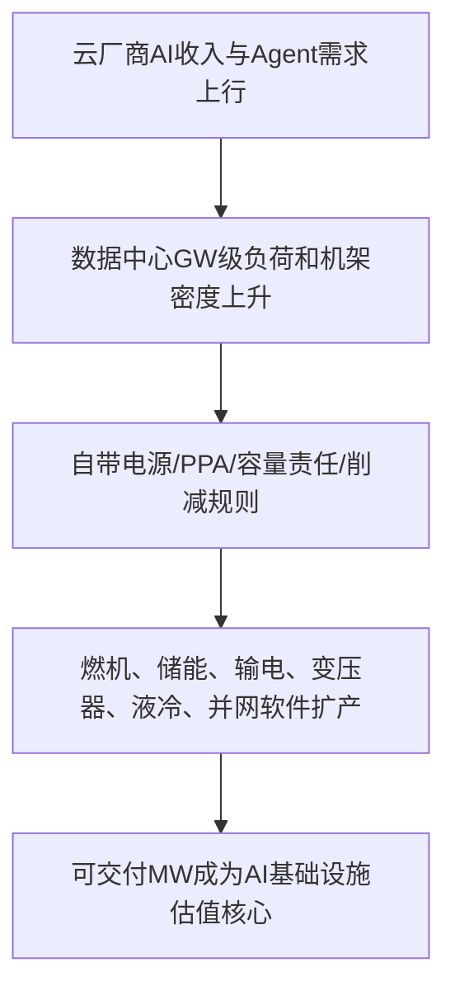
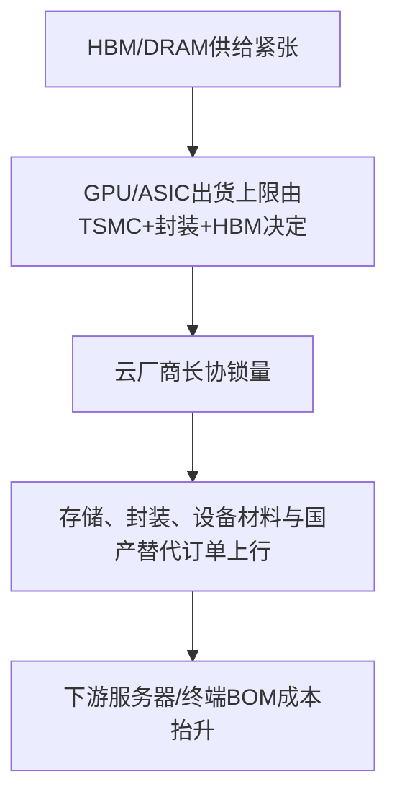
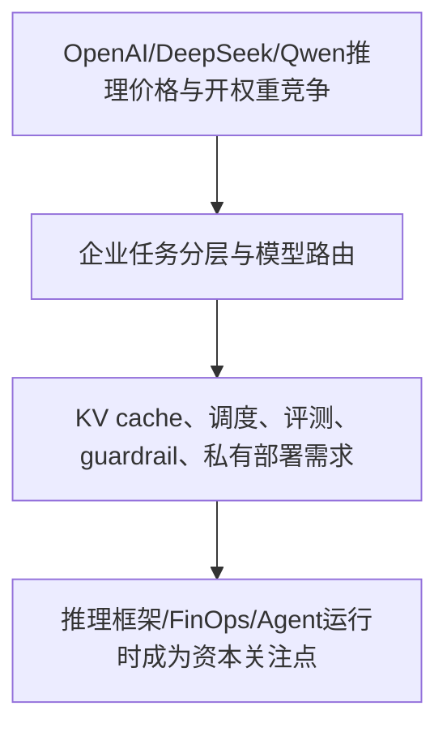

> **覆盖区间**：2026-07-28（周二）00:00 → 2026-08-03（周一）24:00（上海时区完整一周）
> **覆盖范围**：AI 产业链 5 层（能源 / 基础设施 / 芯片存储 / 模型框架 / 应用商业化）+ 4 横切维度（政策 / 国资 / 资金 / 人才）
> **时间窗声明**：仅收录区间内真实公开动态；区间外内容仅作背景并标注，不用于凑本周动态。关键数据附来源或标注“未公开/待验证”。

## 🚦 五维质量门控自检

- **覆盖率**：实质覆盖 37/37 个主题块（100%）；其中 L1/L2 10 个、L3 5 个、L4 6 个、L5/横切 16 个。头部企业 26/26 逐一过筛；中国国资/国企清单按国家级基金、地方国资算力、东数西算、三大运营商、电网、CEC/CETC、信创央企等逐项过筛，静默项均标注原因。
- **原文深度**：抽查 5/5 通过；实际抽查 6 个来源（DOE Paducah、PJM、Samsung Q2、OpenAI GPT-5.6、EU AI Act、SASAC 央企 AI+）均可打开全文，关键数据与中间稿一致。
- **政策原文**：3 类政策/官方文件读原文或官方页面并摘关键条款：EU AI Act 2026-08-02 适用与 AI Office 执法、国家发改委《人工智能合作发展行动计划》（窗口外背景但全文核验）、国务院国资委央企 AI+ 场景/数据集；美国 BIS/AI 行政令/对华投资/州 AI 法本窗口无可确认新规，按静默处理。
- **判断质量**：每个有料主题均有投资判断；产业链 so what 收敛层五项齐全（传导链 / 景气信号 / 资本流向 / 一级市场机会风险 / 领先指标），并标注【确定性】。
- **数据可信**：关键财务、融资、政策、容量、电力、芯片/存储、模型价格和性能数据均附来源 URL；无法官方确认或窗口外内容均降级为“背景/静默/未公开”，未作为本周强结论。
- **报告编排校验**：37 主题对象 / 100+ 数据点 / 42 项判断与结论 / 80+ 去重链接在资料库版与博客版全量对应 ✅。

## 本周产业链全景

> 本周 AI 投资主线从“模型和 GPU”进一步下沉到**可交付基础设施与单位任务经济性**：底层是 GW 级数据中心正在把电力、PPA、燃气、储能、电网规则、液冷和园区选址变成算力交付的第一约束；中层是 HBM/DRAM、先进封装和国产 DUV 决定芯片供给弹性；上层是 OpenAI/DeepSeek/Qwen/Inkling 等把模型竞争推进到价格、推理效率、长上下文和开权重部署；横切层则由 EU AI Act、国资委 AI+ 场景、地方国资算力资金和人才治理公开信共同推动 AI 从“产品竞争”进入“基础设施 + 合规 + 场景预算”的制度化阶段。
>
> **底层最强信号是电力从配套项变成交易结构本身。** Chevron-Microsoft 20 年、约 2.67GW 西得州共址燃气 PPA，DOE Paducah 超 1000 亿美元、1.8GW AI/HPC 园区配 2GW 天然气和 2.6GW 储能，PJM 针对 6.8GW 容量缺口提出 backstop auction 和大型负荷削减规则，三者合在一起说明 AI 数据中心估值不再只看机柜和客户，而要看可证明电源、并网责任、容量成本和监管可交付性。
>
> **芯片层的信号从“谁发布新卡”转向“谁锁住 HBM、DRAM、先进封装和国产设备替代”。** SK hynix 开始谈明年 HBM 量价，Samsung Q2 把服务器 DRAM、eSSD、HBM 和 HBM4E 样品作为利润核心，国产浸没式 DUV 小批量生产则把中国半导体设备链从叙事推进到导入验证阶段。供给瓶颈仍是产业链最硬的景气信号。
>
> **模型层的核心变量是推理经济学。** OpenAI 把 GPT-5.6 效率收益直接降价，DeepSeek V4-Flash 把低价可用模型价格锚进一步下移，Qwen3.8-Max 与 Inkling-Small 强化开权重 / MoE / 长上下文路线，TensorRT-LLM 与 Kubernetes GPU 调度把竞争从单模型跑分推向 KV cache、disaggregated serving 和集群利用率。
>
> **应用与横切层的资本流向更分化。** 本周通用模型公司融资静默，资金更集中到三类：长期能源期权（CFS 10 亿美元聚变融资）、可量化 ROI 的垂直 Agent（ChipAgents 6000 万美元 A2）、强数据/监管壁垒行业模型（商汤医疗超 1 亿美元 B 轮）。地方国资继续投算力中心，但利用率和退出路径会成为下一阶段风险。

---

## 🔥 本周 TOP 5 投资事件

> 按“对产业研判 + 一级市场机会判断的信号价值”排序，非新闻重要性。

### 1. AI 数据中心进入“自带电源 + 容量责任”阶段：Chevron-Microsoft、Paducah 与 PJM 同周共振 ｜ 2026-07-29~31

Chevron 7月31日确认与 Microsoft 签署 20 年西得州数据中心电力协议；交易说明披露 Project Kilby 容量约 **2.67GW**，为 Microsoft 数据中心提供共址专用燃气电力。DOE 7月29日宣布 Paducah Site 超 **1000 亿美元**私有投资，建设 **1.8GW** AI/HPC 园区，并由 NextEra 配套 **2GW** 天然气、最高 **2.6GW** 储能和输电升级。PJM 同周提出一次性 backstop capacity auction，补 **6.8GW** 容量缺口，并要求未自带新增电源的大型数据中心负荷在系统接近紧急状态时被削减或转备用电源。

↳ **投资意义**：AI 基建瓶颈从“买 GPU / 租机柜”升级为“time-to-power 和容量责任”。确定性机会在燃机、EPC、变压器、输电、储能、液冷、并网软件、PPA 风险管理和能源地产；风险在燃料价格、碳核算、州公用事业审批和社区反弹。 [Chevron](https://www.chevron.com/newsroom/2026/q3/chevron-reports-second-quarter-2026-results) ｜ [DOE Paducah](https://www.energy.gov/articles/energy-department-announces-partnership-expand-reliable-affordable-energy-access-and-power) ｜ [Utility Dive/PJM](https://www.utilitydive.com/news/pjm-board-backstop-capacity-auction-data-center-curtailment/826347/)

### 2. HBM/DRAM 长协化与国产 DUV 小批量生产，硬件瓶颈从芯片设计转向供给兑现 ｜ 2026-07-28~30

SK hynix 7月29日称正与大型科技客户谈判明年 HBM 供应量和价格，并将在下半年正式供应 HBM4；TrendForce 8月3日显示 DDR5/DDR4 现货继续上涨。Samsung 7月30日 Q2 披露收入 **171.5 万亿韩元**、营业利润 **89.5 万亿韩元**，DS 部门收入 **127.5 万亿韩元**、营业利润 **89.2 万亿韩元**，并强调服务器 DRAM、eSSD、HBM 和 HBM4E 样品。中国侧 Reuters/AOL 7月28日报道国产浸没式 DUV 小批量生产，2026年约 **5 台**、2027年约 **20 台**，年内拟交付 SMIC、华虹、CXMT 等。

↳ **投资意义**：AI 硬件景气的领先指标不是单次 GPU 发布，而是 HBM 长协价格、HBM4E 客户验证、DRAM bit shipment、CoWoS/封装产能、国产 DUV 连续运行稳定性和晶圆厂导入良率。一级机会集中在 HBM测试、TSV材料、先进基板、存储设备耗材、计量检测、光刻胶、运动台、光源和工艺协同软件。 [Samsung](https://news.samsung.com/global/samsung-electronics-announces-second-quarter-2026-results) ｜ [Reuters/AOL](https://www.aol.com/articles/exclusive-china-starts-production-home-081938000.html) ｜ [TrendForce](https://www.trendforce.com/price/dram/dram_spot)

### 3. 推理价格战进入“单位任务成本”阶段：OpenAI 降价、DeepSeek 低价、Qwen/Inkling 开权重路线同周出现 ｜ 2026-07-29~08-03

OpenAI 7月29日披露 GPT-5.6 通过 kernel、speculative decoding、调度和 agent harness 优化，使端到端 serving cost 降 **20%**、token generation efficiency 提升 **15%+**；7月30日将 Luna 降至 **$0.20/$1.20**、Terra 降至 **$2/$12** 每百万输入/输出 token，并给 Sol 引入最高 **2.5×** 速度的 Fast mode。DeepSeek V4-Flash 7月31日发布，报道口径价格为 **$0.14/$0.28** 每百万输入/输出 token。Alibaba Qwen3.8-Max 8月3日以 **2.4T MoE / 95B active / 1M token** 上下文进入企业与开权重路径；Thinking Machines Inkling-Small 则用 **276B / 12B active**、Apache 2.0 和 1M token 上下文证明小 MoE 也可逼近大模型能力。

↳ **投资意义**：模型竞争的“投资可观测变量”从跑分转为每成功任务成本、路由效率、私有部署 TCO、KV cache 成本和框架 day-0 适配。一级机会在模型路由、评测、guardrail、KV/cache、推理 FinOps、长上下文压缩、企业 Agent harness；风险是中端模型 API 毛利被快速压缩，应用层若缺乏数据和流程壁垒会被降价吞掉。 [OpenAI](https://openai.com/index/advancing-the-price-performance-frontier-with-gpt-5-6/) ｜ [DeepSeek/Reuters](https://www.asahi.com/ajw/articles/16779842) ｜ [Qwen](https://www.computerworld.com/article/4204420/alibaba-takes-aim-at-openai-and-anthropic-with-qwen3-8-max-launch-2.html) ｜ [Inkling](https://thinkingmachines.ai/news/inkling-small/)

### 4. EU AI Act 进入适用与执法状态，SASAC 央企 AI+ 场景把中国侧预算推向“清单 + 数据 + 算力” ｜ 2026-07-27~08-02

欧盟官网明确 AI Act 于 **2024-08-01** 生效、**2026-08-02** 一般适用；透明度规则 2026年8月生效，AI Office 与成员国主管机关自 2026-08-02 起负责实施、监督和执法，并可要求 GPAI 模型提供技术文档、评估模型、要求整改和罚款。中国侧，国资委 7月27日发布第二批央企 AI 战略性高价值场景和行业高质量数据集，上线“焕新社区”2.0，启动智能软件工厂联合筑基工程，明确“聚焦高价值场景”“主动向产业链开放场景资源”“加快算力基础设施建设、深化算电协同、提升全链条数据治理能力”。

↳ **投资意义**：全球 AI 政策从原则进入执行：欧盟带来模型文档、透明提示、深伪标识、内容水印、评测审计和合规预算；中国国资侧带来场景、数据集、国产算力和软件工厂预算。一级机会在 AI 治理工具、模型卡/技术文档、版权数据治理、内容标识、央企行业模型、数据治理、国产算力适配和 AI 辅助软件研发。 [European Commission](https://digital-strategy.ec.europa.eu/en/policies/regulatory-framework-ai) ｜ [SASAC](http://wap.sasac.gov.cn/n2588020/n2588072/n2590902/n2590904/c35690985/content.html)

### 5. 一级市场资金避开同质化基座模型，转向长期能源期权、垂直 Agent 与医疗世界模型 ｜ 2026-07-28~29

CFS 7月末宣布新增 **10 亿美元**股权融资，累计融资 **40 亿美元**，并推进 SPARC 与弗吉尼亚 ARC 商业电站；Google 与 Eni 签署 PPA 购买该电站超过一半电量。ChipAgents 7月29日获得 **6000 万美元** A2，使 Series A 总额达 **1.34 亿美元**，2026H1 ARR 增长 **6×**，部署于 **120+** 半导体公司。商汤医疗 7月28日报道完成超 **1 亿美元** B轮、估值超 **100 亿元人民币**，进入 Pre-IPO 阶段，产品覆盖病理、影像、诊疗平台和医疗世界模型。

↳ **投资意义**：资本没有停止投 AI，而是在重新定价“哪类 AI 有真实壁垒”：长期清洁基荷是能源期权，AI for EDA 是可量化工程 ROI，医疗世界模型是数据/监管/医院网络壁垒。通用基座模型本周融资静默，反而强化“垂直、数据、工作流、合规、能源”的一级市场主线。 [CFS](https://www.prnewswire.com/news-releases/commonwealth-fusion-systems-raises-another-1-billion-bringing-total-capital-raised-to-4-billion-302837638.html) ｜ [ChipAgents](https://chipagents.ai/newsroom) ｜ [商汤医疗](https://news.qq.com/rain/a/20260728A04DAL00)

---

## 🧭 三条主线判断

**资本流向：从“模型公司”转向“瓶颈资产”。** 本周最强资本信号集中在能源、电网、HBM/DRAM、液冷、推理框架、垂直 Agent、医疗世界模型和央企场景数据。通用模型公司静默不是 AI 投资降温，而是同质化模型资产的风险溢价上升。

**技术拐点：推理经济学开始主导模型商业化。** OpenAI 降价、DeepSeek 低价、Qwen/Inkling 开权重、TensorRT-LLM/K8s GPU 调度同周出现，说明“每成功任务成本”正在取代“单次 benchmark”成为企业采用和资本定价的核心变量。

**产业瓶颈：电力交付速度压过算力采购意愿。** 2.67GW PPA、Paducah 1.8GW 园区、PJM 6.8GW 容量缺口、液冷扩产和大厂 capex/FCF 压力共同说明，AI 基础设施进入“资产负债表 + 电力合同 + 监管许可”竞争。

---

## 🧩 产业链研判（so what 收敛层）

### ① 本周产业链传导链

### ② 景气度信号

- **上行：能源、电网、数据中心电力系统。** Chevron-Microsoft 2.67GW、Paducah 1.8GW+2GW燃气+2.6GW储能、PJM 6.8GW容量缺口共同确认“可交付电力”是本周最硬景气信号。**【确定性 高】**
- **上行：HBM、服务器 DRAM、eSSD、先进封装和相关设备材料。** SK hynix 议价、Samsung 服务器产品结构与 HBM4E 样品、DRAM 现货上涨显示存储周期仍由 AI 需求驱动。**【确定性 高】**
- **上行：推理效率、模型路由、开权重部署和 Agent 运行时。** OpenAI 降价与 DeepSeek 低价带来需求弹性，但中端模型 API 毛利承压。**【确定性 高】**
- **拐点：AI 合规从预期变成预算项。** EU AI Act 一般适用和 AI Office 执法权落地，推动模型文档、透明度、内容标识和第三方评测进入采购清单。**【确定性 高】**
- **下行/风险：同质化通用模型与低利用率算力中心。** 本周通用模型融资静默，地方国资资金大量流向算力中心，后续需用实际上架率和租用率验证 ROI。**【确定性 中】**

### ③ 资本流向判断

- **本周钱更偏向底层硬资产与垂直 ROI。** 能源项目融资、地方国资算力、HBM/存储扩产、液冷制造、EDA Agent、医疗世界模型是主线；通用大模型公司更多体现为降价和入口扩张，而非新一轮融资。**【确定性 高】**
- **基础设施资本正在替代纯数据中心地产资本成为主导。** Brookfield、NextEra、Chevron、Amazon/Microsoft/Meta 等把电力合同和能源资产纳入 AI capex 结构。**【确定性 高】**
- **国资资金从“投模型”转向“投算力 + 场景 + 数据集”。** SASAC 场景清单、焕新社区和江苏国资算力资金共同验证这一点。**【确定性 高】**

### ④ 一级市场机会与风险

- **机会：能源与电网卖铲子。** 微电网控制、PPA/容量风险管理、并网排队优化、BESS消防与能量管理、液冷关键部件、变压器/电气设备数字化。**【确定性 高】**
- **机会：HBM与国产半导体配套。** HBM测试、TSV/键合材料、先进基板、eSSD控制器、DUV计量检测、光刻胶、运动台、工艺协同软件。**【确定性 中-高】**
- **机会：推理经济学工具。** 模型路由、评测、成本观测、KV缓存、guardrail、私有部署、长上下文压缩、Agent harness。**【确定性 高】**
- **机会：垂直 Agent 与强数据壁垒行业模型。** AI for EDA、医疗病理/诊疗世界模型、央企行业数据治理和软件工厂。**【确定性 高】**
- **风险：长久期能源期权与低利用率算力中心。** 聚变/SMR商业化节点偏远，地方算力中心可能出现供给过剩；需看并网、电价、利用率和客户长约。**【确定性 中】**

### ⑤ 下周值得跟踪的领先指标

1. **电力/数据中心**：PJM 是否向 FERC 提交方案、容量拍卖价格上限和大型负荷 registry 细则；Chevron-Microsoft PPA 的燃料/碳/容量付款结构；Paducah PSC 审批进度。**【确定性 高】**
2. **硬件/存储**：SK hynix/Samsung/Micron HBM4/HBM4E 客户验证、TSMC/CoWoS 产能、国产 DUV 导入节点与 MTBF/套刻精度。**【确定性 高】**
3. **模型/应用**：OpenAI/DeepSeek/Qwen 价格表与流量份额变化，TensorRT-LLM/vLLM/SGLang 对新 MoE/长上下文模型的 day-0 支持，企业 Agent 运行时付费转化。**【确定性 高】**
4. **政策/国资**：EU AI Act 首批执法/指导案例，SASAC 60项场景/70项数据集后续招标，地方国资算力中心上架率和GPU租用率。**【确定性 高】**

---

## 📊 各层速查表

### L1/L2 能源与基础设施

| 主题 | 状态 | 决策信号 |
|---|---|---|
| 核电/SMR/核相关算力园区 | 🔥重大 | DOE/NNSA 场址释放，核能成为长期电力期权，短中期仍由燃气兜底 |
| 核聚变 | 🔥重大 | CFS 10亿美元融资证明长期清洁基荷期权仍能吸引一级资本 |
| 光伏/储能 | 🟢一般 | 光伏无重大新PPA，储能在GW园区配套中地位上升 |
| 天然气/现场发电 | 🔥重大 | Microsoft 2.67GW与Paducah 2GW确认燃气成为time-to-power解法 |
| 电网/输电与监管 | 🔥重大 | PJM把大型负荷容量责任显性化 |
| 数据中心建设/选址 | 🔥重大 | 能源工业场址、联邦土地和可交付电力节点重估 |
| PPA/自建电源结构 | 🔥重大 | PPA成为AI基础设施融资抵押品 |
| 散热/液冷 | 🔥重大 | 机架密度和PUE约束推动液冷扩产 |
| 网络/选址 | 🟢一般 | 光纤与电力、水、土地一起成为选址筛选项 |
| 云厂商capex传导 | 🔥重大 | Amazon/Meta capex与FCF压力向电力基础设施传导 |

### L3 芯片与存储

| 主题 | 状态 | 决策信号 |
|---|---|---|
| 国产浸没式DUV | 🔥重大 | 国产设备从叙事进入小批量验证，但良率/稳定性仍待看 |
| SK hynix HBM/DRAM | 🔥重大 | HBM长协与DRAM涨价强化存储上行周期 |
| Samsung HBM/服务器DRAM | 🔥重大 | AI服务器需求把存储周期推向长协化 |
| GPU/AI加速器供需 | 🔥重大 | NVIDIA/AMD出货上限由TSMC/HBM/封装共同决定 |
| TPU/云厂ASIC/国产芯片融资/出口管制 | ⚪️静默 | 本周无新增正式路线图、融资或规则落地 |

### L4 模型与框架

| 主题 | 状态 | 决策信号 |
|---|---|---|
| OpenAI GPT-5.6 推理经济学 | 🔥重大 | 效率收益直接降价，API毛利与需求弹性重定价 |
| DeepSeek V4-Flash | 🔥重大 | 低价可用模型压低中端API价格锚 |
| Qwen3.8-Max | 🔥重大 | 超大MoE+长上下文+开权重承诺强化企业替代路线 |
| Inkling-Small | 🟢一般 | 高效开权重MoE推动私有部署与框架适配 |
| TensorRT-LLM/K8s GPU调度 | 🔥重大 | 推理框架竞争转向KV cache、MoE和资源调度 |
| 训练框架 | ⚪️静默 | 本周无高确定性重大版本/融资催化 |

### L5 应用商业化与横切维度

| 主题 | 状态 | 决策信号 |
|---|---|---|
| OpenAI | 🔥重大 | 降价、科研入口、语音工程化同步推进 |
| Google/DeepMind | 🔥重大 | Managed Agents把模型API升级为托管沙箱 |
| 海外其他头部企业 | ⚪️静默/背景 | 除OpenAI/Google外，多数本周无新交易/产品强催化 |
| 中国头部模型应用 | 🟢一般 | 豆包搜索、千问办公和TOP20体现Agent入口竞争 |
| EU AI Act | 🔥重大 | 2026-08-02一般适用，AI Office执法权落地 |
| 中国AI合作行动计划 | 🟡背景 | 窗口外发布，本周作为开源/算力/数据出海政策底座 |
| 美国政策 | ⚪️静默 | 本窗口无可确认新BIS/EO/州法原文 |
| SASAC央企AI+ | 🔥重大 | 场景、数据、算力、软件工厂体系化推进 |
| 地方国资算力资金 | 🔥重大 | 江苏年内>242亿元AI私募资金，六成投算力中心 |
| 人才与治理 | 🟢一般 | Pacing the Frontier体现顶尖人才对前沿节奏治理的集体诉求 |
| 资金 | 🔥重大 | ChipAgents与商汤医疗验证垂直Agent/医疗世界模型融资热度 |

---

## 📚 各层深度正文

### 🔋 L1/L2 能源与基础设施

#### L1-核电/SMR/核相关算力园区
- 本周动态：本周核电/SMR没有看到新的 Big Tech 直接核电 PPA 正式签约公告；但核相关算力园区出现可验证进展。7月31日 ANS 汇总 DOE/NNSA 选择 Amentum 进入 Savannah River Site（SRS）AI 数据中心与能源项目租赁谈判，原始 NNSA 公告写明项目拟建设 1GW 数据中心，并配置约 2GW 现场发电，“natural gas bridging to nuclear energy”。这不是最终租约，仍受谈判、许可、安全与联邦审批约束，因此应视为“核能选址/核能过渡可选项”的早期项目，而非已锁定的核电供电。同期 Amazon 7月末发布碳-free能源组合更新，披露其全球超过700个项目、逾40GW碳-free能源容量，并在核能部分重申 Energy Northwest 4台先进SMR初始320MW、可扩至960MW，X-Energy投资5亿美元、目标2039年前推动美国超过5GW新核能容量；这些SMR核心协议属于背景，非本周新签，但本周公司把AI/数据中心电力需求与SMR战略明确绑定，强化“云厂商从买电转向催化新核订单簿”的投资逻辑。投资上，SRS的意义在于联邦土地、核安全遗产场址、现场电源与AI园区开始打包招标，若审批推进，会利好核工程、EPC、安全评估、燃机过桥电源、SMR开发商与电力基础设施融资；风险在于核能商业化时间仍慢于AI负荷爬坡，短期实际电源仍大概率由天然气兜底。
- 关键数据：SRS拟建1GW数据中心+约2GW现场发电，天然气过渡至核能，NNSA，2026-07（[链接](https://www.energy.gov/nnsa/articles/nnsa-selects-amentum-ai-data-center-and-energy-project-savannah-river-site)）；ANS 2026-07-31交叉验证SRS并列Paducah项目（[链接](https://www.ans.org/news/2026-07-31/article-8261/privatesector-data-center-plans-advance-for-paducah-and-savannah-river-sites/)）；Amazon披露700+碳-free项目、40GW+容量、4项核能协议、Energy Northwest 320MW可扩960MW、X-Energy 5GW目标，2026-07末（[链接](https://www.aboutamazon.com/news/sustainability/amazon-leading-corporate-carbon-free-energy-purchaser?hl=en-US)）。
- 原文链接：[NNSA SRS公告](https://www.energy.gov/nnsa/articles/nnsa-selects-amentum-ai-data-center-and-energy-project-savannah-river-site)；[ANS汇总](https://www.ans.org/news/2026-07-31/article-8261/privatesector-data-center-plans-advance-for-paducah-and-savannah-river-sites/)；[Amazon碳-free能源组合](https://www.aboutamazon.com/news/sustainability/amazon-leading-corporate-carbon-free-energy-purchaser?hl=en-US)。
- 投资判断：核电本周不是“新增PPA签约周”，而是“核相关场址和政策型项目入场周”。AI负荷的时间尺度与核电建设周期错配，决定了短中期最先受益的是燃机、输电、并网、电气设备与核工程前期服务，SMR股权/项目公司则更偏长期期权。
- so what：传导链：AI园区选址→联邦/核相关场址释放→现场发电+未来核能选项→EPC/燃机/核工程/SMR订单簿【确定性中】；景气信号：云厂商与政府均开始把GW级数据中心与专用电源一体化招标【确定性高】；资本流向：从单纯买PPA转向开发权、场址、项目融资与技术股权投资【确定性中】；一级市场机会风险：SMR燃料、许可软件、核安全工程、模块化BOP有机会，但商业化节点2030s带来久期风险【确定性中】；领先指标：NNSA/DOE最终租约、NRC/州许可、SMR首堆EPC合同、Big Tech核电PPA价格与容量条款【确定性高】。

#### L1-核聚变
- 本周动态：核聚变出现明确融资动态。Commonwealth Fusion Systems（CFS）7月末宣布新增10亿美元股权融资，使累计融资达到40亿美元；公司称这是自其2021年18亿美元轮之后全球聚变企业最大单笔融资，并表示资金将用于推进SPARC示范装置装配，以及位于弗吉尼亚 Chesterfield County 的 Fall Line Fusion Power Station/ARC 商业电站开发。公告还披露CFS已成为首家向PJM Interconnection提交申请的聚变公司，并计划在2030年代初并网；Google与Eni既是投资方，也签署PPA购买该电站超过一半的电量。对AI投资主线而言，聚变不是2026-2028年解决数据中心缺电的现实电源，但它正在被基础设施投资人、主权/养老金、工业企业和云厂商作为“2030年代清洁基荷期权”定价。与SMR相比，聚变的审批、燃料与公众接受度叙事更友好，但技术可行性、工程放大、单位经济性均未闭环；本周10亿美元融资说明一级市场仍愿意为“AI电力稀缺+长期无碳基荷”的组合支付高期权费。
- 关键数据：CFS新增10亿美元股权融资，累计融资40亿美元，占聚变行业已融资约30%，2026-07末（[链接](https://www.prnewswire.com/news-releases/commonwealth-fusion-systems-raises-another-1-billion-bringing-total-capital-raised-to-4-billion-302837638.html)）；CFS称Google与Eni签署PPA购买ARC电站超过一半电量，目标2030年代初并网，2026-07末（同上）。二源交叉：Data Center Dynamics搜索结果与行业报道显示“Google-backed CFS raises $1bn”，但原文受限；本文件关键数字采用CFS/PRNewswire全文。
- 原文链接：[CFS融资公告/PRNewswire](https://www.prnewswire.com/news-releases/commonwealth-fusion-systems-raises-another-1-billion-bringing-total-capital-raised-to-4-billion-302837638.html)。
- 投资判断：聚变仍是长久期期权，不应被纳入本轮数据中心2026-2030年电力缺口的基准解法；但融资体量和PPA买方构成显示，AI算力资本正在向“可能重塑基荷曲线”的前沿能源渗透。一级市场可关注超导磁体、电源、真空/热管理、氚/燃料循环与高可靠控制系统等“卖铲子”环节。
- so what：传导链：AI长期电力稀缺→云厂商签未来PPA/股权→聚变公司融资→关键部件和工程服务扩产【确定性中】；景气信号：10亿美元单轮融资+PJM申请显示资本栈成熟化【确定性高】；资本流向：主权、养老金、基础设施与工业资本进入聚变，不再只是VC/战略投资【确定性高】；一级市场机会风险：部件供应商可先商业化，整机电站仍有科学和工程失败风险【确定性中】；领先指标：SPARC里程碑、PJM互联进度、ARC EPC合同、Google/Eni PPA细则和后续融资估值【确定性高】。

#### L1-光伏/可再生与储能
- 本周动态：本周无重大公开动态（严格指AWS/Microsoft/Google/Meta/Oracle在时间窗内新签重大光伏PPA或光伏电站投资的原始公告）；检索口径包括“solar data center PPA AI July 2026 Google Microsoft Amazon Meta”“photovoltaic solar manufacturing AI data center power July 2026”等，并打开DOE数据中心清洁能源资源页与Amazon能源组合页。可记录的相关背景/相关动态是：Amazon本周更新其碳-free能源组合，称全球700+项目、40GW+容量，组合中包括300+公用事业级太阳能和风电项目、300+屋顶/现场太阳能项目、11个公用事业级电池储能项目；此外DOE在数据中心电力需求资源页强调新增清洁能源、§45Y/§48E税收抵免、储能、输电和效率工具可支撑数据中心负荷。Paducah项目虽不是光伏项目，但明确配置最高2.6GW电池储能，说明AI园区专用电源正在从“单一电源”转向“燃机/核能选项+储能+输电”的组合。投资判断上，光伏本周没有AI专属签约催化，短期相对天然气和电网设备的确定性较弱；但储能作为削峰、备用和并网容量管理的地位增强，可能在GW园区配套中成为标配。
- 关键数据：Amazon 700+碳-free项目、40GW+容量、300+公用事业级风光、300+现场太阳能、11个公用事业级储能，2026-07末（[链接](https://www.aboutamazon.com/news/sustainability/amazon-leading-corporate-carbon-free-energy-purchaser?hl=en-US)）；DOE列出§45Y/§48E、LPO、GRIP、输电融资、储能等支持数据中心电力需求的资源，页面本周可检索打开（[链接](https://www.energy.gov/oe/clean-energy-resources-meet-data-center-electricity-demand)）；Paducah最高2.6GW BESS，DOE 2026-07-29（[链接](https://www.energy.gov/articles/energy-department-announces-partnership-expand-reliable-affordable-energy-access-and-power)）。
- 原文链接：[Amazon碳-free能源组合](https://www.aboutamazon.com/news/sustainability/amazon-leading-corporate-carbon-free-energy-purchaser?hl=en-US)；[DOE数据中心清洁能源资源](https://www.energy.gov/oe/clean-energy-resources-meet-data-center-electricity-demand)；[DOE Paducah公告](https://www.energy.gov/articles/energy-department-announces-partnership-expand-reliable-affordable-energy-access-and-power)。
- 投资判断：本周光伏缺少Big Tech增量PPA催化，作为AI电源主题的边际强度低于天然气、核相关场址和电网规则。储能与光伏的机会更偏“项目组合配套”和“并网/可靠性解决方案”，单纯组件环节仍需警惕价格和贸易政策压力。
- so what：传导链：AI负荷增长→清洁能源采购+储能配套→PPA/税抵/项目融资→储能集成、逆变器、并网服务受益【确定性中】；景气信号：Paducah 2.6GW储能显示AI园区已把BESS纳入GW级架构【确定性高】；资本流向：新建风光仍有需求，但本周资本更集中到专用电源和储能组合【确定性中】；一级市场机会风险：长时储能、能量管理、BESS消防与并网软件机会较好，光伏制造需防过剩【确定性中】；领先指标：Big Tech新增风光PPA、BESS attach rate、储能并网队列、45Y/48E政策变化【确定性高】。

#### L1-天然气/现场发电
- 本周动态：天然气是本周AI电力基础设施最明确的高确定性主题。Chevron 7月31日Q2业绩新闻稿确认已与Microsoft签署20年西得州数据中心电力协议；Sullivan & Cromwell对交易的说明披露，Chevron全资子公司Energy Forge One将与Microsoft合作开发West Texas共址电力设施，为Microsoft运营的数据中心提供专用电力，项目名Project Kilby，预期容量约2.67GW，是美国最大的共址天然气发电+数据中心项目之一。DOE/Paducah项目同日也把天然气写入核心架构：NextEra将在Paducah园区附近建设2GW新建并网天然气发电、升级输电，并部署最高2.6GW电池储能，以支持1.8GW AI/HPC园区。SRS项目则写明约2GW现场发电以天然气过渡到核能。三条线索共同说明：AI数据中心负荷爬坡速度已经快于核电、输电和可再生并网速度，科技公司/基础设施投资人正在用专用燃气电厂锁定“time to power”。投资上，这会直接利好燃机、涡轮机械、燃气管线、EPC、排放控制、变压器和中压配电；中期风险则是气价、排放政策、碳承诺以及社区反弹。
- 关键数据：Chevron 2026-07-31确认20年Microsoft西得州数据中心电力协议（[链接](https://www.chevron.com/newsroom/2026/q3/chevron-reports-second-quarter-2026-results)）；S&C披露Project Kilby约2.67GW容量、20年PPA、专供Microsoft数据中心，2026-07（[链接](https://www.sullcrom.com/About/News-and-Events/Highlights/2026/July/SC-Advises-Chevron-20Year-Power-Agreement-Microsoft-West-Texas-Data-Center)）；DOE Paducah 2GW天然气+2.6GW储能+1.8GW AI/HPC园区、1000亿美元投资，2026-07-29（[链接](https://www.energy.gov/articles/energy-department-announces-partnership-expand-reliable-affordable-energy-access-and-power)）；NNSA SRS 2GW现场发电，天然气过渡至核能，2026-07（[链接](https://www.energy.gov/nnsa/articles/nnsa-selects-amentum-ai-data-center-and-energy-project-savannah-river-site)）。
- 原文链接：[Chevron Q2新闻稿](https://www.chevron.com/newsroom/2026/q3/chevron-reports-second-quarter-2026-results)；[S&C交易说明](https://www.sullcrom.com/About/News-and-Events/Highlights/2026/July/SC-Advises-Chevron-20Year-Power-Agreement-Microsoft-West-Texas-Data-Center)；[DOE Paducah公告](https://www.energy.gov/articles/energy-department-announces-partnership-expand-reliable-affordable-energy-access-and-power)；[NNSA SRS公告](https://www.energy.gov/nnsa/articles/nnsa-selects-amentum-ai-data-center-and-energy-project-savannah-river-site)。
- 投资判断：天然气已从“过渡电源”升级为AI园区的第一性约束解法，尤其在西得州、肯塔基、南卡等有土地/管网/输电条件地区。优先看燃机交期、EPC产能、气电项目融资和电力合同结构，而非单纯天然气商品价格。
- so what：传导链：AI算力需求→time-to-power压力→共址燃气电厂/专用PPA→燃机、管网、EPC、变压器订单【确定性高】；景气信号：Microsoft 20年2.67GW与Paducah 2GW同周出现，说明GW级燃气专供成为主流方案【确定性高】；资本流向：油气巨头、基础设施基金、云厂商共同进入电力开发【确定性高】；一级市场机会风险：分布式燃气、碳捕集、排放监测、微电网控制机会增加，但政策和碳核算风险上升【确定性中】；领先指标：燃机订单交期、天然气管网接入、PPA电价、碳排/CCS条款、州公用事业审批【确定性高】。

#### L1-电网/输电与监管
- 本周动态：PJM在时间窗内给出非常关键的电网规则信号。Utility Dive 7月末打开的全文显示，PJM董事会提出一次性backstop capacity auction，目标解决2028年中开始交付年度容量拍卖后出现的6.8GW缺口；同时，新数据中心等大型负荷如果不自带新增电源，将在系统接近紧急状态时被削减负荷或切换至现场备用电源。PJM还估计其13州+华盛顿DC范围内大型负荷到2038年可能增长70GW，并计划建立大型负荷registry，纳入设施位置、爬坡计划、容量供给等数据。价格方面，PJM拟将中标供给总成本上限设为555美元/MW-day，高于上一轮临时上限325美元/MW-day；合格资源需在2032年6月1日前上线。这个动态的投资含义极强：数据中心并网权从“负荷自然接入”转向“带电源、可削减、承担容量成本”，电网成本分摊正在重塑园区选址和资本结构。输电、变电、动态线路评级、并网咨询、DERMS、需求响应、电力市场软件都受益；没有自带电源的纯数据中心开发商的时间和成本不确定性上升。
- 关键数据：PJM拟backstop auction补6.8GW缺口，9月启动、10月21日结束、资源2032-06-01前上线，2026-07末（[链接](https://www.utilitydive.com/news/pjm-board-backstop-capacity-auction-data-center-curtailment/826347/)）；PJM估计大型负荷到2038年或增70GW，容量价格上限555美元/MW-day vs 前次325美元/MW-day，Utility Dive 2026-07末（同上）；Data Center Knowledge本周月度汇总交叉提到FERC要求六大美国电网运营商解释/重写大型负荷互联规则（[链接](https://www.datacenterknowledge.com/data-center-construction/new-data-center-developments-july-2026)）。
- 原文链接：[Utility Dive PJM容量与削减方案](https://www.utilitydive.com/news/pjm-board-backstop-capacity-auction-data-center-curtailment/826347/)；[Data Center Knowledge月度汇总](https://www.datacenterknowledge.com/data-center-construction/new-data-center-developments-july-2026)。
- 投资判断：电网已成为AI capex的“审批闸门”和“隐性成本中心”。若PJM方案获FERC通过，未来大型AI园区估值将更依赖可证明电源、可削减负荷、并网排队位置和输电升级预算。
- so what：传导链：AI负荷申请激增→PJM/FERC重写大型负荷规则→自带电源/可削减/容量成本内生化→电网设备与电力市场服务受益【确定性高】；景气信号：6.8GW缺口和70GW潜在大型负荷让容量稀缺显性化【确定性高】；资本流向：从机房土建转向输电、变电、容量资源和需求响应【确定性高】；一级市场机会风险：并网排队优化、虚拟电厂、DERMS、动态线路评级机会强，但依赖监管采纳【确定性中】；领先指标：FERC批复、PJM大型负荷registry、容量拍卖价格、互联成本/kW、数据中心削减协议【确定性高】。

#### L2-数据中心建设/选址
- 本周动态：本周最具代表性的建设/选址动态是DOE Paducah项目。DOE 7月29日宣布与Brookfield、NextEra、Big Rivers、Jackson Purchase Energy Cooperative、Paducah Power System等合作，将Paducah Site部分土地改造为数据中心园区和能源基础设施，总投资超过1000亿美元，预计创造约8000个建设岗位和600个永久岗位。项目将利用既有输电、水、光纤、道路和土地条件，建设1.8GW AI/HPC园区；NextEra配套2GW天然气、最高2.6GW储能和输电升级，Brookfield负责开发运营数据中心。Data Center Knowledge本周月度汇总还记录，Microsoft在Indiana La Porte破土新数据中心，Prime Data Centers在Avondale, Arizona 66.5英亩、240MW园区开启首座设施，Digital Realty在Kansas City市场收购1440英亩并与本地公用事业签署600MW（2028年初）电力服务协议、满交付2GW。选址逻辑正在清晰化：不是传统互联网流量中心优先，而是“电力、土地、水、光纤、监管可承受性”优先，旧能源/工业场址、联邦土地和中西部/西部电力节点价值上升。
- 关键数据：Paducah超过1000亿美元私有投资、1.8GW AI/HPC园区、2GW天然气、2.6GW储能、8000建设岗位、600永久岗位、2031年完工预期，DOE 2026-07-29（[链接](https://www.energy.gov/articles/energy-department-announces-partnership-expand-reliable-affordable-energy-access-and-power)）；NextEra/Brookfield新闻稿交叉披露满建后1.8GW utility capacity、1.2GW+ compute capacity、4.6GW专用发电资源，2026-07-29（[NextEra/Brookfield项目新闻稿](https://newsroom.nexteraenergy.com/2026-07-29-DOE-Site-in-Western-Kentucky-Revitalized-with-Data-Center-Campus-and-Dedicated-Energy-Project,-Creating-Jobs-and-Protecting-Residents-and-Businesses-from-Costs?l=12)）；Data Center Knowledge月度汇总披露Prime 240MW/66.5英亩、Digital Realty 1440英亩/600MW/2GW等，2026-08-01左右发布（[链接](https://www.datacenterknowledge.com/data-center-construction/new-data-center-developments-july-2026)）。
- 原文链接：[DOE Paducah公告](https://www.energy.gov/articles/energy-department-announces-partnership-expand-reliable-affordable-energy-access-and-power)；[NextEra/Brookfield项目新闻稿](https://newsroom.nexteraenergy.com/2026-07-29-DOE-Site-in-Western-Kentucky-Revitalized-with-Data-Center-Campus-and-Dedicated-Energy-Project,-Creating-Jobs-and-Protecting-Residents-and-Businesses-from-Costs?l=12)；[Data Center Knowledge月度汇总](https://www.datacenterknowledge.com/data-center-construction/new-data-center-developments-july-2026)。
- 投资判断：AI数据中心选址已进入“能源地产化”阶段，土地本身价值不如可交付电力、水、光纤和许可确定性。旧核/煤/工业场址、联邦土地、拥有大容量互联点的地产会被重估。
- so what：传导链：AI capex扩张→传统枢纽电力饱和→旧能源/工业场址再开发→土地、输电、水务、EPC、地方公用事业受益【确定性高】；景气信号：1000亿美元Paducah是能源+数据中心一体化标杆【确定性高】；资本流向：Brookfield/NextEra等基础设施资本替代单一地产开发商成为主导【确定性高】；一级市场机会风险：选址数据、许可自动化、水冷复用、工地电力临建有机会，社区/环保诉讼风险增加【确定性中】；领先指标：GW级园区土地收购、utility service agreement、州PSC审批、用水许可、社区投票/禁令【确定性高】。

#### L2-电力采购协议PPA/自建电源结构
- 本周动态：本周PPA主题的核心变化是从传统可再生PPA扩展到“专用、共址、可融资的电源+算力绑定合约”。Chevron-Microsoft Project Kilby明确为20年PPA，容量约2.67GW，天然气发电设施共址，目标是直接供给Microsoft运营的数据中心并降低对区域电网消费者的冲击。Paducah项目虽未披露单一Big Tech买方，但其电力服务结构同样体现“项目自带电源”：NextEra拥有并建设专用发电资源，Big Rivers提供批发电力服务，Jackson Purchase提供零售服务，电力服务协议仍需Kentucky PSC审批；DOE强调发电和储能容量将超过园区需求，多余电力可送入区域电网。Amazon本周更新长期PPA逻辑，引用ACORE观点称长期PPA提供财务确定性，支持开发商大规模建设新的低碳电源。综合看，AI PPA的投资重点已不只是证书和可再生属性，而是容量、交付时间、并网责任、削减权、备用电源和成本不转嫁条款。
- 关键数据：Project Kilby 20年PPA、约2.67GW，2026-07（[链接](https://www.sullcrom.com/About/News-and-Events/Highlights/2026/July/SC-Advises-Chevron-20Year-Power-Agreement-Microsoft-West-Texas-Data-Center)）；Chevron 2026-07-31 Q2稿确认签署20年Microsoft西得州数据中心电力协议（[链接](https://www.chevron.com/newsroom/2026/q3/chevron-reports-second-quarter-2026-results)）；Paducah电力服务协议需Kentucky PSC审批，2GW燃气+2.6GW储能，DOE 2026-07-29（[链接](https://www.energy.gov/articles/energy-department-announces-partnership-expand-reliable-affordable-energy-access-and-power)）；Amazon 40GW+碳-free组合和长期PPA逻辑，2026-07末（[链接](https://www.aboutamazon.com/news/sustainability/amazon-leading-corporate-carbon-free-energy-purchaser?hl=en-US)）。
- 原文链接：[S&C Chevron-Microsoft交易说明](https://www.sullcrom.com/About/News-and-Events/Highlights/2026/July/SC-Advises-Chevron-20Year-Power-Agreement-Microsoft-West-Texas-Data-Center)；[Chevron Q2新闻稿](https://www.chevron.com/newsroom/2026/q3/chevron-reports-second-quarter-2026-results)；[DOE Paducah公告](https://www.energy.gov/articles/energy-department-announces-partnership-expand-reliable-affordable-energy-access-and-power)；[Amazon碳-free能源组合](https://www.aboutamazon.com/news/sustainability/amazon-leading-corporate-carbon-free-energy-purchaser?hl=en-US)。
- 投资判断：PPA正在从“绿色电力采购合同”变成AI基础设施融资的核心抵押品和项目开发锚定合同。未来估值要看PPA是否覆盖容量可得性、燃料成本、并网升级、削减义务和碳属性，而非只看MW/GW规模。
- so what：传导链：AI负荷确定→20年/长期PPA锁收入→电源项目可融资→燃机、储能、输电、EPC扩产【确定性高】；景气信号：2.67GW单一PPA显示买方愿为专用电源承担长期合约【确定性高】；资本流向：能源公司+基础设施基金+云厂商形成项目融资闭环【确定性高】；一级市场机会风险：PPA定价软件、风险管理、碳会计、能源交易平台机会增加，燃料/监管风险需对冲【确定性中】；领先指标：PPA期限、电价公式、容量付款、燃料pass-through、PSC/FERC审批【确定性高】。

#### L2-散热/液冷与电力密度
- 本周动态：散热/液冷有两条强信号：一是Schneider Electric 7月28日文章把液冷明确放到“电网约束下最大化AI算力”的框架里，披露平均机架密度从2025年约16kW升至2026年27kW，仅约20%运营商准备好支持AI常见的50-70kW机架，新AI系统最高可达246kW/架；直接到芯片液冷可使PUE从传统风冷设施1.55-1.67降到约1.10-1.20，并在合适场景降低30%-60%冷却能耗。二是nVent 7月31日宣布在明尼苏达Blaine租赁16万平方英尺新增制造空间，扩产数据中心液冷方案，这是其三年内第三次扩张，累计新增超40万平方英尺，新站点预计2027年上半年投产、雇佣200+人，公司披露已部署超过2GW液冷。投资含义：液冷不只是热管理，而是电力受限时把更多MW转换为IT负荷的效率杠杆；供应链从CDU、manifold、rear-door heat exchanger、泵阀、快接头到监控软件均进入扩产周期。
- 关键数据：平均机架密度16kW(2025)→27kW(2026)，仅1/5运营商准备好50-70kW，最高AI系统246kW/架；液冷PUE约1.10-1.20、冷却能耗降30%-60%，Schneider 2026-07-28（[链接](https://blog.se.com/datacenter/2026/07/28/data-center-power-density-planning-liquid-cooled-ai-data-centers-around-grid-and-power-constraints/)）；nVent 160,000平方英尺新厂、三年新增400,000+平方英尺、2027H1投产、200+员工、已部署2GW+液冷，2026-07-31（[链接](https://www.globenewswire.com/news-release/2026/07/31/3336671/0/en/nvent-expands-data-center-liquid-cooling-capacity.html)）。
- 原文链接：[Schneider液冷与电网约束](https://blog.se.com/datacenter/2026/07/28/data-center-power-density-planning-liquid-cooled-ai-data-centers-around-grid-and-power-constraints/)；[nVent扩产公告](https://www.globenewswire.com/news-release/2026/07/31/3336671/0/en/nvent-expands-data-center-liquid-cooling-capacity.html)。
- 投资判断：液冷是AI基础设施中确定性较高的“效率型卖铲子”赛道，受GPU功耗、机架密度和电力稀缺三重驱动。相较整机服务器周期，关键热管理部件和制造扩产更直接受益于数据中心从风冷向液冷迁移。
- so what：传导链：GPU功耗上升→机架密度上升→传统风冷/PUE受限→液冷/CDU/泵阀/监控扩产【确定性高】；景气信号：nVent三年三扩、2GW+部署验证需求兑现【确定性高】；资本流向：工业电气/热管理厂商扩建产能并整合Motivair等资产【确定性高】；一级市场机会风险：冷板、快接头、泄漏检测、冷却液、热仿真软件机会强，需防客户集中和标准变化【确定性中】；领先指标：Blackwell/Vera Rubin机架功率、液冷attach rate、CDU交期、PUE承诺、云厂商液冷招标【确定性高】。

#### L2-网络/选址约束
- 本周动态：本周无重大公开动态（严格指云厂商在时间窗内发布重大海底光缆、骨干网或交换芯片网络基础设施专项投资公告）；检索口径包括“data center fiber network AI infrastructure investment campus power site selection July 2026”等。可验证的本周网络/选址相关信息主要来自数据中心建设公告：DOE Paducah公告明确该场址具备existing transmission capacity、water infrastructure、fiber connectivity和available land，使其能支撑大规模AI基础设施并吸引私人投资；NextEra/Brookfield公告也强调前铀浓缩场址既有输电、水、光纤、道路和土地可加速开发。Data Center Knowledge月度汇总显示Digital Realty在Kansas City市场收购1440英亩土地，并签署600MW早期电力服务协议、满交付2GW；Prime Avondale 66.5英亩/240MW园区首设施上线。这说明“网络”在本周并非单独资本开支主角，而是与电力、水、土地一起成为选址筛选项；对于AI训练园区，低时延到核心用户不是唯一目标，能否快速拿到数百MW到GW级电力和光纤通达性更重要。
- 关键数据：Paducah具备既有输电、水、光纤、道路和土地，支持1.8GW AI/HPC园区，DOE 2026-07-29（[链接](https://www.energy.gov/articles/energy-department-announces-partnership-expand-reliable-affordable-energy-access-and-power)）；NextEra/Brookfield同日新闻稿交叉确认既有基础设施可加速开发（[NextEra/Brookfield项目新闻稿](https://newsroom.nexteraenergy.com/2026-07-29-DOE-Site-in-Western-Kentucky-Revitalized-with-Data-Center-Campus-and-Dedicated-Energy-Project,-Creating-Jobs-and-Protecting-Residents-and-Businesses-from-Costs?l=12)）；Data Center Knowledge披露Digital Realty 1440英亩、600MW by early 2028、满交付2GW，以及Prime 66.5英亩/240MW，2026-08-01左右（[链接](https://www.datacenterknowledge.com/data-center-construction/new-data-center-developments-july-2026)）。
- 原文链接：[DOE Paducah公告](https://www.energy.gov/articles/energy-department-announces-partnership-expand-reliable-affordable-energy-access-and-power)；[NextEra/Brookfield项目新闻稿](https://newsroom.nexteraenergy.com/2026-07-29-DOE-Site-in-Western-Kentucky-Revitalized-with-Data-Center-Campus-and-Dedicated-Energy-Project,-Creating-Jobs-and-Protecting-Residents-and-Businesses-from-Costs?l=12)；[Data Center Knowledge月度汇总](https://www.datacenterknowledge.com/data-center-construction/new-data-center-developments-july-2026)。
- 投资判断：网络/选址的价值从“离用户近”转向“电力+光纤+水+许可组合可交付”。拥有既有能源工业基础设施和光纤通达的土地将获得溢价，单纯偏远低价土地若无电力服务协议则价值有限。
- so what：传导链：AI训练负荷可迁移→选址权重转向电力/水/光纤→能源工业场址重估→园区开发、光纤接入、变电站和水务受益【确定性高】；景气信号：Paducah把fiber connectivity列为招商核心条件【确定性高】；资本流向：土地收购与utility service agreement绑定，地产资本向电力节点靠拢【确定性高】；一级市场机会风险：选址情报、光纤接入规划、用水/电力许可数据库机会增加，社区反对和水资源约束是风险【确定性中】；领先指标：大面积土地收购、长周期电力服务协议、暗纤/长途波分合同、用水许可、地方禁令【确定性高】。

#### L2-云厂商AI capex对能源基础设施传导
- 本周动态：本周大厂财报把“AI capex→电力基础设施”传导进一步量化。Amazon 7月31日前后Q2业绩全文显示，AWS Q2销售额422亿美元、同比+37%，AWS达到1690亿美元年化收入run rate；AI业务和芯片业务均超过250亿美元年化run rate，且OpenAI、Anthropic等作出多年、多GW Trainium承诺。Amazon同时披露过去12个月自由现金流转为流出76亿美元，主要因购买物业和设备（扣除出售与激励）同比增加661亿美元，增加主要反映AI投资。Meta方面，CNBC 7月29日财报全文显示其Q2 capex 310.8亿美元，2026全年capex指引收窄至1300-1450亿美元，自由现金流从上年同期85.5亿美元降至7.84亿美元；同时Meta披露BlackRock合资的El Paso 14亿美元数据中心、Louisiana Hyperion 500亿美元+项目、Alberta 90亿美元项目。Microsoft/Alphabet本周也有财报capex焦点，但其原始IR页面对web_fetch可读性不足，未纳入关键数字；可确认的是Chevron-Microsoft 20年2.67GW电力PPA直接显示Microsoft AI基础设施已外溢到能源开发。投资判断：capex不是只买GPU和服务器，正明显挤压自由现金流并转化为电源、储能、输电、液冷、土地与PPA合同。
- 关键数据：Amazon Q2 2026净销售2006亿美元，AWS 422亿美元、同比+37%，AWS 1690亿美元run rate，AI/芯片业务各250亿美元+ run rate，TTM FCF流出76亿美元，PPE购买同比增加661亿美元且主要反映AI投资，2026-07末（[链接](https://www.aboutamazon.com/news/company-news/amazon-earnings-q2-2026-report)）；Meta Q2 2026 capex 310.8亿美元，全年capex指引1300-1450亿美元，FCF 7.84亿美元 vs 上年85.5亿美元，CNBC 2026-07-29（[链接](https://www.cnbc.com/2026/07/29/meta-q2-earnings-report-2026.html)）；Meta 1GW El Paso/BlackRock 14亿美元、Hyperion 500亿美元+、Alberta 90亿美元项目，CNBC同文；Microsoft电力传导以Project Kilby 2.67GW/20年PPA验证，2026-07（[链接](https://www.sullcrom.com/About/News-and-Events/Highlights/2026/July/SC-Advises-Chevron-20Year-Power-Agreement-Microsoft-West-Texas-Data-Center)）。
- 原文链接：[Amazon Q2 2026业绩](https://www.aboutamazon.com/news/company-news/amazon-earnings-q2-2026-report)；[CNBC Meta Q2 2026财报全文](https://www.cnbc.com/2026/07/29/meta-q2-earnings-report-2026.html)；[S&C Chevron-Microsoft交易说明](https://www.sullcrom.com/About/News-and-Events/Highlights/2026/July/SC-Advises-Chevron-20Year-Power-Agreement-Microsoft-West-Texas-Data-Center)。
- 投资判断：AI capex的边际瓶颈从GPU供给扩散到电力交付，且开始反映在自由现金流和长期PPA负债/承诺上。能源基础设施投资应优先看能被大厂capex“穿透支付”的环节：专用电源、变压器、液冷、土地/并网权、储能和输电升级。
- so what：传导链：云AI收入/模型需求→capex大增→FCF承压→自建/共址电源和PPA→能源设备与基础设施融资受益【确定性高】；景气信号：Amazon PPE增量661亿美元、Meta 1300-1450亿美元capex显示AI建设仍在加速【确定性高】；资本流向：从云厂商资产负债表流向油气巨头、Brookfield/NextEra、液冷厂商和地方公用事业【确定性高】；一级市场机会风险：AI infra成本优化、能源采购软件、负荷管理、微电网控制机会强，风险是capex回报被投资人质疑导致项目节奏波动【确定性中】；领先指标：大厂季度capex/FCF、GW级PPA、utility interconnection deposits、GPU交付与液冷attach rate、数据中心租赁价格【确定性高】。

---

### 💾 L3 芯片与存储

#### L3-先进制程/国产光刻：国产浸没式DUV进入小批量生产
- 本周动态：本周最值得列为L3硬件层“变量”的不是GPU新品，而是制程设备约束的边际松动。Reuters 7月28日报道称，中国已开始量产国产浸没式DUV光刻机，由上海爱圣纳电子科技集团牵头；The Information先前披露的生产节奏为2026年约5台、2027年约20台，预计年内交付中芯国际、华虹半导体、长鑫存储等头部晶圆厂。联合早报7月27/28日转载口径也强调：在EUV长期不可得、先进浸没式DUV出口与维保限制趋严背景下，国产DUV是中国晶圆厂可获得的最高端光刻设备替代源。需要冷静的是，JP Morgan在Reuters文中指出，小批量做出设备不等于进入高良率量产，关键仍是套刻精度、吞吐量、可靠性与数千片晶圆连续运行稳定性。因此这不是“立刻替代ASML”，但它把出口管制从“设备绝对断供”改写为“国产设备逐步验证+低端/中端DUV外购并行”的组合局面，长期会影响国内AI芯片、成熟/准先进逻辑和CXMT存储扩产预期。
- 关键数据：2026年计划约5台、2027年约20台；爱圣纳注册资本70亿元人民币（约10亿美元）；ASML中国销售约占其上半年净销售16%；来源：[链接](https://www.aol.com/articles/exclusive-china-starts-production-home-081938000.html)，[链接](https://www.zaobao.com.sg/news/china/story20260727-9428899)；日期：2026-07-28。
- 原文链接：
  - [Reuters/AOL：China starts production of home-grown immersion DUV chipmaking tools](https://www.aol.com/articles/exclusive-china-starts-production-home-081938000.html)
  - [联合早报：美媒称中国开始生产DUV光刻机 年内交付](https://www.zaobao.com.sg/news/china/story20260727-9428899)
  - [Reuters原始链接（抓取受限）](https://www.reuters.com/world/china/china-starts-production-home-grown-immersion-duv-chipmaking-tools-source-2026-07-28/)
- 投资判断：确定性较高的是国产半导体设备链条获得叙事和订单验证窗口，但短期不应直接外推到7nm级AI芯片大规模良率突破。一级市场更应关注计量/检测、光刻胶、浸没液、运动台、光源、镜头材料、EDA工艺协同等“DUV量产爬坡配套”环节，而不是只看整机。
- so what：传导链【确定性】：出口管制趋严→国产DUV小批量交付→中芯/华虹/CXMT获得备份设备源→国产AI芯片和DRAM扩产预期改善但良率仍是领先指标。后续领先指标是：设备连续运行MTBF、套刻精度披露、晶圆厂导入节点、ASML对中国DUV服务/备件限制是否升级。

#### L3-HBM/DRAM：SK海力士启动明年HBM议价，DRAM现货继续走强
- 本周动态：存储链条本周继续呈现“HBM绑定AI加速器、传统DRAM被挤出产能”的强景气特征。韩国Seoul Economic Daily 7月29日报道，SK hynix在二季度业绩电话会上明确表示，正与大型科技客户就明年HBM供应量和价格进行谈判，且谈判因客户需求稳健而进展顺利；公司同时释放价格信号：近期传统DRAM价格显著上涨，可能部分影响HBM价格谈判。该公司还表示，将在今年下半年开始正式供应HBM4，并以接近现有产品水平的良率作为量产基础。TrendForce价格页显示，截至8月3日18:10（GMT+8），DDR5 16Gb 4800/5600 session average为51.333，日涨0.72%；DDR4 16Gb 3200 session average为85.707，日涨0.57%。这说明HBM需求不仅吃掉高端DRAM晶圆与先进封装资源，也在传统DRAM侧形成价格锚，存储涨价周期仍具备可观测数据支撑。
- 关键数据：SK hynix称正在谈判2027年HBM供应量与价格；HBM4拟2026年下半年正式供应；TrendForce 2026-08-03 DDR5 16Gb均价51.333、日涨0.72%，DDR4 16Gb均价85.707、日涨0.57%；来源：[链接](https://en.sedaily.com/finance/2026/07/29/sk-hyn…rise)，[链接](https://www.trendforce.com/price/dram/dram_spot)；日期：2026-07-29、2026-08-03。
- 原文链接：
  - [Seoul Economic Daily：SK hynix Says Next-Year HBM Talks Underway](https://en.sedaily.com/finance/2026/07/29/sk-hyn…rise)
  - [TrendForce：DRAM Spot Price，Last Update 2026-08-03](https://www.trendforce.com/price/dram/dram_spot)
- 投资判断：HBM仍是AI硬件最硬瓶颈之一，SK hynix具备议价权；三星/美光的HBM4/HBM4E验证进度决定供给弹性。当前存储股波动更多来自估值和短线资金，而非供需拐点，产业链景气仍偏强。
- so what：景气信号【确定性】：AI加速器需求→HBM4客户锁量/锁价→先进DRAM晶圆与TSV/封装资源被占用→传统DRAM价格上行→服务器、PC、消费电子BOM成本抬升。一级市场机会在HBM测试、键合、TSV材料、温控、先进基板与国产DRAM设备耗材；风险是客户长协若提前锁死，后进入者议价空间被压缩。

#### L3-三星存储/HBM：AI服务器需求把存储周期推向“长协化”
- 本周动态：三星电子7月30日发布二季度业绩，给存储周期提供了公司级确认。公司合并收入171.5万亿韩元、营业利润89.5万亿韩元，均为历史季度高位；Device Solutions（DS）部门收入127.5万亿韩元、营业利润89.2万亿韩元，几乎贡献全部利润。三星明确称，Memory业务在产能受限情况下优先满足AI需求并聚焦服务器产品，行业价格上行也推动利润创新高；服务器收入在销售结构中创纪录。技术层面，三星称已扩大HBM4销售，并向主要客户出货行业首批HBM4E样品。更重要的是供需展望：公司预计2026年下半年AI基础设施capex和agentic AI采用扩大，将继续支撑服务器DRAM、eSSD、HBM需求，市场在移动和PC部分放缓下仍将供不应求，且供给约束预计延续；Quartz补充称三星已与五大全球数据中心客户锁定合同，并接近完成另外五个大客户协议。这意味着存储从传统季度现货/合约周期转向AI客户预定产能、长协锁量的准基础设施模式。
- 关键数据：三星2Q26收入171.5万亿韩元、营业利润89.5万亿韩元；DS收入127.5万亿韩元、营业利润89.2万亿韩元；Memory收入120.8万亿韩元，同比+471%；2Q26 capex约16.8万亿韩元，其中DS 15.4万亿韩元；来源：[链接](https://news.samsung.com/global/samsung-electronics-announces-second-quarter-2026-results)，[链接](https://qz.com/samsung-q2-2026-earnings-record-profit-mobile-loss-073026)；日期：2026-07-30。
- 原文链接：
  - [Samsung Newsroom：Samsung Electronics Announces Second Quarter 2026 Results](https://news.samsung.com/global/samsung-electronics-announces-second-quarter-2026-results)
  - [Quartz/Yahoo：Samsung Q2 2026 earnings: record profit on AI chip demand](https://finance.yahoo.com/technology/articles/samsung-q2-2026-earnings-record-115328985.html)
- 投资判断：三星的信号强化“HBM+服务器DRAM+eSSD”三线共振，且涨价已传导到消费终端成本。若三星HBM4E样品验证顺利，SK hynix的垄断溢价会被削弱，但行业总量仍受先进封装、TSV、良率和客户验证节奏限制。
- so what：传导链【确定性】：AI服务器capex→三星/SK hynix/美光优先HBM与服务器DRAM→手机、PC、消费电子组件成本上行→终端厂利润承压。资本流向上，确定性更高的是存储设备、HBM材料、测试与eSSD控制器；领先指标是五大数据中心客户长协价格、HBM4E验证通过数量、DRAM bit shipment指引与库存天数。

#### L3-GPU与AI加速器供需：TSMC/HBM/封装共同决定NVIDIA、AMD出货上限
- 本周动态：本周没有看到NVIDIA/AMD在窗口内发布真正改变路线图的新GPU，但7月30日Yahoo/24/7 Wall St.对Wolfe Research分析师Chris Caso的访谈整理，给出了算力硬件供需的核心判断：半导体过剩最早也要到2028年，因为“没有足够物理空间制造半导体”，新厂房和数据中心建设周期无法快速压缩。该文把约束明确传导到NVIDIA、AMD、存储与设备链：TSMC处于售罄状态；NVIDIA Q1 FY2027收入$81.61B、同比+85.2%，Data Center为$75.25B，Q2指引$91.0B，并披露$119.0B供应相关承诺；AMD Q1 2026收入$10.25B、同比+37.9%，Data Center收入$5.78B、同比+57%，MI450客户预测超初始预期。更关键的是，分析师把DRAM/HBM列为最严重短缺，称存储供应商严重受限、无法快速增产。结论是GPU竞争不是单芯片性能，而是先进制程、CoWoS/先进封装、HBM与整机电力/散热共同排产。
- 关键数据：SOXX自高点回撤25%；NVIDIA Q1 FY2027收入$81.61B、Data Center $75.25B、Q2指引$91.0B、供应承诺$119.0B；AMD Q1 2026收入$10.25B、Data Center $5.78B、同比+57%；WDC Q3 FY2026收入$3.34B、同比+45.5%、非GAAP毛利率50.5%；来源：[链接](https://finance.yahoo.com/technology/articles/top-chip-analyst-semiconductor-oversupply-122247883.html)；日期：2026-07-30。
- 原文链接：
  - [Yahoo/24/7 Wall St.：Semiconductor Oversupply Is Nearly Impossible Before 2028](https://finance.yahoo.com/technology/articles/top-chip-analyst-semiconductor-oversupply-122247883.html)
  - [24/7 Wall St.原文](https://247wallst.com/investing/2026/07/30/top-chip-analyst-semiconductor-oversupply-is-nearly-impossible-before-2028-why-hes-bullish-on-memory)
- 投资判断：NVIDIA、AMD短期收入上限由供应链而非需求决定，TSMC先进节点、CoWoS/HBM配额和服务器ODM交付能力比单季度订单更重要。二级市场若因“AI泡沫/估值”调整，不等于产业供需反转；一级市场仍应围绕瓶颈环节找确定性。
- so what：景气信号【确定性】：云厂capex→NVIDIA/AMD GPU订单→TSMC先进制程+CoWoS排产→HBM锁量→设备/材料/电源散热扩产。领先指标包括TSMC capex与CoWoS月产能、SK hynix/三星/美光HBM良率、AMD MI450客户锁单、NVIDIA供应承诺变化和ODM交付周期。

#### L3-静默跟踪：Google TPU/云厂ASIC、国产AI芯片融资与新增出口管制
- 本周动态：静默。按上海时区2026-07-28 00:00→2026-08-03 24:00检索，本窗口内未确认到Google TPU/云厂自研ASIC新的正式路线图、量产节点或重大订单披露；Broadcom-Google TPU五年合作、Anthropic TPU算力扩容等均为4月披露，属于背景，非本周。本窗口内也未确认到寒武纪、壁仞、华为昇腾、沐曦、燧原等国产AI芯片公司新的一级市场融资/国资入股/重大采购合同公告；阿里采购寒武纪15万片等传闻对应后续澄清不在本周窗口，不能列作本周动态。NVIDIA/AMD出口管制方面，本周未见新的可确认规则落地或许可证变化，H20/B30A等讨论多为既有政策背景或窗口外报道。后续继续盯三类信号：云厂ASIC SEC filing/采购长协、国产AI芯片招标与国资基金变更、美国商务部BIS正式规则或许可证公告。
- 关键数据：—。
- 原文链接：—。
- 投资判断：本周不把云厂ASIC和国产AI芯片融资作为新增催化，避免用窗口外旧闻放大本周景气。若后续出现客户锁单或国资入股，优先判断其是否绑定先进制程/HBM/封装产能，而不是只看发布会口径。
- so what：静默本身说明本周硬件层主线集中在“供给瓶颈可验证数据”而非新产品叙事；确定性领先指标仍是HBM长协、晶圆厂设备导入、封装产能和监管文件。

---

### 🧠 L4 模型与框架

#### L4-推理经济学：OpenAI把GPT-5.6效率收益直接降价
- 本周动态：OpenAI在7月29日披露GPT-5.6的服务效率工程，7月30日随即把Luna和Terra的价格下调，形成“模型能力发布—推理栈优化—API价格传导”的完整闭环。其核心不是单点降价，而是把负载均衡、调度、GPU kernel、缓存、speculative decoding和agent harness中的重复工作压缩一起打包成单位任务成本下降：OpenAI称GPT-5.6 Sol通过Codex参与生产kernel重写与优化，使端到端serving cost下降20%；又通过改进draft/speculator模型与训练监控，使token-generation efficiency提升超过15%。价格层面，Luna从原本高得多的价位降至$0.20/$1.20每百万输入/输出token，Terra降至$2/$12，Sol则新增Fast mode，速度最高2.5倍、价格为标准处理2倍。确定性看，这说明头部闭源模型的护城河开始从“只卖最强模型”转向“用最强模型优化自身推理工厂，再用价格切低中低端任务入口”，对第三方模型路由、低价API和推理云都是直接压力。
- 关键数据：7月29日OpenAI称生产GPU kernel改进使端到端服务成本下降20%、speculative decoding使token生成效率提升15%+（[链接](https://openai.com/index/gpt-5-6-frontier-intelligence-efficiency/)）；7月30日Luna定价降至$0.20/$1.20、Terra降至$2/$12每百万输入/输出token，Sol Fast mode最高2.5×速度且2×价格（[链接](https://openai.com/index/advancing-the-price-performance-frontier-with-gpt-5-6/)）。
- 原文链接：[OpenAI｜How GPT-5.6 fuses frontier intelligence with frontier efficiency](https://openai.com/index/gpt-5-6-frontier-intelligence-efficiency/)；[OpenAI｜Advancing the price-performance frontier with GPT-5.6](https://openai.com/index/advancing-the-price-performance-frontier-with-gpt-5-6/)。
- 投资判断：推理成本曲线正在从硬件摩尔定律，转向“模型辅助软件优化+缓存/调度工程+分层模型组合”的复合曲线。短期利好拥有真实高并发流量、可做负载/缓存/路由优化的闭源API平台；单纯转售算力或包装API的中间层议价能力会被压缩。
- so what：【确定性】传导链为：头部模型推理效率提升→API降价→企业可把更多低价值/高频任务纳入AI→总token需求上升但单token毛利承压→推理芯片、KV cache管理、调度、observability、模型路由成为新景气信号。一级市场应优先看能量化“每任务成本/质量”的路由、评测、缓存和agent harness公司，而不是只讲模型调用量增长的应用公司。

#### L4-低价模型冲击：DeepSeek V4-Flash把可用模型价格打到新低
- 本周动态：DeepSeek在7月31日发布V4-Flash正式版，8月3日Reuters/Artificial Analysis等报道给出了更清晰的成本对照：V4-Flash按API价格收取$0.14每百万输入token、$0.28每百万输出token，Artificial Analysis估算平均每次测试成本仅3美分，明显低于Moonshot Kimi K3的86美分、OpenAI GPT-5.6 Sol的$1.86和Anthropic Claude Fable 5的$3.15。需要注意的是，V4-Flash在Artificial Analysis Intelligence Index得分为50/100，低于Kimi K3的57以及Claude/OpenAI旗舰九分以上；这不是“最强模型替代”，而是“足够强+极低价”的高频任务入口。确定性判断：其真正冲击在于企业会重新划分任务层级，把客服、批量编码、工作流自动化、长上下文预处理等迁移到低价模型，旗舰闭源模型只保留在高不确定性环节。
- 关键数据：8月3日报道称V4-Flash价格为$0.14/$0.28每百万输入/输出token，平均测试成本$0.03；Kimi K3为$0.86、GPT-5.6 Sol为$1.86、Claude Fable 5为$3.15；V4-Flash Intelligence Index为50/100（[链接](https://www.asahi.com/ajw/articles/16779842)）。Caixin于8月1日称模型7月31日发布，架构与4月preview相同，性能提升来自post-training（[链接](https://www.caixinglobal.com/2026-08-01/deepseek-releases-official-v4-flash-model-as-chinas-ai-race-intensifies-102470292.html)）。
- 原文链接：[Asahi/Reuters｜DeepSeek’s new AI model is by far the cheapest](https://www.asahi.com/ajw/articles/16779842)；[Caixin｜DeepSeek Releases Official V4-Flash Model](https://www.caixinglobal.com/2026-08-01/deepseek-releases-official-v4-flash-model-as-chinas-ai-race-intensifies-102470292.html)。
- 投资判断：V4-Flash强化了“开源/中国模型用价格制造需求弹性”的路径，短期压低中端模型API价格锚。对算力并非利空：若单位任务价格下降触发3倍以上使用量，整体推理GPU小时仍可能上升；但模型API毛利和缺乏差异化的应用订阅会承压。
- so what：【确定性】传导链为：DeepSeek低价正式版→闭源厂商跟进降价或推出低价tier→企业模型组合更分层→推理框架、模型路由、成本观测和私有部署需求上升。领先指标包括主流API价格表变化、OpenRouter/云厂商流量份额、低价模型在coding/customer service benchmark中的“成本每成功任务”。风险是低价模型若质量波动或安全治理不足，会把机会转给评测/guardrail/治理工具。

#### L4-新基座与开源竞争：Alibaba Qwen3.8-Max把2.4T MoE推向企业与开权重路径
- 本周动态：Alibaba在8月3日发布Qwen3.8-Max，并把它定位为面向软件工程、多模态推理、企业知识工作流的最大Qwen模型。公开报道和Alibaba披露显示，Qwen3.8-Max为2.4万亿总参数MoE，推理时激活约950亿参数，支持最高100万token上下文，并通过Alibaba Cloud Model Studio API、QwenWork等入口面向全球开发者；开放权重版本计划随后发布。其战略含义在于：Qwen不再只以“开源生态广”竞争，而是用超大MoE+长上下文+企业工作流平台形成对OpenAI/Anthropic coding agent的正面对标。Computerworld引用分析师称，企业买点正在从参数规模转向推理效率、可本地/主权部署、TCO和评测吞吐；同时也提醒，在repository、license、model card落地之前，“open-weight”仍是承诺而非已完成事实。
- 关键数据：8月3日Qwen3.8-Max发布；2.4T总参数、约95B active parameters、最高1M token上下文，开放权重计划下周通过Alibaba Cloud Model Studio发布（[链接](https://www.computerworld.com/article/4204420/alibaba-takes-aim-at-openai-and-anthropic-with-qwen3-8-max-launch-2.html)）；SCMP同日称Alibaba港股当日上涨7%，收于HK$125.20（[链接](https://www.scmp.com/tech/article/3362738/alibabas-ai-model-qwen38-max-made-widely-accessible-ahead-open-weights-release)）。
- 原文链接：[Computerworld/InfoWorld｜Alibaba takes aim at OpenAI and Anthropic with Qwen3.8-Max launch](https://www.computerworld.com/article/4204420/alibaba-takes-aim-at-openai-and-anthropic-with-qwen3-8-max-launch-2.html)；[SCMP｜Alibaba’s AI model Qwen3.8-Max made widely accessible](https://www.scmp.com/tech/article/3362738/alibabas-ai-model-qwen38-max-made-widely-accessible-ahead-open-weights-release)。
- 投资判断：Qwen3.8-Max利好“开放权重+云API+企业协作产品”一体化打法，可能吸走部分希望避免单一美国闭源供应商绑定的企业需求。其对算力的影响是两段式：API侧先集中在Alibaba Cloud，权重开放后带动私有云、推理框架适配、国产/非美云部署需求。
- so what：【确定性】传导链为：2.4T MoE大模型发布→企业重新评估闭源API替代→私有部署与模型微调需求上升→vLLM/SGLang/TensorRT-LLM等框架需要快速支持超大MoE、1M上下文和KV缓存优化。一级市场机会在模型迁移、长上下文评测、企业代码/文档agent和低成本MoE serving；风险是“开权重”许可、赔偿、数据合规和海外信任成本可能拉高真实TCO。

#### L4-开源模型效率：Thinking Machines发布Inkling-Small，证明小MoE可逼近大模型
- 本周动态：Thinking Machines Lab在7月30日发布Inkling-Small，这是一个276B总参数、12B active的开权重多模态MoE，目标是在约四分之一Inkling规模下取得接近甚至部分超过975B/41B active Inkling的效果。模型支持文本、图像、音频输入，最高100万token上下文，Apache 2.0许可，权重在Hugging Face发布，并支持Tinker微调与第三方推理服务。技术上，它通过改进pre-training数据配方、on-policy distillation和两周agentic coding RL，使SWE-Bench Verified达到80.2%，Terminal-Bench 2.1达到64.7%，HLE text-only 31.6%，ARC-AGI-2达到40.1%，但SimpleQA factuality明显弱于大Inkling。确定性看，开源模型竞争从“越大越好”进入“active参数、后训练、推理可部署性和许可友好度”综合阶段。
- 关键数据：7月30日发布；276B total/12B active、Apache 2.0、1M token上下文；BF16部署需≥600GB聚合VRAM（4×NVIDIA B300或8×H200），NVFP4需≥180GB（1×B300 W4A4或2×H200 W4A16）；SWE-Bench Verified 80.2%、Terminal-Bench 2.1 64.7%（[链接](https://thinkingmachines.ai/news/inkling-small/)；[链接](https://thinkingmachines.ai/model-card/inkling-small/)）。
- 原文链接：[Thinking Machines｜Introducing Inkling-Small](https://thinkingmachines.ai/news/inkling-small/)；[Thinking Machines｜Inkling-Small Model Card](https://thinkingmachines.ai/model-card/inkling-small/)；[Hugging Face｜thinkingmachines/Inkling-Small](https://huggingface.co/thinkingmachines/Inkling-Small)。
- 投资判断：Inkling-Small对开源生态是正信号：Apache 2.0与可量化硬件需求降低了企业采用门槛，但“Small”仍非消费级模型，推理落地仍依赖B300/H200级集群和框架优化。资本应关注能把这类开权重MoE压到更少GPU、更稳定延迟、更好工具调用的infra公司。
- so what：【确定性】传导链为：开权重高效MoE发布→企业可做私有微调/agent部署→推理框架与量化格式（NVFP4/MXFP8）适配需求上升→B300/H200租赁、托管推理、模型压缩和fine-tuning平台受益。领先指标包括Hugging Face下载、Baseten/Fireworks/Together等托管上线速度、vLLM/SGLang cookbook稳定度、以及企业是否用Apache 2.0模型替代闭源中端tier。

#### L4-推理框架与调度：TensorRT-LLM rc23和NVIDIA/CNCF把战场推到KV cache、MoE和Kubernetes GPU调度
- 本周动态：推理框架侧，本周窗口内最明确的版本动态是NVIDIA TensorRT-LLM在7月31日发布v1.3.0rc23，新增DeepSeek V4 mixed-precision NVFP4 checkpoint加载、MiniMax M3稀疏注意力/TP8与disaggregated serving、GDN MTP replay、KV cache compression运行时集成、per-conversation KV cache block reuse、fine-grained context chunk管理等；同时也列出DeepSeek-V4-Pro在GB300 disaggregated setups可能hang、Qwen MoE multi-LoRA采样失败等已知问题。框架生态之外，Cloud Native Now在8月2日报道NVIDIA加入CNCF Governing Board、将GPU Dynamic Resource Allocation上游到Kubernetes、把KAI Scheduler放入CNCF Sandbox，并承诺3年400万美元GPU cycles给CNCF项目做真实GPU CI/测试。确定性看，推理经济学的瓶颈已从单模型kernel扩展到“跨节点KV cache、MoE专家、disaggregated serving、Kubernetes调度与conformance”。
- 关键数据：TensorRT-LLM v1.3.0rc23于2026-07-31 18:55 UTC发布，支持DeepSeek V4 mixed-precision NVFP4、KV cache compression、per-conversation KV cache block reuse等（[链接](https://github.com/NVIDIA/TensorRT-LLM/releases/tag/v1.3.0rc23)）；Cloud Native Now 8月2日报道NVIDIA承诺3年$4M GPU testing support、KAI Scheduler曾运行于超过10,000 GPU集群、Kubernetes AI Conformance认证平台数从18增至31（[链接](https://cloudnativenow.com/features/nvidia-is-putting-real-skin-in-the-open-ai-game)）。
- 原文链接：[GitHub｜NVIDIA TensorRT-LLM v1.3.0rc23](https://github.com/NVIDIA/TensorRT-LLM/releases/tag/v1.3.0rc23)；[Cloud Native Now｜NVIDIA Is Putting Real Skin in the Open AI Game](https://cloudnativenow.com/features/nvidia-is-putting-real-skin-in-the-open-ai-game)。
- 投资判断：NVIDIA正在把推理框架优势从CUDA/TensorRT扩展到Kubernetes调度、conformance和真实GPU测试资源，目的是把AI生产栈的事实标准继续固定在NVIDIA生态。对独立推理框架公司而言，机会在跨硬件抽象和成本可观测；风险是NVIDIA把高价值优化内化进NIM/TensorRT-LLM/KAI Scheduler后，第三方只剩集成层利润。
- so what：【确定性】传导链为：超大MoE/长上下文模型增多→KV cache和disaggregated serving复杂度上升→TensorRT-LLM/vLLM/SGLang竞争转向端到端吞吐、稳定性、K8s资源效率→GPU利用率提升释放隐性供给但也刺激更多推理需求。领先指标包括TensorRT-LLM已知问题清单收敛速度、KAI Scheduler在云厂商/企业集群采纳、真实GPU CI覆盖率、以及框架对DeepSeek/Qwen/Kimi/Inkling day-0支持能力。

#### L4-静默项：训练框架本周无高确定性重大动态
- 本周动态：在2026-07-28至2026-08-03窗口内，围绕PyTorch、JAX、Megatron、DeepSpeed未检索到足以构成“本周有料主题”的重大正式发布、融资或生态事件。背景信息包括PyTorch 2.13.0在7月8日发布、JAX 0.11.0在7月16日发布、DeepSpeed 0.19.3在7月23日发布、Megatron Core 0.18.2在7月21日发布，均早于本周窗口，不作为本周动态纳入判断。训练侧本周真正可投资跟踪的变量更多来自新模型披露的训练/后训练方法：如DeepSeek V4-Flash强调架构不变、能力提升来自post-training；Inkling-Small强调on-policy distillation和两周agentic coding RL；OpenAI强调模型参与推理栈优化，而非训练框架版本本身。
- 关键数据：PyTorch 2.13.0发布日期为2026-07-08（[链接](https://github.com/pytorch/pytorch/releases/tag/v2.13.0)）；JAX 0.11.0为2026-07-16（[链接](https://github.com/jax-ml/jax/releases/tag/jax-v0.11.0)）；DeepSpeed 0.19.3为2026-07-23（[链接](https://github.com/deepspeedai/DeepSpeed/releases/tag/v0.19.3)）；Megatron Core 0.18.2为2026-07-21（[链接](https://github.com/NVIDIA/Megatron-LM/releases/tag/core_v0.18.2)），均为背景，非本周。
- 原文链接：[PyTorch v2.13.0](https://github.com/pytorch/pytorch/releases/tag/v2.13.0)；[JAX v0.11.0](https://github.com/jax-ml/jax/releases/tag/jax-v0.11.0)；[DeepSpeed v0.19.3](https://github.com/deepspeedai/DeepSpeed/releases/tag/v0.19.3)；[Megatron Core v0.18.2](https://github.com/NVIDIA/Megatron-LM/releases/tag/core_v0.18.2)。
- 投资判断：训练框架短期没有本周催化，资本叙事不应强行从版本发布找beta。更应把训练框架视作成熟基础设施，关注后训练自动化、数据配方、RL for agents和模型辅助系统优化的商业化。
- so what：【确定性】本周信号显示训练框架层相对静默，推理框架和后训练方法更有边际变化。领先指标应从“框架release频率”转向“新模型是否披露训练效率、active参数、post-training成本、可复现实验与开权重许可”。

---

### 💰 L5 应用商业化与横切维度

#### L5/横切-OpenAI：GPT-5.6降价、学术研究者计划与Live Voice工程化
- 本周动态：OpenAI在本窗口内连续发布应用商业化与成本曲线信号。7月30日，公司宣布将GPT-5.6 Luna输入/输出价格降至0.20/1.20美元每百万token，Terra降至2/12美元每百万token；Luna降幅80%、Terra降幅20%，并把Sol的API Priority Processing替换为Fast mode，声称可在智能水平不变情况下提供最高2.5倍速度、价格为标准模式2倍。7月31日“Building abundant intelligence”进一步披露其增长飞轮：模型覆盖“超过10亿活跃用户”和“超过200万企业”，用户注册6个月后日均消息数约增加50%、使用场景约翻倍，Codex代理工作占OpenAI内部每周输出token的99.8%。7月29日，OpenAI推出ChatGPT for Academic Researchers：先向1万名研究者开放，计划至2027年扩大到10万人，承诺到2027年前投入超过2.5亿美元支持外部科学研究与发现。8月3日GPT-Live工程文披露第三代语音系统采用full-duplex、WebRTC、Go重写媒体前端、异步调用前沿模型，指向“语音+桌面控制+多代理协调”的下一代入口。窗口外但同周边背景：7月27日工作AI报告不纳入本周动态。
- 关键数据：Luna $0.20/$1.20、Terra $2/$12 per 1M tokens，Luna降80%、Terra降20%，Fast mode最高2.5×；>10亿活跃用户、>200万企业；100,000名研究者计划、2027年前>$250M承诺；来源URL见下，日期2026-07-29/30/31/08-03。
- 原文链接：[GPT-5.6价格性能](https://openai.com/index/advancing-the-price-performance-frontier-with-gpt-5-6/)；[Abundant intelligence](https://openai.com/index/building-abundant-intelligence/)；[Academic Researchers](https://openai.com/index/chatgpt-for-academic-researchers/)；[GPT-Live工程](https://openai.com/index/continuous-voice-interaction-with-gpt-live/)
- 投资判断：OpenAI本周不是单点发模型，而是在同时压低推理成本、扩大科研/企业入口、强化实时语音交互。商业化重点从“更强模型”转为“每单位算力产出更多可计费工作”，对API代理、企业座席、实时语音和科研工具链均构成需求扩张。
- so what：【确定性】传导链为模型降价→更多高频/低毛利任务可跑→Agent工作流渗透率提升→推理算力、缓存/路由/观测、企业数据连接器受益；领先指标看Terra/Luna在AWS Bedrock等渠道落地速度、Fast mode付费占比、ChatGPT Work/Codex企业席位净增。

#### L5/横切-Google/DeepMind：Gemini Managed Agents默认3.6 Flash，Agent商业化从模型API转向托管沙箱
- 本周动态：Google在7月28日发布Gemini API Managed Agents升级，明确“antigravity-preview-05-2026 agent now runs Gemini 3.6 Flash by default”，且无需代码变更；同时加入environment hooks、模型选择、免费层、预算控制、计划触发、Environments API等能力。官方文本把Managed Agents描述为“a single API call coordinates reasoning, code execution, package installation, file management, and web retrieval inside an isolated cloud sandbox”，这表明Google在把模型服务封装为可调度、可审计、可预算封顶的远程执行环境。7月28日另一篇农业案例显示，密歇根奶农用Gemini 3.6 Flash在本地目录文件接口上搭建多智能体系统，整合传感器、天气、奶质、发票等数据，并用Daily Static Variable Margin作为经营指标；Google强调3.6 Flash具备100万token上下文、64,000 token最大输出，输出token较3.5 Flash约减少17%。7月底Gemini Drop还把3.6 Flash/3.5 Flash-Lite、Gemini Spark全球化、macOS语音输入与跨Dropbox/Zillow/Viator应用连接作为C端功能包。
- 关键数据：Managed Agents默认Gemini 3.6 Flash；支持3.6 Flash/3.5 Flash/3.5 Flash-Lite；1M上下文、64k最大输出、输出token约-17%；Gemini Spark全球可用但不含EEA/UK/瑞士/尼日利亚；来源URL见下，日期2026-07-28/07月Drop。
- 原文链接：[Managed Agents升级](https://blog.google/innovation-and-ai/technology/developers-tools/expanding-managed-agents-gemini-api-3-6-flash-hooks/)；[Gemini农场案例](https://blog.google/innovation-and-ai/models-and-research/gemini-models/using-gemini-to-manage-farm/)；[July Gemini Drop](https://blog.google/products-and-platforms/products/gemini/gemini-drop-july-2026/)
- 投资判断：Google正在把“Agent运行时”做成云产品而不是只卖模型token，hook/预算/cron/沙箱等功能直击企业上线代理的治理痛点。低成本Flash系列配合托管执行环境，有利于把长尾SMB和开发者从实验带入付费自动化。
- so what：【确定性】传导链为托管沙箱+预算控制→企业试点风险下降→代理从代码助手扩展到运营/财务/行业场景→云厂商竞争焦点从基础模型跑分转为“模型+工具执行+审计合规”；领先指标看Interactions API调用、免费层转付费、hooks生态和第三方MCP/插件接入量。

#### L5/横切-Microsoft/AWS/Meta/NVIDIA/AMD/Oracle/Anthropic/xAI/Scale/Perplexity/Cohere静默与背景口径
- 本周动态：本窗口内可确认的公司级动态分化明显。Microsoft方面，7月28日公司博客回顾FY26从AI experimentation到frontier transformation，7月29日财报标题显示“Cloud and AI strength fuels fourth quarter results”，但官方页面被403拦截未能全文读取；同时7月24日后、7月30日微软官网显示“Open Weights and American AI Leadership”已有230多家机构签署，属于窗口内仍在发酵的政策/生态立场，不是新产品。AWS方面，8月3日AWS Weekly Roundup标题显示Bedrock中GPT模型降价，抓取正文受限，仅能作为OpenAI降价渠道扩散信号；窗口内未检索到AWS自有大模型/云基础设施重大新交易。Meta方面，窗口内主要是7月24日open-weight联名信的后续讨论；Muse Spark 1.1首个付费API为7月9日旧闻，标“背景，非本周”。NVIDIA/AMD/Anthropic：AMD-Anthropic最高2GW MI450合作为7月22日旧闻，非本周；Anthropic官网本窗口未检索到新公告，Sonnet 5为6月30日旧闻；NVIDIA本窗口未检索到公司级新交易。Oracle本窗口未检索到新Stargate/OCI交易，相关OpenAI/Oracle 4.5GW为2025年旧闻或2026年3月背景。xAI未检索到官网/可靠来源本窗口新公告，Grok 4.5相关多为月度汇总。Scale AI未检索到本窗口新融资/并购，Meta入股为2025年旧闻。Perplexity/Cohere本窗口未见重大融资/产品公告，仅有Perplexity财务统计类旧/二级信息。
- 关键数据：Microsoft open-weight签署方>230家（截至2026-07-30，Microsoft页面标题/搜索摘要）；AMD-Anthropic 2GW MI450为2026-07-22背景非本周；Meta Muse Spark 1.1 API $1.25/$4.25每百万token为2026-07-09背景非本周；其余—。
- 原文链接：[Microsoft open-weight页面](https://www.microsoft.com/en-us/corporate-responsibility/topics/open-weight/)；[AMD-Anthropic背景](https://ir.amd.com/news-events/press-releases/detail/1292/amd-and-anthropic-announce-strategic-partnership-to-deploy-up-to-2-gigawatts-of-amd-instinct-mi450-series-gpus)；[Anthropic Newsroom](https://www.anthropic.com/news)；[AWS Weekly Roundup](https://aws.amazon.com/blogs/aws/aws-weekly-roundup-price-reduction-of-gpt-models-in-bedrock-cloudwatch-managed-collectors-for-prometheus-metrics-and-more-august-3-2026/)
- 投资判断：本周海外头部企业除OpenAI/Google外，多数属于静默或延续前期事件，说明窗口内商业化增量主要落在“降价、托管代理、语音/科研入口”而非新一轮巨额算力交易。AMD/Anthropic、Meta API、open-weight联名信仍是背景变量，会影响后续政策和采购节奏。
- so what：【确定性】静默本身有信息含量：一级市场和二级市场不应把窗口外巨额交易误计入本周催化；本周更确定的资本流向是推理效率/Agent运行时，而非训练侧GPU大单。领先指标看云渠道对GPT降价的同步速度、Microsoft/AWS财报AI backlog口径、open-weight监管是否进入正式立法/行政议程。

#### L5/横切-中国头部大模型与应用商业化：豆包搜索、千问办公、国产模型TOP20与静默主体
- 本周动态：本窗口内中国侧最明确的应用商业化线索来自7月30日“AI智能体周报”汇总的多项7月28日前后事件：7月28日火山引擎正式上线“豆包搜索服务”，面向AI Agent提供跨语言、多模态、多垂类联网信息查询能力，支持输出Agent可用的Markdown和结构化数据、精准定向查询、多轮检索增强，并在站点/创作者维度建立权威分级以过滤低质信息；7月27日阿里“千问办公”开始小范围测试，整合QoderWork、悟空、MuleRun，当前为本地桌面客户端，后续网页端和钉钉内置版。中国数据研究中心7月28日发布《2026中国AI大模型竞争力TOP20》，把豆包、通义千问、DeepSeek列前三，随后为智谱、文心一言、腾讯混元、Kimi、MiniMax、华为盘古、阶跃星辰、小米MiMo、讯飞星火、美团LongCat、面壁智能、京东言犀、360智脑、商汤商量、百川、零一万物、蚂蚁灵光；报告称2026年中国大模型市场规模预计突破700亿元，2026年6月最后一周全球调用量前六均为中国模型，DeepSeek-V4-Flash连续七周榜首、周调用5.34万亿Token，豆包日活约1.03亿，通义API日调用25亿+。严格口径下，DeepSeek、智谱、Kimi、MiniMax、腾讯、百度、华为、商汤、科大讯飞、面壁在本窗口内未检索到可全文确认的公司级新公告；Kimi K3、GLM-5.2、讯飞企业智能体、商汤医疗融资等另列或为背景。
- 关键数据：TOP20覆盖68家厂商；中国大模型市场2026年预计>700亿元；DeepSeek-V4-Flash周调用5.34万亿Token；豆包DAU约1.03亿；通义API日调用25亿+；金山办公2026H1营收预告32.14-34.13亿元、同比+20.95%-28.43%为应用侧相关但非本组主体；来源URL见下，日期2026-07-28/07-30。
- 原文链接：[AI智能体周报-腾讯新闻](https://view.inews.qq.com/a/20260730A06X6I00)；[TOP20榜单-东方财富](https://caifuhao.eastmoney.com/news/20260728170535422993890)
- 投资判断：中国商业化主线从“基座模型发布”转向Agent所需的搜索、办公、协作和企业流程入口；豆包搜索补的是Agent联网信息底座，千问办公补的是企业桌面/钉钉执行入口。国产模型竞争的投资含义不在单点跑分，而在流量、云MaaS、行业数据和企业工作流谁能闭环。
- so what：【确定性】传导链为国产模型低价高调用→Agent需要可信检索/结构化输出→搜索服务、MaaS平台、办公协同、企业知识库成为新增付费点；资本流向更偏“应用入口+数据资产+推理成本优化”。领先指标看豆包搜索API外部客户数、千问办公进入钉钉时间、DeepSeek/通义/豆包调用量与ARPU是否同步上行。

#### L5/横切-政策｜欧盟AI Act 2026-08-02适用：透明度、GPAI监管与AI Office执法落地
- 本周动态：欧盟AI Act在本期窗口内进入关键适用节点。欧盟数字战略官网明确：“The AI Act entered into force on 1 August 2024 and became applicable on 2 August 2026, with some exceptions”；同时列明例外：禁止性AI实践和AI素养义务自2025年2月2日起适用，治理规则和GPAI模型义务自2025年8月2日起适用，Annex I高风险系统延至2028年8月2日，Annex III敏感领域高风险用例因AI Omnibus延至2027年12月2日。关键条款原文还包括：“The transparency rules of the AI Act will come into effect in August 2026”；“From 2 August 2026, the AI Office and authorities of the Member States are responsible for implementing, supervising and enforcing the AI Act. The AI Office holds enforcement powers over GPAI models. It can request technical documentation, evaluate models, require corrective measures and issue fines for non-compliance.” 适用范围覆盖在欧盟市场投放/部署AI系统和GPAI模型的提供者、部署者及相关价值链主体，尤其影响聊天机器人透明提示、生成内容标识、深伪/公共利益文本标注、GPAI透明/版权/安全义务和高风险场景准备工作。
- 关键数据：AI Act 2024-08-01生效、2026-08-02一般适用；2025-02-02禁止实践/AI素养；2025-08-02治理和GPAI；2027-12-02 Annex III；2028-08-02 Annex I；来源URL见下，日期官网当前页。
- 原文链接：[European Commission AI Act page](https://digital-strategy.ec.europa.eu/en/policies/regulatory-framework-ai)；[EUR-Lex Regulation (EU) 2024/1689](https://eur-lex.europa.eu/legal-content/EN/TXT/?uri=CELEX%3A32024R1689)
- 投资判断：本周欧盟从“立法预期”切换到“执法/监督状态”，对全球模型厂商是合规成本拐点，对AI治理、内容标识、模型文档、训练数据摘要、红队评测和安全评估供应商是确定性需求。面向欧盟的开源/闭源GPAI模型都将被迫建立更成熟的文档与事故响应体系。
- so what：【确定性】传导链为AI Act适用→AI Office可索取技术文档/评估模型/要求整改/罚款→模型厂商合规预算上行→第三方评测、版权数据治理、AI内容标识、审计日志与模型卡工具受益；风险在于高风险行业应用落地周期拉长、欧盟市场准入成本抬升。

#### L5/横切-政策｜中国《人工智能合作发展行动计划》：数据、算力、开源、人才和治理的国际合作框架（背景，非本周发布）
- 本周动态：该政策原文由国家发改委于2026年7月17日发布，严格时间窗属于“背景，非本周”，但在本周中国大模型开源、WAIC后续报道、国资央企AI+专项行动中持续被引用，需作为政策底座。原文八项行动包括：一是“推进数据跨境流动，在部分领域建设运营跨境可信数据空间，促进高效、便利、安全的数据跨境流动。协同构建高质量语料库和行业高质量数据集”；二是“推动智能算力设施联通。面向发展中国家提供普惠智算服务。联合建设绿色能源驱动基础设施”；三是“鼓励共建国际人工智能开源社区……推动通用大模型、基础算法、工具组件共享。协同制定开源合规体系与安全准则”；四是“深化‘人工智能+’合作……促进智能体规范应用与创新发展”；五是数智人才共育，六是规则标准共建，七是安全治理协作，八是人工智能向善。生效/发布口径为2026-07-17国家发改委高技术司发布；适用范围并非国内强制性法规，而是面向国际合作、全球南方、跨境数据空间、开源生态、标准规则和安全治理的行动框架。
- 关键数据：8项行动；发布日期2026-07-17（窗口外背景）；涉及跨境可信数据空间、普惠智算、开源社区、行业数据集、人才认证、标准治理；来源URL见下。
- 原文链接：[国家发改委原文](https://www.ndrc.gov.cn/fggz/202607/t20260717_1406573.html)
- 投资判断：该计划为中国AI出海与开源路线提供政策叙事，核心不是补贴金额，而是把数据跨境、普惠算力、开源合规、安全治理放入统一框架。对于做多语种语料、跨境可信数据空间、绿色算力、国产开源模型服务商，是政策背书；对于面向欧美敏感行业的中国模型API，合规审查仍是约束。
- so what：【确定性】传导链为国际AI合作框架→发展中国家算力/数据/开源项目合作增加→中国云、国产模型、数据治理和行业解决方案获得出海入口；领先指标看跨境可信数据空间试点名单、普惠智算项目落地国家、开源合规标准是否形成行业组织文件。

#### L5/横切-政策｜美国BIS/AI行政令/对华投资/州AI法：本窗口内未检索到可全文确认新规，旧规仅作背景
- 本周动态：按“必须读政府官网/政策原文”的口径检索BIS、Federal Register、White House等来源，本窗口2026-07-28至2026-08-03未检索到新的BIS出口管制、实体清单、AI行政令、补贴或对华投资限制正式规则原文。可读到的BIS相关材料主要是2026-05-31 guidance PDF（web_fetch返回PDF原始流，需另行PDF解析，且窗口外）和2025-01-15 Federal Register《Framework for Artificial Intelligence Diffusion》（窗口外且Federal Register页面触发程序化访问限制）；Anthropic出口管制事件为2026年6月背景；open-weight联名信为产业游说而非政府政策。州AI法方面本窗口未检索到加州/科罗拉多/纽约等有正式生效新AI法条。生效时间、适用范围、影响因此均标记为“本周无新规”。
- 关键数据：本窗口美国政策原文新增—；背景：AI Diffusion框架为2025-01-15 Federal Register旧规，BIS guidance为2026-05-31旧材料；来源URL见下。
- 原文链接：[Federal Register AI Diffusion背景](https://www.federalregister.gov/documents/2025/01/15/2025-00636/framework-for-artificial-intelligence-diffusion)；[BIS官网](https://www.bis.gov/)；[White House官网](https://www.whitehouse.gov/)
- 投资判断：美国本周政策面没有可确认新增硬约束，市场不应把6月Anthropic/BIS事件或2025扩散规则误记为本周催化。真正影响本周交易的是企业和员工围绕open-weight/pace frontier的政策游说升温，代表监管预期而非监管事实。
- so what：【确定性】本周美国政策传导链暂时停留在“产业游说/舆论→潜在规则制定”，尚未进入“规则发布→许可/合规成本变化”；领先指标看BIS Federal Register新notice、White House EO、Treasury outbound investment FAQ/Final Rule是否在后续窗口更新。

#### L5/横切-国资央企AI+：SASAC发布第二批高价值场景/数据集，焕新社区2.0与智能软件工厂
- 本周动态：国务院国资委官网于7月27日发布“2026央企人工智能战略性高价值场景等系列成果”，属于本窗口核心政策/国资动态。原文称，2026世界人工智能大会期间，国资委在“智赋新质 全域焕新”论坛正式发布第二批央企人工智能战略性高价值场景和行业高质量数据集，上线AI开源“焕新社区”2.0，启动国资央企智能软件工厂联合筑基工程；成果“构筑起涵盖开源生态、场景落地、数据流通、智能算力等全链条能力布局”。国资委还明确下一步将“深入推进央企‘AI+’专项行动”，“聚焦高价值场景”，“主动向产业链开放场景资源”，“加快算力基础设施建设，深化算电协同，提升全链条数据治理能力”。科技日报7月19日背景报道补充：焕新社区自2025年发布以来已聚合超280家生态伙伴，免费开放超2000卡国产算力，汇聚开源模型超20000个、高质量行业数据集超3000个，服务百余家央企和高校；2.0围绕场景牵引、算力供给、赛事创新、人才培养升级，并新建/升级通信、安全、电力、医疗、轨交、交通六大行业专区；第二批成果包括60项高价值场景和70项高质量数据集，智能软件工厂首批聚合13家央企研发力量。
- 关键数据：第二批60项央企AI高价值场景、70项行业高质量数据集；焕新社区>280生态伙伴、>2000卡国产算力、>20000开源模型、>3000高质量行业数据集、服务百余家央企和高校；首批13家央企参与智能软件工厂；来源URL见下，日期2026-07-27/07-19。
- 原文链接：[SASAC原文](http://wap.sasac.gov.cn/n2588020/n2588072/n2590902/n2590904/c35690985/content.html)；[科技日报背景](https://www.stdaily.com/web/gdxw/2026-07/19/content_549762.html)
- 投资判断：央企AI+进入“清单+平台+算力+软件工厂”的体系化阶段，核心价值在于开放高价值场景和行业数据集，而不是单纯采购大模型。国产算力和行业模型公司若能进入焕新社区/央企场景库，将获得稀缺数据与标杆客户。
- so what：【确定性】传导链为央企场景/数据集清单→试点预算和联合攻关→行业AI应用、国产算力、数据治理、AI辅助软件研发工具受益；领先指标看60个场景中哪些进入招标/采购、焕新社区算力卡数扩张、13家央企软件工厂产出代码/项目复用率。

#### L5/横切-地方国资与AI/算力基金：江苏AI私募投融资超242亿元，六成资金流向算力中心
- 本周动态：7月28日江苏媒体/人民网江苏等报道显示，截至2026年7月22日，江苏人工智能赛道私募股权投资年内累计发生138起融资事件、披露投资总额超242亿元，其中约六成资金投向算力中心，地方国资在纯算力服务企业中扮演领投/跟投角色。典型案例是7月上旬苏州工业园区博云科技完成数亿元战略融资，本轮由本土国资元禾控股、园丰资本领投，多家外地国资跟进；报道将其描述为江苏今年纯算力服务企业的重要融资。该主题与国家大基金、制造业转型基金、国新控股、国投等中央资本不同：本窗口未检索到国家大基金一/二/三期、制造业转型基金、国新控股、国投在AI/算力方向的新投资公告；国家大基金三期3440亿元、累计认缴超6800亿元等为旧背景，不能算本周动态。
- 关键数据：江苏AI赛道年内138起融资、披露总额>242亿元、约60%投向算力中心；博云科技数亿元战略融资，元禾控股/园丰资本领投；来源URL：新华/人民网江苏搜索结果和转引页面，日期2026-07-28。
- 原文链接：[人民网江苏报道](http://js.people.com.cn/n2/2026/0728/c360301-41651630.html)；[新华社江苏转引](https://www.js.news.cn/20260728/7acdf363629b4d94ba21730670ff26a8/c.html)
- 投资判断：地方国资的AI配置正在从“投模型公司”转向“投算力底座+落地税源”，这更符合地方政府招商和固定资产拉动逻辑。算力服务商估值会受益于国资信用背书，但也面临利用率、能源指标和GPU国产化适配风险。
- so what：【确定性】传导链为地方国资基金→算力中心/AI Infra融资→GPU服务器、液冷、电力、运维、国产芯片适配需求上行；风险在于资金集中涌入导致区域算力供给过剩，领先指标看机柜上架率、实际GPU租用率、地方国资退出/并购路径。

#### L5/横切-央企/国企主体逐一追踪口径：运营商、电网、CEC/CETC、信创央企等本周静默
- 本周动态：按要求逐一检索国家大基金一二三期、制造业转型基金、国新控股、国投、东数西算国资、三大运营商、国家电网/南方电网、中国电子CEC、中国电科CETC、信创央企，本窗口内可全文确认的新动态主要集中在国资委/SASAC统一发布的央企AI+场景、数据集、焕新社区和智能软件工厂；单个央企层面未检索到国家电网、南方电网、CEC、CETC或信创央企的独立AI投资/基金新公告。三大运营商本窗口内无新增资本开支或大模型发布，背景数据包括2025/2026年三大运营商算力投资占比提升、合计智算规模超过228 EFLOPS、移动已建成两大超万卡智算集群等，但多为3-7月旧信息或行业报告。东数西算国资本窗口未见新增节点/基金公告。结论：本周国企投入的可交易增量不在单个央企，而在国资委统一组织的场景/数据/算力/开源平台化推进。
- 关键数据：本周单主体新增—；背景：三大运营商合计智算>228 EFLOPS（普华永道/行业材料，非本周）；中国移动两大超万卡集群（2026-03背景）；来源URL见下。
- 原文链接：[SASAC原文](http://wap.sasac.gov.cn/n2588020/n2588072/n2590902/n2590904/c35690985/content.html)；[中国移动MWC背景](https://www.10086.cn/aboutus/news/groupnews/index_detail_54578.html)；[三大运营商背景](https://www.news.cn/finance/20260327/0ec5bc8810f842a4a27316d7602d98d5/c.html)
- 投资判断：央国企AI预算短期更可能以“高价值场景清单”释放，而不是单独发布股权投资。电力、通信、交通、医疗、安全等六大专区将决定后续项目优先级，相关行业解决方案公司比泛模型厂商更直接受益。
- so what：【确定性】传导链为SASAC统一清单→央企内部立项/采购→行业AI、国产算力、信创软件适配订单释放；领先指标看国资委场景库后续招标公告、三大运营商智算CAPEX占比、CEC/CETC信创AI一体机/行业模型订单。

#### L5/横切-人才｜Pacing the Frontier公开信：头部实验室员工要求建立“放慢前沿”的治理工具
- 本周动态：7月28日，来自OpenAI、Anthropic、Google DeepMind、Meta等前沿AI公司的员工/前员工发起或签署“Pacing the Frontier”公开信。官网原文称：“AI could help create a dramatically better future, but that outcome is not guaranteed. The world's leading AI companies believe they could be close to automating AI research.” 公开信强调一旦AI研发被自动化，能力进展可能“rapidly accelerates beyond our ability to understand or control the resulting systems”；同时指出“each company—and country—is under intense competitive pressure not to unilaterally slow that acceleration”，世界缺少“technical and governance tools to deliberately pace frontier-wide progress”。搜索与媒体摘要显示，签署人数从7月28日的约1,100/1,178人上升到官网显示的1,346名frontier AI company employees。该事件不是传统跳槽，但属于顶尖人才群体对监管与安全方向的集体行动，直接影响OpenAI/Anthropic/DeepMind/Meta内部治理、open-weight政策辩论和美国政府对前沿模型节奏控制工具的关注。
- 关键数据：官网显示1,346名签署者；Reuters/CNN等7月28日报道口径为>1,000或约1,100/1,178名；来源URL见下，日期2026-07-28。
- 原文链接：[Pacing the Frontier官网](https://www.pacingthefrontier.com/)；[Reuters报道](https://www.reuters.com/legal/litigation/tech-employees-call-us-backed-global-effort-manage-risks-advanced-ai-2026-07-28/)；[CNN报道](https://www.cnn.com/2026/07/28/tech/ai-development-tech-employees-open-letter)
- 投资判断：AI人才战不只体现在薪酬，也体现在研究员对安全、开源、政府介入的偏好分化。对公司而言，能否给顶尖研究员可信的安全治理路线，会影响留才与公众合法性；对投资而言，监管预期可能压制完全开源前沿模型，但利好评测、安全、监控和治理工具。
- so what：【确定性】传导链为顶尖员工集体发声→政府/行业协会讨论“前沿节奏控制”→模型发布审查、评测、监控工具预算上行；领先指标看公开信签署人数变化、是否被国会/白宫/BIS引用、OpenAI/Anthropic/Meta后续安全政策调整。

#### L5/横切-人才｜AI顶尖研究员薪酬战与流动：本周有二级报道，未见单一明星跳槽官宣
- 本周动态：8月3日Axios报道“AI talent wars”称OpenAI、Anthropic、Meta、Thinking Machines等之间的顶尖研究员流动仍在加剧；搜索摘要显示，精英研究员在领先实验室间持续跳转，招聘难度高。另有薪酬基准类资料显示，Anthropic两年内入职员工留存率约80%，Meta尽管支付最高仍约64%留存，Meta曾被报道提供极高长期薪酬包吸引OpenAI研究员；但这些薪酬数字多来自非本周或二级统计，需谨慎。中国侧本窗口检索到“Anthropic、字节疯抢顶尖科学家：大模型集体押注下一个十年”等二级材料，指向AI+基础科学人才争夺，但未能抓取到足够原始公告；高校实验室方面本窗口无可确认重大新设实验室或明星团队迁移。结论：本周人才主题的硬证据是“Pacing the Frontier”公开信，薪酬/跳槽战仅作趋势跟踪。
- 关键数据：Anthropic两年留存约80%、Meta约64%为薪酬基准二级资料；Meta高薪挖角、OpenAI/Anthropic/Meta/Thinking Machines流动为媒体趋势；本周单一明星研究员官宣—。
- 原文链接：[Axios人才战报道](https://www.axios.com/2026/08/03/ai-talent-wars-openai-google-meta-anthropic)；[Pacing the Frontier官网](https://www.pacingthefrontier.com/)
- 投资判断：薪酬战提高AI基础模型公司的固定成本和股权稀释压力，削弱纯模型创业公司的经营杠杆；但对具备明确产品收入和强文化/安全定位的公司，留存优势会变成非财务护城河。中国侧若高校/企业联合科学计划加速，人才争夺会从CS扩展到数学、物理、生命科学。
- so what：【确定性】传导链为研究员稀缺→薪酬/股权包上升→模型公司现金消耗和估值门槛抬高→应用层公司更倾向调用外部模型或开源模型；领先指标看核心作者离职公告、股权薪酬占收入比、实验室安全/开源立场导致的团队分裂。

#### L5/横切-资金｜ChipAgents追加6000万美元A2，AI for EDA/半导体设计成为Agent融资样板
- 本周动态：7月29日，ChipAgents官网新闻室披露其通过Business Wire发布融资新闻：公司获得额外6000万美元Series A2融资，使Series A总额扩至1.34亿美元，距离最初Series A仅约6个月；新投资方B Capital领投，Bessemer Venture Partners、Micron、MediaTek、Ericsson、ScOp参与。公司称融资背景是“Demand Grows for Agentic AI in Semiconductor Design”，且2026年上半年ARR增长6倍，已部署于超过120家半导体公司。Reuters同日也报道，NVIDIA合作伙伴ChipAgents融资6000万美元以加速用AI进行芯片设计。该交易位于“AI应用商业化+半导体基础设施”交叉点：不是训练大模型，而是把Agent用于EDA流程、设计验证和工程自动化，直接对应芯片研发周期缩短和工程师效率提升。
- 关键数据：Series A2新增$60M；Series A总额$134M；2026H1 ARR 6×增长；部署>120家半导体公司；投资方B Capital、Bessemer、Micron、MediaTek、Ericsson、ScOp；来源URL见下，日期2026-07-29。
- 原文链接：[ChipAgents Newsroom](https://chipagents.ai/newsroom)；[Reuters报道](https://www.reuters.com/business/nvidia-partner-chipagents-raises-60-million-accelerate-chip-design-with-ai-2026-07-29/)；[BusinessWire发布页](https://www.businesswire.com/news/home/20260729819576/en/ChipAgents-Expands-Series-A-Funding-to-%24134-Million-as-Demand-Grows-for-Agentic-AI-in-Semiconductor-Design)
- 投资判断：ChipAgents证明Agent融资已从通用办公/代码助手进入高价值工程垂直场景，且半导体客户愿意为“设计+验证”效率买单。战略投资方含Micron/MediaTek/Ericsson，说明产业资本在寻找能降低芯片研发瓶颈的软件层杠杆。
- so what：【确定性】传导链为AI Agent进入EDA→芯片设计验证周期缩短→半导体公司软件预算向AI工具倾斜→EDA incumbents、AI-native EDA、验证数据平台竞争升级；一级市场机会在专用Agent+私有工程数据+可量化ROI，风险在准确率/责任归属和与Cadence/Synopsys生态整合。

#### L5/横切-资金｜商汤医疗超1亿美元B轮：医疗世界模型进入Pre-IPO资本化阶段
- 本周动态：7月28日，腾讯新闻/东方财富转引铅笔道等报道称，商汤医疗近日完成超1亿美元B轮融资，估值突破百亿元，成为首个估值突破百亿元的医疗世界模型公司，并进入Pre-IPO关键阶段、筹备上市前最后一轮融资。投资方包括联创资本、中国电子体系健康医疗大数据产业资本平台中电数融基金、联美集团，以及多家大型险资、券商直投、大型资管机构；另有一家未具名香港产业资本，具上市公司背景并横跨AI算力运营与产业投资。资金用途为持续强化医疗世界模型研发与产品化、加快全球业务布局、拓展医疗具身智能等新业务。公司核心产品SenseCare智慧诊疗平台覆盖放射、病理、放疗、外科、骨科等科室；PathEngine病理大模型AI应用生产平台已在国内近30家骨干医院部署；与瑞金医院数字人计划覆盖全身200多个器官、100余款AI影像产品，瑞金医院积累27万亿健康词元。背景：2026年4月商汤医疗完成超5亿元A轮、估值突破10亿美元；本次B轮距A轮约两个月。
- 关键数据：B轮>1亿美元；估值>100亿元人民币；A轮>5亿元、估值>10亿美元（背景）；累计融资10亿元级；近30家骨干医院部署；200+器官、100+AI影像产品、27万亿健康词元；来源URL见下，日期2026-07-28。
- 原文链接：[腾讯新闻](https://news.qq.com/rain/a/20260728A04DAL00)；[东方财富财富号](https://caifuhao.eastmoney.com/news/20260728114122241784500)
- 投资判断：商汤医疗融资说明医疗AI资金开始追逐“世界模型+全流程平台+医院数据资产”的系统级公司，而非单病种AI影像工具。投资方中出现CEC体系健康医疗数据平台和险资/资管，意味着医疗AI商业化正从科室工具扩展到数据、支付、医院运营和上市退出。
- so what：【确定性】传导链为医保AI项目纳入+医院数据资产化→医疗世界模型融资加速→病理/影像/诊疗平台、医疗数据治理、院内算力需求上行；风险在医疗器械审批、真实临床责任、医院预算周期和IPO窗口。领先指标看Pre-IPO轮估值、三类证/海外认证、医院复购和医保支付落地。

#### L5/横切-资金总表与静默：本周重大融资/并购/IPO/基金募集全产业链口径
- 本周动态：本窗口确认的重大融资主要为两条：美国AI-for-EDA公司ChipAgents追加6000万美元A2、总Series A达1.34亿美元；中国商汤医疗完成超1亿美元B轮、估值超百亿元并进入Pre-IPO阶段。中国区域资金方面，江苏AI赛道年内私募投融资超242亿元、138起事件、六成流向算力中心，为地方国资/AI Infra资金面信号；但这是年内累计统计，不是单笔本周融资。未检索到OpenAI、Anthropic、xAI、Perplexity、Cohere、Scale AI在本窗口内新一轮官方融资；未检索到国家大基金三期、制造业转型基金、国新控股、国投等在本窗口AI方向新基金募集/出资公告；未检索到AI公司本窗口IPO定价/上市完成，商汤医疗为Pre-IPO筹备而非IPO事件。并购方面本窗口未检索到重大AI并购完成。
- 关键数据：ChipAgents $60M A2/$134M Series A；商汤医疗>$100M B轮/>100亿元估值；江苏AI赛道年内>242亿元/138起/约60%投向算力；本周AI重大并购—；本周AI IPO完成—。
- 原文链接：[ChipAgents Newsroom](https://chipagents.ai/newsroom)；[商汤医疗腾讯新闻](https://news.qq.com/rain/a/20260728A04DAL00)；[人民网江苏](http://js.people.com.cn/n2/2026/0728/c360301-41651630.html)
- 投资判断：资金流向呈现“两端确定”：一端是能显著提升工程效率的垂直Agent，另一端是有监管/数据壁垒的医疗世界模型；中间层通用模型公司本周相对静默。地方国资继续托底算力基础设施，但需要警惕算力中心ROI分化。
- so what：【确定性】传导链为资本避开同质化基座模型→投向可量化ROI的垂直Agent和强数据壁垒行业模型→AI Infra/行业应用估值分化；一级市场机会在半导体EDA Agent、医疗病理/诊疗世界模型、央企/地方国资场景数据平台，风险在高估值、合规周期和算力利用率。

#### L5/横切-静默清单与覆盖校验
- 本周动态：按任务清单逐一覆盖后，明确“有料主题”包括OpenAI、Google/DeepMind、中国豆包/通义/国产模型应用、欧盟AI Act、中国AI合作行动计划背景、美国政策静默、SASAC央企AI+、地方国资算力资金、人才公开信、ChipAgents、商汤医疗。明确静默或仅背景主体：Anthropic（官网本周无新公告，Sonnet 5/Fable 5为6月旧闻，AMD合作为7月22日背景）、xAI（未检索到官网可靠本周公告）、Microsoft（有财报/回顾与open-weight背景但页面受限，无全文可确认产品交易）、Meta（Muse Spark 1.1为7月9日背景，本周仅open-weight舆论延续）、NVIDIA（未见本周新交易）、AMD（Anthropic合作窗口外）、AWS（Bedrock降价周报正文受限，仅渠道扩散）、Oracle（无本周新Stargate/OCI交易）、Palantir（8月3日财报报道出现但未抓取公司IR原文，未展开为有料主题）、Scale AI（2025 Meta交易背景）、Perplexity/Cohere（无本周官方融资/产品）。中国主体DeepSeek、智谱、Kimi、MiniMax、腾讯混元、百度文心、华为盘古、商汤商量、科大讯飞、面壁智能本周无可确认公司级新公告，纳入TOP20/资金/背景覆盖。
- 关键数据：覆盖美国14家公司、中国12家公司、政策3大区域、国资/资金/人才横切；静默口径为“窗口内未检索到官方原文或可靠报道的新事件”。
- 原文链接：[OpenAI News](https://openai.com/news/)；[Anthropic News](https://www.anthropic.com/news)；[Google Blog](https://blog.google/)；[SASAC](http://wap.sasac.gov.cn/)
- 投资判断：本周D组的可投资信息不在“所有头部公司都有动作”，而在少数确定事件构成的方向：推理降价、托管Agent、央企AI+场景、地方国资算力、医疗世界模型、EDA Agent。静默主体需防止被旧闻污染周报。
- so what：【确定性】本周领先指标组合：OpenAI/Gemini价格与托管Agent采用、SASAC场景库招标、地方算力利用率、ChipAgents/商汤医疗后续客户与融资、AI Act执法案例；若后续出现美国BIS或White House新规，应单独更新政策冲击。

---

## 📋 关于本周报

- **数据口径**：本周报覆盖 2026-07-28 00:00 至 2026-08-03 24:00（上海时区）。所有“本周动态”均要求落在时间窗内；窗口外内容只作背景并标注。
- **图标说明**：🔥重大 = 对产业链或一级市场判断有高信号价值；🟢一般 = 有可验证动态但信号强度中等；🟡边缘/背景 = 非本周或仅作政策/产业底座；⚪️静默 = 本周未发现可确认重大公开动态。
- **来源说明**：优先公司公告、政府/监管原文、交易所/IR、权威媒体、开源项目 release 和可打开全文的行业资料；搜索摘要不作为关键证据。
- **投资边界**：本报告只做产业与资本层面事实 + 逻辑判断，不构成个股买卖建议或二级市场点位建议。
- **下期预告**：重点跟踪 PJM/FERC 大型负荷规则、Paducah/Project Kilby 审批与PPA结构、HBM4/HBM4E 客户验证、OpenAI/DeepSeek/Qwen价格与流量份额、EU AI Act首批执法/指导案例、SASAC场景清单招标落地。
