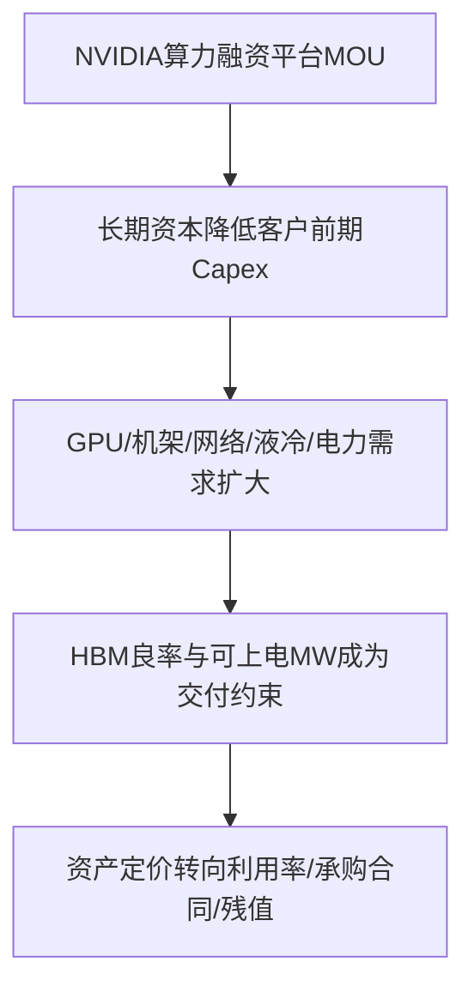
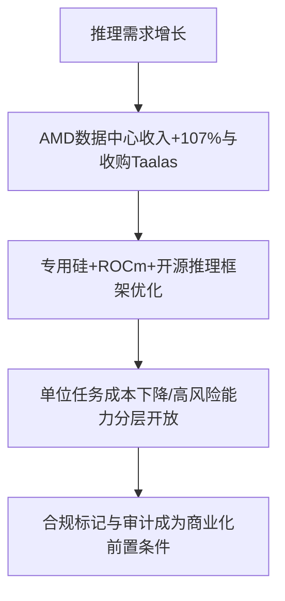

> **覆盖区间**：2026-08-04（周二）00:00 → 2026-08-10（周一）24:00（上海时区完整一周）  
> **覆盖范围**：AI 产业链 5 层（能源 / 基础设施 / 芯片存储 / 模型框架 / 应用商业化）+ 4 横切维度（政策 / 国资 / 资金 / 人才）  
> **时间窗声明**：仅收录区间内真实公开动态；区间外内容仅作背景并明确标注。关键数据附来源；未公开、单一来源或时区边界不确定的信息均降级处理。本报告不构成个股建议或二级市场买卖意见。

## 🚦 五维质量门控自检

- **覆盖率**：核心研究主题 43/43（100%）：L1/L2 13 个、L3 10 个、L4 10 个、L5与横切深度主题 10 个；美国头部 15/15、中国头部 13/13 逐一过筛；国家级基金、地方国资算力、东数西算、三大运营商、电网、CEC/CETC、基建与信创央企均逐项核验。
- **原文深度**：抽查 6/6 通过。NVIDIA融资平台、AMD Q2、vLLM v0.27.0、欧盟Article 50、武汉AI+Data、烟台AI三年行动页面均可打开全文，关键数字与中间稿一致；台积电新闻页遇反爬403，报告保留其官方月营收表/PDF交叉入口并明确局限。
- **政策原文**：本周3组有动态政府原文（欧盟Article 50、武汉AI+Data、烟台三年行动）均读全文并列明适用/生效状态与影响；美国联邦/州和中国中央无可核新增正式规则，按静默处理，未用旧闻补数。
- **判断质量**：每个有料主题都有具体投资判断；产业链研判包含传导链、景气信号、资本流向、一级市场机会与风险、领先指标五项，均标注【确定性】并由本周事实推导。
- **数据可信**：关键数字均附来源与日期；AMD等重要经营数据完成公司原文+独立媒体交叉验证。只有单一政府/公司口径或尚待最终协议的数据均明确降级，未把意向额度当成已募资、未把规划容量当成已投运。
- **报告编排校验**：43 个核心研究对象 / 100 个去重关键量化数据点 / 41 条主题投资判断 / 47 个去重原文链接，在资料库版与博客版全部对应 ✅。

## 本周产业链全景

> 本周最强信号不是单一模型或芯片发布，而是**AI算力开始被金融化、供给多元化与合规产品化同时重估**。NVIDIA联合六家全球资管/投行拟建立算力融资平台，目标长期动员超过5000亿美元第三方资本，把GPU和全栈基础设施推向长期信用资产；AMD数据中心收入同比增长107%，并收购专用推理芯片公司Taalas，说明第二加速计算栈和推理专用化同时进入财务与并购兑现阶段。
>
> 上游瓶颈并未消失。TrendForce提示DRAM紧张可能延续至2027年，HBM4e验证和良率不确定已迫使下一代GPU/ASIC重新权衡堆叠层数、容量与供给量；台积电7月营收同比增长44.7%，进一步确认先进制程和封装负荷仍高。底层能源侧，Google用15年PPA承购155MWac新增光伏，而得州接网审计把项目融资、现场电源、水耗与社区责任纳入准入，资本将更看重“可上电MW”而不是名义规划GW。
>
> 上层商业化与政策同步转向“可控开放”。OpenAI以身份审核和分层授权开放高双用途网络安全能力，Anthropic把生物安全误拦截降低约85%；欧盟Article 50则把AI交互告知和机器可读标记变成已适用义务。中国地方资金侧，江苏首次披露年内AI私募144起、披露额超过243亿元，并出现9—10年期算力贷款；武汉、烟台把数据券、算力券和基金矩阵写入政策预告。综合判断：钱仍在进入AI，但从无差别模型估值转向**可融资算力资产、供给瓶颈、推理效率、受监管准入和真实场景使用率**。

---

## 🔥 本周 TOP 5 投资事件

> 按“对产业研判 + 一级市场机会判断的信号价值”排序，非按新闻热度。

### 1. 算力信用化 ｜ 8月10日

NVIDIA与Apollo、BlackRock、Blackstone、Brookfield、Goldman Sachs、KKR签署谅解备忘录，拟建立相互独立的算力融资平台，长期动员**超过5000亿美元**第三方资本。原文把NVIDIA算力定义为“productive, investable infrastructure”，Goldman提出形成以NVIDIA算力为担保的信贷市场，但同时明确交易仍“subject to execution of the final agreements”。因此，5000亿美元是目标容量，不是已募集或已投放金额。

↳ **投资意义**：AI资本结构从企业自有capex和VC股权，向项目融资、结构化信用和长期使用量收入迁移。机会从GPU扩展到承购合同管理、资产运营、利用率优化、电力与液冷；风险则转向GPU残值、技术折旧快于债务久期、客户信用和最终协议兑现率。[NVIDIA原文](https://nvidianews.nvidia.com/news/nvidia-partners-with-apollo-blackrock-blackstone-brookfield-goldman-sachs-and-kkr-to-establish-ai-compute-infrastructure-financing-platforms-to-mobilize-over-500-billion-of-third-party-capital)

### 2. AMD：供给与推理并购 ｜ 8月4—6日

AMD Q2收入115.36亿美元，同比增长50%；数据中心收入67亿美元，同比增长107%，占公司收入约58%，并给出Q3约130亿美元±3亿美元指引。两天后，AMD宣布收购加拿大推理芯片公司Taalas，将其围绕模型构建硬件的专用数据流技术并入Instinct、EPYC、ROCm与Helios体系；收购价未披露，Taalas累计融资2.19亿美元。

↳ **投资意义**：算力需求不再只由单一GPU平台承接，竞争从单卡性能转向机架、网络、内存、软件生态与专用推理硅的组合。一级机会在跨CUDA/ROCm迁移、异构调度、内存数据流和机架级供配电；风险是大客户集中、专用硅随模型迭代失效，以及把多年2GW部署目标一次性资本化。[AMD Q2](https://ir.amd.com/news-events/press-releases/detail/1295/amd-reports-second-quarter-2026-financial-results) ｜ [AMD收购Taalas](https://ir.amd.com/news-events/press-releases/detail/1296/amd-acquires-taalas-to-advance-compute-solutions-for-rapidly-growing-ai-inference-market) ｜ [CNBC](https://www.cnbc.com/2026/08/06/amd-buys-taalas-startup-that-hardwires-ai-models-into-its-silicon.html)

### 3. HBM改写GPU规格 ｜ 8月4—5日

TrendForce预计DRAM供给紧张延续至2027年，12-Hi HBM4e验证和量产良率存在不确定性，NVIDIA因而为Rubin Ultra评估8-Hi HBM4e、12-Hi HBM4和8-Hi HBM4等备选方案；多家云厂也在评估降低下一代自研ASIC的HBM容量。研究预计2027年HBM bit出货同比增长50%—60%仍可能跟不上需求，但厂商最终规格、份额与价格均未确认。

↳ **投资意义**：供给瓶颈从“能否买到GPU”深入到“有限DRAM晶圆和HBM良率如何配置”，并向集群TCO、模型并行和采购预算传导。一级机会更集中于TSV/键合、薄化、检测、热管理、控制器/IP和内存调度；风险是把研究机构情景当作厂商定案。[TrendForce](https://www.trendforce.com/presscenter/news/20260804-13166.html) ｜ [TechTimes复核](https://www.techtimes.com/articles/323106/20260805/nvidia-rubin-ultra-ai-chip-may-deliver-less-hbm-rubin-forcing-procurement-replanning.htm)

### 4. 欧盟透明度义务 ｜ 本周更新

欧盟委员会Article 50指南明确：AI系统提供者必须确保个人在直接与AI交互时被明确告知，并为AI生成或操纵内容增加机器可读标记；部署者使用情绪识别、生物特征分类、深度伪造，以及未经人工审核的公共利益文本时必须告知个人。规则自2026年8月2日起适用，不参加自愿行为准则者须以“alternative equivalently adequate means”证明合规。

↳ **投资意义**：监管成本从法务条款进入模型输出、内容管线和用户体验，率先形成订单的环节可能是内容溯源、水印、身份授权、投诉响应与审计证据链。风险是固定合规成本抬高早期应用进入欧盟市场的门槛，并影响消费产品转化率。[欧盟委员会指南](https://digital-strategy.ec.europa.eu/en/policies/guidelines-ai-transparency-obligations) ｜ [AI Act时间线](https://digital-strategy.ec.europa.eu/en/policies/regulatory-framework-ai)

### 5. 地方资金转向使用端 ｜ 8月6—10日

江苏本周首次披露，截至7月31日年内AI私募融资144起、披露额超过243亿元，约四成流向云计算和算力设备；同时出现2.4亿元、10年期和1.8亿元、9年期算力专项贷款。武汉提出加快出台数据券、算力券，烟台提出组建基金矩阵，但两地均未公布预算、申报门槛或基金规模，仍处政策预告阶段。

↳ **投资意义**：地方资本工具从买卡、建机房，扩展到长期信贷、软件调度、数据治理和场景使用补贴。机会在国产异构调度、政企数据闭环、工业智能体和资产运营软件；风险是重复建设、长期债务与技术折旧错配，以及把政策意图提前计入估值。[江苏省委新闻网/新华日报](https://www.zgjssw.gov.cn/yaowen/202608/t20260806_8587301.shtml) ｜ [武汉市政府](https://www.wuhan.gov.cn/sy/whyw/202608/t20260810_2831467.shtml) ｜ [烟台市政府](https://www.yantai.gov.cn/col/col11794/art/2026/art_9262ab7b0d42436f8a97b13cdc4d8150.html)

---

## 🧭 三条主线判断

**资本流向：从股权叙事转向信用与使用率。** NVIDIA融资平台、江苏长期算力贷款、Google长期PPA共同表明，资本正在用承购合同、利用率和资产现金流重写AI基础设施融资；规划容量和意向金额不再等同可交付资产。

**技术拐点：推理成为软硬件共同优化对象。** AMD收购Taalas、vLLM/SGLang高强度版本更新、OpenAI和Anthropic分层开放能力共同说明，竞争从训练规模转向单位任务成本、通信与缓存效率，以及受监管场景中的实际可用率。

**产业瓶颈：HBM、电力和合规同时约束交付。** HBM4e良率影响GPU规格，可上电MW决定数据中心开工，Article 50决定应用如何呈现输出。三类瓶颈分别把价值量传导至先进封装、电网/能源与合规基础设施。

---

## 🧩 产业链研判

### ① 本周产业链传导链

### ② 景气度信号

- **L3算力硬件上行【确定性高】**：AMD数据中心收入同比+107%，台积电7月营收同比+44.7%，经营与制造端同向；但HBM约束说明增长仍受供给兑现限制。
- **L4推理基础设施上行【确定性高】**：AMD并购Taalas，vLLM/SGLang单周均发布大版本，资本和人才向推理专用硅、通信、KV缓存与控制面集中。
- **L1/L2分化【确定性中】**：长期PPA和电网接入服务价值上升；SMR/聚变、液冷、网络本周无合格新增订单，不能确认全面加速。
- **L5通用模型融资静默、受监管应用升温【确定性中】**：头部模型公司本周没有新估值或大额股权融资，但网络安全、生物/医疗可用性和合规基础设施出现商业化信号。

### ③ 资本流向判断

- **【确定性高】** 全球资本从单纯VC股权和云厂自有capex，向算力基础设施基金、GPU担保信用、长期贷款和PPA支持项目迁移。
- **【确定性中】** 中国地方国资和金融机构开始从机房建设延伸到调度软件、私有化智能体、数据券/算力券；但政策预告尚未形成可核预算，不能提前确认资金切换规模。
- **【确定性中】** 早期技术资本更偏向推理硅、内存数据流、跨硬件软件和合规中间件；通用基座模型本周缺乏新增融资信号。

### ④ 一级市场机会与风险

- **机会【确定性高】**：HBM测试/键合/热管理、跨CUDA/ROCm调度、MoE通信与KV缓存、算力资产运营、并网真实性验证、受监管准入和内容溯源，均由本周经营、并购、版本或政策原文直接支持。
- **机会【确定性中】**：工业流程智能体、政企数据治理、算力券核销平台及电水联合选址有早期空间，但需等待预算、采购和续约数据。
- **风险【确定性高】**：把5000亿美元目标容量当已募资、把474GW排队当可落地负荷、把模型公司自述benchmark当独立性能、把政策意图当实际出资，都会系统性高估估值与订单。
- **风险【确定性中】**：GPU技术折旧快于债务久期、专用硅随模型迭代失效、地方算力重复建设、合规固定成本抬升，可能在下一阶段集中暴露。

### ⑤ 下周领先指标

1. **【确定性高】** NVIDIA六项MOU是否签署最终协议，以及首期资金池、利率、LTV、承购年限和实际投放项目。
2. **【确定性高】** NVIDIA是否确认Rubin Ultra HBM层数/容量；SK海力士、三星、美光是否披露HBM4e认证、良率与晶圆分配。
3. **【确定性中】** ERCOT/PUCT审计如何去重项目、Batch Zero何时恢复，以及更多PPA是否披露价格、储能和形状匹配条款。
4. **【确定性高】** AMD-Taalas交易价、交割和产品路线；vLLM/SGLang优化能否获得独立tokens/s/$、TTFT与功耗复测。
5. **【确定性中】** 武汉数据券/算力券、烟台基金矩阵是否公布预算和申报细则；欧盟AI Office是否出现首批纠正措施或处罚。

---

## 📚 各层深度正文

以下保留全部研究笔记、静默项、数据边界、原文链接和投资判断；已进入TOP5的主题仍完整展开，便于核验。

### 🔋 L1能源与🏗️ L2基础设施

**研究窗口（上海时区）：2026-08-04 00:00—2026-08-10 24:00**  
**口径：**仅将窗口内发生或首次公布的信息列为“本周动态”；更早材料只作背景并明确标注。本文讨论产业链与一级市场，不构成个股建议。

### 覆盖清单与完成状态

| 层级 | 主题 | 状态 |
|---|---|---|
| L1 | 核电（SMR/核聚变） | 完成（静默） |
| L1 | 光伏 | 完成（有动态） |
| L1 | 天然气 | 完成（有动态） |
| L1 | 电网（含国家电网/南方电网） | 完成（有动态；中国专项静默） |
| L1 | AI电力供给 | 完成（有动态） |
| L2 | 超大规模数据中心 | 完成（有动态） |
| L2 | PPA | 完成（有动态） |
| L2 | 电力缺口 | 完成（有动态） |
| L2 | 选址（含东数西算） | 完成（有动态；东数西算静默） |
| L2 | 液冷 | 完成（静默） |
| L2 | 网络（含三大运营商） | 完成（静默） |
| L2 | 科技巨头自建电厂/核电协议 | 完成（静默；PPA有动态） |
| L2 | 能源融资与基建投资 | 完成（有动态） |

---
#### L1-核电（SMR/核聚变）
- **本周动态（静默）：**经对美国能源部、核能行业媒体、公司新闻稿及中英文新闻检索，本窗口内未发现可由公司公告、监管文件或权威媒体全文确认的新增SMR/核聚变融资、核电购电协议、开工或许可里程碑。搜索出现的“核能初创累计融资超过45亿美元”等社交媒体二手表述没有可核验的本周原始发布日期与交易清单，故不纳入。非本周背景：科技公司对核电的承诺仍多处在协议、开发和许可阶段，无法据此推断本周订单释放。静默的具体含义不是赛道降温，而是本周没有满足“发生时间+原始全文+关键数字”三项证据门槛的事件；因此本周不能把SMR/聚变作为已确认的景气边际变化。
- **关键数据：**本周可核验新增项目/融资/许可数量：**0（截至2026-08-10 24:00，公开渠道）**；融资额、估值及新增装机：**未公开/不适用**。
- **原文链接：**本周无合格原始事件；[美国能源部新闻中心（核验入口）](https://www.energy.gov/newsroom)
- **投资判断：**一级市场仍应把“获得核监管许可、锁定燃料、签署有约束力购电合同、首堆工程进度”作为估值兑现条件，而非只看数据中心需求叙事。本周静默，维持高技术风险、长久期判断，不上调热度。

#### L1-光伏
- **本周动态：**2026年8月4日，RWE与Google披露美国俄克拉荷马州Crooked Creek光伏项目15年期PPA：Google包销拟建电站全部**155MWac**产出，项目计划2026年开工、2028年投运，电量服务于覆盖14州的SPP区域内Google设施。该事件把AI算力新增负荷直接转化为具备长期承购方的新能源项目现金流，并非泛泛“绿电承诺”。不过光伏的间歇性意味着它解决的是电量与部分价格锁定，并非单独解决数据中心24×7容量需求；同一原文还提到RWE未来将关注灵活燃气调峰，说明“光伏+可调度电源/储能+电网”才是完整供电栈。产业链受益顺序更偏向已锁定并网、土地和PPA的开发商，以及储能、变电与输电配套，而不是无差别组件扩产。
- **关键数据：**15年PPA、155MWac、2026年开工/2028年投运（RWE交易报道，2026-08-04）；建设期最多250个岗位、约2430万美元当地经济产出、长期约2500万美元区域收入（同源）；美国2025年企业PPA规模29.5GW（BloombergNEF数据由该权威行业媒体转述，2026-08-04，未能取得BNEF开放原文，标注为二手）；项目容量与期限亦由Data Center Dynamics报道标题交叉确认，但其全文被Cloudflare阻断。
- **原文链接：**[IWR/ Renewable Energy Industry全文：RWE–Google 155MW PPA（2026-08-04）](https://www.renewable-energy-industry.com/countries/article-7597-ai-boom-drives-solar-power-demand-rwe-signs-155-mw-solar-ppa-with-google-in-oklahoma)；[Data Center Dynamics交叉来源（2026-08-04）](https://www.datacenterdynamics.com/en/news/google-signs-155mw-solar-ppa-with-rwe-in-oklahoma/)
- **投资判断：**一级市场更值得关注能把“并网权+长期PPA+储能/调峰”打包的开发平台，以及服务SPP等负荷增长区的电网软件和储能集成商。风险是2028年投运前的许可、并网与设备成本变化，且155MW光伏不能等同155MW全天候算力供电。

#### L1-天然气
- **本周动态：**本周最强信号来自美国数据中心供电模式的政策与环保争议，而非新燃气项目本身。8月5日《纽约时报》报道特朗普政府推动更多AI数据中心将带来显著空气污染，原文因付费墙未能抓取全文，故仅作为线索、不采用其数字。可完整核验的本周事实是得州州长要求暂停新数据中心接入ERCOT并审计项目的电力、水、现场发电和融资信息；审计明确要求披露“用于降低对州电网依赖的现场电厂”。这使燃气轮机/发动机成为加速上电的现实选项，但同时把排放、噪声、水耗和社区影响正式纳入准入审查。非本周背景：美国能源部3月披露俄亥俄项目拟建至少9.2GW燃气发电支持10GW数据中心，此数字不能当作本周新增，却说明燃气在AI供电栈中的规模潜力。
- **关键数据：**ERCOT大负荷接入申请474GW，约90%来自数据中心（ERCOT 2026-07-29演示材料，经Houston Public Media于2026-08-03全文引用；事件发生于8月3日美中时间，对应上海时间可能跨入8月4日，时区边界存在低度不确定）；非本周背景9.2GW燃气/10GW数据中心、333亿美元日本资金（DOE，2026-03-20）。本周新增燃气装机：**未公开**。
- **原文链接：**[Houston Public Media：得州暂停新数据中心接网并审计（2026-08-03）](https://www.houstonpublicmedia.org/articles/news/energy-environment/2026/08/03/558529/gov-greg-abbott-pauses-new-data-centers-until-ercot-puct-audit-energy-water-usage/)；[ERCOT原始演示材料（2026-07-29，非本周背景）](https://www.ercot.com/files/docs/2026/07/29/ERCOT-Senate-July-29-Panel-1-Assessing-The-Grid.pdf)；[DOE俄亥俄项目事实表（2026-03-20，非本周背景）](https://www.energy.gov/articles/fact-sheet-department-energy-ensuring-affordable-energy-access-ohio-while-powering-future)
- **投资判断：**燃气的机会在短交付周期分布式电源、微电网和排放控制，而不是“AI缺电=所有燃机项目必然获批”。一级市场尽调需前置核查气源、排放许可、社区接受度及能否在电网紧急时反送/削峰。

#### L1-电网（含国家电网/南方电网）
- **本周动态：**本周可验证的边际变化集中在美国得州：州长要求PUCT和ERCOT在完成全面审计前暂停新增数据中心接网，ERCOT同步推迟“Batch Zero”输电规划研究。审计覆盖融资与补贴、预测负荷、现场电源、水耗/循环利用、社区缓解措施、所有权与控制权，显示电网瓶颈正在从单纯排队升级为“真实性筛选+成本归属+水电联审”。这会清理重复或投机性474GW申请，但也延长真实项目的电力可得时间。中国方面，对国家电网、南方电网官网及权威媒体按8月4—10日检索，未发现窗口内可核验的、直接针对AI数据中心/东数西算的新增重大投资、政策或接网数字；因此明确记为静默，不能以7月旧闻充数。
- **关键数据：**得州大负荷申请474GW、约90%数据中心，即约427GW（按比例推算，非ERCOT直接给出的精确值）；474GW超过得州历史峰值用电五倍（报道，2026-08-03）。国家电网/南方电网本周AI算力专项新增投资额：**未公开/未发现合格动态**。
- **原文链接：**[Houston Public Media全文（2026-08-03）](https://www.houstonpublicmedia.org/articles/news/energy-environment/2026/08/03/558529/gov-greg-abbott-pauses-new-data-centers-until-ercot-puct-audit-energy-water-usage/)；[ERCOT原始材料（2026-07-29，供交叉核验）](https://www.ercot.com/files/docs/2026/07/29/ERCOT-Senate-July-29-Panel-1-Assessing-The-Grid.pdf)
- **投资判断：**电网侧景气将优先传导至接入研究、765kV/高压设备、变电站、需求响应和项目真实性验证工具。风险是“申请容量”严重重复，不能把474GW直接视为可落地订单池。

#### L1-AI电力供给
- **本周动态：**本周AI供电的关键不是新增发电总量，而是供电责任边界显著收紧。得州暂停新增数据中心接网并要求披露现场电源、融资、水耗和社区影响，说明“先报超大负荷、再等待公共电网扩容”的模式受到约束；Google与RWE的155MW、15年光伏PPA则展示另一条路径——由高信用算力买方为新增电源提供可融资的长期承购。两者合并看，瓶颈传导链已由GPU交付转向电源可调度性、并网真实性、输变电建设和水资源。DOE本周搜索结果出现俄亥俄AI供电事实表，但页面正文实际标注2026-03-20，属于搜索引擎“近期更新”误导，已按非本周背景处理，不计本周动态。
- **关键数据：**Google承购155MWac、15年、2028年投运（2026-08-04）；得州474GW大负荷申请、约90%数据中心，Batch Zero延期（2026-08-03美中时间，上海时区边界见前述说明）；DOE俄亥俄10GW供电与10GW数据中心为2026-03-20旧信息。
- **原文链接：**[RWE–Google PPA全文（2026-08-04）](https://www.renewable-energy-industry.com/countries/article-7597-ai-boom-drives-solar-power-demand-rwe-signs-155-mw-solar-ppa-with-google-in-oklahoma)；[得州接网暂停全文（2026-08-03）](https://www.houstonpublicmedia.org/articles/news/energy-environment/2026/08/03/558529/gov-greg-abbott-pauses-new-data-centers-until-ercot-puct-audit-energy-water-usage/)；[DOE事实表（2026-03-20，非本周）](https://www.energy.gov/articles/fact-sheet-department-energy-ensuring-affordable-energy-access-ohio-while-powering-future)
- **投资判断：**资本将更偏好“新增电源+专用费率+输电出资+需求响应”的全栈方案。早期机会在可调负荷编排、并网排队去重、微电网控制与水电协同；风险是把名义GW、排队GW和可用容量混为一谈。

### L1层投资洞察
L1本周呈现“新能源PPA可融资性增强、公共电网准入收紧、可调度电源价值抬升”的轮动。核电/聚变无合格新增催化；光伏通过长期PPA获得订单确定性，但容量价值仍依赖储能、燃气或电网；天然气的速度优势与排放/社区约束同步上升。电网成为瓶颈与规则制定者。

#### L2-超大数据中心
- **本周动态：**8月4日Data Center Knowledge发布月度项目梳理，虽其中多数底层项目发生于6—7月，不能作为本周新增交易，但该篇本周权威汇总明确显示超大规模项目的竞争指标从总Capex转向“time-to-energy、网络规模、电力采购和基础设施变现速度”。文中列出Meta加拿大1GW/超90亿美元、OpenAI佐治亚州3.2GW客户承诺、Brookfield与NextEra在DOE Paducah规划1.2GW、Pure DC芬兰一期110MW/15亿欧元等存量进展；这些均标为非本周背景。本周真正新增的约束是得州暂停新接网，意味着项目储备不等于可开工供电。产业链订单会向已有土地、电源、并网批复及长周期设备的“可上电项目”集中。
- **关键数据：**本周发布的项目汇总含：Meta加拿大1GW、投资超90亿美元；OpenAI匹配公用事业记录3,200MW承诺/3,210MW审查项目；Pure DC一期110MW、15亿欧元，远期超550MW/75亿欧元（均为8月4日汇总披露、底层事件非本周）；得州474GW申请与接网暂停为本周约束。严格口径下，本周新宣布超大规模项目总投资：**未发现可确认数字**。
- **原文链接：**[Data Center Knowledge全文（2026-08-04）](https://www.datacenterknowledge.com/data-center-construction/new-data-center-developments-august-2026)；[得州暂停接网（2026-08-03）](https://www.houstonpublicmedia.org/articles/news/energy-environment/2026/08/03/558529/gov-greg-abbott-pauses-new-data-centers-until-ercot-puct-audit-energy-water-usage/)
- **投资判断：**估值应从“规划MW”切换到“可上电MW”，对只有土地或排队编号的平台折价。一级市场机会在握有电力与许可的棕地改造、模块化交付与长周期电气设备，但项目延期和重复申报是核心风险。

#### L2-PPA
- **本周动态：**Google与RWE于8月4日公布Crooked Creek项目15年PPA，Google承购155MWac全部发电量，为RWE在俄克拉荷马首个光伏项目；电力将在SPP 14州区域内支持Google设施。这是本周最清晰的资本拐点证据：AI买方的长期信用把尚未开工、预计2028年投运的发电资产变成可融资项目，同时新增发电而非仅购买存量证书。交易价格、结算结构、是否物理直供、形状匹配和违约条款未公开，不能据此估算项目IRR。报道还称这是RWE数月内第二份美国超大规模客户PPA，反映优质承购方竞争，但不能把单笔交易外推为全市场价格上涨。
- **关键数据：**期限15年；规模155MWac；计划2026年开工、2028年投运；Google承购100%产出；SPP覆盖14州（2026-08-04）。PPA电价、项目总投资、储能配置：**未公开**。容量和期限由IWR全文与DCD标题两独立来源交叉验证，无冲突。
- **原文链接：**[IWR全文（2026-08-04）](https://www.renewable-energy-industry.com/countries/article-7597-ai-boom-drives-solar-power-demand-rwe-signs-155-mw-solar-ppa-with-google-in-oklahoma)；[DCD交叉来源（2026-08-04）](https://www.datacenterdynamics.com/en/news/google-signs-155mw-solar-ppa-with-rwe-in-oklahoma/)
- **投资判断：**长期PPA正在成为AI基础设施融资的“信用桥”，有利于开发期股权和项目债退出。风险集中在基差、弃电、形状不匹配和并网延迟；没有价格及保证条款时不宜推断高回报。

#### L2-电力缺口
- **本周动态：**得州监管行动把电力缺口从预测变成实际接入暂停：州长要求在完成审计前不允许更多数据中心接入，ERCOT随即推迟首批“Batch Zero”输电规划研究。ERCOT披露大负荷请求达474GW，约90%来自数据中心，超过全州历史峰值负荷五倍。这里的关键矛盾是排队容量远超系统物理规模且可能重复申报；审计目标之一就是区分投机项目和有资金、有节能/自备电方案的真实投资者。因此缺口的投资含义不是474GW都要建电厂，而是短期接网权、可中断负荷、现场电源及输电设备的稀缺溢价上升。
- **关键数据：**474GW大负荷请求；约90%即约427GW来自数据中心（推算）；大于历史峰值五倍；Batch Zero暂停（Houston Public Media 2026-08-03引用ERCOT 2026-07-29原始材料）。审计结束日期和最终可接入容量：**未公开**。
- **原文链接：**[Houston Public Media全文（2026-08-03）](https://www.houstonpublicmedia.org/articles/news/energy-environment/2026/08/03/558529/gov-greg-abbott-pauses-new-data-centers-until-ercot-puct-audit-energy-water-usage/)；[ERCOT原始演示PDF（2026-07-29）](https://www.ercot.com/files/docs/2026/07/29/ERCOT-Senate-July-29-Panel-1-Assessing-The-Grid.pdf)
- **投资判断：**机会在将“虚假排队”转化为可核验项目的数据产品、需求响应聚合和现场可调度电源。最大风险是用申请容量测算TAM；审计后分母可能大幅缩水。

#### L2-选址（含东数西算）
- **本周动态：**选址逻辑本周进一步从“土地/税收优惠”转向“可上电、可用水、可被社区接受”。得州的新审计要求逐项目披露融资、补贴、电力预测、现场电源、水耗与循环、噪声/灯光/退距/交通/应急安排以及最终控制权；这相当于对传统低成本选址模型增加资源与治理评分。8月4日行业汇总还指出芬兰吸引AI项目的组合是可再生能源、冷凉气候、税收与可持续创新，但其列举项目底层公告在7月，故只作非本周背景。中国“东数西算”八大节点及相关地方政府官网在8月4—10日窗口内未检索到可核验的新增重大项目、批复或投资数字；本周明确静默。
- **关键数据：**得州审计至少覆盖6类核心信息（融资/补贴、电力与现场电源、水与冷却、社区缓解、所有权控制权等，2026-08-03）；东数西算本周新增可核验重大投资：**0/未发现**。非本周背景：Pure DC芬兰一期110MW、15亿欧元，远期超550MW、75亿欧元（8月4汇总，底层7月14日）。
- **原文链接：**[得州选址/接网审计全文（2026-08-03）](https://www.houstonpublicmedia.org/articles/news/energy-environment/2026/08/03/558529/gov-greg-abbott-pauses-new-data-centers-until-ercot-puct-audit-energy-water-usage/)；[全球项目选址汇总（2026-08-04）](https://www.datacenterknowledge.com/data-center-construction/new-data-center-developments-august-2026)
- **投资判断：**早期机会在电水联合选址、社区风险建模、棕地能源资产改造。东数西算本周无新增催化，不应仅凭国家战略标签上调项目估值；需等待节点内真实客户和电力批复。

#### L2-液冷
- **本周动态（静默）：**对8月4—10日公司公告、数据中心专业媒体及中英文新闻检索，未发现满足原始全文要求的液冷新品量产、重大订单、融资或并购。得州审计虽要求披露水耗、回用及“不依赖本地水源的其他冷却系统”，为闭式液冷、干冷与水资源管理形成政策性需求线索，但监管文件没有指定技术路线、采购规模或供应商，不能记作液冷订单。静默原因是本周公开信息停留在需求约束与行业综述，没有可验证的交易/产能数字；因此仅可判断水效率权重上升，不能确认液冷资本开支已经在本周加速。
- **关键数据：**本周液冷新增融资、订单、产能：**未公开/未发现合格动态**；得州审计要求所有新申请数据中心披露用水及回用/替代冷却方案（2026-08-03）。
- **原文链接：**[Houston Public Media全文（2026-08-03）](https://www.houstonpublicmedia.org/articles/news/energy-environment/2026/08/03/558529/gov-greg-abbott-pauses-new-data-centers-until-ercot-puct-audit-energy-water-usage/)
- **投资判断：**水约束提高液冷与干冷的选址价值，但技术机会应以芯片热流密度、PUE/WUE实测、维护成本和订单为准。一级市场防范“液冷概念”公司将测试项目包装为规模收入。

#### L2-网络（含三大运营商）
- **本周动态（静默）：**本周对中国移动、中国电信、中国联通集团新闻、政府与权威媒体及国际数据中心网络公告进行检索，未发现8月4—10日内可核验的算力网络重大新建、融资、骨干互联容量或AI集群网络订单。8月4日Data Center Knowledge的行业汇总指出Microsoft、Alphabet和Meta在二季度沟通中把“大规模网络”和上电速度列为AI基础设施变现重点，但这些财报/电话会发生在此前，属于非本周背景。静默的具体原因是窗口内可见材料以行业评论和旧财报复述为主，缺少运营商原始公告及本周关键数字，故不将“算力网络持续建设”的常识当成动态。
- **关键数据：**三大运营商本周新增AI网络资本开支、端口/带宽、智算节点：**未公开/未发现合格动态**；国际超大规模网络本周新增订单：**未发现**。
- **原文链接：**[Data Center Knowledge月度全文（2026-08-04；所引财报为非本周背景）](https://www.datacenterknowledge.com/data-center-construction/new-data-center-developments-august-2026)；[中国移动集团新闻核验入口](https://www.10086.cn/aboutus/news/groupnews/)；[中国电信集团新闻核验入口](https://www.chinatelecom.com.cn/news/)
- **投资判断：**网络仍是集群扩展的结构性瓶颈，但本周没有订单级催化，不上调融资热度。早期项目需验证真实流量、端口利用率、客户集中度及与主流GPU互联生态兼容性。

#### L2-巨头电厂与核电协议
- **本周动态（静默）：**窗口内未发现Google、Microsoft、Amazon、Meta新签核电/SMR协议或正式宣布自建电厂的合格原始公告。Google本周签署的是155MW光伏PPA，并非自建电厂，也不是24×7核电协议；应避免将其误写为“巨头自建能源资产”。得州审计要求披露现场电厂，表明监管鼓励项目说明如何减少公共电网依赖，但没有披露具体巨头的新项目。非本周背景包括DOE俄亥俄10GW数据中心配套至少9.2GW燃气及科技公司既有核电承诺，均不计入本周。
- **关键数据：**本周新增巨头核电协议：**0（公开可核验）**；本周Google新增PPA：155MWac、15年（2026-08-04）；自建电厂资本开支与核电价格：**未公开**。
- **原文链接：**[Google–RWE PPA全文（2026-08-04）](https://www.renewable-energy-industry.com/countries/article-7597-ai-boom-drives-solar-power-demand-rwe-signs-155-mw-solar-ppa-with-google-in-oklahoma)；[得州现场电源披露要求（2026-08-03）](https://www.houstonpublicmedia.org/articles/news/energy-environment/2026/08/03/558529/gov-greg-abbott-pauses-new-data-centers-until-ercot-puct-audit-energy-water-usage/)；[DOE俄亥俄事实表（2026-03-20，非本周）](https://www.energy.gov/articles/fact-sheet-department-energy-ensuring-affordable-energy-access-ohio-while-powering-future)
- **投资判断：**本周事实支持“巨头承购新增电源”，不支持“巨头普遍转为电厂业主”。一级市场应区分PPA承购、项目股权、自备电资产和核电开发承诺四种风险收益结构。

#### L2-能源与基建资本
- **本周动态：**本周没有找到合格原始来源披露新的AI能源基础设施股权融资或基金募资，但两项事实改变资本配置门槛：其一，Google用15年PPA支持155MW新增光伏，使开发期资产具备长期承购信用；其二，得州审计要求披露项目融资、政府资金和税收激励，并暂停接网，直接把“资金真实性”纳入基础设施准入。8月4日行业汇总列出Pure DC芬兰15亿欧元一期、Meta加拿大超90亿美元、AWS印度2026—2030年210亿美元云与AI投入等，但底层公告早于窗口，只能作为非本周存量资本背景。由此可见本周资本不是全面升温，而是从规划型估值转向可融资PPA、已付接网成本和自带电源的项目。
- **关键数据：**本周可确认的新增能源股权融资额：**未公开/未发现**；PPA支持155MWac、15年；得州要求披露全部新项目融资、政府资金和税收激励（2026-08-03）。非本周背景：Pure DC一期15亿欧元、Meta加拿大超90亿美元、AWS印度2026—2030年210亿美元（8月4汇总所载旧事件）。
- **原文链接：**[RWE–Google PPA全文（2026-08-04）](https://www.renewable-energy-industry.com/countries/article-7597-ai-boom-drives-solar-power-demand-rwe-signs-155-mw-solar-ppa-with-google-in-oklahoma)；[得州融资披露要求全文（2026-08-03）](https://www.houstonpublicmedia.org/articles/news/energy-environment/2026/08/03/558529/gov-greg-abbott-pauses-new-data-centers-until-ercot-puct-audit-energy-water-usage/)；[项目资本汇总（2026-08-04）](https://www.datacenterknowledge.com/data-center-construction/new-data-center-developments-august-2026)
- **投资判断：**一级市场更有吸引力的是获得高信用承购、并网权和许可的开发平台及电网配套，而非只有宏大GW规划的SPV。风险包括接网暂停导致资金占用、税收激励回撤、PPA基差及工程成本超支。

### L2层投资洞察
L2本周的核心分化是“规划容量”与“可上电容量”。PPA赋予新增电源融资性，监管审计则压缩无资金、无现场电源、无水资源方案的项目估值。选址、液冷、网络和基建资本都将围绕电力真实性重新排序；东数西算、三大运营商网络及液冷在严格时间窗内无订单级新增，应保持证据纪律。

### So what：能源与基础设施五项结论
1. **传导链【确定性高】**：AI算力需求→大负荷接网申请激增→电网启动真实性/水电/融资审计并暂停接入→可上电项目稀缺→PPA、现场电源、输变电、需求响应价值上升。本周得州暂停与Google 15年PPA构成链条两端的直接证据。
2. **景气信号【确定性中】**：光伏长期PPA与电网接入服务景气改善；燃气/微电网有需求但监管与排放约束并升；SMR/聚变、液冷、网络本周无合格新订单，不能确认边际加速。
3. **资本流向【确定性中】**：资本偏向有高信用承购和并网条件的项目，监管开始要求披露融资、补贴与控制权；本周未见新的大额能源股权融资，故“资本全面涌入”证据不足。
4. **一级市场机会风险【确定性高】**：机会为并网排队去重/真实性验证、电水联合选址、需求响应、微电网控制、已有PPA的开发平台；风险为重复GW申请、PPA形状与基差、接网延期、排放/社区阻力及把规划容量包装为收入。
5. **下周领先指标【确定性中】**：关注ERCOT/PUCT审计执行口径、Batch Zero恢复时间与淘汰比例；更多超大规模客户PPA是否披露价格/储能；现场电源许可与燃机订单；国家电网/南方电网、东数西算节点、三大运营商是否出现带投资额和投运日期的原始公告。

### 研究限制与冲突标注
- 得州州长指令的权威媒体页面日期为美国当地2026-08-03；事件发生“Monday”，换算上海时间可能落在8月4日，但未公开精确时刻，故纳入并明确边界不确定性。
- 搜索引擎将DOE俄亥俄事实表标为“3天前”，但打开全文显示原始日期2026-03-20；已剔除出本周动态。这一冲突说明仅凭搜索摘要会误判日期。
- Google–RWE交易规模由两独立行业来源均报155MW；一处搜索社交摘要写150MW，属于四舍五入/转述，采用正文155MWac。
- 付费墙或Cloudflare阻断的页面未作为唯一数字来源；关键结论均以成功打开的全文为基础。部分市场总量（如BNEF 29.5GW）只有权威媒体转述，已明确标注二手。

---

### 💾 L3芯片与存储

> 严格时间窗：上海时区 2026-08-04 00:00—2026-08-10 24:00。旧信息仅作背景且明确标注“非本周”。研究用途，不构成个股建议。

### 覆盖清单与完成状态

- [ ] NVIDIA / AMD GPU
- [ ] Google TPU及云厂自研ASIC
- [ ] 华为昇腾
- [ ] 寒武纪
- [ ] 壁仞及其他重大国产AI芯片
- [ ] 先进制程：台积电 / 三星 / 中芯国际
- [ ] HBM：SK海力士 / 三星 / 美光
- [ ] DRAM与产能、价格周期
- [ ] 出口管制、capex、供应链与人才
- [ ] 国家大基金一/二/三期、制造业转型基金、国新控股、国投、CEC/CETC、信创央企

#### L3-NVIDIA / AMD GPU
- **本周动态（有料）**：AMD于美国时间8月4日公布2026财年二季度业绩，是本周GPU主线最硬的需求验证。收入115.36亿美元，同比增50%、环比增13%；数据中心收入67亿美元，同比增107%，占公司收入约58%，增长由EPYC与Instinct GPU共同驱动。公司给出三季度收入约130亿美元（±3亿美元），中值同比增41%、环比增13%，并明确称下半年数据中心销售还将加速。产品侧，Helios机架开始爬坡，MI400系列覆盖训练/推理，且与Anthropic的合作目标为部署最高2GW MI450/Helios；这说明竞争已由“单卡性能”转向机架级系统、网络、内存与ROCm生态的整体交付。对产业链而言，AMD的放量使先进制程、CoWoS类封装、HBM、基板与高速互连的需求不再仅由NVIDIA单一牵引，二供格局改善但也加剧稀缺产能争夺。NVIDIA在严格窗口内未检索到新的公司公告、财报或可核实重大产品/订单事件，故明确静默；原因是其当季业绩发布不在本周，搜索所得多为旧闻或市场评论，未纳入。
- **关键数据**：AMD Q2收入115.36亿美元（同比+50%）、数据中心收入67亿美元（同比+107%）、GAAP毛利率54%；Q3指引130亿美元±3亿美元、非GAAP毛利率约56%（2026-08-04，AMD公告）。CNBC同日独立报道收入115.4亿美元、市场预期112.8亿美元，数据中心67亿美元，口径与公司公告一致。AMD亦披露Q2'25受MI308出口管制产生8亿美元库存及相关费用（对比基数提示）。
- **原文链接**：[AMD Q2 2026官方业绩公告（2026-08-04）](https://ir.amd.com/news-events/press-releases/detail/1295/amd-reports-second-quarter-2026-financial-results)；[Reuters业绩报道（2026-08-04，页面访问受限但检索结果与原公告交叉）](https://www.reuters.com/business/amd-forecasts-upbeat-revenue-ai-data-center-demand-beats-quarterly-estimates-2026-08-04/)；[CNBC独立报道（2026-08-04）](https://www.cnbc.com/2026/08/04/amd-earnings-report-q2-2026.html)
- **投资判断**：一级市场应把机会从通用GPU“正面替代”下沉到多平台兼容的软件栈、机架级散热/供电、互连、内存池化与集群运维；AMD放量可降低创业公司对单一CUDA平台的商业依赖。风险是头部客户订单高度集中、2GW属多年部署目标而非当期收入，估值不宜按远期容量一次性兑现。

#### L3-云厂自研ASIC
- **本周动态（明确静默）**：逐项检索Google TPU、AWS Trainium、Microsoft Maia、Meta MTIA及云厂自研ASIC，在2026-08-04至08-10严格窗口内未找到公司公告、政府文件、财报更新或权威媒体确认的新增芯片发布、量产节点、重大采购及融资事件。检索结果主要落在Microsoft于2026-01-26发布Maia 200、以及6月前后的架构比较，均为非本周信息，故不作动态展开。静默的具体原因是本周云厂并非集中发布自研芯片的产品节点，且市场文章大量复述既有路线图，缺少新增可验证数字。产业含义不是需求转弱，而是本周可观测增量由AMD业绩端体现，ASIC侧需等待云厂财报中的资本开支、芯片部署规模或下一代流片公告再判断。
- **关键数据**：本周新增关键数字未公开；严格窗口内无可交叉验证的新增出货、capex或量产数字。
- **原文链接**：无本周原始动态；[Microsoft Maia 200旧公告（2026-01-26，非本周，仅作检索排除依据）](https://blogs.microsoft.com/blog/2026/01/26/maia-200-the-ai-accelerator-built-for-inference/)
- **投资判断**：一级市场不应把“云厂自研”静默误判为停滞，仍应关注ASIC设计服务、Chiplet/IP、验证与编译器工具，但需以正式流片/部署合同为估值触发点。缺乏本周增量数据时，应避免仅凭路线图上调估值。

#### L3-国产AI芯片
- **本周动态（明确静默）**：分别以公司名、产品名、监管公告及产业会议检索华为昇腾/CANN、寒武纪、壁仞、摩尔线程、沐曦、燧原等，在严格窗口内未找到由公司官网、交易所、政府或权威媒体确认的重大新品发布、流片/量产、订单、融资或并购。搜索高频结果为“华为宣布CANN开源”，但原事件日期是2025-08-05，恰好因月日相同而被搜索引擎误召回，属于非本周，明确剔除；另有2026-08-04二级市场ETF行情，不属于产业动态。静默原因是公开披露不足且本周无集中产业大会节点，并不等于研发或交付停止。对国产链判断应保持证据纪律：没有合同金额、集群规模、良率或客户验收数据，就不能用市场传闻推导景气拐点。
- **关键数据**：本周新增订单、融资估值、出货、良率及产能数据均未公开。旧闻中的CANN 8.0算子数量等不纳入本周关键数据。
- **原文链接**：无本周原始动态；[通信世界关于CANN开源（2025-08-06，非本周，仅用于说明误召回）](https://www.cww.net.cn/article?id=602835)
- **投资判断**：早期机会仍集中于国产算力的软件迁移、算子优化、训推平台与板卡/集群交付，但估值应绑定真实付费客户和复购率，而非“国产替代”标签。风险包括信息披露弱、客户集中、生态适配成本高，以及先进封装/HBM约束向整机交付传导。

#### L3-先进制程
- **本周动态（有料）**：台积电于8月10日公布7月营收约4,675.8亿新台币，环比增5.6%、同比增44.7%；1—7月累计2.872064万亿新台币，同比增37.0%。这是本周先进制程景气最直接的高频信号，与AMD数据中心收入翻倍相互印证：AI加速器和高端CPU需求仍在向晶圆代工收入兑现。该月度数据未拆分节点与客户，因此不能把全部增长归因于3nm/2nm或AI，但结合AI芯片厂商增长，先进逻辑与配套先进封装的高负荷方向确定性较高。三星与中芯国际在严格窗口内未找到新的官方制程量产、良率、capex或客户公告，明确静默；原因是本周缺少相应公司披露节点，检索结果主要为此前财报或媒体推测。台积电网页受反爬限制，但官方PDF/新闻页全文入口已打开尝试，数字以官方发布页与月营收表交叉校验。
- **关键数据**：台积电2026年7月营收4,675.8亿新台币，环比+5.6%、同比+44.7%；1—7月累计28,720.64亿新台币，同比+37.0%（2026-08-10，公司月报）。官方新闻页和官方2026月营收表数字一致；未检索到本周第二家权威媒体对7月数字的完整独立报道，故交叉验证仅限两个台积电官方载体，局限已标注。
- **原文链接**：[台积电7月营收官方新闻（2026-08-10）](https://pr.tsmc.com/english/news/3329)；[台积电2026年月营收表](https://investor.tsmc.com/english/monthly-revenue/2026)；[官方PDF](https://pr.tsmc.com/system/files/newspdf/attachment/bab28e7eeb5a0a0fcc2888817c72f8fa67d247bb/July%202026%20%28E%29_final_wmn.pdf)
- **投资判断**：一级市场机会更偏向先进制程伴生的材料、检测、先进封装设备与良率软件，而非重资产晶圆厂正面竞争。风险在于月营收无法拆分AI贡献，若以单月同比外推长期估值，容易忽略客户拉货节奏与汇率因素。

#### L3-HBM与DRAM周期
- **本周动态（有料）**：TrendForce 8月4日称，DRAM供给紧张预计延续至2027年，且12-Hi HBM4e验证时间与量产良率仍不确定，已迫使NVIDIA从Rubin Ultra原定12-Hi HBM4e基线，扩展评估8-Hi HBM4e、12-Hi HBM4及8-Hi HBM4等方案；多家CSP也在评估降低下一代自研ASIC的HBM容量。若降堆叠层数，实质是在单颗GPU容量/带宽与有限晶圆可支持的GPU出货量之间重新分配。本周最重要的“瓶颈传导链”因此清晰：DRAM总晶圆约束与HBM4e良率/认证不确定→HBM分配和价格权上升→GPU/ASIC规格下修或成本上涨→模型训练/推理的单位集群配置与采购预算重算。SK海力士、三星、美光本周均未发布新的官方产能/财报公告，厂商级份额、报价及认证进度未公开，不能据行业报告擅自分配受益幅度。
- **关键数据**：TrendForce预计2027年HBM bit出货同比增50%—60%，仍跟不上需求；Rubin Ultra候选I/O速率若HBM4e按期量产可达14—16Gbps，若用HBM4优化则约11—12Gbps，而上一代Rubin为8—11.7Gbps（2026-08-04）。TechTimes 8月5日全文复核并援引同一研究，称8-Hi方案可能为192GB、较当前Vera Rubin 288GB低33%，但同时注明NVIDIA尚未公开确认；因此192GB只作为二级来源情景，不作为已定规格。
- **原文链接**：[TrendForce原始研究新闻（2026-08-04）](https://www.trendforce.com/presscenter/news/20260804-13166.html)；[TechTimes独立全文复核（2026-08-05）](https://www.techtimes.com/articles/323106/20260805/nvidia-rubin-ultra-ai-chip-may-deliver-less-hbm-rubin-forcing-procurement-replanning.htm)
- **投资判断**：一级市场机会从“扩产”进一步转向提升良率与有效供给：TSV/键合、薄化、检测、热管理、HBM控制器/IP及内存调度软件；这些环节能同时服务多家GPU/ASIC。风险是行业报告不是厂商定案，最终规格、各厂份额和价格均未公开，若按50%—60% bit增长直接线性外推设备订单与创业公司收入，会高估兑现速度。

#### L3-管制、供应链与人才
- **本周动态（部分有料）**：严格窗口内未检索到美国BIS或中国政府发布新的、已生效的AI芯片出口管制条款，因此政策本身明确静默；搜索结果主要为2026年1月或3月规则/草案，非本周，不纳入政策动态。供应链侧则有两项本周事实：AMD Q2业绩显示数据中心收入同比+107%，并提示其产品依赖第三方制造、内存、基板与制造工艺；TrendForce称DRAM紧缺及HBM4e验证/良率不确定正在反向改变GPU规格。capex方面，本周没有头部晶圆厂或三大存储厂新的正式预算更新；人才方面也未见重大公司级招聘、裁员、团队并购或政府人才政策原文。故本主题的新增结论不是“政策放松”，而是管制边际无新增、实体供给约束成为更靠前的可观测瓶颈。
- **关键数据**：AMD披露Q2'25曾因美国政府对MI308出口管制计提8亿美元库存及相关费用（2026-08-04公告中的历史对比项，事件非本周但披露在本周）；本周新增管制条款、生效时间与适用范围：未公开/无新增。HBM bit 2027供给预计+50%—60%仍不足，见上节。
- **原文链接**：[AMD Q2 2026官方公告（2026-08-04）](https://ir.amd.com/news-events/press-releases/detail/1295/amd-reports-second-quarter-2026-financial-results)；[TrendForce供应约束原文（2026-08-04）](https://www.trendforce.com/presscenter/news/20260804-13166.html)；[美国联邦公报旧规则（2026-01-15，非本周，仅用于排除）](https://www.federalregister.gov/documents/2026/01/15/2026-00789/revision-to-license-review-policy-for-advanced-computing-commodities)
- **投资判断**：一级市场尽调应把“可获得的HBM/先进封装配额、出口合规与供应商多元化”列为硬性条款，而不只看芯片峰值算力。人才端本周无信号，暂不能推导薪酬或团队流动拐点；资本应避免为未经确认的政策变化支付溢价。

#### L3-国资与产业基金
- **本周动态（明确静默）**：按机构逐一检索国家集成电路产业投资基金一期、二期、三期，国家制造业转型升级基金，国新控股、国投集团，以及中国电子（CEC）、中国电科（CETC）和信创央企，在2026-08-04至08-10窗口内未找到政府官网、基金/央企官网或工商披露可确认的AI芯片、先进制造、HBM/DRAM新增出资、设立子基金、重大项目签约或退出事件。搜索结果集中在2024年大基金三期注册、2026年2月既有投资、7月IPO受理等，均非本周，故剔除。没有政府官网政策原文意味着本周不存在可在本报告中摘录的新增条款、生效时间和适用范围；不能用媒体“即将出手”替代已发生投资。该静默显示本周资本端硬信号弱于经营/供给端，不代表国资长期战略转向。
- **关键数据**：本周各列名机构新增公开出资额、估值、持股比例、项目数量：未公开；本周新增政府政策条款：未检索到。
- **原文链接**：无本周合格原始动态。搜索排除示例：[大基金三期历史背景（2024-05-27，非本周）](https://www.voachinese.com/a/china-sets-up-third-fund-with-47-5-bln-to-boost-semiconductor-sector-20240527/7628405.html)
- **投资判断**：一级市场本周不能据国资传闻上调项目估值；更合理的是等待基金工商变更、官方签约或上市公司公告形成可验证资本流。早期项目若以“预计大基金接盘”为退出逻辑，存在周期错配与政策兑现风险。

### 本层投资洞察与 So What

1. **传导链【确定性高】**：AMD数据中心收入同比+107%与台积电7月营收同比+44.7%共同验证算力需求仍在向上游制造兑现；同时DRAM晶圆约束与HBM4e认证/良率不确定，已传导到Rubin Ultra候选规格，链条为“AI需求扩张→先进制程/封装/HBM争抢→内存规格或成本调整→集群TCO重算”。
2. **景气信号【确定性高】**：经营端与制造端同向，AMD Q3指引中值环比约+13%、台积电7月环比+5.6%，景气未见本周拐头；但GPU增长和台积电月营收都不能精确拆分到HBM/节点，强度判断保留边界。
3. **资本流向【确定性中】**：本周硬数据支持资本继续偏向数据中心GPU、先进制程和内存瓶颈环节；国资基金及央企无可核验新增动作，说明公开一级资本信号暂时静默，不能以传闻替代资金落地。
4. **一级市场机会风险【确定性中】**：机会优先级为HBM良率/测试/键合/散热、机架级供电互连、多GPU软件与内存调度；风险是客户集中、供应配额、未经厂商确认的规格情景，以及把远期2GW部署或2027 bit增长一次性资本化。
5. **下周领先指标【确定性中】**：跟踪NVIDIA是否确认Rubin Ultra HBM层数/容量，SK海力士、三星、美光的HBM4e客户验证与晶圆分配，BIS/中国政府是否出现正式规则文本，及国产芯片公司是否披露真实订单/集群验收；若只有二级媒体转述，继续按“未确认”处理。

### 覆盖完成核验

- [x] NVIDIA / AMD GPU（AMD有料；NVIDIA静默及原因）
- [x] Google TPU及云厂自研ASIC（静默及原因）
- [x] 华为昇腾（静默及原因）
- [x] 寒武纪（静默及原因）
- [x] 壁仞及其他重大国产AI芯片（静默及原因）
- [x] 先进制程：台积电 / 三星 / 中芯国际（台积电有料；三星、中芯静默）
- [x] HBM：SK海力士 / 三星 / 美光（行业有料；厂商公告静默）
- [x] DRAM与产能、价格周期（有料）
- [x] 出口管制、capex、供应链与人才（供应链有料；其余静默）
- [x] 国家大基金一/二/三期、制造业转型基金、国新控股、国投、CEC/CETC、信创央企（静默及原因）

---

### 🧠 L4模型与框架

**严格时间窗：** 上海时区 2026-08-04 00:00—2026-08-10 24:00（检索与事实截止 2026-08-10）。旧信息仅作背景且明确标注“非本周”。不构成个股建议。

### 覆盖清单与完成状态
- [ ] 大模型训练：训练集群、成本、新基座模型
- [ ] 大模型推理：成本下降、推理需求、推理芯片/优化
- [ ] 训练框架：PyTorch / JAX / Megatron / DeepSpeed
- [ ] 推理框架：vLLM / SGLang / TensorRT-LLM / TGI
- [ ] 开源 vs 闭源
- [ ] 模型与框架生态融资、并购、人才
- [ ] 训练/推理经济学拐点
- [ ] 中国政策、国资、资金、人才影响
- [ ] 美国政策、资金、人才影响
- [ ] 欧盟政策、资金、人才影响

> 口径说明：“本周动态”要求事件发生或首次正式公布于时间窗内；仅有搜索摘要、转述或窗口外材料不计入。无合格原始材料的主题明确记为静默。

#### L4-模型训练
- 本周动态（静默）：按“首次公布必须在窗口内”的口径，未检索到可由模型厂商官方公告、论文或两家权威来源证实的全新基座模型发布，也未见训练集群规模或训练总成本的新披露。Kimi K3、DeepSeek-V4、Qwen3.5等虽在本周框架版本中新增适配，但模型本身均为此前发布，故只作非本周背景，不倒灌为本周模型动态。本周可验证信号集中在“如何把超大MoE和混合注意力模型稳定跑起来”，不是新一轮预训练规模竞赛。训练集群与新基座模型具体资本开支、GPU数量、训练token和训练成本均未公开；因此无法对训练算力需求作新的定量上修。
- 关键数据：本周合格新增披露为0；训练GPU数、训练token、总成本：未公开（检索截止2026-08-10）。
- 原文链接：[vLLM v0.27.0发布页（2026-08-10，框架适配而非模型首发）](https://github.com/vllm-project/vllm/releases/tag/v0.27.0)；[SGLang v0.5.17发布页（2026-08-08）](https://github.com/sgl-project/sglang/releases/tag/v0.5.17)
- 投资判断：训练侧缺乏新增规模数据，不宜仅因框架适配推断训练景气再加速。一级市场更应要求训练公司披露有效算力利用率、数据闭环与单位能力增益，而非只看参数量。

#### L4-模型推理
- 本周动态：8月6日AMD宣布签署确定性协议收购加拿大推理芯片公司Taalas，明确将其“围绕模型构建硬件”的专用数据流技术并入Instinct GPU、EPYC、ROCm及Helios机架级平台；交易价和交割时间未披露。AMD官方只定性称其减少通用架构的计算和内存瓶颈。CNBC补充，Taalas 2023年成立、累计融资2.19亿美元，现有芯片将Llama 3.1小模型硬连线，采用较成熟TSMC工艺与片上SRAM，声称从收到新模型到硬件实现仅需两个月、特定模型速度可比GPU高“数千倍”；该性能为公司主张，未见本周独立benchmark，不能等同实测。事件表明推理需求正分裂为GPU通用池与超低延迟/高重复模型的专用加速池，瓶颈从纯算力转向内存、数据流和系统集成。
- 关键数据：2026-08-06签署确定性收购协议；交易金额未公开；Taalas累计融资$219m（CNBC，2026-08-06）；模型到硅实现约2个月、速度“数千倍”为Taalas自述，缺少独立复核。
- 原文链接：[AMD官方公告（2026-08-06）](https://ir.amd.com/news-events/press-releases/detail/1296/amd-acquires-taalas-to-advance-compute-solutions-for-rapidly-growing-ai-inference-market)；[CNBC全文（2026-08-06）](https://www.cnbc.com/2026/08/06/amd-buys-taalas-startup-that-hardwires-ai-models-into-its-silicon.html)
- 投资判断：并购验证推理专用硅、SRAM/内存数据流与软硬协同是资本争夺点，但“单模型硬化”承受模型迭代快、流片与客户集中风险。早期项目应重点验证两个月映射周期是否可规模复制、真实tokens/s/W及总拥有成本，而非采信峰值倍数。

#### L4-训练框架
- 本周动态：PyTorch、JAX和Megatron在窗口内没有正式新版本，原因是其最近正式发布分别早于本周；DeepSpeed则连续发布0.19.4（8月6日UTC）和0.19.5（8月10日UTC）。0.19.4把ZeRO-3推理与Tensor Parallel结合、修复TP+Tutel可能静默损坏、增加Ampere/Ada上的Triton grouped-GEMM MoE kernel，并让NVMe异步I/O释放GIL、共享pinned-tensor manager；0.19.5继续修复ZeRO++小参数二级分片、ZeRO-3异步梯度卸载并默认pinned buffers、AutoEP ZeRO-1/2通用检查点转换及Torch 2.12+编译。发布说明未给端到端训练吞吐或成本benchmark，因此只能判断可靠性与可用硬件范围改善，不能量化训练成本下降。
- 关键数据：DeepSpeed v0.19.4于2026-08-06发布、v0.19.5于2026-08-10发布；两版合计涵盖ZeRO/AutoTP/AutoEP/MoE/NVMe等关键路径；性能提升数字未公开。
- 原文链接：[DeepSpeed 0.19.4（2026-08-06）](https://github.com/deepspeedai/DeepSpeed/releases/tag/v0.19.4)；[DeepSpeed 0.19.5（2026-08-10）](https://github.com/deepspeedai/DeepSpeed/releases/tag/v0.19.5)；[PyTorch releases](https://github.com/pytorch/pytorch/releases)；[JAX releases](https://github.com/jax-ml/jax/releases)；[Megatron releases](https://github.com/NVIDIA/Megatron-LM/releases)
- 投资判断：训练软件价值正在从“大版本新功能”转向MoE正确性、分片兼容和卸载稳定性；静默错误修复对企业ROI比单点峰值更重要。一级市场机会在跨硬件编排、检查点迁移和训练可观测性，风险是基础框架快速吸收功能导致独立插件被挤压。

#### L4-推理框架
- 本周动态：vLLM 0.27.0于8月10日发布，561 commits、242名贡献者（64名新贡献者），新增Kimi K3全栈、Qwen3.5等模型支持，升级PyTorch 2.13并引入FA4的FP8 KV cache、JIT预热、P/D分离及容错。官方列出DeepSeek-V4优化：若干kernel约2x/1.88x，TTFT分别改善3.4%、3.9%，PP buffer节省448MiB，RMSNorm kernel提升1.2–3.1x，但不同优化可能重叠，不能简单相加。SGLang 0.5.17于8月8日发布，582 PR、194贡献者；DWDP在4×B200、gpt-oss-120B预填充测试中，32K输入场景相对DEP4达1.92x，饱和吞吐506K vs 329K tok/s（1.54x），同时引入Rust前端、会话感知Radix cache及权重缓存守护进程。TensorRT-LLM窗口内无正式版，TGI已于2026-03-21归档（非本周），本周静默原因分别是无合格正式发布与项目只读。
- 关键数据：vLLM：561 commits/242贡献者/64新人，DeepSeek-V4 TTFT -3.4%与-3.9%、448MiB节省（2026-08-10）；SGLang：582 PR/194贡献者，DWDP 1.92x、506K vs 329K tok/s（2026-08-08）。两组benchmark均为各项目自测，硬件/工作负载不同，不作横向胜负结论。
- 原文链接：[vLLM v0.27.0（2026-08-10）](https://github.com/vllm-project/vllm/releases/tag/v0.27.0)；[SGLang v0.5.17（2026-08-08）](https://github.com/sgl-project/sglang/releases/tag/v0.5.17)；[TensorRT-LLM releases](https://github.com/NVIDIA/TensorRT-LLM/releases)；[TGI归档页](https://github.com/huggingface/text-generation-inference/releases)
- 投资判断：推理框架竞争从PagedAttention进入“MoE通信+P/D分离+缓存分层+Rust控制面+跨GPU”系统战，软件优化可直接释放昂贵GPU容量。机会在可观测、调度与跨框架兼容层；风险是vLLM/SGLang高频迭代与云厂商内建服务压低独立商业化空间。

#### L4-开源 vs 闭源
- 本周动态：本周没有新的开源/闭源基座模型首发可作能力对比，但开源推理栈出现高强度工程推进：vLLM与SGLang合计公开了超过1100项commit/PR量级变更，并同步支持多个此前发布的开放权重模型；SGLang甚至把OpenAI兼容服务、量化权重LoRA、跨NVIDIA/AMD验证一起交付。相对地，本周没有闭源厂商公开可复核的同口径服务端吞吐、KV缓存或单位token成本数据。因此可确认的是开放生态的“适配速度和可审计优化”优势，而不能据此断言模型能力超过闭源。TGI归档则提醒开源项目也会发生维护集中化，生态份额可能向vLLM/SGLang等头部收敛。
- 关键数据：vLLM 561 commits、SGLang 582 PR；SGLang Kimi K3验证覆盖GB300与AMD MI35x；闭源API本周同口径成本/吞吐：未公开。
- 原文链接：[vLLM v0.27.0](https://github.com/vllm-project/vllm/releases/tag/v0.27.0)；[SGLang v0.5.17](https://github.com/sgl-project/sglang/releases/tag/v0.5.17)；[TGI归档页](https://github.com/huggingface/text-generation-inference/releases)
- 投资判断：开源栈的议价力来自跨模型、跨芯片迁移和透明优化，而非单纯“免费”。一级市场应优先看围绕开源控制面的企业功能和迁移工具，同时警惕项目合并、API标准化导致的护城河稀释。

#### L4-生态资本与人才
- 本周动态：最清晰的资本事件是AMD收购Taalas：官方称收购将带来专用推理硅和“世界级工程团队”，并承诺保留和扩大加拿大人才；价格未披露、仍待惯常交割条件和监管批准。CNBC披露Taalas自2023年累计融资2.19亿美元，形成可用于判断早期资本退出热度的下限参照，但不能由融资额推算收购估值。框架侧没有检索到窗口内独立融资；贡献者数据却显示人才继续向vLLM/SGLang聚集，vLLM单版64名新贡献者。资本与人才共同指向推理基础设施，而非新通用训练框架。
- 关键数据：Taalas累计融资$219m、收购价未公开（2026-08-06）；vLLM新增贡献者64名（2026-08-10）；SGLang本版194名贡献者（2026-08-08）。
- 原文链接：[AMD官方并购公告](https://ir.amd.com/news-events/press-releases/detail/1296/amd-acquires-taalas-to-advance-compute-solutions-for-rapidly-growing-ai-inference-market)；[CNBC交叉报道](https://www.cnbc.com/2026/08/06/amd-buys-taalas-startup-that-hardwires-ai-models-into-its-silicon.html)；[vLLM发布页](https://github.com/vllm-project/vllm/releases/tag/v0.27.0)
- 投资判断：大型芯片商正用并购补齐专用推理与人才，给早期推理硅团队提供潜在退出路径。风险在交易价不透明、产品仍需并入GPU系统，独立芯片公司的渠道与软件生态劣势仍大。

#### L4-训推经济学
- 本周动态：训练侧缺少新训练账单，无法确认成本曲线出现本周拐点；推理侧则出现两类可量化边际变化。第一，SGLang DWDP用NVLink P2P预取专家权重、在本地计算专家，消除EP all-to-all token dispatch，在特定4×B200预填充场景达1.54–1.92x，说明MoE经济性瓶颈可能由FLOPS转向通信。第二，vLLM通过路由跳过、workspace复用、kernel删减和内存压缩获得个位数端到端TTFT与接近2x kernel级改善；这些提升会降低单位请求GPU时间，但缺少利用率、电价和云价，不能换算美元/token。AMD收购Taalas进一步显示，当模型稳定且请求量足够大，牺牲灵活性的专用硅可能获得经济性，但尚无独立TCO验证。
- 关键数据：DWDP 1.92x及1.54x吞吐；vLLM TTFT -3.4%/-3.9%、kernel约2x/1.88x、显存-448MiB；美元/token均未公开。
- 原文链接：[SGLang 0.5.17](https://github.com/sgl-project/sglang/releases/tag/v0.5.17)；[vLLM 0.27.0](https://github.com/vllm-project/vllm/releases/tag/v0.27.0)；[AMD-Taalas公告](https://ir.amd.com/news-events/press-releases/detail/1296/amd-acquires-taalas-to-advance-compute-solutions-for-rapidly-growing-ai-inference-market)
- 投资判断：本周更像“推理经济学局部拐点”，不是全行业价格拐点：通信、KV与首token延迟成为主要优化对象。投资评估应从峰值算力转向SLA下有效tokens/$、缓存命中率及故障恢复时间。

#### L4-中国横切因素
- 本周动态：窗口内检索到国务院发展研究中心网站刊发的权威政策解读，但未检索到中央层面新发布、专门针对L4模型/框架且在本周生效的规范性文件，故“新规”静默。该文引用2025年底748款生成式AI服务中83.56%为行业/垂类、通用模型16.44%，并指出县域中小制造企业难负担“千万级”硬件投入，建议算力券/存力券、产业集群共性技改资金池及按应用效果补助；同时强调共享工程师和真实脱敏产线数据。需要严格区分：这些是本周发布的政策研究与专家建议，不是已生效条款，也非新增财政预算。它显示国资/政策资源潜在传导方向从参数竞赛转向共享算力、数据空间与产业AI人才，但本周资金金额未公布。
- 关键数据：企业数量超6000家、2025核心产业规模超1.2万亿元、2026增速预测30%以上；748款服务中行业/垂类83.56%、通用16.44%；中小企业硬件门槛“千万级”。均为2026-08上旬DRC刊文引述，原始统计口径未附，不能当新增官方统计公报。
- 原文链接：[国务院发展研究中心刊文（本周检索发布）](https://www.drc.gov.cn/DocView.aspx?chnid=379&leafid=1338&docid=2910205)
- 投资判断：政策信号利好算力共享、工业数据治理、集群式AI服务和复合人才培训，而不是无差别补贴训练集群。风险是建议尚未转化为预算和申报细则，一级市场不可提前资本化政策预期。

#### L4-美国横切因素
- 本周动态（静默）：在白宫、OMB及联邦政府公开渠道中，未找到2026-08-04至08-10内新公布且直接改变基础模型训练、推理框架、政府资金或人才流动的正式文件。8月3日有关自愿AI安全测试的报道发生在时间窗之前，按铁律不纳入本周；窗口内也未见可核对的新拨款额度、出口许可条款或生效日期。因此本周美国政策对L4的增量影响记为静默，而不是沿用旧AI行动计划补数。企业并购AMD-Taalas是市场行为且涉及加拿大团队，不视作美国新政策。
- 关键数据：本周合格联邦L4新规/新拨款=0；适用范围、生效时间及金额：不适用/未公开。
- 原文链接：[白宫总统行动索引](https://www.whitehouse.gov/presidential-actions/)；[OMB备忘录索引](https://www.whitehouse.gov/omb/information-resources/guidance/memoranda/)
- 投资判断：一周政策静默不等于监管风险下降，尤其芯片出口与安全测试仍可能形成跳变。一级市场本周应以产品与资本事件为主，不对政策溢价作增量定价。

#### L4-欧盟横切因素
- 本周动态：欧盟《AI法案》主体自2026年8月2日起适用并启动执法，虽起点早于窗口两天，但其持续生效状态直接覆盖本周，故仅作为“非本周开始、但本周有效”的背景，不冒充本周发布。欧委会政府原文明确：AI Office与成员国主管机关负责执行；AI Office可向GPAI模型提供者索取技术文档、评估模型、要求整改并处罚。透明义务要求聊天机器人/Agent/Avatar告知用户在与AI交互，deepfake及特定AI生成内容需可见标签和机器可读标记；企业罚款最高1500万欧元或全球年营业额3%，欧盟机构最高75万欧元。GPAI义务本身自2025年8月已适用（非本周），本周新增影响是执法落地而非规则诞生。适用范围覆盖欧盟市场内相关提供者/部署者；框架项目若仅提供通用软件，责任取决于是否构成提供者及下游用途。
- 关键数据：执法开始2026-08-02；企业最高罚款€15m或全球年营收3%；欧盟机构最高€750k；已有180多家组织签署透明度实践准则。后两项由欧委会两页政府原文交叉确认。
- 原文链接：[欧委会AI Act总览及时间线](https://digital-strategy.ec.europa.eu/en/policies/regulatory-framework-ai)；[欧委会透明度与处罚说明（2026-08-02）](https://commission.europa.eu/news-and-media/news/safer-and-more-transparent-ai-2026-08-02_en)；[欧委会执法公告](https://digital-strategy.ec.europa.eu/en/news/commission-starts-enforcing-ai-act-rules-and-new-transparency-requirements-2-august)
- 投资判断：欧洲L4价值链新增刚性成本落在模型文档、内容标记、投诉响应与合规证据链，利好合规中间件和模型评测。风险是罚款上限与跨成员国执行提高早期公司固定成本，闭源模型文档不足或开源下游责任边界不清都可能延缓商业化。

### 本层投资洞察与 So What
1. **传导链【确定性高】**：超大MoE/长上下文 → EP通信、KV缓存与TTFT成为瓶颈 → vLLM/SGLang推进DWDP、P/D分离、FP8 KV与预热 → 有效GPU容量提升；若模型稳定且量大，再向Taalas式专用硅传导。
2. **景气信号【确定性高】**：本周景气最强的是推理系统软件与专用推理硬件，而非训练集群扩张；证据是两大开源框架千余项变更及AMD并购，训练规模数据则静默。
3. **资本流向【确定性中】**：资本从单一GPU扩展到“GPU+专用加速器+控制面”的整机栈；Taalas累计融资2.19亿美元后被AMD收购是单一但强信号，因收购价未公开，不能推导估值倍数。
4. **一级市场机会与风险【确定性中】**：机会在跨硬件调度、MoE通信/KV层级、推理可观测性、欧盟合规证据链；风险是开源框架快速内建功能、专用硅模型过时与流片风险、政策建议未落实成预算。
5. **下周领先指标【确定性高】**：追踪vLLM/SGLang优化的独立复测（tokens/s/$、TTFT、功耗）、AMD-Taalas交易价/交割与路线图、TensorRT-LLM正式版、云API价格变化、欧盟首批执法/投诉案例，以及中国算力券和共享数据平台的正式申报金额。

### 覆盖清单最终状态
- [x] 大模型训练：训练集群、成本、新基座模型（静默并说明原因）
- [x] 大模型推理：成本下降、推理需求、推理芯片/优化（有动态）
- [x] 训练框架：PyTorch / JAX / Megatron / DeepSpeed（DeepSpeed有动态，其余静默）
- [x] 推理框架：vLLM / SGLang / TensorRT-LLM / TGI（前二有动态，后二静默）
- [x] 开源 vs 闭源（有动态）
- [x] 模型与框架生态融资、并购、人才（有动态）
- [x] 训练/推理经济学拐点（有动态）
- [x] 中国政策、国资、资金、人才影响（研究信号；新规静默）
- [x] 美国政策、资金、人才影响（静默）
- [x] 欧盟政策、资金、人才影响（持续生效/执法影响）

---

### 💰 L5应用商业化与🌐横切维度

> 严格时间窗：上海时区 2026-08-04 00:00—2026-08-10 24:00；检索截止 2026-08-11。仅将窗口内发生或正式公布事项计为“本周动态”。
> 决策用途：产业链景气轮动、技术资本拐点、瓶颈传导；一级市场融资热度、估值及早期机会/风险。不构成个股建议。

### 完整覆盖清单与状态

- [完成] 美国头部：OpenAI、Anthropic、xAI、Google/DeepMind、Microsoft、Meta、NVIDIA、AMD、Amazon/AWS、Oracle、Palantir、Scale AI、Perplexity、Cohere
- [完成] 中国头部：DeepSeek、智谱GLM、月之暗面Kimi、MiniMax、阿里通义/夸克、字节豆包/Coze、腾讯混元、百度文心、华为昇腾/盘古、商汤、科大讯飞、面壁智能
- [完成] 中国国资国企：国家大基金一/二/三期、国家制造业转型升级基金、国新控股、国投集团、地方国资AI/算力基金及平台、东数西算国资项目、三大运营商、国家电网/南方电网、CEC、CETC、华润/中建等基建央企、信创央企
- [完成] 政策：美国BIS/实体清单/AI行政令/补贴/对华投资/州立法；中国国家AI战略/算力数据/信创/地方扶持；欧盟AI Act/主权AI
- [完成] 人才、全产业链融资/并购/IPO/基金募集

### 口径与证据纪律

“有动态”须能以发布日期或事件日期落入窗口；政府政策只采政府官网原文。媒体独家或公司博客若无法第二来源确认，明确标为单一来源/待核；金额、估值未披露不作推断。搜索无结果不等于事实不存在，静默仅表示在截至检索时的公司官网、监管官网及主流新闻公开索引中未找到符合窗口与重大性门槛的事项。

#### 欧盟Article 50透明度

- **本周动态（≥200字）**：欧盟委员会官网确认，《AI Act》自**2026年8月2日**整体适用，AI Office与成员国主管机关自该日起实施、监督和执法；因该日期在本周窗口前两天，整体适用本身仅作背景，**不计本周新增**。本周新增是委员会于窗口内上线/更新Article 50透明度义务指南页面，明确Article 50已适用：提供者须“**Design AI systems in a way that ensures individuals are explicitly informed whenever they interact with an AI system directly**”，并须“**Add machine-readable marks**”使AI生成或操纵内容可被检测；部署者使用情绪识别、生物特征分类、深度伪造，以及未经人工审核/编辑控制的公共利益文本时须告知个人。指南还明确，不参加自愿透明度行为准则者，必须以“alternative equivalently adequate means”证明标记、标签义务合规。适用范围覆盖在欧盟市场提供或部署的交互式/生成式AI及内容应用，执法主体包括国家市场监督机关、AI Office和EDPS。高风险系统的主要义务则因AI Omnibus延后至2027年12月2日（Annex III）及2028年8月2日（Annex I），不能与本周透明度义务混同。
- **关键数据**：Article 50适用日2026-08-02；本周指南页面检索标示更新约2026-08-05；透明度覆盖聊天机器人、生成/操纵内容、deepfake、情绪识别、生物特征分类、未经人工编辑的公共利益文本。罚款具体数额在本页未列，故不推断。
- **原文链接**：[委员会Article 50指南全文](https://digital-strategy.ec.europa.eu/en/policies/guidelines-ai-transparency-obligations)（本周更新，抓取2026-08-11）；[AI Act官方总览及实施时间表](https://digital-strategy.ec.europa.eu/en/policies/regulatory-framework-ai)（抓取2026-08-11）。
- **投资判断**：合规成本从模型层向应用层传导，内容溯源、水印、机器可读标记、身份与授权管理、内容审核审计将先于高风险系统认证释放订单。对面向欧盟的消费级生成应用，产品转化率可能受显著标签影响；合规基础设施则从“可选功能”变成采购前置项，确定性高。

#### 江苏AI资金流向

- **本周动态（≥200字）**：8月6日，中共江苏省委新闻网转载新华日报调查，披露截至7月31日江苏AI赛道年内私募融资**144起、披露总额超243亿元**，约四成投向云计算、算力设备。虽然统计区间截至上月末，但数据在本周首次公开，计入本周资金景气信号。文章称苏州博云科技近期完成“数亿元”战略融资，由苏州元禾控股、园丰资本领投，合肥包河区、张家港等国资跟投，公司以政企私有化部署、BoClaw桌面AI助手和BoAgent政企智能体平台打通算力商业化；具体交割日、精确金额、轮次及估值未公开，因此只列“近期/数亿元”，不伪造日期。债权侧，恒丰银行扬州分行投放2.4亿元、10年期算力专项贷款，南京分行为泰兴智算平台投放1.8亿元、9年期固贷；这说明资金工具正从高成本短久期股权，扩展到与数据中心回收期匹配的长期信贷、租赁和基金。
- **关键数据**：144起；>243亿元；约40%流向云计算/算力设备；博云“数亿元”；2.4亿元/10年、1.8亿元/9年。报道另披露（非本周背景）苏银金租算力累计投放>114亿元、余额70亿元，及如东与中国电信江苏分公司7月签约300亿元、IT规模>200MW枢纽项目。
- **原文链接**：[江苏省委新闻网/新华日报全文](https://www.zgjssw.gov.cn/yaowen/202608/t20260806_8587301.shtml)（2026-08-06）。第二来源：文中明确引用“新华日报财经‘江苏创投这一周’统计”；逐笔底表未公开，故总额属官方党媒单一统计口径。
- **投资判断**：瓶颈由“有没有GPU”转为“能否稳定利用、能否形成36个月以上现金流”，资金随之偏向调度软件、私有化智能体和有订单支撑的算力运营。一级机会在国产异构调度、推理利用率优化、政企数据闭环；风险是地方项目重复建设、客户集中及长期贷款与技术快速折旧错配。

#### 武汉AI+Data计划

- **本周动态（≥200字）**：武汉市政府8月10日发布消息，记录8月8日市数据局与达梦数据、模态跃迁、中文在线、数新智能等联合发布“数智产业创新联合发展计划”。官方原文将方向限定为高质量数据集共建、“模数共振”基础设施、数据安全治理、产学研联动、跨区域科创协同，目标是以“数据+算力+算法”形成协同生态；同时明确下一步“**加快出台数据券、算力券等支持政策**”，并拓展智能制造、智慧城市、智慧医疗和城市智能体场景。须注意，这是计划及政策预告，不是已经出台可申领的补贴细则：券额、预算、申报门槛、生效日均未公开。参与方包括地方数据主管部门、武汉数据集团、达梦等数据库企业及武大、华科大，高校—国资平台—信创数据库—应用企业的组合，体现地方扶持由园区招商转向数据供给和真实场景牵引。
- **关键数据**：发布日2026-08-08，官网公开日2026-08-10；五大方向；近百名产学研人士；数据券/算力券具体金额、基金规模、招标金额均未公开。
- **原文链接**：[武汉市人民政府全文](https://www.wuhan.gov.cn/sy/whyw/202608/t20260810_2831467.shtml)（2026-08-10）。
- **投资判断**：地方补贴若从设备采购转为按使用量补贴，将直接降低中小应用团队推理和数据治理成本，利好国产数据库、数据治理、MaaS及垂直智能体。领先指标不是计划数量，而是券的财政预算、核销率、采购名单与场景付费续约，当前确定性中等。

#### 烟台AI三年行动

- **本周动态（≥200字）**：烟台市政府官网披露，8月7日市长张明康在全市AI产业工作座谈会上要求实施“人工智能+”三年行动，重点包括建强AI产业先导区、推进工业/服务业/社会治理融合应用，并在要素端明确“壮大创新主体、夯实算力支撑、强化数据供给、攻坚算法模型、统筹场景资源、完善支持政策、**组建基金矩阵**”。这属于市级部署而非已发布的规范性政策文件，尚无基金名称、目标规模、财政出资比例、管理人、成立日期或项目清单，故不能作为已募集基金计入融资金额。其价值在于将烟台能源与工业场景优势和资本工具同时写入执行框架，潜在传导链是能源/园区基础设施→算力供给→工业数据→行业模型/智能体→采购订单，但目前仍在“政策意图”而非现金落地阶段。
- **关键数据**：会议日期2026-08-07；行动期限3年；金额、基金规模、算力规模和实施细则均未公开。
- **原文链接**：[烟台市人民政府会议全文](https://www.yantai.gov.cn/col/col11794/art/2026/art_9262ab7b0d42436f8a97b13cdc4d8150.html)（2026-08-07）。
- **投资判断**：一级市场应跟踪基金矩阵是否采用母基金+直投+场景采购联动，而非仅看名义规模。工业数据确权、工艺智能体与能源协同有早期机会；若缺少采购预算和龙头客户，园区式同质化招商风险高。

#### NVIDIA算力融资平台

- **本周动态（≥200字）**：NVIDIA 8月10日宣布，与Apollo、BlackRock、Blackstone、Brookfield、Goldman Sachs、KKR签署谅解备忘录，拟建立相互独立的算力融资平台，长期动员**超过5000亿美元**第三方资本，向前沿实验室、企业和AI云客户提供专门资金池。公司原文将GPU全栈基础设施表述为“a new class of productive, investable infrastructure”，并强调“compute is revenue”；Goldman称将创造以NVIDIA算力为担保的信贷市场。最关键的审慎点是原文明确“**subject to execution of the final agreements**”：5000亿美元是拟动员容量，不是已募集、已承诺或已投放资金，不能与VC融资相加。金融结构若落地，将GPU现金购买转为长期、使用量/承购合同支持的资产融资，降低客户短期capex门槛，却把利用率、残值、技术迭代和客户信用风险转移给资金池。
- **关键数据**：>5000亿美元拟动员第三方资本；6家金融机构；Apollo截至2026-06-30 AUM约1.05万亿美元；最终协议、利率、杠杆、首期规模、项目名单均未公开。
- **原文链接**：[NVIDIA新闻稿全文](https://nvidianews.nvidia.com/news/nvidia-partners-with-apollo-blackrock-blackstone-brookfield-goldman-sachs-and-kkr-to-establish-ai-compute-infrastructure-financing-platforms-to-mobilize-over-500-billion-of-third-party-capital)（2026-08-10）。新闻稿含六家机构负责人逐一确认，但属联合公司稿，尚无最终协议这一独立法律文件。
- **投资判断**：这是AI资本从股权融资转向项目融资/结构化信用的标志，短期强化GPU、网络、液冷、电力设备需求；中期瓶颈将转为可融资的长期承购合同与高利用率。风险是技术折旧快于贷款久期，若推理收入不达预期，GPU残值和信用利差会成为最早暴露点。

#### AMD数据中心增长

- **本周动态（≥200字）**：AMD 8月4日发布2026Q2财报：总收入115.36亿美元，同比+50%、环比+13%；数据中心收入**67亿美元，同比+107%**，已占公司收入58%，由EPYC与Instinct共同驱动。GAAP毛利率54%，同比提升14个百分点；GAAP经营利润19.90亿美元，净利润22.97亿美元。管理层预计Q3收入约130亿美元±3亿美元，中值同比+41%、环比+13%，non-GAAP毛利率约56%。公司同时确认Helios机架正在放量，客户包括Anthropic、Meta、Microsoft、OpenAI、Oracle等，并重申与Anthropic最高2GW MI450部署合作。对照Reuters 8月4日报道，数据中心收入约67.2亿美元，高于市场预期64.8亿美元，形成第二来源交叉验证。需注意同比基数含2025Q2因美国MI308出口管制产生的8亿美元库存及相关费用，利润同比改善不能完全外推。
- **关键数据**：营收115.36亿美元；数据中心67亿美元/+107%；GAAP毛利率54%；Q3指引130亿±3亿美元；数据中心占比58%；Anthropic规划最高2GW（非本周新合同）。
- **原文链接**：[AMD IR财报全文](https://ir.amd.com/news-events/press-releases/detail/1295/amd-reports-second-quarter-2026-financial-results)（2026-08-04）；[Reuters交叉验证](https://www.reuters.com/business/amd-forecasts-upbeat-revenue-ai-data-center-demand-beats-quarterly-estimates-2026-08-04/)（2026-08-04）。
- **投资判断**：景气由单一GPU垄断叙事进入“第二供给栈放量”，受益链从加速卡扩至EPYC、机架、网络和ROCm优化服务。一级市场机会在跨CUDA/ROCm推理迁移、异构编排和性能可观测；风险是大客户集中、软件生态差距及出口政策波动。

#### Anthropic安全与政策

- **本周动态（≥200字）**：Anthropic 8月7日更新Claude Fable 5生物安全分类器，公司测试显示生物相关fallback约下降**85%**，使日常健康、检验结果解释、症状理解和教育任务更多由前沿模型直接处理；但病毒学、毒理学、分子设计等双重用途专业研究仍回退到Opus 5。按产品面，公司预计总fallback下降：Claude.ai约67%、Cowork 55%、Claude Code 17%、Claude Platform 7%。这是一项商业化关键优化：不改变高风险边界，却显著降低医疗/教育用户的误拒绝和算力浪费。8月4日，公司另宣布Mariano-Florentino “Tino” Cuéllar出任首位Chief Global Affairs Officer，负责全球政策、国际战略与政府关系；其曾任加州最高法院法官、Carnegie Endowment总裁及斯坦福相关机构负责人，并从Anthropic长期利益信托受托人职位退出。
- **关键数据**：生物fallback约-85%；全产品fallback预估Claude.ai -67%、Cowork -55%、Code -17%、Platform -7%；薪酬、股权、营收影响未公开。
- **原文链接**：[生物安全更新全文](https://www.anthropic.com/news/improving-fable-5-s-biology-safeguards)（2026-08-07）；[Tino任命全文](https://www.anthropic.com/news/tino-cuellar)（2026-08-04）。
- **投资判断**：应用层拐点不只看模型分数，更要看拒绝率、fallback率和受监管工作流可用性；85%的改善可能直接抬高医疗教育留存。首设全球事务高管说明国际政府客户与监管准入成为规模化销售能力的一部分，合规/政策人才争夺升温。

#### Cohere企业AI人才

- **本周动态（≥200字）**：Cohere 8月6日宣布与University of Waterloo合作，由Future of Work Institute建设“AI Transformation and Change Management”非学分证书，计划2026年秋季启动。项目将课堂、工作场景及结构化co-op结合，学生直接参与企业AI用例发现、优先级排序与实施；课程同时覆盖AI素养、人本设计、伦理、商业战略与变革管理。双方还将设立living lab，让Cohere、学校和参与机构共同沉淀安全、负责任的企业落地方法。此举不属于融资或人才跳槽，合作金额、招生规模、Cohere投入与商业客户名单均未公开；但它提供了清晰人才需求信号：企业缺口已从训练研究员扩展为能连接技术、业务流程、治理和组织采纳的“翻译型”人才。
- **关键数据**：2026秋启动；非学分证书；金额、人数、薪酬均未公开。
- **原文链接**：[Cohere全文](https://cohere.com/blog/cohere-university-of-waterloo-announcement)（2026-08-06，内链滑铁卢大学公告作校方交叉确认）。
- **投资判断**：L5商业化瓶颈正在从模型能力转向组织改造和安全部署，咨询、评测、流程挖掘、权限治理和集成工具的需求更具持续性。早期团队应以可量化ROI和行业流程资产建立壁垒，单纯“提示词培训”易被压价。

#### OpenAI分层准入

- **本周动态（≥200字）**：OpenAI 8月10日扩展Daybreak，设Blue与Red两档经批准防御者准入。Blue提供包括GPT‑5.6 Sol在内的前沿通用模型，并为授权防御工作调整系统护栏，覆盖漏洞发现、安全代码审查、恶意软件分析、事件响应及补丁验证；Red提供面向漏洞研究、利用验证与安全测试的专用模型，并新增GPT‑5.6‑Cyber。公司内部Advanced Cybersecurity Completion Rate显示，GPT‑5.6‑Cyber对利用链、认证绕过、提权等高级请求完成率**95.0%**，相较普通GPT‑5.6 Sol的1.5%、Daybreak Blue的2.0%和GPT‑5.5‑Cyber的57.3%显著提高。商业本质是把通用API的统一拒绝策略变为“身份审核+分层授权+专用模型”，为高价值受监管客户释放能力；但价格、客户数、审核标准和收入均未公开，内部评测亦缺乏独立复现。
- **关键数据**：完成率95.0% vs 1.5%/2.0%/57.3%；两档准入；ARR、价格、客户名单未公开。
- **原文链接**：[OpenAI全文](https://openai.com/index/expanding-daybreak-as-the-cyber-defense-window-narrows/)（2026-08-10）。
- **投资判断**：可信准入层将成为生物、网络、国防等双用途应用的商业化中间件，身份、用途证明、审计和撤权能力具有横向平台机会。风险是事故责任和审查成本随能力开放上升，内部完成率不能等同真实安全收益。

### 头部企业逐一覆盖（动态/静默原因）

#### 美国头部

- **有重大动态**：OpenAI（Daybreak分层准入，见上）；Anthropic（生物安全与全球事务高管，见上）；Meta（8月6日发布自建AI数据中心说明，强调自研、自营、冷却/水耗与选址，但未披露新增capex或项目金额，属基础设施战略沟通）；NVIDIA（>5000亿美元融资平台MOU，见上）；AMD（Q2财报，见上）；Amazon/AWS（8月7日AWS Parallel Computing Service纳入FedRAMP Moderate范围，利好美国政府HPC/AI工作负载合规迁移，但未披露订单）；Cohere（滑铁卢人才项目，见上）。
- **窗口内检索后未见符合“营收/ARR、估值、融资并购、IPO、capex或重大订单”门槛的新披露**：**xAI**（官网与主流新闻仅见存量融资/产品信息，无本周可核重大资本事件）；**Google/DeepMind**（8月4日发布7月AI更新汇总，所述事件均发生于7月，按时间窗剔除；8月10日后出现的信息不纳入）；**Microsoft**（官方博客本周无可核重大新增订单/capex/融资）；**Oracle**（新闻中心本周无符合门槛的AI资本/订单披露）；**Palantir**（Q2业绩发布于美国时间8月3日，早于上海窗口，明确剔除）；**Scale AI**（无本周可核重大融资/并购/订单）；**Perplexity**（搜索结果多为旧估值/二级份额营销，无公司本周确认，静默）。

#### 中国头部

- **DeepSeek、智谱GLM、月之暗面Kimi、MiniMax、阿里通义/夸克、字节豆包/Coze、腾讯混元、百度文心、华为昇腾/盘古、商汤、科大讯飞、面壁智能**：逐一以中英文公司/产品名+2026年8月4—10日+融资/估值/收入/订单/并购/IPO检索公司官网、公告和主流新闻索引，未发现能以原始材料确认且达到本报告重大性门槛的窗口内资本事件。搜索中出现所谓“DeepSeek 6月融资500亿元”等论坛内容，既非本周又缺乏公司/监管原始文件，明确排除；对各家不据搜索空白推断业务停滞，仅记为**本周重大资本商业化披露静默**。

### 中国国资国企逐一追踪

- **本周有明确地方动态**：江苏地方国资（元禾控股、园丰资本及合肥包河、张家港国资跟投博云，精确金额/日期未公开）；武汉市数据局/武汉数据集团（AI+Data计划及券政策预告）；烟台市政府（基金矩阵政策意图）。
- **国家大基金一期、二期、三期**：未见本周新设基金、募资完成或AI项目交割原始公告；搜索命中600亿元国家AI基金等为2025年旧闻，剔除。
- **国家制造业转型升级基金、国新控股、国投集团**：未见本周符合窗口的新募资/AI重大投资原始披露；静默原因是官网/新闻索引无可核交割事件。
- **东数西算国资项目**：江苏报道本周复盘如东300亿元项目等7月事件，仅作非本周背景，不计新增。
- **中国移动、中国联通、中国电信**：未见本周新披露重大算力订单/capex；已有年度资本开支数据均早于窗口。中国电信江苏如东项目为7月签约，剔除。
- **国家电网、南方电网、中国电子CEC、中国电科CETC、华润、中建等基建央企、信创央企**：逐项检索本周AI/算力投资、订单、基金与并购，未找到可由企业/政府原文确认的重大新事件；不以二手盘点或会议表态充数。

### 人才追踪

- **本周确认**：Anthropic首设Chief Global Affairs Officer并任命Tino Cuéllar；Cohere与滑铁卢大学建立企业AI转型证书及living lab。前者体现政策准入人才进入模型公司核心管理层，后者体现落地型复合人才培养。
- **静默/剔除**：未检索到8月4—10日可由公司原文确认的OpenAI、Google DeepMind、Meta、xAI、中国头部模型公司的顶尖研究员跳槽或薪酬战新事件。John Jumper等流动发生于6月，明确非本周。

### 资金事件全表

| 日期（上海） | 主体/事件 | 类型/轮次 | 金额 | 投资方/资金方 | 估值 | 证据与口径 |
|---|---|---|---:|---|---:|---|
| 2026-08-10 | NVIDIA算力融资平台MOU | 基础设施融资平台（拟设） | **拟动员>US$500bn** | Apollo、BlackRock、Blackstone、Brookfield、Goldman Sachs、KKR | 不适用 | NVIDIA原文；尚待最终协议，非已募资/投放 |
| 2026-08-06披露 | 江苏AI私募年度累计 | 144起私募统计 | **>RMB24.3bn** | 多元资本 | 未公开 | 新华日报统计截至7/31，本周首次披露；非单笔本周交割 |
| 2026-08-06披露 | 博云科技战略融资 | 新一轮战略融资 | “数亿元” | 元禾控股、园丰资本领投；包河区、张家港等国资跟投 | 未公开 | 官方党媒；精确交割日/轮次未公开 |
| 2026-08-06披露 | 泰州医药高新区数据中心 | 10年期专项贷款 | RMB240m | 恒丰银行扬州分行 | 不适用 | 官方党媒，投放日未公开 |
| 2026-08-06披露 | 泰兴智算平台 | 9年期固定资产贷款 | RMB180m | 恒丰银行南京分行 | 不适用 | 官方党媒，投放日未公开 |
| 2026-08-07媒体披露（事件8/6） | 橡树清溪科技 | 天使轮 | 数千万元 | 未公开 | 未公开 | 亿欧单一数据源；未找到公司原文，列为低置信观察，不纳入确定性合计 |

**完整性说明**：本周未发现可核的头部模型公司新估值、IPO定价或并购交割。NVIDIA 5000亿美元是平台目标容量；江苏243亿元是年内累计统计，二者均不可作为“本周融资额”直接求和。对未披露金额、轮次、估值统一标“未公开”。

### 政策原文清单

| 地区 | 本周原文/动作 | 发布/发生日 | 生效时间 | 适用范围 | 实际影响 |
|---|---|---:|---:|---|---|
| 欧盟 | Article 50透明度义务指南 | 本周更新 | 2026-08-02已适用 | 交互式/生成式AI提供者与部署者、deepfake等 | 强制告知、机器可读标记、部署者披露；催生水印/审计/身份治理 |
| 中国武汉 | 数智产业创新联合发展计划 | 2026-08-08（10日上网） | 计划启动；券细则未发布 | 数据、算力、算法及工业/城市/医疗场景 | 数据券/算力券仍是预告，关注预算与核销 |
| 中国烟台 | AI产业工作会议/三年行动部署 | 2026-08-07 | 未公布 | 园区、算力、数据、模型、场景、基金矩阵 | 政策意图明确，尚非可申领规范文件 |
| 美国联邦 | BIS出口管制/实体清单、AI行政令、补贴、对外投资限制 | 本周未检出AI相关新正式原文 | — | — | 无本周增量，不以旧规则充数 |
| 美国州级 | AI州立法 | 本周未检出达到重大性且可核的正式原文 | — | — | 无本周增量 |
| 中国国家 | 国家AI战略/算力数据/信创 | 本周未检出新的国务院/部委正式规范文件 | — | — | 地方计划活跃、中央本周静默 |
| 欧盟主权AI | 本周未检出新正式资金/法规原文 | — | — | — | 本周核心仍是AI Act透明度执法 |

### 本层投资洞察

1. **算力“金融化”比单纯capex更重要**：NVIDIA将GPU/全栈算力包装为可承保、可抵押、由承购收入支持的基础设施资产，若最终协议落地，供给约束会从资本金转向信用、利用率和电力。
2. **替代栈开始财务兑现**：AMD数据中心收入同比翻倍，说明第二加速计算栈不是远期概念；软件迁移、异构调度和推理经济性服务成为附着机会。
3. **应用商业化由“能力解锁”驱动**：Anthropic生物fallback下降85%、OpenAI网络安全分层准入，把原被安全策略挡住的高价值任务变成可审核销售，受监管垂直场景的ARPU可能上升。
4. **地方资本由建设端下沉到使用端**：长期贷款、租赁、数据券/算力券和政企智能体并行，表明资金正尝试解决重资产回收与“最后一公里”使用率。
5. **监管成为产品规格**：欧盟Article 50要求告知和机器可读标记，合规不是法务附录，而是模型输出、内容管线和UX层的产品要求。

### So What（五项）

1. **传导链【确定性高】**：长期资本/国资与信贷 → AI工厂/算力池 → GPU、CPU、网络、液冷、电力设备 → 异构调度与MaaS → 政企/医疗/安全智能体 → 合规标记与审计。当前最易形成收入的是硬件及基础设施；最可能成为下一瓶颈的是利用率、承购合同和数据治理。
2. **景气判断【确定性高】**：AMD数据中心收入+107%与NVIDIA超大规模融资意向共同确认基础设施景气仍强；但从“缺芯”进入“融资与消化能力”阶段，不能用订单/意向直接等同终端收入。
3. **资本流向【确定性中】**：资本从纯VC股权向长期信贷、租赁、基础设施基金和GPU担保信用迁移；中国地方国资从建机房进一步投向调度软件、私有化智能体。领先观察是债务期限、利差、抵押折扣与实际投放率。
4. **一级机会与风险【确定性中】**：机会在异构推理优化、受监管准入、内容溯源、数据治理、工业流程智能体、算力资产运营软件；风险在地方重复建设、单一大客户、技术折旧快于债务久期、内部benchmark无法复现及政策标签降低消费转化。
5. **领先指标【确定性高】**：①NVIDIA六项MOU最终协议及首期投放；②GPU抵押LTV/利差与承购年限；③AMD Instinct收入/2GW部署节奏及ROCm开发者迁移；④地方算力券预算、核销率和续约；⑤应用fallback/拒绝率、合规标记覆盖率；⑥欧盟AI Office首批纠正措施/罚款。

### 覆盖与审计

- **命名主体覆盖**：美国15/15；中国13/13；指定国资国企类别全部逐项列示。
- **深度主题**：10个（欧盟AI Act、江苏资金、武汉、烟台、NVIDIA、AMD、Anthropic、Cohere、OpenAI、头部/国资静默审计）；其中可核“有料”主题9个，另1个为覆盖审计。
- **政策原文**：3组本周有动态政府官网原文（欧盟、武汉、烟台）均已全文抓取阅读；美国联邦/州、中国中央本周未发现新增正式政策，故不引用二手标题。
- **重要数字交叉验证**：AMD由公司IR+Reuters；欧盟由Article 50指南+AI Act总览；江苏243亿元由省委新闻网转载新华日报并注明统计来源，但无逐笔底表，标示单一统计口径；NVIDIA由含六方管理层引语的联合公司稿确认，但最终协议尚未签署。
- **局限**：未来日期网页索引可能不完整；“静默”仅表示在检索截止时未找到达到门槛的公开披露，不证明没有小规模产品更新或未公开交易。

---

## 📋 关于本周报

- **数据口径**：覆盖上海时区2026-08-04 00:00至2026-08-10 24:00。窗口外材料只作背景；发布时间与事件时间不一致时，以事件发生时间优先，并标注边界。
- **图标说明**：🔥代表高决策信号；有动态主题完整展开；静默不代表业务停滞，只代表本周无满足原文、日期与数据门槛的重大公开信息。
- **来源说明**：优先公司公告、政府文件、项目发布页与权威财经媒体；付费墙、反爬或只有单一来源的数据均明确降级。
- **下期预告**：重点跟踪算力融资平台最终协议、HBM4e验证、AMD-Taalas路线、地方算力券预算和欧盟首批执法动作。
