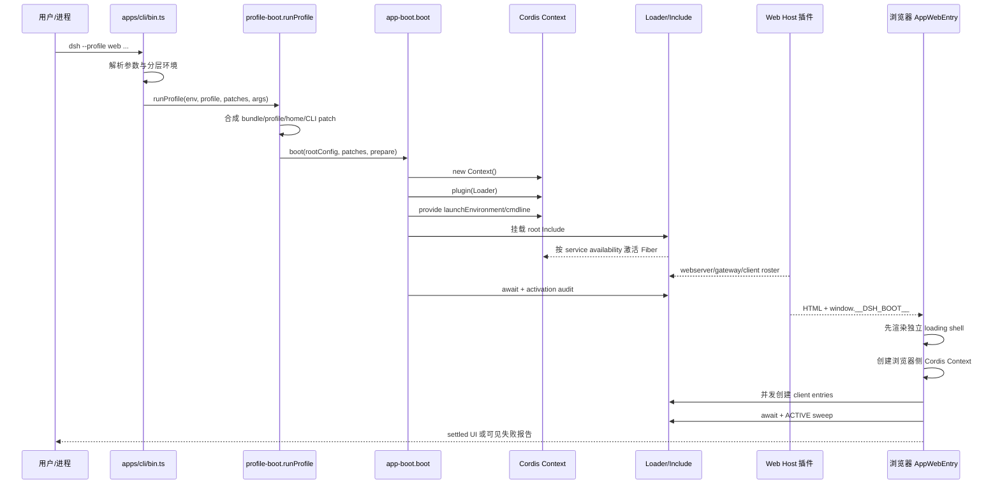
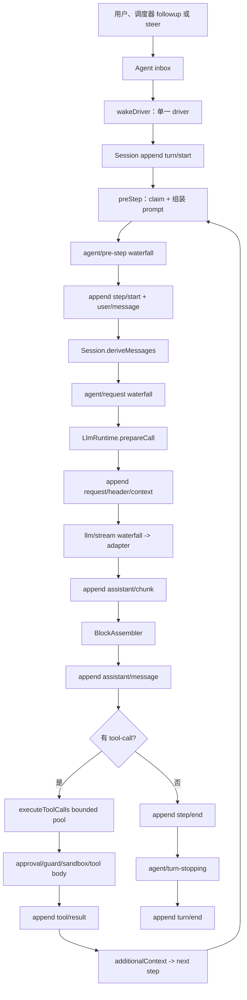

> 本文基于 DeepSeek Harness 官方仓库当前研究快照：`47f943859bef60e4160492346772ded9b24f765a`，根包版本 `0.1.0-rc.5`，研究日期为 2026-08-16。项目仍处于 Developer Preview，官方明确提示会发生破坏性兼容变化；文中描述的是这个提交的架构事实，不是稳定版 API 承诺。

DeepSeek Harness 最容易被误读成“DeepSeek 版 Coding Agent”。但如果只看 `dsh` 命令、Web UI 或几个预置工具，会错过它真正想解决的问题：**如何把一个 Agent 运行时拆成可替换的模型、工具、会话、循环、沙箱、存储、调度器和 UI，并让这些部件仍然能被依赖、作用域、生命周期和持久化规则约束。**

这也是为什么它把自己称为 Harness，而不是一个固定形态的 Agent 产品。它不是只提供一个模型调用 SDK，也不是把一个 coding agent 包装成可配置应用；它提供的是一套“组合关系”和“运行时纪律”。

## 先给结论：它真正提供的是一座动态微内核

从源码和官方架构文档交叉看，DeepSeek Harness 可以用四句话概括：

1. **Vendored Cordis 是动态微内核。** Context、Service、Plugin、Fiber、typed event 和可逆 effect 组成运行时骨架。
2. **Session 追加事件日志是事实源。** 模型上下文、工具结果、UI 展示、重放和部分调度状态，都从可持久化事件派生，而不是依赖一份会不断变形的 conversation 数组。
3. **AgentLoop 是状态机，不是不可替换的黑盒。** Agent loop 自己也是插件，负责把 inbox、turn、step、模型流、工具调用和停止条件串起来。
4. **Bundle、Profile、Agent preset 是组合语言。** Profile 决定整个进程长什么样，Bundle 负责分发配置与代码，Agent preset 决定一个 Agent/Session 看见哪些能力。

所以，“Everything is a Plugin”并不等于“Everything Goes”。恰恰相反，它要求每个可替换部件遵守更强的接入边界：服务要声明依赖，注册要有 disposer，作用域要匹配所有权，模型可见内容必须可由日志重建，能力要通过 Definition、Provider、Consumer 组成完整 seam。

## 一、从 monorepo 看架构：不是一个 core，而是六层图

官方仓库是 pnpm workspace。`pnpm-workspace.yaml` 把 `vendor/*`、`packages/*/*`、`apps/*`、`native`、`website`、`examples` 和 SDK runtime 纳入同一个工程。源码结构大体可以划为六层：

### 1. Vendored 框架层

`vendor/cordis` 提供 Context、Service、Plugin、Fiber、Registry、Events 和 Reflect 等基础设施；Loader、Include、Group、HMR 等包负责把配置树装载成运行中的插件图。

仓库还通过 workspace overrides 固定 vendored 的 `cosmokit`、`schemastery` 等依赖，避免构建时混入另一份不相认的框架单例。这一细节很关键：插件化运行时最怕“接口看起来相同，但容器身份不同”。

### 2. 核心领域与协议层

`packages/core/{agent,agent-loop,session,scope,system-prompt,tools}` 与 `packages/llm/llm` 定义 Agent、事件日志、请求、工具和模型运行时的主要契约。它们尽量不直接绑定 HTTP、磁盘或 UI。

### 3. 能力定义与 Provider 层

能力通常拆成“定义包 + 实现包”：例如 `sandbox/sandbox` 与 `sandbox-local`、`session/session-persistence` 与 JSONL/SQLite 实现、`storage/storage` 与 JSON/SQLite backend。定义层描述能力是什么，Provider 决定能力如何执行。

### 4. 横切扩展层

Compaction、Credentials、Guard、Hooks、MCP、Skill、Subagent、Workflow、Schedule 等，不是把代码硬塞进 AgentLoop，而是通过事件、工具注册、prompt section 或 provider seam 参与运行。

### 5. 产品装配层

`packages/bundle/base`、`web-app`、`headless` 的 `cordis.patch.yml` 是真正的产品装配事实。它们决定哪些插件会被加载，哪些工具属于 Host，哪些能力要在 Agent scope 中挂载。

### 6. 入口与表现层

`apps/cli` 是 `dsh` 可执行程序；浏览器入口在 `apps/web`，Host 侧则由 web server、API gateway、client-modules 等插件组成。Node Host 和浏览器 Client 各自拥有一棵 Cordis 树，通过 manifest、HTTP/API 和连接层通信，并不是把同一个 Context 跨网络共享出去。

这种细粒度拆分带来明显收益：契约、Provider、UI 和产品形态可以独立裁剪，headless 和 web 能共享底座；代价则是 package graph、配置 row、service name 和 host/agent/client plane 的认知成本很高。仓库因此配套了 workspace constraint、runtime closure、package invariant、module graph 等生成和校验门禁。

## 二、启动链：CLI 先合成一棵插件树，再启动 Agent

CLI 真正的入口是 `apps/cli/src/bin.ts`。它先解析参数，再按 mode 动态导入：profile 进入 `runProfile()`，plugin 进入插件管理命令，`dump-config` 输出合成后的配置。动态 import 让帮助、版本和参数错误可以在加载完整产品图之前结束。

`apps/cli/src/profile-boot.ts#runProfile` 的启动顺序大致是：

### 分层环境先于配置树

`loadLayeredEnv('dsh')` 的优先级是 inherited process、调用目录 `.env`、`$DSH_HOME/.env`。项目 `.env` 不能悄悄改变 `PATH`、`NODE_OPTIONS`、代理、证书、`DSH_*`、`GIT_*` 等 bootstrap-only 变量。这不是普通的环境变量便利功能，而是在阻止项目文件改变进程加载和网络信任边界。

### Profile 合成不是深层 merge

`composeProfile()` 按 bundle、profile patch、home patch、命令行 `--patch` 的顺序组合配置，最后还会叠加 telemetry hard-disable。patch 以 row id 定位，并替换完整 config，而不是随意做字段级深合并。`structuredClone` 用来避免 Include 对插入 row 的原地修改污染下一代配置。

`web = base + web-app`，`headless = base + headless`。产品形态的差异先由 Profile/Bundles 决定，具体某个 Agent 能拿到什么能力，再由 Agent preset 进入 Agent scope。

### 启动失败必须可诊断

`app-boot#boot` 创建 root Context，挂载 Loader 与 Include，等待服务依赖满足，最后执行 activation audit。源码会检查 enabled 但没有 Fiber、FAILED、仍 PENDING 的条目，并在失败时先 dispose 已经启动的 Context，再保留最深层 cause。

Cordis 的缺依赖本身可以永久 PENDING，因此 Harness 不能只“等一下就算启动完成”。boot 和浏览器 boot 都有额外的 sweep，把遗漏的依赖、导入失败和未激活条目变成可读错误。

## 三、Cordis：依赖拓扑就是生命周期状态机

`vendor/cordis/src/context.ts#Context` 不是一个普通对象，而是被 Reflect service 包装的 Proxy。Context 同时承担四个角色：

- 通过稳定 key 提供服务的 repository；
- 通过原型链处理子 Context、isolation 与 intercept 的作用域系统；
- 承载事件和插件注册的运行时入口；
- 拥有 Fiber 与 effect/disposer 的生命周期边界。

`Service` 构造时通过 `ctx.reflect.provide(name, this, check)` 注册服务，服务归当前 Fiber 所有，Fiber 卸载时自动撤销。插件入口可以是函数、class 或 `{ apply(ctx) }` 对象；`ctx.plugin()` 创建 Fiber，返回可等待其生命周期稳定的 thenable wrapper。

Fiber 状态包括 `PENDING`、`LOADING`、`ACTIVE`、`FAILED`、`UNLOADING`、`DISPOSED`。它根据依赖对应的 provider Fiber 和 epoch 判断是否激活：依赖齐全就 reload，provider 消失或变化就 unload，若新的 epoch 再次满足则重新加载。插件返回的 function、Promise、iterable、async iterable 都可以被解释为 effect/disposer，并按逆注册顺序清理。

这意味着 Harness 的动态依赖注入不是简单的“启动时帮你 new 对象”，而是：

> **服务出现，消费者激活；服务撤销，消费者先清理再等待；配置变化，相关子图可以重载。**

事件系统也不是一个无语义的 EventEmitter。官方和源码提供 `emit`、`parallel`、`serial`、`bail`、`waterfall` 等契约：

- `emit`：广播，不等待返回值；
- `parallel`：并行等待全部 listener，用 AggregateError 汇总；
- `serial`：按注册顺序等待；
- `bail`：同步短路；
- `waterfall`：around middleware，listener 必须调用 `next()` 才继续。

这让策略、审批、请求改写和工具管线可以插入既有行为，但也让插件拥有改变控制流的能力。`waterfall`、配置表达式和动态 loader 都必须纳入高信任供应链审查。

## 四、AgentLoop：用一个 Driver 管住 turn、step 和取消

`packages/core/agent-loop/src/index.ts#AgentLoop` 是 factory，注入 agents、sessions、llm、tools、systemPrompt 等服务。它维护 factory teardown AbortController，并等待创建中的任务和 live agent disposer 完成，避免 AgentLoop 被卸载后留下半发布对象。

每个运行实例是 `ReactLoopAgent`。它只有 `idle`、`maintenance`、`running` 三类 phase；running 里携带当前 turn、step、AbortController 和 wake latch。输入先进入 Agent inbox：

- `followup`：启动一个新 turn；
- `steer`：插入下一 step 并唤醒；
- `inject`：插入上下文，但不主动唤醒。

同一 Agent 只允许一个 `wakeDriver()`。维护任务或正在 abort 的活动期间收到的 wake 会被锁存，等回到 idle 后再重放。这不是全局数据库锁，而是围绕 Agent owner 建立的单一执行权。

一次 turn 的关键路径是：

`turn()` 会先追加 `turn/start`，然后 claim inbox、执行 `preStep()`、追加 `step/start` 和 `user/message`，进入模型请求；无论成功、失败还是取消，最终都追加 `step/end`，并在 finally 中追加 `turn/end`。如果工具结果带有 additional context 或用户 steer，继续同一个 turn 的下一个 step；否则由 `agent/turn-stopping` 决定是否结束。

错误也被分层处理：结构化的 `LlmError.failure` 保留 reason，普通异常压平为 UNKNOWN；`throwError()` 先发 `agent/error` 再抛出，最外层 `kick()` 吞掉已报告失败，避免单个 Agent 变成进程级 unhandled rejection。取消通过 AbortController 传播，并按选项决定是否清空 inbox。

## 五、Session 不是消息数组，而是事件溯源脊柱

`packages/core/session/src/index.ts#Session` 是 append-only typed event log。LLM message history 从它派生；原始流 chunk、turn/step 边界、tool call/result、request header/context、todo 快照、seed 边界等都可以成为日志事实。

它有三个重要不变量：

1. 事件必须是 lossless JSON，并保持连续 sequence；
2. 事件先计划 surface 转换，再提交 canonical log；
3. observer 异常可以被 containment，但已经接受的日志不能回滚。

模型请求开始前，Harness 把实际的 adapter、route、prompt、tool schema、默认 maxTokens/reasoning、retry policy 等固化到 request header/context。模型流的 chunk 先落为 `assistant/chunk`，完成后生成完整 `assistant/message`，并用 `sourceEventSeqs` 指向来源 chunk。

这对应一个很重要的工程折中：**动态组合发生在请求之前，实际生效的 envelope 则被记录下来。** 如果插件后来卸载、Provider 更新或默认配置改变，旧请求仍可从日志解释；系统不要求未来一定能恢复当时的全部代码，只要求过去送入模型的事实有证据。

官方文档还明确采用偏严格的兼容哲学：未知 required event 不允许静默跳过；旧 v0 request-header delta 日志在 seed、append、load 边界会被拒绝；Storage 的版本不符也暂不自动 migration。这使回放更可靠，却意味着升级必须做数据备份和 fixture 回放。

## 六、能力不是功能清单，而是一组 Seam

“插件化”如果只是把功能注册进一个列表，没有多大架构价值。DeepSeek Harness 更值得关注的地方，是把可替换能力拆成 Definition、Provider、Consumer 三个角色：定义契约、提供实现、消费能力。一个 provider 单独存在，不代表它已经成为完整 seam。

### Skill：渐进披露，而不是把所有指令塞进 prompt

Skill registry 合并 Host 和 per-scope provider catalog。模型默认只看名称与描述，需要正文时再通过 `skill` 工具按需加载。这样可以把 discovery 与 instruction activation 分开，避免大量 skill 正文常驻上下文。

Skill 还区分 `modelInvocable` 与 `userInvocable`；能出现在 catalog，不等于模型自动拥有调用权限。同名 skill 由更近 scope 整体遮蔽全局项，同层再按 rank、provider order 和 local order 决定。

### Subagent：可选能力，不是 loop 内置递归

`ctx.subagents` 支持多个命名 Provider，包括 in-process spawn、fork、ACP、Codex、Claude Code 和 dsh SDK 等。这里的关键不是“兼容了哪些 Agent 产品”，而是这些产品在 Harness 内属于 subagent backend，而不是整个 plugin tree 的同构替代品。

启动前，Provider descriptor 会检查 output schema、depth limit、tool filter、persona 等能力；如果后端不支持，就应 typed error 失败，不能接受后静默忽略。工具过滤不只是隐藏 schema，还会拒绝执行。取消统一传播 AbortSignal。

可继续运行的 child 被拆成两部分：一个 durable child Session，加上最多一个 process-local Activation。Activation 消失后仍可 cold resume；后续消息沿唯一 Agent inbox FIFO 进入，不再额外造一套任务状态机。父子关系来自 durable direct-parent lineage，而不是消息里自报 sender id。

### Workflow：把脚本编排放进 worker，但复用 Subagent 生命周期

Workflow 是可选 seam，允许 Agent 运行模型生成的 orchestration script。当前 provider 使用 Node worker thread，每次运行一个 worker，在 VM context 中执行脚本；脚本里的 `agent()` 仍然走 subagent seam，child 继续受 cwd、lineage、depth 和工具过滤约束。

取消有 bounded grace；run handle 的 `result` 不通过 reject 表达失败，而是以 closed stop reason 结束，holder 必须 dispose。观察事件只发送复制后的数据快照，不暴露 live run 的 cancel/dispose。更重要的是，Workflow 不建立第二个 Agent 状态机：执行权仍在 child Agent，展示事实投影回 parent Session。

### Storage 与 Session Persistence：两套持久化职责

Storage 管理不属于 Session event log 的设置、索引和业务 KV；它是 backend registry，不直接承担所有 IO。多个 JSON/SQLite backend 可以并存，由 domain consumer route。Domain spec 用名称、版本和 schema 定义布局，写操作在 per-domain chain 排队，backend durability 确认后才更新内存。

SessionPersistence 则专门服务 append-only 会话日志，负责 durable append、load、inspect、prepare、readFrom、list 和 revision。把两者分开，可以避免把对话历史、设置、索引和业务数据硬塞入同一个“万能数据库”。代价是运维者必须清楚每份数据的 authoritative owner。

### Scheduler：有持久规则，不等于后台通知系统

Schedule 把 durable reminder 写入原 live Session，并在 Agent idle 后送成普通 followup turn。它支持 after、带时区的 absolute at 和至少五分钟的 fixed-rate every；不支持 cron、calendar recurrence 和跨记录 admission gate。

冷 Session 不执行；重开后重建 timer，过期项折成 overdue。崩溃可能在 inbox admission 与 dispatch durable append 的窄窗口产生重复，因此官方把语义定义为 best-effort at-least-once，而不是 exactly-once。它是“可恢复的会话提醒”，不是拥有外部通知 SLA 的常驻任务系统。

## 七、Preset 的三层含义：Profile、Bundle、Permission 不要混为一谈

这是使用 Harness 时最容易混淆的词汇层：

- **Profile**：整个 Harness home 的命名启动组合，决定 web/headless、插件树和环境。
- **Bundle**：Cordis 配置 rows 与挂载代码的分发单位，决定一组能力如何被装配。
- **Agent preset**：某个 Agent/Session 的 standing composition，决定它获得哪些 scoped capability。
- **Permission preset**：将 sandbox mode 与 approval policy 打包成 selector，不是单独的安全执行器。

当前默认 permission preset 主要是 `workspace-write + ask` 与 `danger-full-access + never`。前者把文件写入限制在 workspace，并在策略要求时询问；后者绕过文件 confinement 且不询问。Preset 层自己不执行安全策略，真正执行仍来自 sandbox、approval、filesystem 和 shell provider。

Agent preset 的实现也不是每个 session 复制一套插件。`mountPreset` 建立 standing mount，Agent 通过 scope parent 加入；真正 per-agent 的 plan、compaction、workflow 使用 isolate，而 tools、jobs、goals、subagent registry 等共享服务留在 Host。错误的 realm 归属可能不会在第一个 session 暴露，却会在多 session 或 Provider collision 时出问题。

## 八、安全：五个边界必须分开看

DeepSeek Harness 的安全模型不是一个“安全模式”开关，而是多层边界的叠加：

1. **工具可见性**：模型能不能看到工具 schema；
2. **Approval**：是否需要人确认；
3. **Filesystem Sandbox**：文件效果能否越出 workspace；
4. **Execution World**：subprocess、shell、文件 provider 实际在哪个执行环境运行；
5. **Network**：web fetch 是否能访问哪些网络目标。

把它们混为一谈会产生危险结论：隐藏工具不等于没有权限，approval 不等于隔离，filesystem sandbox 不等于 network sandbox，loopback Web UI 也不等于身份认证。

Sandbox mode 主要治理 filesystem effects：`read-only`、`workspace-write`、`danger-full-access`。网络与进程可见性在它的词汇边界之外。Linux 可使用 bwrap/Landlock，macOS 使用 Seatbelt，Windows 使用 ACL restricted token；backend 还要报告 `full` 或 `partial` enforcement。没有可用 backend 时，confined policy 必须 fail closed，不能静默裸跑。

Web server 默认监听 `127.0.0.1`，但官方明确提示：没有 TLS、认证和 origin policy。若选择 `0.0.0.0`，它只代表服务绑定到网络，并不自动获得多用户安全能力。更危险的是 `web_fetch` 不阻断私网目标；它可能成为 SSRF 或内网探测入口，而 process sandbox 的文件策略覆盖不了这个问题。

因此，Developer Preview 的正确部署姿态是本地开发、受控试验或内部单用户 preview。若要暴露给网络，至少应增加 TLS、鉴权、CSRF/origin 策略、网络 ACL，审查每个 provider，并验证 sandbox 的实际 enforcement 等级。

## 九、并发、取消与错误：小边界组成可靠性

工具执行不是简单的 `Promise.all`。`executeToolCalls()` 使用有上限的 rolling pool：exclusive call 充当 barrier，parallel call 才进入 `maxParallelToolCalls` 限制的并发池；prepare、policy 和结果 commit 保持模型顺序，只有 dispatch/body 重叠。

取消后不再补充新任务，但已启动的 body 要 drain 到静止，未启动的 call 要写合成错误，保证回放里的 call/result 配对。这样做会产生 head-of-line blocking：排在前面的慢调用可能阻塞后面的结果提交，但换来更稳定的事件顺序。

系统把失败分成不同身份：

- 插件启动失败：整树 dispose，保留 cause；
- 普通工具失败：物化成 `isError` result，让模型尝试恢复；
- 持久化腐坏、schema/invariant 错误：fail loud；
- observer 异常：通常 containment 并继续；
- scheduler fault：不伪造成功结果，等待 in-flight 后报告故障。

这种分类比“所有错误都回模型”更可靠。否则基础设施损坏会被伪装成一个普通工具失败，用户得到的是一段看似合理但无法修复的 Agent 对话。

## 十、Web UI：浏览器里又启动一棵 Cordis 树

Web Host 通过 `client-modules` 扫描带 client face 的插件图，向 HTML 注入 `window.__DSH_BOOT__`，并提供 `/plugins/<id>/client.js` 等模块资源。浏览器入口 `AppWebEntry` 不直接 import 全部业务 UI，而是：

1. 解析 wire manifest；
2. 注册 shell 自有的 ClientModuleSystem；
3. 先渲染不依赖业务插件的 loading shell；
4. 预取 immediate tier；
5. 在浏览器中创建新的 Context 并挂载 Loader；
6. 并发创建 modules、插件 row 和 app-shell；
7. 对所有条目做 ACTIVE sweep 后，才切换到真实 UI。

因此，Web UI 不是 Host Context 的“远程 DOM”，而是一套对等的 client-side plugin runtime。Host 的 API gateway、session projection、storage、workspace 和 plugin inventory 通过协议把状态投影给浏览器；浏览器自己的 theme、locale、sidebar、conversation、tool renderer、settings、workflow、jobs、goal、permission、preset 等又在 Client plane 装配。

这种双树模型能让 UI 插件也拥有服务、依赖和 teardown，但代价是出现两套 boot、两套 loader 和两套错误诊断路径。开发者不能把 Node Host 上的 service 直接当成浏览器可见对象。

## 十一、它与 Claude Code、Codex、OpenClaw 的差异在哪里

这里不做功能排名，只谈架构重心。

| 观察维度 | DeepSeek Harness | Claude Code / Codex | OpenClaw |
|---|---|---|---|
| 首要抽象 | Cordis plugin tree、capability seam、event-sourced session | 面向编码任务的 Agent 产品与 CLI/客户端体验 | 以网关、渠道、工具/技能和多 Agent 会话为中心的个人/消息平台运行时 |
| Agent loop | 默认 loop 也是可替换插件 | 对外以产品既定 loop 行为呈现 | 运行时调度与会话/渠道集成是主干 |
| 组合单位 | Profile → Bundle → Cordis rows；Agent preset → scoped capability | 以产品配置、工具和任务执行为主 | 工具、skills、渠道插件、子 Agent 与持久任务围绕网关组合 |
| 状态模型 | append-only typed SessionEvent 是模型上下文事实源 | 本文不对其内部实现做推断 | 会话、记忆、渠道状态与工具结果由长驻运行时治理 |
| UI 形态 | Web 是 bundle/plugin，headless 不启动 server | 典型入口偏 CLI、IDE 或产品客户端 | 聊天渠道与控制面是重要入口 |

最重要的边界是：Harness 文档把 Codex、Claude Code backend 放在 **subagent provider** 层，而不是宣称自己与它们共享完整插件协议、权限模型或生命周期。相似的名词——skill、session、subagent、sandbox——也不意味着语义相同。

## 十二、五个反直觉结论

### 1. “Everything is a Plugin”反而要求更强的核心纪律

没有特权核心，不代表没有规则。事件域、Service seam、Scope、disposer 和日志重建不变量，比传统硬编码 composition root 更严格。插件自由度越大，生命周期和数据契约越不能靠约定俗成。

### 2. Session 不是聊天记录，而是运行时的事实脊柱

用户消息只是 surface 的一部分。原始流 chunk、请求 envelope、tool call/result、turn 边界和插件事件共同组成可解释的运行轨迹。UI、重放、fork 和审计都应从这里投影。

### 3. Sandbox 不是安全容器的同义词

它主要约束文件效果，不覆盖网络和完整进程隔离；某些平台只能报告 partial enforcement。要获得更强边界，需要把远程执行、容器或 microVM 当作完整 capability seam，而不是给现有布尔开关再加一个名字。

### 4. Scheduler 持久化了提醒，却不保证离线送达

规则可以跨重启保留，计时器却只在 live Session 中工作；它还是 at-least-once。durable 描述的是状态保存，不等于外部通知 SLA。

### 5. Workflow 有脚本，却没有复制出第二套 Agent 状态机

脚本在 worker 中运行，child 仍经过 subagent seam，执行事实回到 parent Session，取消和生命周期继续由宿主管理。它把动态编排限制在一个小边界里，而不是把整个运行时交给脚本。

## 十三、采用 Developer Preview 前要过的闸门

官方对破坏性变化的警告应被当作架构事实，而不是 README 角落里的免责声明。至少要做以下准备：

- 固定 commit、lockfile 和 profile dump，不用浮动 latest；
- 升级前备份 Session 与 Storage，做 session/storage fixture 回放；
- 用 `--dump-config` 审核最终插件树和 patch 结果；
- 验证每个 sandbox backend 的 full/partial enforcement；
- 检查 Web bind、TLS、认证、origin 和网络 ACL；
- 禁用不需要的 Provider、tool、web_fetch 和 danger-full-access；
- 为插件注册/卸载、Provider HMR、取消、崩溃恢复和多 session 建回归测试；
- 每次升级人工审查事件目录、配置 diff 与 persistence compatibility。

如果把 DeepSeek Harness 当作稳定的“开箱即用编码助手”，这些边界会显得像缺点；如果把它当作一场关于 Agent 运行时如何被拆分、组合和审计的架构实验，它的取舍就清晰得多。

## 结语：它的价值在于把替换性和可恢复性放进同一张图

DeepSeek Harness 最有辨识度的地方，不是插件数量，也不是 Web UI 的完成度，而是把**替换性、作用域、生命周期和可重建性**放进同一个 Cordis 组合模型。

模型和工具可以替换并不新鲜；真正值得观察的是，它进一步把 AgentLoop、Session、UI、Storage 和 Scheduler 也降为可组合部件，并要求它们通过 service、event、effect 和 durable log 协作。这样做的收益是：可以按 Profile 裁剪产品形态，按 Agent preset 选择能力，按 Provider 替换执行后端，按 Session 日志解释一次请求到底发生了什么。

代价同样明确：插件图变复杂，Scope 与 Host/Agent/Client plane 更容易放错，preview 还没有稳定 migration 和安全默认值。正确评价它的方式，不是数一数有多少功能，而是追踪三条线：

> **谁提供并注入服务？谁拥有 Fiber/Scope 的生命周期？哪一条 Session 事件把结果变成可恢复事实？**

这三条线，基本就是读懂 DeepSeek Harness 的最短路径。

## 官方资料

- [DeepSeek Harness 官方仓库](https://github.com/deepseek-ai/deepseek-harness)
- [DeepSeek Harness 官方介绍](https://deepseek.com/harness/en/)
- [架构文档](https://github.com/deepseek-ai/deepseek-harness/blob/47f943859bef60e4160492346772ded9b24f765a/docs/architecture.md)
- [Cordis Primer](https://github.com/deepseek-ai/deepseek-harness/blob/47f943859bef60e4160492346772ded9b24f765a/docs/cordis-primer.md)
- [Session 子系统](https://github.com/deepseek-ai/deepseek-harness/blob/47f943859bef60e4160492346772ded9b24f765a/docs/subsystems/session.md)
- [Subagent 子系统](https://github.com/deepseek-ai/deepseek-harness/blob/47f943859bef60e4160492346772ded9b24f765a/docs/subsystems/subagent.md)
- [Sandbox 子系统](https://github.com/deepseek-ai/deepseek-harness/blob/47f943859bef60e4160492346772ded9b24f765a/docs/subsystems/sandbox.md)
- [Web Server 子系统](https://github.com/deepseek-ai/deepseek-harness/blob/47f943859bef60e4160492346772ded9b24f765a/docs/subsystems/web-server.md)
