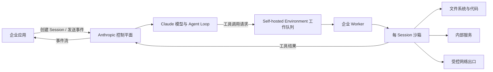

# Claude Managed Agents：把 Agent 编排交给平台，把执行边界留在自己手里

企业把 AI Agent 从演示推进到生产时，真正困难的往往不是“让模型调用一个工具”，而是管理一整条长期运行链路：会话如何恢复，工具在哪里执行，文件如何隔离，网络能访问什么，密钥怎样下发，任务失败后如何重试，多个 Worker 如何扩缩容，以及每一步如何审计。

Anthropic 的 [Claude Managed Agents](https://platform.claude.com/docs/en/managed-agents/overview) 试图把这套链路产品化。它不是单纯提供一次模型调用，而是提供一个预构建、可配置的 Agent Harness：平台保存 Agent 配置和会话事件，运行模型循环，处理上下文压缩与提示缓存，并把工具调用编排成可以持续数分钟或数小时的异步任务。

[Self-hosted sandboxes](https://platform.claude.com/docs/en/managed-agents/self-hosted-sandboxes) 则给这套托管系统增加了一条重要边界：**编排继续由 Anthropic 托管，工具和代码改在企业自己的基础设施里执行。**

这听起来像“Agent 私有化”，但并不准确。更准确的理解是：Managed Agents 把 Agent Runtime 拆成控制平面和执行平面，自托管沙箱只把后者迁回企业环境。模型推理、会话编排、事件历史，以及工具输入和输出，仍要经过 Anthropic 的控制平面。

这一区分决定了它能解决什么，也决定了它不能替企业解决什么。

> **本文核验日期：2026 年 8 月 31 日。** Managed Agents 当前仍处于 Beta，接口、Beta Header、模型支持、限制和合规资格都可能变化，生产采用前应重新核对官方文档。

## Managed Agents 管的不是模型，而是 Agent 生命周期

在 Messages API 中，开发者拿到的是模型调用能力，Agent Loop、工具执行、状态保存和重试通常需要自己实现。Managed Agents 则把运行时抽象成四个核心对象：

| 对象 | 作用 | 关键边界 |
|---|---|---|
| **Agent** | 可复用、可版本化的配置 | 定义模型、系统提示、工具、MCP Server、Skills 和多 Agent 委派关系 |
| **Environment** | 执行环境模板 | 决定使用 Anthropic 云沙箱，还是企业自托管沙箱 |
| **Session** | 一次有状态的 Agent 实例 | 绑定 Agent 与 Environment，保存多轮历史、状态和输出 |
| **Events** | 应用与 Agent 的通信协议 | 用户消息、工具调用、结果、状态、用量和观测事件都进入同一事件流 |

Agent 是长期配置，Session 是一次运行实例。创建 Session 时可以直接引用 Agent 最新版本，也可以锁定具体版本，便于灰度和回滚。应用通过 `user.message` 启动或继续任务，通过 SSE 接收 `agent.message`、`agent.tool_use`、`session.status_*` 和 `span.*` 等事件，也可以发送 `user.interrupt` 中途纠偏。

这一设计的价值，不只是“少写几行循环”。它把长任务需要的状态机固化进平台：Session 可以在运行、空闲、重调度和终止之间转换；事件历史持久保存；瞬时错误可以触发重试；应用可以在模型推理和工具执行之间随时观察、批准或中断。

内置工具集包含 Bash、文件读写编辑、Glob、Grep、Web Search 和 Web Fetch。超过 100,000 字符的工具输出会被写进沙箱文件，模型只先看到截断预览和文件路径，再按需读取全文。Skills 以文件形式向 Agent 提供领域能力，Memory Store 则为跨 Session 状态提供持久载体。MCP 和 Custom Tools 用来接入外部系统。

换句话说，Managed Agents 的产品单位不是“一个 Prompt”，而是**一个可版本化 Agent 在受控环境里持续完成任务的全过程**。

## 自托管沙箱真正改变了哪一层

默认情况下，Managed Agents 的工具在 Anthropic 管理的云沙箱中运行。自托管模式不改变 Claude 模型所在的位置，也不把整个控制平面搬进企业 VPC；它改变的是工具执行的位置。

官方给出的边界可以浓缩成两层：



在企业侧，本地保存和运行的是：

- Agent 能读写的工作目录；
- Bash 与文件工具启动的进程；
- Custom Tool 或本地封装 MCP Tool 的实现；
- 沙箱能访问的内部服务与网络出口；
- 企业自行收集的 Worker、容器和网络日志。

但以下内容仍在 Anthropic 一侧：

- Claude 模型推理与 Agent Loop；
- Agent、Session 和事件历史等控制面资源；
- 工具调用的输入与输出——模型必须看到结果才能决定下一步；
- Skills 的存储；
- Memory Store 及其版本历史。自托管 Worker 只在 Session 期间下载本地副本，再把修改同步回去。

因此，“代码、文件和网络出站不离开企业环境”并不等于“业务数据完全不离开企业环境”。如果工具输出包含客户记录、源代码片段、数据库查询结果或内部文档，它们仍会回传给控制平面供 Claude 推理。

这也是评估自托管模式时最重要的第一问：**你的约束是要求执行发生在内网，还是要求任何业务内容都不能进入外部模型控制平面？** 前者可能适合 Managed Agents 自托管沙箱；后者通常不适合。

## Worker 是连接两层的执行代理

自托管 Environment 在 Anthropic 一侧表现为一个工作队列。应用把 Session 绑定到该 Environment 后，控制平面创建 Work Item；企业运行的 Environment Worker 通过出站 HTTPS 轮询队列、领取任务、执行工具并回传结果。

一个完整回合大致经过以下步骤：

1. 企业先创建可复用的 Agent 与 `self_hosted` Environment，并在 Console 生成 Environment Key。
2. 应用用组织 API Key 创建 Session，并发送 `user.message`；也可以在创建时通过 `initial_events` 一次完成。
3. Anthropic 运行 Claude 和 Agent Loop。当模型需要 Bash、文件或本地 Custom Tool 时，控制平面把 Session 放进该 Environment 的工作队列。
4. Worker 用 `ANTHROPIC_ENVIRONMENT_KEY` 轮询并 Claim Work Item，拿到 Session ID、Work ID，以及在需要 Memory Store 时使用的 per-session `secret`。
5. Worker 下载 Agent 的 Skills。SDK Worker 还会把 Memory Store 下载到 `/mnt/memory/<store>/`，把 Session 需要的本地执行上下文准备好。
6. Worker 在工作目录——系统默认 `/workspace`——执行工具。工具结果以事件回传控制平面，Claude 继续判断下一步；这个循环会重复多次。
7. Session 进入 Idle 或终止后，Worker 完成最后一次 Memory 同步、释放 Work Item，并清理本地 Memory 副本。
8. 应用持续从事件流读取最终消息、工具轨迹、状态、用量和 Span。

最简单的部署是一个常驻进程直接执行：

```bash
export ANTHROPIC_ENVIRONMENT_ID="env_..."
export ANTHROPIC_ENVIRONMENT_KEY="***"

ant beta:worker poll --workdir /workspace
```

CLI 的 `poll` 模式只需要企业网络能够主动访问 Anthropic API，不要求开放入站端口。若不希望维持空闲 Poller，也可以订阅 `session.status_run_started` Webhook，由处理函数短暂启动 SDK Worker。Webhook 方案节省空闲资源，但增加了公网 Endpoint、签名校验、冷启动和重复投递处理。

## 两组选择决定隔离强度

自托管并不自动等于沙箱化。官方 Worker 可以直接在宿主进程里执行工具，也可以把每个 Session 转交给独立容器或 MicroVM。这里有两组彼此独立的选择。

### 常驻轮询，还是 Webhook 唤醒

**Always-on Worker** 最简单，延迟稳定，故障面较少，适合持续有任务或 PoC。代价是 Worker 长驻，空闲时也消耗资源。

**Webhook-triggered Worker** 只在新 Session 开始时唤醒，适合 Serverless 或低频任务。代价是必须保证 Webhook 验签、幂等、并发拉起和失败重试正确，部署链路也更长。`ant` CLI 只支持常驻模式；Webhook 方式需要 Python、TypeScript 或 Go SDK。

### 同进程执行，还是每 Session 一个沙箱

**In-process** 模式把工具直接跑在 Worker 主机和指定 Workdir 上。它能最快验证链路，但 Workdir 限制只约束文件工具，不约束 Bash；一旦 Agent 能运行 Shell，实际权限就是 Worker 进程拥有的权限。把这种模式称为“沙箱”会高估它的隔离能力。

**Sandbox-per-session** 模式让 Poller 只负责领取任务，然后为每个 Session 启动独立容器、MicroVM 或其他隔离实例。它可以提供新的文件系统、CPU/内存/PID 限额、独立网络策略和生命周期清理，也是生产部署更合理的默认形态。

官方文档已经列出 AWS Lambda MicroVM、Cloudflare Sandbox、Daytona、E2B、Fly.io、GKE Agent Sandbox、Modal、Namespace、Superserve、Vercel 等集成路径。它们解决的是不同形态的隔离与调度，不改变 Managed Agents 的控制面边界。

如果 Agent 会处理不可信输入、执行生成代码、安装依赖或访问多个租户的数据，建议至少采用：

- 一 Session 一沙箱；
- 非 Root 用户；
- 只读根文件系统和最小 Linux Capabilities；
- CPU、内存、磁盘、PID、执行时长配额；
- 独立临时工作目录；
- 默认拒绝网络出站，再按任务 Allowlist；
- 不把 Docker Socket、宿主密钥目录或共享 Home 挂进容器。

## Memory 让状态跨会话，也引入同步语义

Managed Agents 的 Memory Store 是 Anthropic 托管、Workspace 级的文本文件集合。每个 Memory 有路径，每次修改都会形成不可变版本，可用于审计和回滚。单个 Memory 上限为 100 kB，一个 Store 最多 10,000 个 Memory；一个 Session 最多挂载 8 个 Store。

云沙箱中，它表现为 `/mnt/memory/` 下的挂载目录。自托管环境中则不是实时挂载，而是 SDK Worker 管理的本地副本：

- 开始时用 Work Item 携带的 per-session `secret` 下载；
- 默认每 15 秒至多同步一次；
- Session 结束时再做最终同步，并最多等待 30 秒冲刷上传；
- 远端 Store 是事实源，冲突时远端版本覆盖本地版本；
- Worker 被直接 Kill、没有执行 Teardown 时，本地目录可能残留，未同步修改也会丢失。

这意味着 Memory 是“最终一致的文件同步”，不是数据库事务，也不是多 Session 强一致共享状态。同一个 Store 若被多个自托管 Session 同时使用，最好给每个 Session 独立文件系统；在同一宿主路径并发挂载会发生冲突。

还有两个容易踩坑的边界：

第一，`ant` CLI Worker **不会挂载和同步 Memory Store**，即使 Session 声明了 Memory，任务仍可能运行，只是 Agent 在路径上看不到内容。需要 Memory 时必须使用 Python、TypeScript 或 Go SDK 的 `EnvironmentWorker`。

第二，`read_only` 只阻止 Worker 的 `write` 与 `edit` 工具上传修改，不保证本地视图不可变。Bash 或其他同权限进程仍能改本地副本，只是不会同步回 Store。如果连 Session 内临时篡改都不能接受，就要禁用 Bash，并确保 Custom Tool 也无法写该目录。

Memory 还带来一类持久化 Prompt Injection 风险：不可信网页或工具结果若诱导 Agent 写入 Memory，后续 Session 可能把恶意内容当作长期上下文继续读取。共享规范、知识库和参考材料应优先使用 `read_only`；读写 Memory 应按用户、项目或信任域拆分，并建立人工审阅与回滚机制。

## MCP Tunnel 与自托管沙箱解决不同问题

自托管沙箱和 MCP Tunnel 经常被混为一谈，但它们控制的是两条不同路径。

- **自托管沙箱**决定 Bash、文件和本地工具代码在哪里运行。
- **MCP Tunnel**决定 Anthropic 如何访问企业内网里的 MCP Server。

因此，云沙箱也可以通过 Tunnel 访问私有 MCP；自托管 Session 也可以访问公共或经 Tunnel 暴露的 MCP。只有同时要求“代码执行留在企业边界内”和“MCP 服务不暴露公网”时，才需要组合两者。

还有第三种做法：在自托管 Worker 内把本地 MCP Server 包装成 Custom Tools。这样工具实现和访问路径都留在沙箱里，不需要 Tunnel，但会失去 MCP Connector 的部分动态能力。工具列表在 Worker 启动时发现并转成静态声明，运行中的 Session 不能自动增加工具；Custom Tool 也不受 Managed Agents 的 Permission Policy 约束，审批必须由工具实现自行完成。

截至核验日，MCP Tunnel 仍是 Research Preview，底层使用 Cloudflare 的出站连接作为传输，官方不提供可用性、支持或持续性承诺。它适合受控试验，不应被默认视为已有生产 SLA 的企业连接层。

## 密钥分层比“一个 API Key”更重要

Managed Agents 自托管模式至少涉及三类凭证，不能混用：

1. **组织 API Key**：应用创建 Agent、Environment、Session，并读取运维统计。它不应该出现在 Worker 主机上，否则 Agent 工具可能接触到组织级凭证。
2. **Environment Key**：Worker 用它轮询某一个 Environment 的队列并提交结果。它应放进 Secret Manager，按信任边界拆分 Environment，并支持快速轮换。
3. **Per-session secret**：每个 Work Item 临时携带，用于访问该 Session 的 Memory Store。只应传给处理这一个 Session 的沙箱，不写入镜像、共享卷或日志。

如果 Agent 通过 MCP Connector 访问 GitHub、工单系统或其他 SaaS，Agent 定义只保存 Server URL，Session 通过 Vault ID 提供认证。把工具定义和每次 Session 的凭证分离，是比把 Token 写进 System Prompt 或镜像更安全的设计。

不过，Secret 分层并不会自动消除泄露。环境变量仍可能被 Bash、调试信息、进程列表、Core Dump 或错误日志读出。生产实现应配合短期凭证、文件描述符或 Workload Identity、日志脱敏、禁止 Debug Dump，以及按 Session 销毁执行环境。

## Shared Responsibility 才是安全模型本身

[官方安全模型](https://platform.claude.com/docs/en/managed-agents/self-hosted-sandboxes-security) 明确把自托管责任划给企业：Anthropic 负责 Session 与工作队列完整性、多租户隔离和控制面上下文最小化；企业负责镜像质量、运行时加固、网络策略、服务密钥、工具权限、日志留存、Memory 本地副本和会话间隔离。

最容易被忽略的是默认值。内置 Agent Toolset 默认 `always_allow`，MCP Toolset 默认 `always_ask`。如果直接启用完整 Toolset，Bash、文件修改和网络工具可能无需确认即可执行。生产 Agent 应从“默认关闭所有工具”开始，只开启任务真正需要的能力，并对 Bash、写文件、外部写操作单独配置确认。

一个可执行的最小安全基线应包括：

| 层 | 最小基线 |
|---|---|
| Agent | 锁定 Agent 版本；工具默认关闭；高风险工具 `always_ask`；Skills 来源可追溯 |
| Session | 按租户和信任域隔离；限制预算、时长与并发；不可信输入不得写共享 Memory |
| Sandbox | 一 Session 一实例；非 Root；只读根；无宿主 Socket；资源和路径最小授权 |
| Network | 默认拒绝出站；只允许必要 API；阻断云 Metadata、内网横向地址和任意代理 |
| Secrets | 组织 Key 不上 Worker；Environment Key 放 Secret Manager；per-session secret 不落盘、不记录 |
| Memory | 参考资料只读；读写 Store 分域；监控版本变化；优雅停机至少预留 30 秒 |
| Supply chain | 镜像签名与 SBOM；依赖锁版本；Skills、脚本和 Tool Server 进入代码审查 |
| Observability | 记录 Session/Work ID、工具名、耗时和结果状态；敏感参数与输出脱敏；队列和 Worker 告警 |

需要特别强调：Anthropic 不检查企业镜像，也无法验证 Worker 是否遭到供应链污染；控制平面不会在沙箱内部再替企业隔离不同工具；Session 内容进入 Worker 之后，企业自己的留存和删除政策由企业负责。

自托管只是把责任边界移动了，不是把责任删除了。

## 可观测性从 Event Stream 延伸到队列

Managed Agents 的事件流不仅返回回答，还提供 Session 状态、工具调用、用量和 Span。`span.model_request_start/end` 可用于推理时延与 Token 观测，`session.status_rescheduled` 表示瞬时错误后的自动重试，`session.error` 携带错误类型和 Retry Status。

企业 Worker 侧还需要监控 Work Queue。`work.stats` 暴露四个关键指标：

- `depth`：尚未被领取的任务数，可用于扩容和积压告警；
- `pending`：已 Claim 但尚未 Acknowledge 的任务，持续非零可能代表 Worker 卡在领取阶段；
- `oldest_queued_at`：最老排队任务的时间；
- `workers_polling`：过去 30 秒内轮询过的 Worker 数，可用于存活检测。

停止任务时可以调用 `work.stop`。正常 Stop 会让 Work Item 进入 `stopping`，Worker 在下一次 Lease Heartbeat 感知后取消正在执行的工具并确认停止；`force: true` 则直接标记停止，可能跳过清理和 Memory 最终同步。对有状态任务，优雅停止应当是默认路径。

官方公开的 Managed Agents Endpoint 限额是：创建类请求每个组织 300 RPM，读取、列表和 Stream 类请求 1,200 RPM，此外还受组织消费额度和模型使用层级限制。这里的请求额度不等于 Worker 并发上限；实际吞吐仍取决于模型、队列积压、沙箱冷启动、工具耗时和企业自己的资源配额。

## 与 Agent SDK 和自建 Loop 如何选择

Managed Agents 不是 Claude Agent SDK 的“云版本开关”，而是独立产品。两者都提供 Agent Loop 和工具能力，但控制权的位置不同。

| 方案 | Agent Loop 在哪 | 执行环境 | 平台代管内容 | 适合场景 |
|---|---|---|---|---|
| Messages API / Client SDK | 企业自行实现 | 企业决定 | 模型 API | 需要完全自定义协议、状态机和调度 |
| Claude Agent SDK | 企业应用进程 | 企业决定 | 模型 API | 希望复用 Claude Code 式 Loop，但自己掌控运行时 |
| Managed Agents 云沙箱 | Anthropic | Anthropic | Loop、Session、事件、沙箱 | 快速上线长任务与异步工作 |
| Managed Agents 自托管沙箱 | Anthropic | 企业 | Loop、Session、队列；企业负责工具执行 | 要接内网、控制文件与网络出口，又不想自建控制平面 |

如果企业需要自定义每一次上下文组装、Tool Retry、检查点、跨模型路由、精确成本策略，或必须让全部会话状态与工具结果留在自己的基础设施中，Agent SDK 或自建 Loop 更合适。

如果核心诉求是减少 Session、事件、长任务和 Worker 调度的开发量，同时接受 Claude 控制平面保存和处理这些内容，Managed Agents 更有吸引力。

自托管沙箱位于两者之间：它保留了托管 Harness，却允许企业把执行面接入私有数据、既有容器平台和合规审计体系。这种折中是它最独特的价值，也是最容易被营销语言模糊的地方。

## Claude Platform on AWS 不是 Bedrock 的另一个名字

Managed Agents 也可通过 Claude Platform on AWS 使用，但它与 Amazon Bedrock 不同。Claude Platform on AWS 由 Anthropic 运营模型与平台，AWS 提供 IAM/SigV4 或 AWS Console API Key、Marketplace 计费和 PrivateLink 接入；推理输入输出的数据处理者仍是 Anthropic，数据也不保证始终位于 AWS 内。

自托管 Worker 在该模式下使用 AWS IAM 或 AWS Console 生成的 API Key认证，并需要 `AnthropicSelfHostedEnvironmentAccess` 托管策略。Claude Console 生成的 Environment Key 不能用于 AWS Endpoint。

还有一个明确限制：截至核验日，Claude Platform on AWS 的自托管 Environment **不能挂载 Memory Store**。如果你的设计依赖跨 Session Memory，这不是实现细节，而是架构阻断项。

对于要求 AWS 成为唯一数据处理者，或需要 FedRAMP High、IL4、IL5、HIPAA-ready 等 AWS 原生合规边界的组织，官方建议评估 Claude in Amazon Bedrock，而不是把 Claude Platform on AWS 当成等价替代。

## 目前不应忽略的 Beta 边界

截至 2026 年 8 月 31 日，Managed Agents 使用 `managed-agents-2026-04-01` Beta Header；Memory Store Endpoint 单独使用 `agent-memory-2026-07-22`，两者不能在 Memory 请求中同时发送。官方 CLI 示例版本为 `ant 1.27.0`，Linux Worker 要求精确存在 `/bin/bash`；TypeScript SDK Worker 还要求 Node.js 22+、`unzip` 和 `tar`，Python 与 Go 使用标准库解压。

自托管文档列出的模型支持包括 Managed Agents 可用的所有 Claude 模型，模型配置在 Agent 而非 Environment 上。但具体模型名和可用区变化很快，不应把今天的模型清单写死进长期部署脚本。

更关键的是，Managed Agents 因为持久保存 Session 历史、沙箱状态和输出，官方当前明确标注：**不符合 Zero Data Retention，也不在 HIPAA BAA 覆盖范围内。** 自托管执行并不会改变这一点，因为控制平面仍然是有状态的。企业不能仅凭“工具在自己 VPC 内执行”就推导出 ZDR 或 HIPAA 资格。

文档尚未给出所有生产问题的完整承诺，例如：特定隔离平台的统一 SLA、每 Environment 的硬并发上限、跨区域灾备语义、Work Queue 的长期保留期限，以及自托管执行的端到端 Exactly-once 保证。没有被文档明确说明的能力，不应当在架构评审中默认存在。

## 企业采用应先回答五个问题

### 1. 数据能否进入 Anthropic 控制平面

如果工具结果、会话历史或 Memory 内容不允许进入外部控制平面，应停止评估，而不是试图靠自托管执行绕过这一条。

### 2. 是否真的需要托管 Harness

长任务、异步 Session、事件历史、自动压缩、调度和多轮恢复越重要，Managed Agents 的收益越明显。如果只是一次检索或短工具调用，Messages API 可能更简单。

### 3. 企业能否承担执行面的运维责任

选择自托管后，镜像、容器隔离、网络、Secret、日志、资源配额、Worker 扩缩容和故障清理都回到企业侧。没有成熟容器平台和安全团队时，云沙箱反而可能更稳妥。

### 4. Memory 是否是必要能力

Memory 会引入一致性、并发、Prompt Injection、版本审计和优雅停机问题。能用企业数据库和经过验证的检索层管理的状态，不必全部交给可写 Memory 文件。

### 5. Beta 风险是否可接受

Header、Worker、CLI、模型和功能资格仍在变化。生产试点应锁版本、保留 Agent 配置快照，设计退出路径，并用真实工作负载做故障注入，而不是把 Quickstart 直接视为生产模板。

可以把采用判断压缩成一张矩阵：

| 需求 | 建议 |
|---|---|
| 快速验证长任务，无内网数据 | Managed Agents 云沙箱 |
| 需要访问内网服务、控制代码与网络出口 | Managed Agents 自托管沙箱 |
| 只需让 Claude 访问私有 MCP，不要求本地执行 Bash | 云沙箱 + MCP Tunnel |
| 需要本地 Agent Loop、Hooks 和深度定制 | Claude Agent SDK |
| 所有状态、工具结果和编排都必须留在企业边界 | 自建 Loop / Agent SDK；Managed Agents 通常不适合 |
| 当前必须满足 ZDR 或 HIPAA BAA | 不采用 Managed Agents；重新评估合资格的 API/平台路径 |

## 真正的产品变化是控制面与执行面的分离

Managed Agents 的意义，不只是 Anthropic 又提供了一套 Agent API。它把过去分散在应用代码里的 Agent 配置、Session、事件、工具循环、状态恢复、队列和观测，收敛成一个托管控制平面；自托管沙箱则允许企业把最敏感、最依赖基础设施的执行平面接回自己的安全边界。

这是一种务实的分层：企业不必从零构建 Harness，也不必把文件系统、Shell 和内网访问全部交给外部沙箱。但它不是完全私有化，更不是合规捷径。工具输入输出仍会跨越控制平面，Memory 仍托管在 Anthropic，隔离与网络安全也由企业自己承担。

因此，最准确的结论不是“Managed Agents 让 Agent 可以私有部署”，而是：

> **Managed Agents 让企业在不接管 Agent 控制平面的前提下，接管工具执行平面。**

对许多需要内网访问、异步任务和统一治理的企业 Agent，这可能正好是合适的边界；对要求所有数据与编排都不出域的系统，它仍然不够。

---

**信息核验账本**：本文覆盖 12 个核心对象、58 条可核验事实、19 个数值或限制、11 条架构判断与 16 个唯一来源链接。事实和限制均可回溯至下列官方文档；架构判断已在正文中明确标注边界，不把推断写成官方承诺。

## 参考资料

- [Claude Managed Agents overview](https://platform.claude.com/docs/en/managed-agents/overview)
- [Self-hosted sandboxes](https://platform.claude.com/docs/en/managed-agents/self-hosted-sandboxes)
- [Self-hosted sandboxes security model](https://platform.claude.com/docs/en/managed-agents/self-hosted-sandboxes-security)
- [Get started with Claude Managed Agents](https://platform.claude.com/docs/en/managed-agents/quickstart)
- [Define your agent](https://platform.claude.com/docs/en/managed-agents/agent-setup)
- [Start a session](https://platform.claude.com/docs/en/managed-agents/sessions)
- [Session event stream](https://platform.claude.com/docs/en/managed-agents/events-and-streaming)
- [Cloud environment setup](https://platform.claude.com/docs/en/managed-agents/environments)
- [Tools](https://platform.claude.com/docs/en/managed-agents/tools)
- [Permission policies](https://platform.claude.com/docs/en/managed-agents/permission-policies)
- [Using agent memory](https://platform.claude.com/docs/en/managed-agents/memory)
- [MCP connector](https://platform.claude.com/docs/en/managed-agents/mcp-connector)
- [MCP tunnels](https://platform.claude.com/docs/en/agents-and-tools/mcp-tunnels/overview)
- [Managed Agents reference](https://platform.claude.com/docs/en/managed-agents/reference)
- [Claude Agent SDK overview](https://code.claude.com/docs/en/agent-sdk/overview)
- [Claude Platform on AWS](https://platform.claude.com/docs/en/build-with-claude/claude-platform-on-aws)
