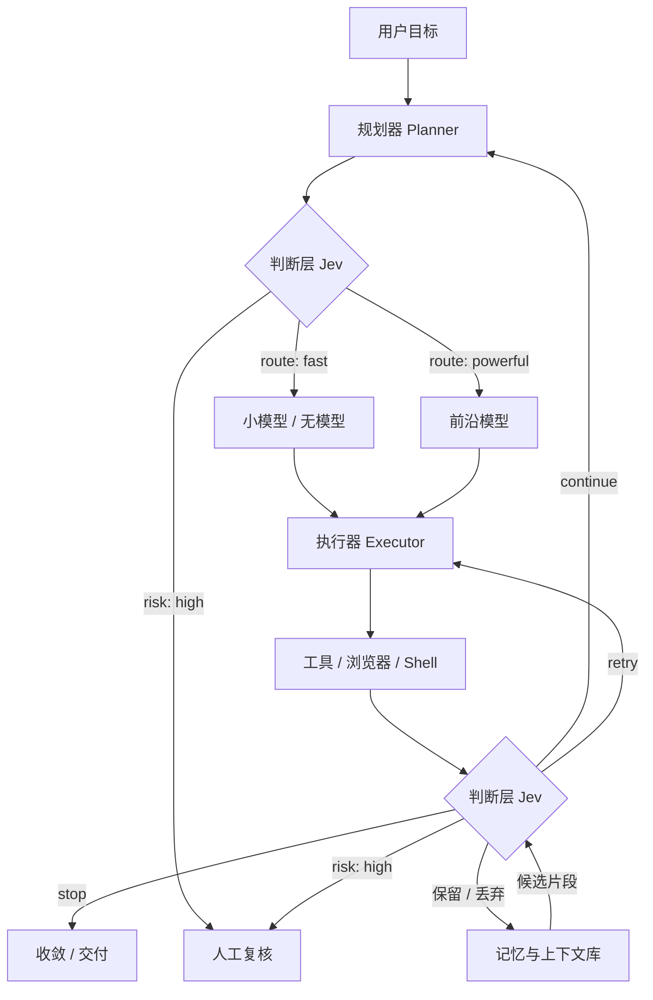

2026 年 9 月 15 日，TypeSafe AI 发布了 **Jev**：一个不能写字的模型。它不吃 prompt 吐文章，而是接收一段程序状态和若干个带固定答案空间的问题，返回结构化的判断——一个选项、一个分数，或者一个 0 到 1 的概率。发布一周内，它在 Vercel AI Gateway、Cloudflare 和 OpenRouter 上线，社区自称试过的开发者超过两千人。<a href="#ref-1">[1]</a><a href="#ref-2">[2]</a><a href="#ref-3">[3]</a>

对 Agent 基础设施的架构师来说，值得研究的不是它有多火，而是一个更具体的问题：**Agent 循环里那些"下一步该不该继续""这个工具调用危不危险""这条检索结果值不值得进上下文"的微小判断，值不值得从大模型里拆出来，做成独立的一层。**

本文先核实事实与数字，再把它放回架构，最后给出落地边界。

*本文依据截至 2026 年 9 月 22 日（Asia/Shanghai）的官方文档、平台文档、第三方实测与社区公开报告整理。除引用他人已发表的测试结果外，未做付费 API 实测。*

## 它到底是什么

Jev 的接口只有两个端点：`POST https://api.typesafe.ai/v1/systemone` 与 `GET /v1/models`；当前版本 `jev-1.13.0`。<a href="#ref-4">[4]</a>

一次调用由两部分组成：**state**（你的应用知道的一切，可以是字符串、JSON 对象或数组）和 **questions**（带类型的若干问题）。问题只有三种原语：<a href="#ref-5">[5]</a>

| 原语 | 语义 | 返回 | 典型用途 |
|---|---|---|---|
| **Choice** | 从预定义选项里选一个，上限 255 个 | 选中项 + 全部选项概率 + confidence | 路由、分类、打标 |
| **Score** | 在有序刻度上打分，2–10 级 | 可落在级间的分数 + 各级概率 + confidence | 线索评分、质量分级 |
| **Noul** | 判断一句陈述是否为真的概率 | 单个 0–1 值，**没有 confidence 字段** | 是非判断、门控 |

三个原语里最容易被写错的是 **Noul**。它不是"Bool"的转写错误，而是官方原名：文档页是 `/primitives/noul`，SDK 里有 `Noul` 类和 `noul()` 函数。创始人在 Hacker News 给出词源——"noul" 是 **Bernoulli** 的缩合，对应"是/否概率"这一数学对象。<a href="#ref-6">[6]</a> 平台侧把它暴露成 `boolean`，所以同一原语在不同层的三个名字，构成了第一笔认知税。

一个请求里可以混放多个问题。官方文档的说法是：每个问题都对同一份 `state` **并行且独立**求值，"增加问题几乎不改变响应时间"——只增加问题本身的输入 token。<a href="#ref-5">[5]</a>

其余关键参数：单请求 **64k token** 上下文（其中 state 加最长问题占 32k）；**仅文本输入**，不支持图像、音频、视频；定价 **$0.042 / 百万输入 token，输出免费**（官方原话 "too cheap to meter"）；限流 250,000 token/秒、1,200 请求/分钟，且官方明示这两个数字会动态调整。<a href="#ref-4">[4]</a>

它不做 chain-of-thought。官方措辞是"Jev 不写回复、不产生代码、不解释自己的推理"。<a href="#ref-1">[1]</a>

## 为什么它能占一层：判断层的位置

先把 Agent 循环摊开看。一个典型 harness 每一轮做四件事：模型决定下一步 → 工具执行 → 模型评估结果 → 决定继续还是停止。业界花了几年时间把"模型与程序之间"的接口标准化，工具调用（tool calling）和结构化输出（structured outputs）是两个关键原语。但它们解决的是**格式**问题，没有解决**成本与延迟**问题：循环里每一次判断仍旧是一次模型调用。<a href="#ref-7">[7]</a>

Jev 的位置就在这个空隙里：**它不是又一个生成模型，而是插在确定性代码和昂贵智能之间的判断层。**

这张图的重点是：**Jev 不出现在"生成"路径上，只出现在"分岔"路径上。** 它不负责写，只负责在若干处收敛选择空间。这也解释了为什么官方要求"代码拥有控制流，模型只做语义判断"——控制流不交给模型，模型只回答封闭问题。<a href="#ref-5">[5]</a>

### 六类组件的替代边界

把 Agent 基础设施拆成六类常见组件，逐一对照现状做法、Jev 的边界，以及它替不掉的部分：

| 组件 | 现状做法 | Jev 能做什么 | 替不掉什么 |
|---|---|---|---|
| **工具 / 模型路由** | 关键词规则、或再调一次 LLM 判断"该上哪个模型" | 用 Choice 从模型清单里选，附带概率与置信度，可在中间件里做 | 路由后的实际执行；路由错了仍要有人兜底 |
| **安全与策略判定** | 危险命令分类器锁在闭源 harness 内部；或用 LLM 分类后处理文本 | 用 Noul/Score 对工具调用、shell 命令、提示注入做风险分级，可前置阻断 | 授权、权限校验、确定性验证；它只能做"分级"，不能做"许可" |
| **上下文工程** | 等模型写摘要（summarization），慢且贵 | 对每条历史工具调用问"还需要记录吗""需要完整结果吗"，按答案重建上下文 | 摘要同时承担"重写历史以保持焦点"的功能，剪枝不做这件事 |
| **浏览器 / 计算机操作** | 每步一次多模态模型调用 | 把可操作元素编号，用 Choice 选"点/输入/等待 + 元素号" | 需要生成填空文本时仍要另调小生成模型 |
| **评估与打分** | LLM-as-judge，慢、贵、格式不稳定 | 用 Score 在固定刻度上打分，返回分布 | 需要理由说明的场景——Jev 不给理由 |
| **数据 / 内容流水线** | 大批量分类靠人工或烧 LLM 额度 | 高并发分类、去噪、去广告、工单分流 | 任何需要产出文字的下游环节 |

LangChain 已经把其中两类做成了现成中间件：`ModelRouterMiddleware`（按任务复杂度选模型）和 `AutoModeMiddleware`（用 Jev 检查 `bash` 等工具的调用风险，在工具执行前阻断）。后者的社区意义可能比技术意义更大：**过去"危险动作分类器"是各家 harness 的闭源内部件，现在它变成了任何 agent 都能挂上去的一个中间件。**<a href="#ref-7">[7]</a>

## 数字对账：官方口径、用户实测、独立测试

这是本文最需要小心的部分。Jev 的传播里存在三套数字，混用会得出完全相反的结论。

### 官方口径

| 指标 | 官方数字 | 性质 |
|---|---|---|
| 端到端延迟 | 70–500 ms | 官方自述 |
| 加速比 | 40×–200×（同一智能水平、System One 形态的任务） | 官方自述 |
| 降本比 | 40×–400× | 官方自述 |
| 首页口径 | 193.6× 更快、444.6× 更便宜 | 官方自述 workflow 评测 |
| 输入价 | $0.042 / 百万 token，输出免费 | 官方定价页（可核） |

### 用户实测

有第三方抓取了发布后四天（9 月 15–18 日）的 26,896 条推文，筛出 12,759 条有效内容，并把"作者自己的测量"与"复述厂商数字"分开统计。<a href="#ref-8">[8]</a>

| 指标 | 官方 | 用户自报中位数 | 四分位区间 |
|---|---|---|---|
| 加速比 | 193.6× | **7×**（215 个数据） | 2× – 20× |
| 降本比 | 444.6× | **30×**（180 个数据） | 5× – 85× |
| 延迟 | 70–500 ms | **76 ms**（333 个数据） | 2 ms – 270 ms |

三点必须说清楚：

**第一，7× 与 193.6× 的差距不能直接判定官方造假。** 两者比较的是不同任务、不同基线——用户实测里被替换的对象从 Opus 5、Gemini、gpt-5.6-luna 一直写到"我们原来的方案"，把一次长推理调用换成一次短分类调用，和把一个小模型换成 Jev，是两种不同的比较。<a href="#ref-8">[8]</a>

**第二，传播放大了官方数字，但重复不构成证据。** 在被复述的加速比数字里，中位数几乎精确等于首页的 193×——说明大量帖子在转引同一个数，而不是各自测出同一个数。<a href="#ref-8">[8]</a>

**第三，比较对象本身常被不公平地设置。** 有开发者指出：LLM 完全可以被要求只回 `y` 或 `n`，不必先写一段解释；让对照模型输出解释，测到的一部分是那段落文字的成本。<a href="#ref-8">[8]</a> 真正有意义的对照，是你的应用**现在能发出的最短可靠调用**。

### 独立测试

发布后一周内出现了三项独立测试，含作者自己写的前置条件：<a href="#ref-9">[9]</a>

| 测试 | 结果 | 关键限定 |
|---|---|---|
| BANKING77 银行意图分类（3,080 条） | Jev **92.40%**，微调 BERT 论文值 93.66% | 非零样本：每条消息附 24 个 BM25 检索的标注样例 + 77 个意图定义；BANKING77 是公开集，可能已在训练数据里；均值 0.533 s（含检索与网络），总成本 $0.7671 |
| 零样本 BERT 对抗（7 个评测集） | Jev 七项全胜，AG News 0.865 vs DeBERTa 0.763；**发布后新出现的 258 篇 arXiv 论文上领先 0.30** | 对 bge-m3 向量模型在 Banking77 上是统计平手；只给裸标签名会掉 0.13 |
| 钓鱼邮件检测（2,000 封） | 单问题 **62.6%** → 拆成五个问题 **89.4%** → 逻辑回归加权 **95.0%** | 同任务 Haiku 93.2%，95.0% 相对它**没有统计显著优势** |

第三项是整批证据里最有实操价值的一条：**同一个模型、同一批邮件，仅因为问题怎么写，准确率相差 32.4 个百分点。** 换句话说，用 Jev 的主要工作量不在于调模型，而在于设计问题。

同时它给出了一条明确的警示：拆分加权重后的 95.0%，仍未显著超过直接用一个通用模型。**如果你的任务本来就简单到一次 LLM 调用能解决，Jev 带来的是成本与延迟优势，不是能力优势。**

## 争议：这是不是"高级 switch 语句"

发布周的批评和追捧一样响。

**反方最有分量的四条：**

1. **"不过是一个很聪明的 switch 语句。"** 这条来自 Nathan Flurry，是发布周传播最广的批评之一。<a href="#ref-9">[9]</a>
2. **创始人的回应让这条批评更难反驳。** 在 Hacker News 上，有评论者说 Jev"基本上就是一个零样本分类器"，Diogo Almeida 的回复是：**"完全正确！"**<a href="#ref-9">[9]</a>
3. **上下文剪枝方案被指方向错误。** 该 demo 是发布周最热的应用之一（83 条帖子、210 万浏览），Theo Browne 直接称其为 "a terrible compaction strategy"，理由是 Jev 在判断某一步是否还需要时，看不到那一步**返回了什么**；另有开发者质疑，脱离整体任务上下文，单看一条工具结果无法判断其有用性。<a href="#ref-8">[8]</a> 支持方与反对方各自描述的其实是两种不同测试：剪枝要证明"没有丢掉后续需要的信息"，摘要要证明"重写后信息仍在"，而公开数据里没有用真实任务结果把这二者比出胜负。
4. **校准没有被独立验证。** 官方强调 confidence 与概率分布，但本次检索**未发现任何公开的第三方校准测试**。<a href="#ref-9">[9]</a>

**但也有一条支撑它不只是"旧瓶装新酒"的证据。** 一位第三方分析者的表述比较准确：这是"**一个 2016 年形态的分类器，装上了 2026 年水平的智能**"。它的价值不在于发明新能力，而在于把"分类、路由、排序、打标"这类工作变得足够便宜和足够快，**以至于在以前根本不值得调用模型的决策点上，现在可以调用模型**。<a href="#ref-10">[10]</a> 这与公司名物的由来一致——Jev 取自杰文斯悖论：成本下降会带来用量爆炸。<a href="#ref-1">[1]</a>

**开源复刻在几天内出现**，这一条对架构师比争论本身更重要：有人用开源 Qwen 模型提供了 Jev 兼容 API（`openjev-sglang`），有人公开了基于 Qwen3.5-9B 的开源复刻数据与配方，另有厂商推出可自托管的多语言替代品。<a href="#ref-9">[9]</a> 说明"判断层"这个位置是**可实现的**，不是这家公司的独占技术。

### 尚未解决的问题

诚实地列出本次研究没能解决的：

- **架构未公开。** 创始人的原话是 "architecture is close to the chest for now, but we have talked about writing a paper"。<a href="#ref-11">[11]</a> 官方也未开源权重，且不支持微调或 LoRA——官方称所有账号共用同一份权重。
- **不公布公开基准。** 官方 FAQ 设有"How does Jev perform against public benchmarks?"一栏，但答案文本取不到；HN 有评论者引述官方"刻意不公布"，本次未能在官方正文复核。
- **口径冲突。** 上下文官方文档写 64k，Vercel 与 Cloudflare 都标 32,000；延迟下限 70 ms 在第三方数据中未被复现（独立测试均值 0.533 s、社区实测均值 227 ms / p95 400 ms）。引用时必须标口径来源。
- **状态页有真实故障记录**：9 月 20 日 console 不可用，9 月 21 日 API 出现 "intermittent downtime and system instability"（均已修复），API 可用率 99.838%。<a href="#ref-12">[12]</a>

## 落地前必须知道的四个硬约束

**一、中文。** 官方文档明写："英语是主要训练语言，也是当前准确率最好的语言。其他语言，**包括 CJK 文字，能够处理，但表现不如英语**。"<a href="#ref-4">[4]</a> 这不是"效果打折"那么轻——它意味着任何中文业务场景都必须先做本地评测，不能沿用英文 benchmark 的结论。

**二、没有审计轨迹。** 没有推理链、没有"为什么"字符串、没有特征归因。输出只有一个选项加一个概率。<a href="#ref-9">[9]</a> 如果客户或监管要问"这个简历为什么被拒"，Jev 的输出本身无法回答。金融、医疗、招聘、法律等场景，它只能做筛选与分流，不能承担决定责任。

**三、已知弱项是数字与日期。** 官方自己的 `jev-1.13` jaggedness 文档列出的失败模式包括：数字、日期，以及**过于字面地理解措辞**。<a href="#ref-13">[13]</a> 把"金额、期限、比例"这类判断交给它时，最需要设防的正是它自己承认的弱区。

**四、校准是平均性质。** 一个 0.9 的意思是"在许多次回答中，约九成是对的"，任何单次 0.9 仍可能是错的。<a href="#ref-9">[9]</a> 而且 Noul 原语本身**不返回 confidence**，只有单个概率值。

除此之外还有一层容易被忽略的工程成本：**Jev 不接受微调，所有账号共用同一份权重**。<a href="#ref-4">[4]</a> 这意味着换模型时，你积累的资产不是权重，而是**问题定义与阈值**——它可迁移，但也意味着你无法通过微调去补某个具体场景的短板，只能改问题、改拆解方式。

## 把它接进生产：五步

社区里跑得通的用法，结构高度一致。**软件构造状态 → 给 Jev 一个有界问题 → Jev 返回带概率的类型化判断 → 代码决定这个判断被允许改变什么。**<a href="#ref-10">[10]</a> 按解决方案视角拆解：

**怎么搭。** 先用 Choice/Noul 把当前由 LLM 承担的判断重写成封闭问题。参照钓鱼检测那组数据，不要问"这封邮件是钓鱼邮件吗"，而是拆成五个更窄的问题（是否索取凭据、是否制造紧迫感、发件域是否与品牌不符……），再在代码里合并。<a href="#ref-9">[9]</a>

**交付给谁。** 对内是 harness 与中间件：模型路由、工具风险门控、上下文剪枝。对外是产品功能：工单分流、线索评分、内容合规检查。

**什么代价。** 直接成本可以忽略——社区报告里成规模的例子包括：分类 20,700 条 YouTube 评论耗时 2 分 27 秒、花费 $0.20；PR 审查每题 $0.00007；YouTube 赞助片段跳过每个视频 $0.005。<a href="#ref-8">[8]</a> 真正的代价在人力侧：**问题设计、用你自己的数据建测试集、调阈值**。这三件事不能外包给模型。

**踩什么坑。** 上面四类硬约束。另加一条来自社区实测的坑：只给裸标签名（不带每个选项的定义说明）会让准确率明显下滑——BANKING77 上掉 0.13。<a href="#ref-9">[9]</a> 选项的 `criteria` 描述不是装饰。

**能否复制。** 可以，且有降级链。判断层完全可以先用开源小模型或微调编码器实现（已有开源复刻在先）；Jev 的优势是免训练、免部署、开箱即用。合理的接法是**影子模式起步**：让 Jev 与实际决策并行跑一段时间，用你的真实流量对齐它的概率与你的判断，再决定哪些判断点可以交给它自动执行，哪些必须保留硬策略与人工复核。

## 结论

**一、Jev 的实现方式不新，但它把一个位置做成了产品。** "用分类器替代昂贵模型调用"是老做法；新的是把这个位置标准化成一种带概率、可组合、按输入 token 计费的托管原语——并且这个位置在 Agent 架构里真实存在，不是硬造的。

**二、它的价值不在倍数，在决策点的密度。** 官方 193.6× / 444.6× 与用户自报中位数 7× / 30× 之间的差距，提醒我们这类数字高度依赖基线选择，不可跨场景搬运。真正可迁移的结论是：当单次判断的成本从"一分钱"降到"百万分之一美元"，**以前不值得判断的地方现在值得判断了**——上下文该不该瘦身、这个工具调用要不要拦、这条检索结果要不要进窗口。

**三、判断层会与生成层长期分工，而不是互相替代。** 官方定位、LangChain 的中间件、以及三项独立测试都指向同一结论：Jev 负责收敛选择空间，大模型负责开放推理与生成，确定性代码负责控制流与权限。对 Agent 基础设施来说，值得现在就做的不是"要不要换掉大模型"，而是**把自己 Agent 循环里那些高频、重复、答案空间封闭的判断点列出来**——那份清单，就是判断层的需求说明书。

## 来源

[1] TypeSafe AI, *Introducing System One Models and Jev* — https://typesafe.ai/blog/introducing-system-one-models-and-jev
[2] Vercel Changelog, *TypeSafe's Jev now available on AI Gateway*（2026-09-16）— https://vercel.com/changelog/typesafe-ai-jev-now-available-on-ai-gateway
[3] Vercel Blog, *Jev is the fastest-adopted model in AI Gateway history* — https://vercel.com/blog/ai-gateway-jev-model-launch
[4] TypeSafe AI Docs, *Models / API / Limits* — https://docs.typesafe.ai/models ・ https://docs.typesafe.ai/api
[5] TypeSafe AI Docs, *Introduction / Primitives / Use-case map* — https://docs.typesafe.ai/ ・ https://docs.typesafe.ai/primitives/noul ・ https://docs.typesafe.ai/concepts/use-case-map
[6] Hacker News, *Introducing System One Models and Jev*（官方帖，1,953 分 / 511 评论，创始人回复）— https://news.ycombinator.com/item?id=49717558
[7] LangChain, *Building a harness with Jev* — https://www.langchain.com/blog/building-a-harness-with-jev
[8] OpenChamber, *Jev by TypeSafe AI: 193× in the headlines, 7× in user reports*（12,759 条推文的第三方调查）— https://openchamber.dev/blog/jev-typesafe-ai/
[9] Growthr, *What Is Jev? TypeSafe's System One Model Guide*（汇总三项独立测试及限定）— https://growthr.com/resources/what-is-jev/
[10] Linas Substack, *How to Use Jev AI* — https://linas.substack.com/p/how-to-use-jev-ai
[11] Hacker News 创始人回复（架构未公开）— https://news.ycombinator.com/item?id=49718824
[12] TypeSafe AI Status — https://status.typesafe.ai/ ・ https://status.typesafe.ai/incident/1070670
[13] TypeSafe AI Docs, *Model jaggedness: jev-1.13* — https://docs.typesafe.ai/model-jaggedness/jev-1.13
[14] 36氪, 《最火哑巴模型 Jev 加上微信》（含 Vercel 采用率与 Browser Use 长程测试复述；该文亦存在"谷歌的哑巴模型"等错误表述，引用时需注意）— https://www.36kr.com/p/3992576831002240
